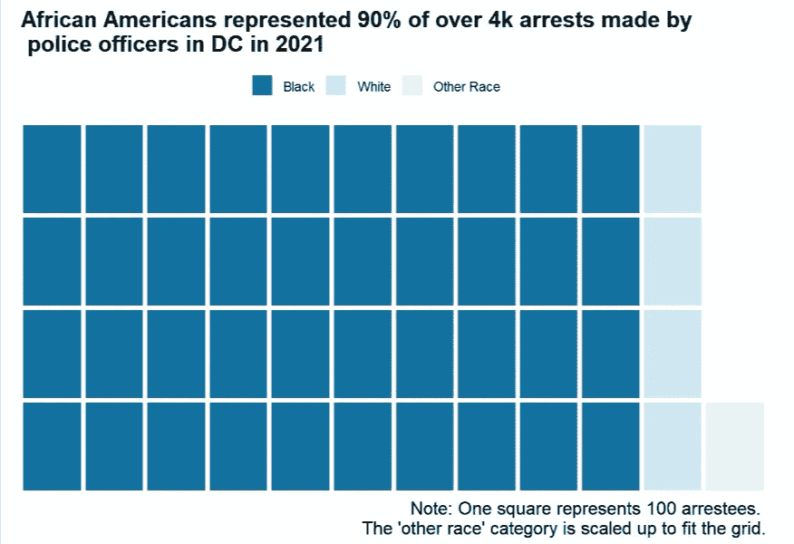
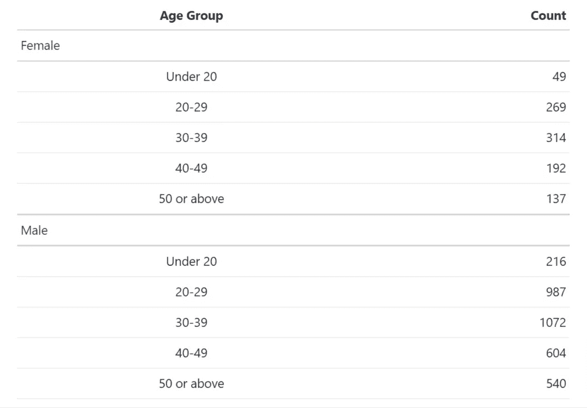
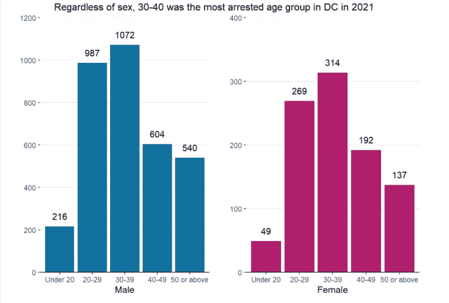
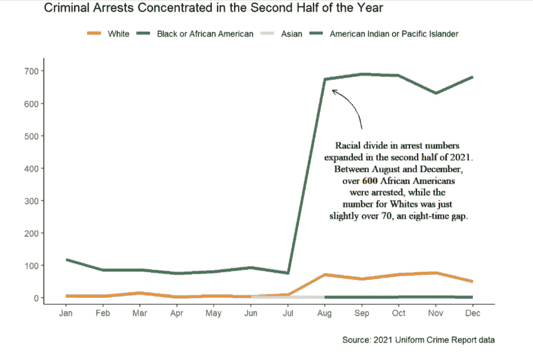
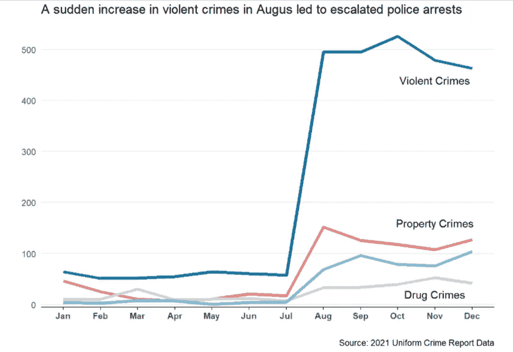
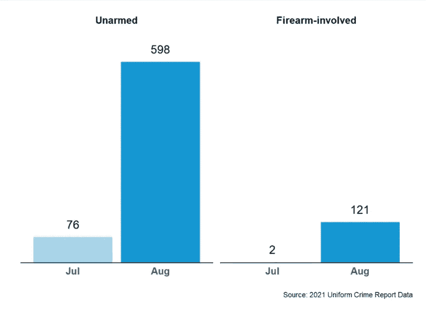
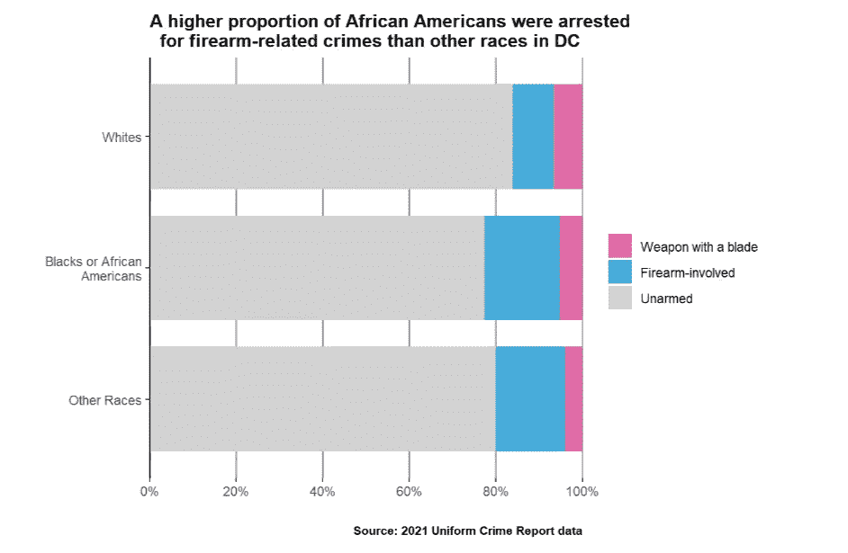

# (第二部分)用数据科学促进刑事司法

> 原文：<https://pub.towardsai.net/fostering-social-impacts-with-data-science-part-ii-a73f5b90ebf5?source=collection_archive---------2----------------------->

## DC 四千人被捕背后的故事


来源:【NIBRS 官方网站

# 分析继续:探索性数据分析

在上一篇博文中，我们第一次见到了 UCR 2021 DC 逮捕数据。现在，我们将怀着激动的心情再次见到我们的新朋友。正如我在我们的第一次对话中简要提到的，我认为数据科学(EDA、统计分析、机器学习等。)作为一个镜头或窗口，通过它我们可以更好地看到和了解我们的世界，并为重要的社会问题，如犯罪和居住隔离，提供更有效的解决方案。作为一名计算研究人员，我培养了对社会科学数据的热爱，这种对两个领域的特殊热情引导我走上了自己独特的职业道路。对我来说，数据科学是一个很好的工具，但不是唯一的。我们根据分析的目标和受众选择一种研究方法，因此数据驱动的方法不一定比定性、文献综述或社区参与方法更好。事实上，我对数据科学研究得越多，在这个社区呆得越久，我就越意识到包含定性方法的必要性。在如此多的项目中，我看到了数据分析师的高超技能和他们对算法的关注，同时，我也看到了他们领域知识的不足，这经常导致他们错误的解释和决策。

因此，在这篇文章中，我将主要使用 *ggplot* 来创建可视化，并用学科知识来解释它们。也就是说，这篇文章将关注数据故事——数据科学的真正艺术。我们的叙述将围绕我们在本系列的第一篇博客中提出的三个问题，即(略有修改)

1.警察的逮捕权如何不成比例地影响不同的社会经济和种族群体？

2.大都会警察逮捕某人，主要是因为使用了武力吗？

3.这些被捕者做了什么触发了逮捕？(记住，逮捕需要高度的合理性。在刑事司法系统中，一个行为侵犯公民隐私的程度越深，就需要越强的理由来证明执法人员的行为是正当的)

我们将遵循“谁做了什么，什么时候，以及如何”的框架来叙述数据故事。

# DC 逮捕行动的概貌——“谁”的作品

在美国，每年都有数量惊人的逮捕发生。据最著名的刑事司法智囊团之一[维拉司法研究所](https://www.vera.org/publications/arrest-trends-every-three-seconds-landing/arrest-trends-every-three-seconds/findings)估计，在任何一年，警察都会逮捕大约 1050 万人。虽然自 2006 年以来，由于社会运动的兴起，导致刑事司法系统的改革和其他社会变化，如监控摄像头的普及，阻止了人们犯下低级的财产罪，特别是盗窃，这一数字有所下降，但这一数字仍然很高。相对而言，这可能相当于一个小国的人口。正如[大量研究](https://www.sentencingproject.org/publications/un-report-on-racial-disparities/)表明的那样，这个负担不成比例地落在少数种族和边缘社会群体的身上。这一大堆逮捕背后的故事是什么？让我们来看看。

由于我们的分析范围是在 DC，我们不能将我们的发现推广到其他情况和政策截然不同的国家/地区。此外，一些因素导致了逮捕。由于我们的资料有限，我们只看其中的几个。

像上次一样，我们从加载所有的库开始。这就像为朋友来访准备咖啡和茶一样。

```
library(tidyverse) # use the tidyverse universe
library(ggtext) # format texts/annotations in ggplots
library(GGally) # for more visualization options
library(ggpubr) # dot chart and plot arrangement
library(kableExtra) # format tables
library(gt) # for goog looking table 
library(waffle) #waffle chart
library(extrafont) # for changing the glyph in waffle plots
library(fontawesome) #  for changing the glyph in waffle plotsload("data/final_data.rda")
```

## 按种族

2021 年，DC 执法人员共逮捕了 4380 人。对于一个不到 100 万居民(最多)的城市来说，这大致相当于 160 个人中就有一个。

如下图中的华夫饼干图所示，在这 4380 起案件中，绝大多数被捕者是非裔美国人。2021 年在 DC 被捕的人中，约有 90.82%是非洲裔美国人，而白人被捕者的人数要少 10 倍。根据 [2021 年人口普查数据](https://www.census.gov/quickfacts/DC)，45%的 DC 居民，即 30 万人，是黑人。也就是说，2021 年，大约 78 个黑人中就有 1 个在 DC 至少被捕过一次。考虑到逮捕可能带来的一系列社会经济后果，这种不相称性可能会促进制度化，并使该城市的系统性种族主义永久化。但在我们做出任何结论之前，我们将进一步查看我们的数据。

为了让我们的图表看起来更好，我把两个种族群体“亚洲人”和“太平洋岛民”归为一组，“其他种族”。然后我创建了一个华夫饼干图。

```
dc21 <- dc21 %>%
  mutate(race_new = fct_lump_n(race, 
                               n = 2, 
                               other_level = "Other races")) 
dc21 %>%
  count(race_new) %>%
  gt() %>%
  cols_align(
    align = "left",
    columns = race_new
  ) %>%
   cols_label(
    race_new = "Race",
    n = "Count"
  )
```


表 1:使用 gt()按种族统计的逮捕次数汇总表

```
waffle(
  c(Black = 40, White = 4, `Other Race` = 1), 
  rows = 4, size = 1.5,
  colors = c("#12719e", "#cfe8f3", "#ececec"),
  title = "African Americans represented 90% of over 4k arrests made by\n police officers in DC in 2021",
  legend_pos = "top", 
  equal = FALSE) +
     theme(
       plot.caption = element_text(size = 12),
       plot.title = element_text(size=15, face='bold')) +
     labs(caption = "Note: One square represents 100 arrestees. \n The 'other race' category is scaled up to fit the grid.")
```



图 1:被捕者的竞赛

## 按年龄和性别

了解前科犯是如何脱离犯罪道路的，对于犯罪预防、团伙监管和政策制定非常重要。人们普遍认为，年龄是这种转变的一个重要因素。犯罪大多发生在青少年时期，随着人越来越成熟，大脑进一步发育(人类的大脑到 25 岁才发育完全)，也就停止了犯罪行为。这就是[年龄-犯罪曲线](https://www.jstor.org/stable/1147518)的概念，这是生命过程犯罪学中的一个重要理论，也是我的本科教授和导师专门研究的子领域。该理论认为，对于大多数人来说，犯罪活动在他们 20 岁以下时活跃起来，随着年龄的增长而减少。这一趋势大体保持不变，但根据不同的犯罪行为，这一分布可能略有不同。对于许多犯罪来说，最佳年龄是 25 岁左右，而不是 15/16 岁左右。(我在做恢复性司法的经历中有很多这样的故事，但这超出了本文的范围)

逮捕通常不遵循相同的模式。Vera 在 T2 的一项研究发现，25-39 岁是所有被捕者中最高的年龄组。对于[暴力犯罪](https://www.prisonpolicy.org/graphs/agecrimecurve.html)，20-24 岁的人被捕率最高。虽然这些研究从国家的角度研究了警察逮捕，但这不能用于 DC，它们展示了重要的一点:年龄逮捕曲线和年龄犯罪曲线可能重叠，但它们肯定不重叠。

事实证明，DC 特有的年龄停止曲线实际上与上一段描述的一般情况有偏差。从下面的方框图中我们可以看出，对于男性和女性被捕者来说，30-39 岁是大多数被捕者的年龄组，紧随其后的是 20-29 岁。而且 20 岁以下是人数最少的年龄段。这可能是由于执法人员为保护青少年的隐私而采用了另一种制度。在许多州，青少年信息是保密的，只有少数机构可以访问(这可能不适用于我们的数据，因为 UCR 是由联邦调查局收集的)。更重要的是，原因可能是生活在城市的青少年没有成年人多。DC 的特殊之处在于它是一个特区，而不是一个州。作为全国的政治中心，许多人在 DC 工作，但不住在这里。然而，为什么两种分布都有这样的形状的具体原因需要进一步的研究。我们还应该注意到，两种分布都是右偏的，当数据的平均值大于中位数时就会出现这种情况。对于正偏度，许多假设不再有效，如果假设检验是我们的下一步，可能需要一些转换。

按性别细分，男性被捕者的规模比女性被捕者大三至四倍。鉴于大多数罪犯是男性，这并不奇怪。将此与受害者的性别进行比较会很有趣(这种比较在受害者研究中很重要！NCVS/全国犯罪受害情况调查是这方面的专家数据集)。

```
dc21 %>%
  group_by(sex, age_group) %>%
  summarise(n = n()) %>%
  gt() %>%
  cols_align(
    align = "left",
    columns = sex
  ) %>%
   cols_label(
    sex = "Sex",
    age_group = "Age Group",
    n = "Count"
  )
```



表 2:使用 gt 软件包的性别和年龄组交叉列表

```
p_m <-dc21 %>%
  filter(sex == "Male") %>%
  group_by(age_group) %>%
  summarise(count = n()) %>%
  ggplot(aes(x = age_group, y = count)) +
  geom_col(fill = "#12719e") +
  labs(x = "Male", 
       y = "") +
  scale_y_continuous(expand = c(0, 0),
                     limits = c(0, 1200), 
                     breaks = seq(0, 1200, 200))+ 
  geom_text(mapping = aes(label = count), vjust = -1)+
  theme_classic() +
  theme(
    panel.grid.major.y = element_line(),
    axis.line.y = element_blank()
  ) p_f <- dc21 %>%
  filter(sex == "Female") %>%
  group_by(age_group) %>%
  summarise(count = n()) %>%
  ggplot(aes(x = age_group, y = count)) +
  geom_col(fill = "#af1f6b") +
  labs(x = "Female", 
       y = "") +
  scale_y_continuous(expand = c(0, 0),
                     limits = c(0, 400), 
                     breaks = seq(0, 400, 100))+ 
  theme_classic() +
  theme(
    panel.grid.major.y = element_line(),
    axis.line.y = element_blank()
  ) +
  geom_text(mapping = aes(label = count), vjust = -1)p_sex <- ggarrange(p_m, p_f, ncol = 2) 
annotate_figure(p_sex, top = text_grob("Regardless of sex, 30-40 was the most arrested age group in DC in 2021", size= 12))
```



图 2:按性别分列的被捕者年龄分布

# 全年抓捕？—“何时”部分

作为人类，我们自然对趋势感到好奇:美国的 GDP 在最近十年里发生了怎样的变化？犯罪率是上升了还是下降了？与之相关的是，几乎没有一个犯罪学学生不了解犯罪的下降趋势。从预防犯罪的角度来看，知道“时间”也很重要:我们需要知道犯罪发生的时间，以便相应地调配警力和作出其他安排。很多犯罪都是时间敏感的。例如，你无法想象在一个温度冷得连枪都拿不稳的下雪天，一群少年走到街上，开始一场群殴。我记得大学一年级的时候，我和明尼阿波利斯警察局的一名警官一起骑马，那名警官指给我看当地一个帮派聚会的地点，说:“这个地方不像你在夏天看到的那样和平”。他的话揭示了帮派犯罪的季节性。

我用了一个线形图来显示 2021 年的逮捕频率。出乎我的意料，抓捕行动集中在这一年的夏末秋初。具体来说，8 月份的逮捕人数是 7 月份的 7 倍。8 月份逮捕的非裔美国居民警察人数大约相当于 1 月至 7 月逮捕人数的总和。这种趋势一直持续到年底。

这和我想象的很不一样。我有兴趣知道是否有一个原因导致了 8 月份的上涨。这要归咎于天气吗？还是因为 DC 的政策或社会事件？这些问题在这篇文章中没有被研究。

```
line_chart_label <- "Racial divide in arrest numbers <br>expanded in the second half of 2021.<br> Between August and December,<br>  over <span style='color:darkred'>**600**</span> African Americans<br> were arrested, while the <br>number for Whites was just <br>slightly over 70, an eight-time gap."dc21 %>%
  group_by(race, month) %>%
  summarise(count = n()) %>%
  ggplot(aes(x = month, y = count, group= race)) +
  geom_line(aes(color = race), size = 1.5) +
  theme_classic() +
  theme(
        legend.position="top", 
          legend.direction = "horizontal") +
  labs(x = "", y = "", color = "", 
       caption = "Source: 2021 Uniform Crime Report data") +
  ggtitle("Criminal Arrests Concentrated in the Second Half of the Year") +
  scale_color_manual(values=c("#e88e2d", "#408941", "#d2d2d2", "#12719e")) +
  scale_y_continuous(expand = c(0, 20),
                     limits = c(0,720),
                     breaks = seq(0,700,100)) +
  ggtext::geom_richtext(aes(x = 10, y = 360,
    label = line_chart_label),
    size = 3.5, fill = NA, label.color = NA, family = "serif") +
  annotate(
    geom = "curve", x = 9, y = 520, xend = 8.2, yend = 640, 
    curvature = .3, arrow = arrow(length = unit(2, "mm"))
  )
```



图 3:2021 年按种族群体分列的被捕人数的时间趋势

这一发现促使我根据不同的指标对逮捕进行分解，试图找出是否有特定的因素导致了逮捕率的变化。我最终知道的是，暴力犯罪导致的逮捕在 8 月份激增。这种上升趋势也反映在其他类型的犯罪中，即财产犯罪、人身犯罪和毒品犯罪，但没有这么严重。也许发生了一些事情，例如，更频繁的帮派活动，导致 DC 人更加暴力。在这一点上，我不确定答案，但这是值得未来调查。

```
dc21 %>%
  group_by(month, offense_group) %>%
  summarise(count = n()) %>%
  mutate(percent = round(count/sum(count), 4)) %>%
  ggplot(aes(x = month, 
             y = count, 
             group = offense_group, 
             color = offense_group)) +
  geom_line(size = 1.5) +
  theme_classic() +
  theme(legend.position="none", 
        axis.line.y = element_blank(),
        axis.ticks.y  = element_blank(),
        panel.grid.major.y = element_line(),
        axis.text.x =  element_text(face="bold")
     ) +
  labs(x = "", y = "", 
       title = "A sudden increase in violent crimes in Augus led to a spike of police arrests",
       caption = "Source: 2021 Uniform Crime Report Data") +
  scale_y_continuous(expand = c(0, 5),
                     limits = c(0,550),
                     breaks = seq(0,500,100)) +
  annotate("text", y = 440, x = 11, 
           label = "Violent Crimes", color = "black") +
   annotate("text", y = 160, x = 11,  
           label = "Property Crimes", color = "black") +
  annotate("text", y = 20, x = 11, 
           label = "Drug Crimes", color = "black") +
  scale_color_manual(values=c("#12719e", "#e9807d", "#d2d2d2", "#73bfe2"))
```



## 通过使用武器

我还根据武器的使用情况对数据进行了细分，发现在 2021 年 7 月至 8 月期间，警方逮捕的手无寸铁的平民从 76 人增加到 598 人，而涉及枪支的逮捕从 2 人增加到 121 人。这告诉我们，逮捕的升级分布在武装和非武装案件之间。枪支的使用并不能解释犯罪逮捕的意外上升。我们可能需要寻找其他原因。从我的角度来看，我认为这种变化很可能是由外部事件引起的。

(注:武器组“带刀刃的武器”由于尺寸相对较小，因此不在此比较范围内)

```
dc21 %>%
  filter(month %in% c("Jul", "Aug"),
         weapon != c("Weapon with a blade")) %>%
  group_by(month, weapon) %>%
  summarise(count = n()) %>%
  ggplot(aes(x = month, y = count)) +
  geom_col(aes(fill = month), position = "dodge") +
  theme_classic() +
  labs(x = "", y = "",
       caption = "Source: 2021 Uniform Crime Report Data")+
  theme(
        strip.text.x = element_text(size = 12, 
                                    color = "black", 
                                    face = "bold"),
        strip.background = element_blank(), 
        strip.placement = "outside",
        legend.position = "none",
        legend.direction = "horizontal",
        axis.line.y = element_blank(),
        axis.ticks = element_blank(),
        axis.text.x = element_text(face = "bold", size = 12), 
        axis.text.y = element_blank()) +
  scale_x_discrete(position="bottom") +
  scale_fill_manual(values = c("#a2d4ec", "#1696d2")) +
  scale_y_continuous(expand = c(0, 0),
                     limits = c(0, 700)) +
  facet_wrap(vars(weapon), scales = "free_y") +
  geom_text(mapping = aes(label = count),
            size = 5,
            vjust = -1)
```



图 5:使用武器的多面条形图

# 接下来

在本系列的最后一篇文章中，我们将以“如何”来结束我们的数据故事，并转到最后一节——使用一般线性回归进行数据建模。此外，我们将继续讨论数据如何在社会科学研究中发挥作用。敬请期待！



下一个帖子的额外津贴！

***注:*** *博客最初是用 Quarto 写的，新时代 Rmarkdown。所有代码都可以在* [*我的 GitHub 库*](https://github.com/jcvincentliu/data-blogging/blob/main/UCR%202021%20DC%20Arrest%20Data%20Analysis.qmd) *上找到。*

关于我自己的更多信息，请随时查看我的 [LinkedIn 页面](https://www.linkedin.com/in/jcvincentliu/)或我的[个人网站](https://jcvincentliu.netlify.app/)。