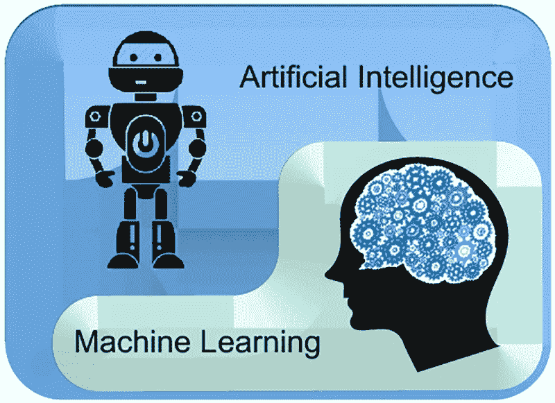

# 数据科学的未来:机器学习还是人工智能

> 原文：<https://pub.towardsai.net/future-of-data-science-machine-learning-or-artificial-intelligence-6e9cbb93f547?source=collection_archive---------1----------------------->

## [数据科学](https://towardsai.net/p/category/data-science)

图片作者:javapoint

当我们思考人工智能的未来时，我们可以想象高度复杂的机器人能够如此有效地模仿人类，以至于它们与人类无法区分。诚然，人工智能快速学习、处理和评估数据以做出选择的能力是一个重要的属性。

然而，我们大多数人认为的人工智能实际上是一个被称为机器学习的分支学科。人工智能已经成为一个涵盖数学和计算机科学中各种算法领域的笼统短语。为了优化它们的增长潜力，必须了解它们之间的一些关键区别。

专家预计，对人工智能的投资将继续增加，人工智能作为服务平台的使用也将增加，这将使没有复杂技术知识的用户更容易获得机器学习算法。因此，了解这些技术的工作原理以及如何利用它们来改善数据科学的未来至关重要。

简而言之，人工智能(AI)是一个领域或一类旨在在机器人中模拟人类智力的技术。另一方面，机器学习是计算机科学的一个分支，它教会计算机从以前的数据中学习。

人脸识别、语音识别和异常检测都是人工智能的例子，属于机器学习的深度学习和强化学习类别。计算机被训练来理解各种领域的模式，以便它们最终可以在不需要人类参与的情况下执行识别和分类等任务。

强化学习的持续进步可能是开启下一代人工智能的关键。强化学习算法通过试错来学习，而标准的机器学习程序从历史数据中学习。RL 可以被视为一种“成人”学习技术，能够优化或最大化或最小化某个结果。

一个计划由一系列的活动组成，每一项活动都由前一项活动的最佳结果所指导。这个试错的过程需要时间，但是技术在不断进步。我们可以预见，强化学习算法在未来很快就能提供高效的结果。

虽然流氓 AI 的担忧被夸大了，但 AI 和机器学习与任何技术一样，都有后果和局限性。然而，这些技术可以让企业以新的方式组织和分析数据，从而给企业带来巨大的好处。

**人工智能和机器学习的好处**

以下是人工智能和机器学习的一些优势:

# **安全**

在网络安全领域，机器学习对于识别可能性和危险变得非常重要。机器学习算法可以帮助保护敏感数据和安全架构的无缝运行。动态应用安全测试(DAST)是一种与在线应用连接的工具，用于发现应用和底层架构中的潜在安全缺陷，是网络中 ML 的一个很好的例子。

https://www.youtube.com/watch?v=ZJFqWODugSo

“DAST 是一种黑盒应用程序测试，可以在应用程序运行时对其进行测试，”云防御安全分析师表示。使用 DAST 测试应用程序时，您不需要访问源代码来识别漏洞。如果您的项目的依赖项受到新报告的漏洞的影响，您会收到通知。“因此，漏洞检测变得比以往任何时候都更加高效和全面。

一旦扫描器发现漏洞，人类可以采取行动缓解问题。尽管计算机可能很“聪明”，但 ML 程序没有直觉；相反，他们根据严格的标准和学习数据做出判断。因此，IT 专业人员仍应在扫描完成时对其进行验证，以确保获得最大收益。

# **商业物流**

由于计算机程序自身理解、组织和分析数据的能力，许多商业工具和应用程序得到了发展。机器学习可以帮助人们进行市场预测、消费者习惯和目标人口统计，等等。

[机器学习算法](https://www.cogitotech.com/)可以在内部使用，以识别人工错误，提高速度和准确性，并简化企业程序。此外，由于大数据的普及，人工智能驱动的营销分析是寻求优化数据分析能力的企业的一项要求。

# **联系客户**

随着云数据存储选项提高生产力和可访问性，越来越多的组织开始问自己如何有效地使用消费者数据。随着收集的数据越来越多，人工智能分析变得越来越准确，B2B 营销活动将从随着时间的推移收集的信息中受益。

随着速度的提高，我们可能会看到消费者互动和偏好检测的定制化。基于人工智能的预测分析将为精通技术的企业提供明确无误的竞争优势。

**人工智能和机器学习的风险**

以下是人工智能和机器学习的一些危险:

# **有知觉的机器神话**

对人工智能的速度和创造力的敬畏经常伴随着一种恐惧感。像斯蒂芬·霍金、埃隆·马斯克和比尔·盖茨这样的大人物都警告过人工智能的危险，如果人类不能正确处理它。流行文学和电影煽动了对计算机有朝一日会发展出自己的大脑的恐惧。一些人担心有害的人工智能系统，如自主武器，会落入坏人手中。这些担心并非完全没有根据。

例如，最近两次美国总统选举显示了数据挖掘算法在瞄准社交媒体用户方面的效率，以及干预技术的影响。

然而，这些干预不是由有知觉的机器人做出的；它们是由利用现代技术达到可疑目的的个人制造的。自动化的便利性和普及性使它在我们的日常生活中成为一个强大的存在，它像其他任何东西一样，必须通过立法和道德规范。

# **坏当局**

另一个需要关注的问题是网络安全。网络攻击变得越来越复杂，越来越有创意。基于人工智能的恶意软件类似于任何其他人工智能。人工智能也在研究如何处理基于人工智能的网络安全解决方案。我们正在进入一个时代，在这个时代，网络安全可能是好计算机和坏计算机之间的斗争。幸运的是，机器学习算法擅长检测异常。为了跟上坏人，网络安全专家必须不断创新。

> **未来的数据科学**

学习机制现在是人工智能局限性的来源。机器分阶段学习，将未来的判断建立在以前的数据基础上，以便产生某种结果。另一方面，人类可以抽象地推理，使用上下文，并抛弃不再有用的数据。

因此，未来的机器学习算法也可能能够执行机器去学习，特别是对于金融和个人数据等数字资产。这可能是提高人工智能安全性和减少其危险的下一步。

人工智能的进步将对数据科学的未来产生重大影响，尽管机器人仍然没有达到人类认为的智能的程度。虽然计算机在处理速度方面可以超越人类，但我们还没有开发出可以复制我们的创造性和逻辑才能的软件。机器是一种有价值的资产，但它们仍然仅仅是人类创造力的补充。

随着我们越来越接近将科幻变为现实，深度学习和强化学习有望在人工智能方面取得进展。当谈到人工智能时，这些是需要关注的一些话题。