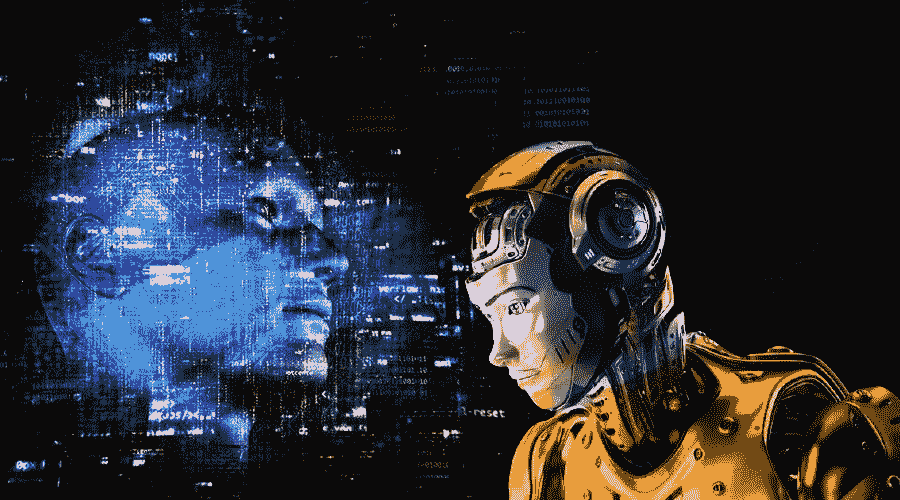
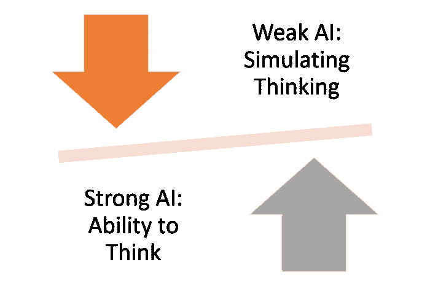
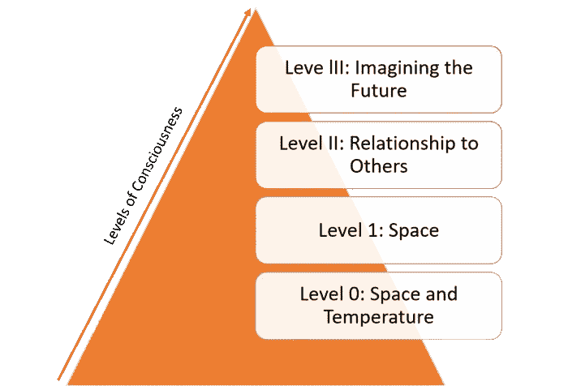

# 哥德尔和关于机器意识的一些有争议的观点

> 原文：<https://pub.towardsai.net/g%C3%B6del-and-some-controversial-ideas-about-machine-consciousness-3b1e40e0af51?source=collection_archive---------2----------------------->

## 人工智能中关于意识的一些非正统观点。

来源:[https://www . analyticsinsight . net/why-achieving-ai-awareness-as-close-as-humans-is-impossible/](https://www.analyticsinsight.net/why-attaining-ai-consciousness-as-close-as-humans-is-impossible/)

> 我最近创办了一份专注于人工智能的教育时事通讯，已经有超过 125，000 名订户。《序列》是一份无废话(意思是没有炒作，没有新闻等)的 ML 导向时事通讯，需要 5 分钟阅读。目标是让你与机器学习项目、研究论文和概念保持同步。请通过订阅以下内容来尝试一下:

 [## 序列

### 与机器学习、人工智能和数据发展保持同步的最佳资源…

thesequence.substack.com](https://thesequence.substack.com/) 

随着所有关于人工智能(AI)的技术炒作，我发现有时回到它的哲学根源是健康的。在所有围绕人工智能的哲学辩论中，没有什么比弱人工智能对强人工智能的问题更重要了。从技术的角度来看，我同意这样的观点，我们距离实现某种形式的强大或通用的人工智能还有一两个突破。然而，从哲学的角度来看，仍然有几个挑战需要解决。这些挑战中有许多可以用上世纪一位奥匈数学家开创的一个晦涩的理论来解释，也可以用神经科学的一个领先研究领域来解释。

在人工智能理论中，弱人工智能通常与系统表现出智能的能力相关联，而强人工智能与机器思考的能力相关联。我所说的思考是指真正的思考，而不仅仅是模拟的思考。这种困境通常被称为“强人工智能假说”。

在一个数字助理和算法击败围棋世界冠军和 Dota2 团队的世界探索中，机器是否能够智能地行动的问题似乎很愚蠢。在受限的环境中(例如:医学研究、旅行),我们已经能够构建大量的人工智能系统，这些系统能够像智能系统一样工作。虽然大多数专家同意弱人工智能肯定是可能的，但当谈到强人工智能时，仍然有巨大的怀疑。

# 机器会思考吗？

自 1950 年艾伦·图灵的著名论文[“计算机械和智能”](https://en.wikipedia.org/wiki/Computing_Machinery_and_Intelligence)发表以来，这些问题一直困扰着计算机科学家和哲学家。当大多数科学家甚至不能就思维的正式定义达成一致时，这个问题似乎也有点不公平。

为了说明围绕强人工智能假说的困惑，我们可以用著名计算机科学家埃德格·迪克斯特拉在 1984 年的一篇论文中的一些幽默来说明。埃德格·迪克斯特拉在一篇论文中把机器是否能思考的问题与诸如*“潜水艇能游泳吗？”*或者*“飞机能飞吗？”*。虽然这些问题看起来相似，但大多数说英语的人都会同意，事实上，飞机能飞，但潜艇不会游泳。这是为什么呢？我将把这场辩论留给你和字典；)这种比较的要点是，如果没有一个关于思维的普遍定义，纠结于机器是否能思考似乎就无关紧要了😉。

对强人工智能的主要反驳观点是，从本质上来说，确定机器是否真的能思考是不可能的。这个论点的基础是有史以来最著名的数学定理之一。

# 哥德尔不完全性定理

当我们谈论历史上对我们的思维方式产生了广泛影响的最伟大的数学理论时，我们需要为[哥德尔的不完全性定理](https://en.wikipedia.org/wiki/G%C3%B6del%27s_incompleteness_theorems)预留一个位置。1931 年，数学家[库尔特·哥德尔](https://en.wikipedia.org/wiki/Kurt_G%C3%B6del)通过证明他著名的[不完全性定理](https://en.wikipedia.org/wiki/G%C3%B6del%27s_incompleteness_theorems)证明了演绎有其局限性。哥德尔定理指出，在任何强到足以进行算术运算的形式理论中(例如人工智能)，都存在在该理论中没有证明的真实陈述。

不完全性定理一直被用来反对强人工智能。这一理论的支持者认为，强大的人工智能代理将无法真正思考，因为他们受到不完全性定理的限制，而人类的思维显然没有。那个论点引发了很多争议，被很多强人工智能从业者拒绝。强人工智能学派使用最多的论点是，不可能确定人类思维是否服从哥德尔定理，因为任何证明都需要形式化人类知识，而我们知道这是不可能的。

# 意识论证

在强人工智能辩论中，我最喜欢的论点是关于意识的。机器真的能思考还是只是模拟思考？如果机器在未来能够思考，这意味着它们将需要有意识(即意识到它们的状态和行为)，因为意识是人类思维的基石。

对强人工智能的怀疑引发了各种争论，从经典数学理论如[哥德尔的不完全性定理](https://en.wikipedia.org/wiki/G%C3%B6del%27s_incompleteness_theorems)到人工智能平台的纯技术限制。然而，争论的主要领域仍然是生物学、神经科学和哲学的交叉，并且与人工智能系统的意识有关。

# 什么是意识？

关于意识有很多定义和争论。当然，这足以劝阻大多数理智的人继续讨论它在人工智能系统中的作用；)意识的大多数定义涉及自我意识或一个实体意识到其精神状态的能力。然而，当谈到人工智能时，自我意识和精神状态也没有明确的定义，所以我们可以很快开始进入兔子洞。

为了适用于人工智能，意识理论需要更加实用和技术化，而不是哲学化。我最喜欢的遵循这些原则的意识定义来自诺贝尔物理学家[加来道雄](https://en.wikipedia.org/wiki/Michio_Kaku)，他是纽约大学的理论物理学教授，也是弦理论的创始人之一。几年前，Kaku 博士提出了他所谓的“意识的时空理论”，以汇集生物学和神经科学等领域对意识的定义。在他的理论中，Kaku 博士对意识的定义如下:

*“意识是使用各种参数(例如:温度、空间、时间和与他人的关系)的多重反馈回路创建世界模型的过程，以完成一个目标(例如:寻找配偶、食物、住所)”*

意识的时空定义直接适用于 AI，因为它基于大脑不仅基于空间(如动物)而且基于时间(向前和向后)创建世界模型的能力。从这个角度来看，Kaku 博士将人类意识定义为*“一种意识形式，它通过评估过去来模拟未来，从而创建一个世界模型，然后在时间上模拟它。”换句话说，人类的意识与我们规划未来的能力直接相关。*

除了它的核心定义，意识的时空理论还包括几种类型的意识:

**0 级:**包括移动受限的植物等生物，它们使用温度等少数参数创建其空间模型。

**一级:**爬行动物之类的生物，是可以移动的，有神经系统。这些生物使用更多的附加参数来形成其空间的模型。

第二层次:像哺乳动物这样的有机体，不仅基于空间，而且基于与他人的关系来创建世界模型。

**第三等级:**理解时间关系并拥有想象未来独特能力的人类。

# 人工智能系统有意识吗？

意识是人工智能社区中争论最激烈的话题之一。所谓人工智能意识，我们指的是人工智能主体自我意识到其“精神状态”的能力。本文的前一部分介绍了一个由著名物理学家加来道雄博士首创的框架，在四个不同的层次上评估意识。

在 Kaku 博士的理论中，0 级意识描述了植物等生物体，它们根据温度等少数参数来评估自己的现实。爬行动物和昆虫表现出 1 级意识，因为它们使用包括空间在内的新参数来创建世界模型。第二级意识包括基于情感和与其他物种的关系创建世界模型。哺乳动物是与 2 级意识相关的主要群体。最后，我们有人类可以被归类为第三级意识，基于世界的模型，包括对未来的模拟。

基于 Kaku 博士的意识框架，我们可以评估当前一代人工智能技术的意识水平。大多数专家同意，今天的人工智能代理可以被归类为 1 级或非常早期的 2 级意识。将 AI 智能体排在 1 级涉及到很多因素，包括机动性。今天，许多人工智能代理已经能够实现移动性，并根据他们周围的空间开发他们环境的模型。然而，大多数人工智能代理在其受限环境之外操作有很多困难。

空间评估并不是将人工智能代理置于一级意识的唯一因素。用于创建模型的反馈循环的数量是另一个需要考虑的非常重要的因素。我们以图像分析为例。即使是最先进的视觉人工智能算法也只使用相对较少的反馈回路来识别物体。如果我们将这些模型与认知能力、昆虫和爬行动物相比较，它们似乎相当简单。所以是的，目前这一代人工智能技术具有昆虫的意识水平；)

# 到达第二层

稳步地，一些人工智能技术已经表现出二级意识的特征。有几个因素促成了这一演变。人工智能技术在理解和模拟情绪以及感知周围的情绪反应方面越来越先进。

除了基于情感的人工智能技术的发展，人工智能代理在群体环境中的操作效率越来越高，在这种环境中，他们需要相互合作或竞争才能生存。在某些情况下，团队合作甚至创造了新的认知技能。为了看到一些最近展示出 2 级意识的人工智能代理的例子，我们可以参考 DeepMind 和 OpenAI 等公司的工作。

最近，DeepMind 对 AI 智能体需要在资源有限的环境中生活进行了实验。当资源丰富时，智能体表现出不同的行为。当代理需要彼此交互时，行为会发生变化。另一个有趣的例子可以在最近的 OpenAI 模拟实验中找到，在该实验中，人工智能代理能够使用少量符号创建自己的语言，以便更好地与其环境共存。很酷吧？

主流人工智能解决方案仍处于非常早期的阶段，但提高人工智能代理的意识水平是当前一代人工智能技术栈的最重要目标之一。2 级意识是下一个前沿！

# 到达第三级

目前，人工智能系统中的第三级意识仍然是一个活跃的争论话题。然而，最近的系统，如 OpenAI Five 或 DeepMind Quake III，已经清楚地显示了人工智能代理进行长期规划和合作的能力，所以我们可能不会太远。

# 人工智能系统有意识吗？

简短的，也许令人惊讶的答案是肯定的。将 Kaku 博士的意识时空理论应用于 AI 系统，很明显 AI 智能体可以表现出一些基本的意识形式。考虑到当前一代人工智能技术的能力，我会把人工智能代理的意识放在一级(爬行动物)或基本二级。