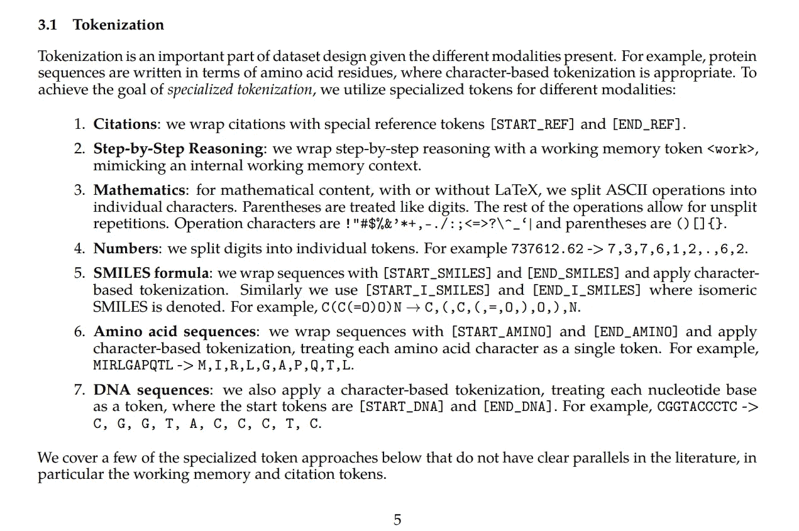
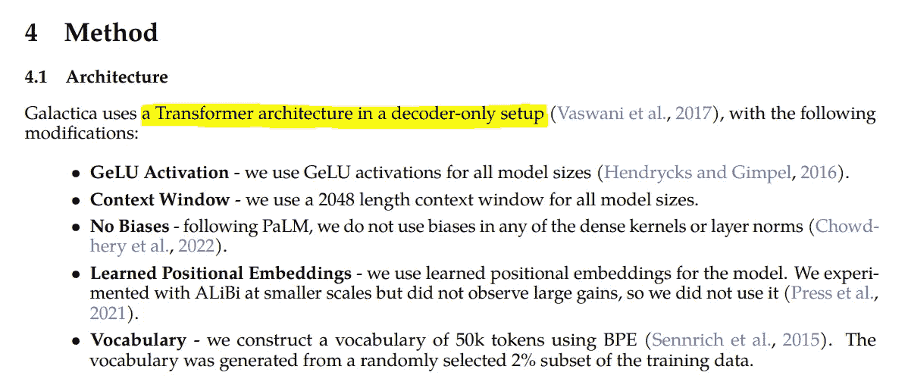
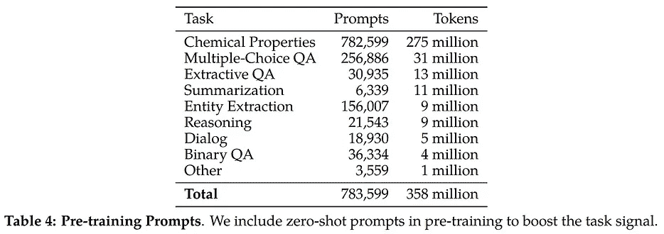

# 卡拉狄加:这是什么，发生了什么事？

> 原文：<https://pub.towardsai.net/galactica-what-is-it-and-what-happened-b4a8649b029?source=collection_archive---------0----------------------->

## 卡拉狄加，元人工智能的最新模型:人工智能科学家

> 最初发表于 [louisbouchard.ai](https://www.louisbouchard.ai/galactica/) ，前两天在[我的博客上读到的！](https://www.louisbouchard.ai/galactica/)

## 观看视频

11 月 15 日，MetaAI 和代码为[的论文宣布发布 Galactica](https://twitter.com/paperswithcode/status/1592546933679476736) ，这是一个改变游戏规则的开源大型语言模型，基于科学知识训练，拥有 1200 亿个参数。

正如我的一个朋友[在 Twitter](https://twitter.com/patrickmineault/status/1592738675456344065) 上分享的，这个模型可以写白皮书、评论、维基百科页面和代码。它知道如何引用，如何写方程。这对人工智能和科学来说是一件大事。

11 月 17 日，卡拉狄加被关闭。

为什么？因为，与所有深度学习模型一样，它没有理解手头的任务，并且在许多情况下是错误的。这不应该是一个问题，特别是如果我们添加一个警告，说模型可能是错误的，不要盲目相信它。就像没有人信任维基百科一样，我们不能把这个作为高中项目的参考。问题是[卡拉狄加是错误的或有偏见的，但听起来是正确的和权威的](https://twitter.com/michael_j_black/status/1593133722316189696)。

尽管如此，研究人员仍然可以使用这个模型，我相信保持它的开源性是很重要的。

正如我的另一个朋友[分享的](https://twitter.com/AlphaSignalAI/status/1594338043078447104)，围绕新模式的所有戏剧似乎有点过度。当然，这个模型并不完美，就像目前网上所有的模型一样。我们需要在网上测试它的局限性，改进它。我们应该像学生一样看待这类出版物，允许出现错误和改进，而不用担心被关闭或取消。

不管怎样，我们不是来讨论这个的。希望[它会很快重新上线](https://twitter.com/EMostaque/status/1594494813164146688)。

我们在这里看到卡拉狄加是什么，或者曾经是什么，以及它如何实现写论文、评论、代码等等…

基本上，卡拉狄加是一个大型的语言模型，大小与 GPT-3 相当，但专门研究科学知识。更准确地说，它是在一个大型的科学知识语料库上进行训练的，包括超过 4800 万篇论文、教科书和课堂笔记、数百万种化合物和蛋白质、科学网站、百科全书等等。他们强调的数据是高质量和高度精确的，这是与 GPT-3 的最大区别之一。

所以，理论上，卡拉狄加包含了几乎所有人类的科学知识。想象一下，你有惊人的记忆力，有时间阅读数百万份研究，记住其中的大部分。

这里是卡拉狄加。它的记忆力似乎并不太好，而且它把所有的东西都混在一起了，尽管我们可以假设训练数据集中的大多数信息都是准确的。即使考虑到所有的偏见和失败，卡拉狄加仍然非常强大，在与科学相关的任务中几乎胜过所有其他方法。

对于一个我们可以信任的产品来说，这还不够。尽管如此，理解它是如何工作的还是值得的，特别是因为它很快会变得更加强大。

图片来自报纸。

正如我们提到的，卡拉狄加是一个大型语言模型，类似于 GPT-3 或布鲁姆，正如他们所说，是为“组织科学”而专门训练的。这个模型中还进行了大量的工程设计，允许其输入和输出具有如此多的多功能性，如引用或蛋白质序列的特殊标记化，你可以在下面链接的论文中了解更多信息。他们的符号化努力是这项工作迄今为止最大的贡献。符号化基本上意味着模型将看到数据的方式，而不是我们看到和理解的单词、数学或形状。我将在本周晚些时候分享一篇关于嵌入和标记化的文章，所以如果这听起来很有趣，请继续关注并关注我的文章。

那么除了这个怪异的记号化和预处理步骤，Galactica 是什么，它在获取单词或不同的科学输入并为做记号化的模型做准备之后做了什么？

图片来自报纸。

毫不奇怪，卡拉狄加是另一个基于变形金刚的架构，就像 GPT 3，有一些变化，包括符号化的差异。因此，我肯定会邀请您阅读我或我的一些朋友撰写的许多关于变压器架构的文章中的一篇，因为我不会再一次讨论它是如何工作的。

即时预培训。报纸上的图片。

卡拉狄加和其他大型语言模型的第二个主要区别是他们所谓的提示预训练。这意味着它们将包括从训练数据集中提取的提示以及数据本身，这已被证明“最大限度地提高了模型的通用性，同时提高了一些感兴趣的任务的性能。”

差不多就是这样了！

正如我所说的，该架构与您已经知道的非常相似，并且主要是训练和预处理方案有所不同，这表明模型不是一切，但我们如何预先咀嚼数据实际上可能更重要。你基本上可以看出 GPT 3 号和卡拉狄加的区别，就像同一个学生有一个糟糕的科学老师和一个好老师。它拥有同样的能力和资源。老师只是让他更容易理解。

当然，这只是这篇论文的概述，我强烈推荐阅读它。有大量关于他们实施的多种工程技巧的细节，以及结果分析，他们使用该模型处理的所有任务的细节，以及该模型如何理解输入数据及其预测，其局限性，偏差等

我希望您喜欢这篇文章，下周我将带着另一篇精彩的论文和一篇介绍什么是嵌入的特别文章与您见面！

## 参考

泰勒等人，2022:卡拉狄加，[https://galactica.org/](https://galactica.org/)
我的时事通讯(一个新的人工智能应用每周向你的电子邮件解释！):[https://www.louisbouchard.ai/newsletter/](https://www.louisbouchard.ai/newsletter/)