# 使用 GANs 生成合成序列数据

> 原文：<https://pub.towardsai.net/generating-synthetic-sequential-data-using-gans-a1d67a7752ac?source=collection_archive---------0----------------------->

## [深度学习](https://towardsai.net/p/category/machine-learning/deep-learning)

时序数据(具有时间依赖性的数据)在商业中非常常见，从信用卡交易到医疗保健记录再到股票市场价格。但隐私法规限制并大大减缓了对研发至关重要的有用数据的访问。这就产生了对具有高度代表性但又完全私密的合成序列数据的需求，至少可以说这是一种挑战。

生成合成时间序列和顺序数据比表格数据更具挑战性，表格数据通常将一个人的所有信息存储在一行中。在顺序数据中，信息可以分布在许多行中，如信用卡交易，保持行(事件)和列(变量)之间的相关性是关键。此外，序列的长度是可变的；一些案例可能只包含几笔交易，而其他案例可能包含数千笔交易。

时序数据和时间序列[的生成模型已经得到了广泛的研究](https://pubmed.ncbi.nlm.nih.gov/30535151/)，然而，许多这些努力导致了相对较差的合成数据质量和较低的灵活性。在许多情况下，模型被设计成特定于每个问题，因此需要详细的领域知识。

在本帖中，我们描述并应用了一种最新的强大方法的扩展版本来生成合成序列数据— [二重身](https://github.com/fjxmlzn/DoppelGANger)。它是一个基于生成对抗网络(GANs)的框架，具有一些创新，使得复杂序列数据集的合成版本的生成成为可能。

我们在这项工作的基础上引入了两项创新:

1.  加速 GAN 收敛和避免模式崩溃的学习策略。
2.  鉴别器中设计良好的噪声，以在不降低数据质量的情况下使过程有差别地私有，使用修改版本的矩会计策略来提高模型的稳定性。

# 顺序数据生成的常用方法

大多数时序数据生成模型使用以下方法之一:

**动态平稳过程**通过将时间序列中的每个点表示为添加了一些噪声的确定性过程的总和来工作。这是一种广泛使用的方法，通过像[引导](https://eranraviv.com/bootstrapping-time-series-r-code/)这样的技术来建模时间序列。然而，一些长期依赖关系的先验知识，如循环模式，必须纳入约束确定性过程。这使得用复杂的、未知的相关性来建模数据集变得非常困难。

**马尔可夫模型**是一种通过将系统动态表示为条件概率分布来对分类时间序列建模的流行方法。变体，如[隐马尔可夫模型](https://link.springer.com/article/10.1023/A:1007469218079)，也被用于时间序列的分布建模。这种方法的问题是它不能捕捉长期复杂的依赖关系。

**自回归(AR)模型**是动态平稳过程，其中序列中的每个点都被表示为前 *n* 个点的[函数。非线性 ar 模型(如 ARIMA)非常强大。像马尔可夫模型这样的 AR 模型有一个保真度问题——它们产生的模型过于简单，无法捕捉复杂的时间相关性。](https://arxiv.org/abs/1801.07736)

**递归神经网络(RNNs)** 最近被用于深度学习中的时间序列建模。像自回归和马尔可夫模型一样，RNNs 使用以前时间步长的滑动窗口来确定下一个时间点。rnn 还存储一个内部状态变量，该变量捕获时间序列的整个历史。像长短期记忆网络(LTSMs)一样，RNNs 在学习时间序列数据的判别模型方面取得了巨大的成功，这些模型预测以样本为条件的标签。然而，rnn 不能学习某些简单的时间序列分布。

**基于 GAN 的方法**或生成式对抗网络模型已经成为一种用于生成或扩充数据集(尤其是图像和视频)的流行技术。然而，gan 在网络数据中的保真度较差，网络数据既有复杂的时间相关性，又有混合的离散-连续数据类型。虽然存在基于 GAN 的时间序列生成技术，例如[医学时间序列](https://github.com/mp2893/medgan)，但这种技术在更复杂的数据上失败，这些数据在长序列上表现出较差的自相关得分，同时易于出现模式崩溃。这是由于数据分布是重尾的并且长度可变。这似乎对 GANs 有很大影响。

# 引入二重身以生成高质量的合成时间序列数据

在这一节中，我将探索最近的模型来生成合成序列数据[分身](https://arxiv.org/pdf/1909.13403.pdf)。我将使用这个基于 GANs 的模型和一个由递归单元组成的生成器，使用两个数据集生成交易数据的合成版本:银行交易和道路交通。我们使用了二重身模型的修改来解决顺序数据的生成模型的局限性。

传统的生成对抗网络(GANs)由于以下问题而难以对序列数据建模:

*   它们没有捕捉到时态特征和它们相关的(不可变的)属性之间的复杂关系:例如，根据所有者的特征(年龄、收入等)，交易中的信用卡模式是非常不同的。
*   时间序列中的长期相关性，如日变化模式:这些相关性在性质上与图像中发现的相关性非常不同，图像具有固定的维度，不需要逐像素生成。

二重身融合了一些创新的想法，比如:

*   使用两个网络(多层感知器 MLP 和递归网络)来捕获时间依赖性
*   分离属性生成，以更好地捕捉时间序列及其属性(例如，用户的年龄、位置和性别)之间的相关性
*   批量生成—生成长序列的小堆栈批量
*   去耦归一化-将归一化因子添加到约束要素范围的生成器中

DoppelGANger 将属性的生成与时间序列解耦，同时在每个时间步将属性提供给时间序列生成器。这与传统方法形成对比，在传统方法中，属性和特征是联合生成的。

DoppelGANger 的条件生成架构还提供了更改属性分布和属性条件的灵活性。这也有助于隐藏属性分布，从而增加隐私。

二重身模型还具有根据数据属性生成数据特征的优势。

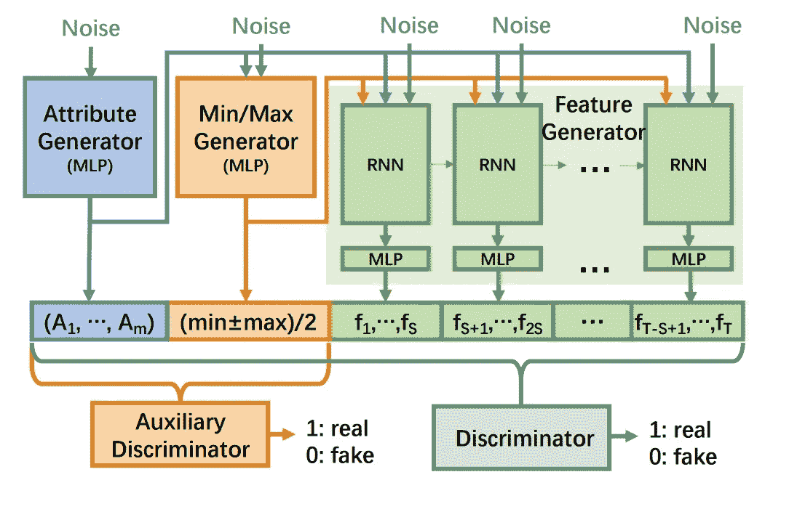

**图 1** :原二重身模型两个发生器模块和两个鉴别器的示意图。信用:【https://arxiv.org/abs/1909.13403】T2。

这个模型的另一个特点是它如何处理极端事件，这是一个非常具有挑战性的问题。跨样本的序列数据具有广泛的特征值并不罕见，一些产品可能有数千个交易，而另一些只有几个。对于 GANs 来说，这是有问题的，因为它是模式崩溃的可靠方法——样本将只包含最常见的项目，而忽略罕见的事件。对于图像——几乎所有 GANs 工作的焦点——这不是问题，因为分布是平滑的。这就是为什么《二重身》的作者提出了一种创新的方法来处理这些情况:**自动规范化**。它包括在训练之前对数据特征进行归一化，并且将最小和最大范围的特征作为两个附加属性添加到每个样本中。

在生成的数据中，这两个属性通常会将要素缩放回实际范围。这分三步完成:

1.  使用多层感知器(MLP)生成器生成属性。
2.  将生成的属性作为输入，使用另一个 MLP 生成两个“假”(最大/最小)属性。
3.  将生成的真假属性作为输入，生成要素。

# 在银行交易数据上训练二重身模型

首先，我们在银行交易数据集上评估了二重身。用于训练的数据是合成的，所以我们知道真实的分布，并且可以在这里 访问 [**。我们的目的是证明这个模型能够学习数据中的时间依赖性。**](https://www.dropbox.com/s/yz6por3n3b1o6rn/data.csv?dl=0)

## 如何准备资料？

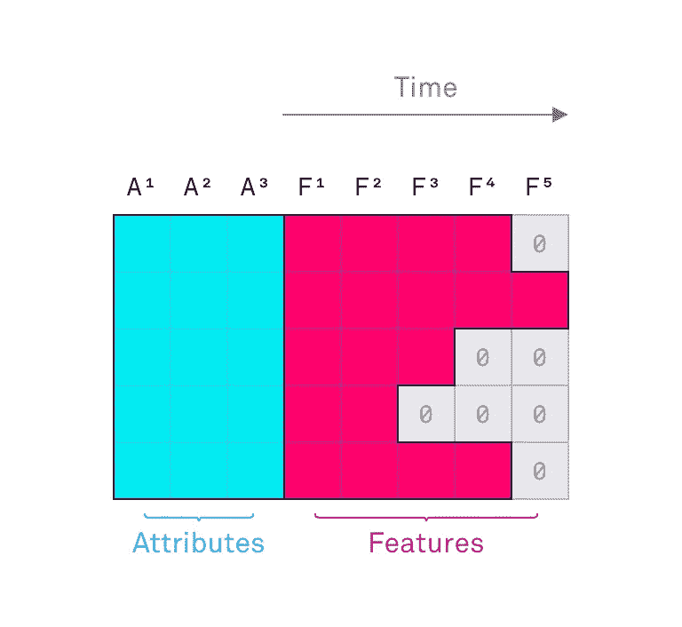

**图 2** :作为一组不同长度的属性和特征处理的数据的示意图。

我们假设顺序数据由一组最大长度为 Lmax 的序列组成—在我们的例子中，我们考虑 Lmax *=* 100。每个序列包含一组**属性** **A** (固定数量)和**特性** **F** (交易)。在我们的例子中，唯一的属性是初始银行*余额*，特征是:交易的*金额*(正或负)和另外两个描述交易的类别:*标志*和*描述*。

要运行该模型，我们需要三个 [NumPy 数组](https://cs231n.github.io/python-numpy-tutorial/#:~:text=A%20numpy%20array%20is%20a,the%20array%20along%20each%20dimension.):

1.  **数据 _ 特征**:训练特征， [NumPy float32 数组格式](https://numpy.org/doc/stable/user/basics.types.html)。大小为[(训练样本数)x(最大长度)x(特征的总尺寸)]。分类特征通过一键编码存储。
2.  **data_attribute** :训练属性，NumPy float32 数组格式。大小为[(训练样本数)x(属性总维数)]。
3.  **data_gen_flag** :表示特性激活的标志数组。大小为[(训练样本数)x(最大长度)]。

此外，我们需要一个包含每个变量的数据类型、规范化和基数的类输出对象列表。在这种情况下，它是:

```
data_feature_outputs = [
output.Output(type_=OutputType.CONTINUOUS,dim=1,normalization=Normalization.ZERO_ONE,is_gen_flag=False), 
# time intervals between transactions (Dif)
    output.Output(type_=OutputType.DISCRETE,dim=20,is_gen_flag=False), 
# binarized Amount
    output.Output(type_=OutputType.DISCRETE,dim=5,is_gen_flag=False),
# Flagoutput.Output(type_=OutputType.DISCRETE,dim=44,is_gen_flag=False) 
# Description    
]
```

列表的第一个元素是事件之间的时间间隔 *Dif* ，接着是 1-hot 编码的交易值(金额)，接着是标志，第四个是交易描述。所有的 gen_flags 都被设置为 False，因为它是一个内部标志，以后会被模型本身修改。

该属性被编码为一个连续变量，归一化值在-1 和 1 之间，以说明负余额:

```
data_attribute_outputs = [output.Output(type_=OutputType.CONTINUOUS,dim=1,normalization=Normalization.MINUSONE_ONE,is_gen_flag=False)]
```

此模拟中使用的唯一属性是初始平衡。每一步的余额只需添加相应的交易金额即可更新。

我们使用[模糊处理器](http://hazy.com)来预处理每个序列，并以正确的格式重塑它。

```
n_bins = 20
processor_dict = {
            "by_type": {
                  "float": {
                    "processor": "FloatToOneHot", #FloatToBin"
                    "kwargs": {"n_bins": n_bins}
                  },
                  "int": {
                    "processor": "IntToFloat",
                    "kwargs": {"n_bins": n_bins}
                  },
                  "category": {
                    "processor": "CatToOneHot",

        },
                 "datetime": {
                    "processor": "DtToFloat",
                  }
                }
        }from hazy_trainer.processing import HazyProcessor
processor = HazyProcessor(processor_dict)
```

现在我们将读取数据，并使用函数 format_data 对其进行处理。辅助变量 categories_n 和 categories_cum 分别存储变量的基数和基数的累积和。

```
data=pd.read_csv('data.csv',nrows=100000)    # read the datacategorical = ['Amount','Flag','Description'] 
continuous =['Balance','Dif']
cols = categorical + continuous
processor = HazyProcessor(processor_dict) #call Hazy processor
processor.setup_df(data[cols]) # setup the processor
categories_n = [] # Number of categories in each categorical variable
for cat in categorical:
    categories_n.append(len(processor.column_to_columns[cat]['process']))

categories_cum = list(np.cumsum(categories_n)) # Cumulative sum of number of categorical variables
categories_cum = [x for x in categories_cum] # We take one out because they will be indexes
categories_cum = [0] + categories_cum

def format_data(data, cols, nsequences=1000, Lmax=100, cardinality=70):
''' cols is a list of columns to be processednsequences  number of sequences to use for training
   Lmax is the maximum sequence length
   Cardinality shape of sequences'''
   idd=list(accenture.Account_id.unique()) # unique account ids
   data.Date = pd.to_datetime(data.Date) # format date
  # dummy to normalize the processors
 data['Dif']=np.random.randint(0,30*24*3600,size=accenture.shape[0])    data_all = np.zeros((nsequences,Lmax,Cardinality))
   data_attribut=np.zeros((nsequences))
   data_gen_flag=np.zeros((nsequences,Lmax))
   real_df = pd.DataFrame()
   for i,ids in enumerate(idd[:nsequences]):
      user = data[data.Account_id==ids]
      user=user.sort_values(by='Date')
      user['Dif']=user.Date.diff(1).iloc[1:] 
      user['Dif']=user['Dif'].dt.seconds 
      user = user[cols]
      real_df=pd.concat([real_df,user])
      processed_df = processor.process_df(user)
      Data_attribut[i] = processed_df['Balance'].values[0]
      processed_array = np.asarray(processed_df.iloc[:,1:)
      data_gen_flag[i,:len(user)]=1
      data_all[i,:len(user),:]=processed_arrayreturn data_all, data_attribut, data_gen_flag
```

**数据**

[数据](https://www.dropbox.com/s/yz6por3n3b1o6rn/data.csv?dl=0)包含大约 1000 万笔银行交易，我们将从中抽取 100，000 笔交易作为样本，其中包含 5，000 个不同的账户，每个账户平均有 20 笔交易。我们考虑以下领域:

*   交易日期
*   交易金额
*   保持平衡
*   交易标志(5 级)
*   描述(44 级)

下面是标题所用的数据:

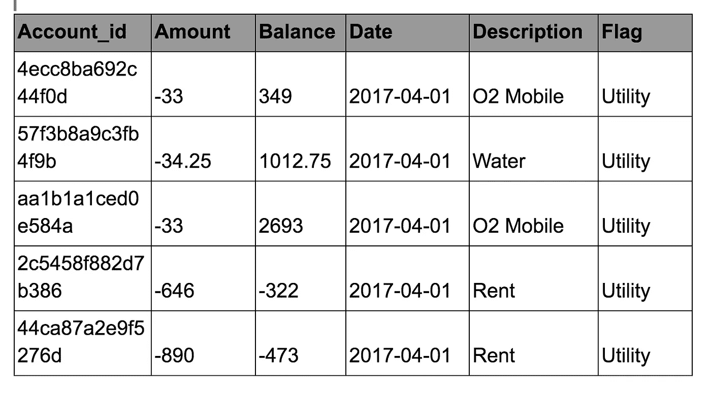

表 1:银行交易数据示例

如前所述，时间信息将被建模为两个连续事务之间的时间差(以秒为单位)。

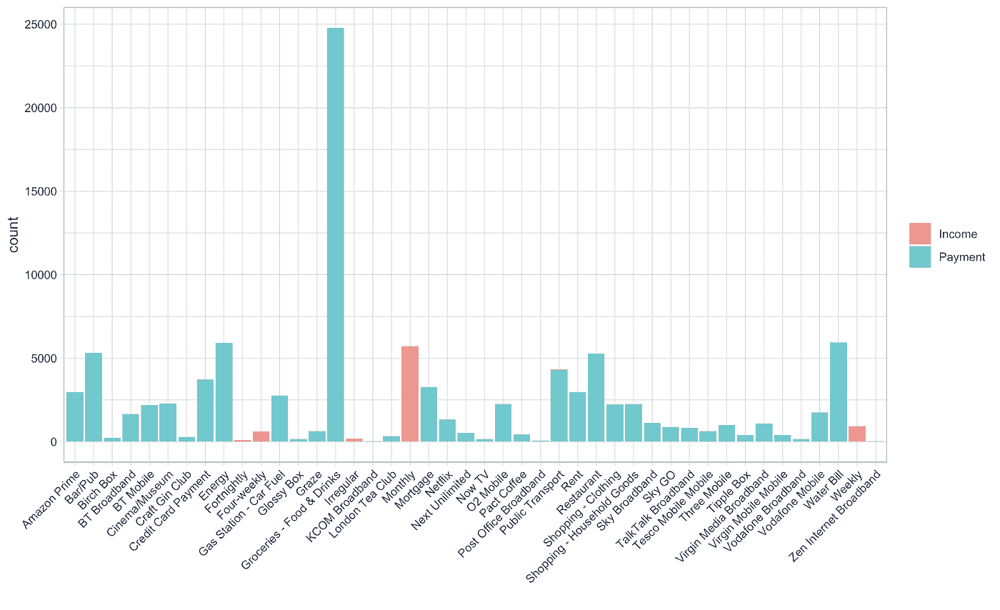

**图 3** :不同*描述*的交易柱状图，分离为收入和流出。

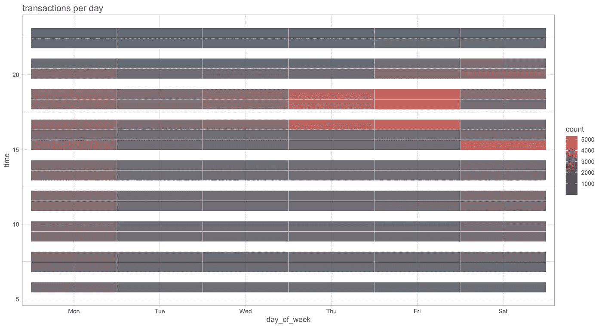

**图 4:** 不同时间分布的交易热图。

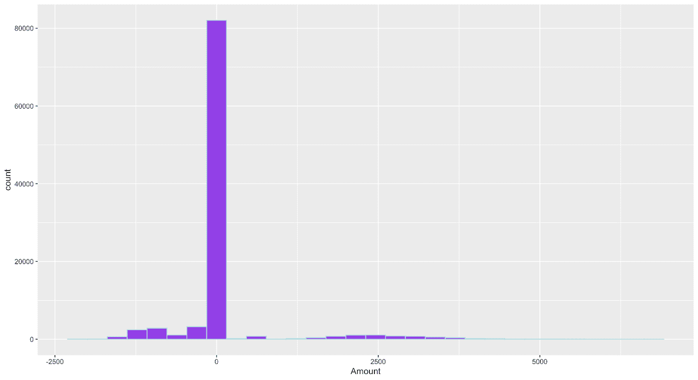

**图五**:交易分布*金额*。

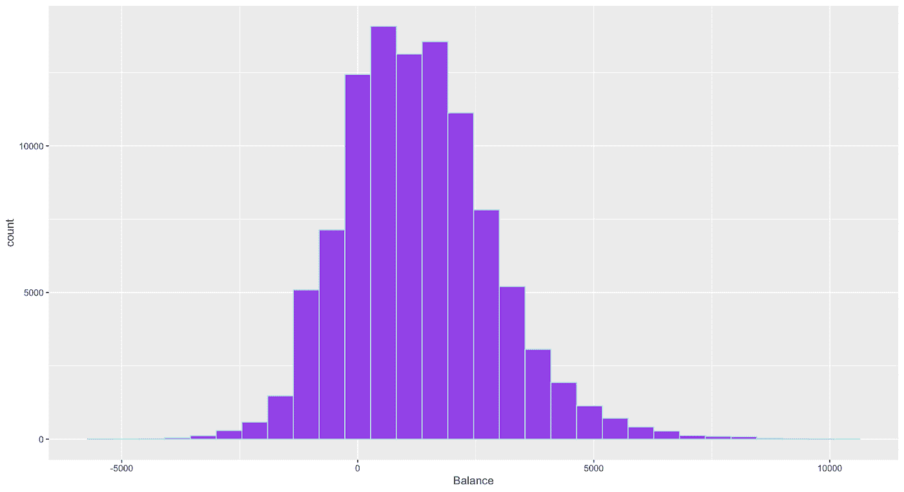

**图 6** :初始*余额*分配。请注意，由于透支，一些帐户的初始余额为负。

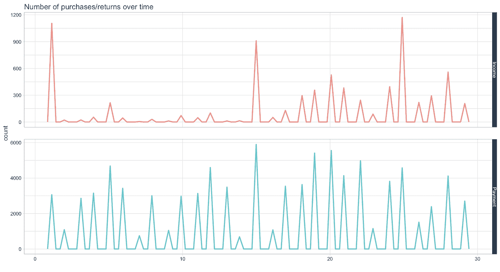

**图 7** :一个月的交易笔数——收入和流出。请注意，收入有非常明显的峰值。合成数据必须捕捉这些峰值

# 运行代码

我们使用以下参数仅运行了 100 个时期的代码:

```
import sys
import os
sys.path.append("..")
import matplotlib.pyplot as plt

from gan import output
sys.modules["output"] = output

import numpy as np
import pickle
import pandas as pd

from gan.doppelganger import DoppelGANger
from gan.load_data import load_data
from gan.network import DoppelGANgerGenerator, Discriminator, AttrDiscriminator
from gan.output import Output, OutputType, Normalization
import tensorflow as tf
from gan.network import DoppelGANgerGenerator, Discriminator, \
    RNNInitialStateType, AttrDiscriminator
from gan.util import add_gen_flag, normalize_per_sample, \
    renormalize_per_sample

sample_len = 10
epoch = 100
batch_size = 20
d_rounds = 2
g_rounds = 1
d_gp_coe = 10.0
attr_d_gp_coe = 10.0
g_attr_d_coe = 1.0
```

请注意，生成器由一系列层组成，对于分类输入使用 *softmax* 激活功能，对于连续变量使用*线性*激活功能。发生器和鉴别器都使用具有指定学习速率和动量的 [Adam 算法](https://arxiv.org/abs/1412.6980)进行优化。

现在，我们准备好数据来输入网络。real_attribute_mask 是一个 True/False 列表，其长度与属性的数量相同。如果属性为(max-min)/2 或(max+min)/2，则为 False 否则为真。首先，我们实例化生成器和鉴别器:

```
# create the necessary input arrays
data_all, data_attribut, data_gen_flag = format_data(data,cols)
# normalise data
(data_feature, data_attribute, data_attribute_outputs,
 real_attribute_mask) = normalize_per_sample(
        data_all, data_attribut, data_feature_outputs,
        data_attribute_outputs)
# add generation flag to features
data_feature, data_feature_outputs = add_gen_flag(
    data_feature, data_gen_flag, data_feature_outputs, sample_len)generator = DoppelGANgerGenerator(
    feed_back=False,
    noise=True,
    feature_outputs=data_feature_outputs,
    attribute_outputs=data_attribute_outputs,
    real_attribute_mask=real_attribute_mask,
    sample_len=sample_len,
    feature_num_units=100,
    feature_num_layers=2)

discriminator = Discriminator()
attr_discriminator = AttrDiscriminator()
```

我们使用由两层 100 个神经元组成的神经网络作为生成器和鉴别器。所有数据都进行了标准化或 1-hot 编码。然后，我们用以下参数训练模型:

```
checkpoint_dir = "./results/checkpoint"
sample_path = "./results/time"
epoch = 100
batch_size = 50
g_lr = 0.0001
d_lr = 0.0001
vis_freq = 50
vis_num_sample = 5
d_rounds = 3
g_rounds = 1
d_gp_coe = 10.0
attr_d_gp_coe = 10.0
g_attr_d_coe = 1.0
extra_checkpoint_freq = 30
num_packing = 1
```

# 关于培训的一些注意事项

如果数据很大，你应该使用更大数量的历元——作者建议 400 个，但在我们的实验中，我们发现我们可以高达 1000 个而网络不会退化到模式崩溃。此外，考虑到历元的数量与批次大小有关，较小的批次需要更多的历元和较低的学习率。

对于刚接触神经网络的人来说，批量、随机和小批量梯度下降是机器学习算法的三种主要形式。训练神经网络时，批量大小控制误差梯度估计的准确性。在学习过程中，用户应了解批次大小、速度和稳定性之间的权衡。更大的批量需要更大的学习速率，网络将学习得更快，但也可能不太稳定，由于[模式崩溃问题](https://medium.com/@jonathan_hui/gan-why-it-is-so-hard-to-train-generative-advisory-networks-819a86b3750b#:~:text=Mode%20collapse%20is%20one%20of%20the%20hardest%20problems%20to%20solve%20in%20GAN.&text=The%20mode%20collapses%20to%20a,to%20detect%20this%20single%20mode.)，这对于 GANs 来说尤其成问题。

根据经验，生成器和鉴别器的学习率应该很小(在 10–3 到 10–5 的范围内)并且彼此相似。在我们的例子中，我们使用 10–4，而不是默认的 10–3。

另一个重要参数是发生器和鉴别器上的回合数。Wasserstein GAN (WGAN)需要两个组件才能正常工作:梯度限幅和比发生器更高的鉴频器轮数(d_round)。通常，对于发生器的每一轮，鉴别器的轮数在 3 到 5 之间。这里我们用 d_round=3，g_round=1。

为了加速训练，我们对生成器使用了一个[循环学习率](https://arxiv.org/pdf/1506.01186.pdf)，对鉴别器使用了一个固定的学习率。

目录 sample_path 存储了在不同检查点收集的一组样本，这对验证非常有用。损失函数的可视化可以使用 TensorBoard 在您提供的检查点目录上完成。您可以使用参数 extra_checkpoint_freq 控制检查点的频率。

请注意，这可能会占用大量磁盘空间。在 MacBook Pro 上模拟不到十分钟。

```
run_config = tf.ConfigProto()
tf.reset_default_graph() # if you are using spyder 
with tf.Session(config=run_config) as sess:
    gan = DoppelGANger(
        sess=sess, 
        checkpoint_dir=checkpoint_dir,
        sample_dir=sample_dir,
        time_path=sample_path,
        epoch=epoch,
        batch_size=batch_size,
        data_feature=data_feature,
        data_attribute=data_attribute,
        real_attribute_mask=real_attribute_mask,
        data_gen_flag=data_gen_flag,
        sample_len=sample_len,
        data_feature_outputs=data_feature_outputs,
        data_attribute_outputs=data_attribute_outputs,
        vis_freq=vis_freq,
        vis_num_sample=vis_num_sample,
        generator=generator,
        discriminator=discriminator,
        attr_discriminator=attr_discriminator,
        d_gp_coe=d_gp_coe,
        attr_d_gp_coe=attr_d_gp_coe,
        g_attr_d_coe=g_attr_d_coe,
        d_rounds=d_rounds,
        g_rounds=g_rounds,g_lr=g_lr,d_lr=d_lr,
        num_packing=num_packing,
        extra_checkpoint_freq=extra_checkpoint_freq)
    gan.build()
    gan.train()
```

# 合成数据生成

模型定型后，您可以使用生成器从噪声中创建合成数据。有两种方法可以做到:

1.  纯噪声的无条件生成
2.  属性的条件生成

在第一种情况下，我们生成属性和特征。在第二个示例中，我们明确指定了我们希望以哪些属性作为要素生成的条件，以便只生成要素。

下面是从中生成样本的代码:

```
run_config = tf.ConfigProto()
total_generate_num_sample = 1000
with tf.Session(config=run_config) as sess:
    gan = DoppelGANger(
        sess=sess, 
        checkpoint_dir=checkpoint_dir,
        sample_dir=sample_dir,
        time_path=time_path,
        epoch=epoch,
        batch_size=batch_size,
        data_feature=data_feature,
        data_attribute=data_attribute,
        real_attribute_mask=real_attribute_mask,
        data_gen_flag=data_gen_flag,
        sample_len=sample_len,
        data_feature_outputs=data_feature_outputs,
        data_attribute_outputs=data_attribute_outputs,
        vis_freq=vis_freq,
        vis_num_sample=vis_num_sample,
        generator=generator,
        discriminator=discriminator,
        attr_discriminator=attr_discriminator,
        d_gp_coe=d_gp_coe,
        attr_d_gp_coe=attr_d_gp_coe,
        g_attr_d_coe=g_attr_d_coe,
        d_rounds=d_rounds,
        g_rounds=g_rounds,
        num_packing=num_packing,
        extra_checkpoint_freq=extra_checkpoint_freq)

# build the network 
    gan.build()

    length = int(data_feature.shape[1] / sample_len)
    real_attribute_input_noise = gan.gen_attribute_input_noise(
                total_generate_num_sample)
    addi_attribute_input_noise = gan.gen_attribute_input_noise(
                total_generate_num_sample)
    feature_input_noise = gan.gen_feature_input_noise(
                total_generate_num_sample, length)
    input_data = gan.gen_feature_input_data_free(
                total_generate_num_sample)# load the weights / change the path accordingly
    gan.load(checkpoint_dir+'/epoch_id-100')

# generate features, attributes and lengths
    features, attributes, gen_flags, lengths = gan.sample_from(
        real_attribute_input_noise, addi_attribute_input_noise,
        feature_input_noise, input_data, given_attribute=None,
        return_gen_flag_feature=False)
#denormalise accordingly
    features, attributes = renormalize_per_sample(
        features, attributes, data_feature_outputs,
        data_attribute_outputs, gen_flags,
        num_real_attribute=1)
```

我们需要一些额外的步骤来将生成的样本处理成序列格式，并返回 1-hot 编码格式的向量。

```
nfloat = len(continuous)
synth=np.zeros(features.shape[-1])
for i in range(features.shape[0]):
    v = np.concatenate([np.zeros_like(attributes[i]), np.zeros_like(features[i])],axis=-1)
    v[attributes[i].shape] = attributes[i]
    V[attributes[i].shape[0]:attributes[i].shape[0]+1] = feature[i,:,0]

    for j, c in enumerate(categories_cum[:-1]):
        ac = features[:,nfloat+categories_cum[j]-1:          nfloat+categories_cum[j+1]-1]
        a_hot = np.zeros((ac.shape[0], categories_n[j]))    
        a_hot[np.arange(ac.shape[0]),ac.argmax(axis=1)] = 1
        v[:,nfloat+categories_cum[j]:nfloat+categories_cum[j+1]]=a_hot
    v=np.concatenate([np.array([i]*len(ac))[np.newaxis].T,v],axis=1)

    synth = np.vstack([synth,v])

df = pd.DataFrame(synth[1:,1:],columns=processed_df.columns)
formated_df = processor.format_df(df)
formated_df['account_id']=synth[:,0] # add account_id
```

下面我们给出了合成(生成)数据和真实数据之间的一些比较。我们可以观察到，总的来说，生成的数据分布与真实分布匹配得相当好——图 8 和图 9。

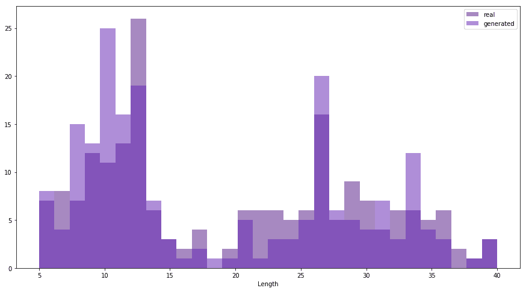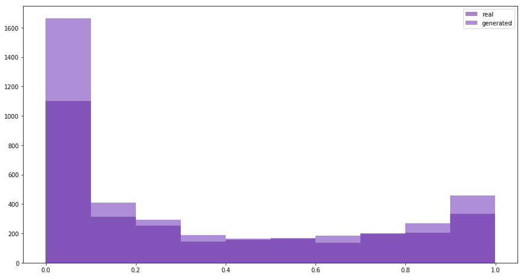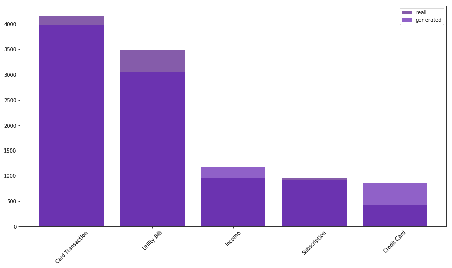

**图 8** :生成数据与实际数据的序列长度直方图(上图)事务之间的时间间隔直方图(中图)和标志直方图(下图)。

唯一的例外是变量*的分布量*，如图 9 所示。这是由于该变量具有非平滑分布的事实。为了解决这个问题，我们将其离散化为 20 个级别，从而得到更好的匹配。

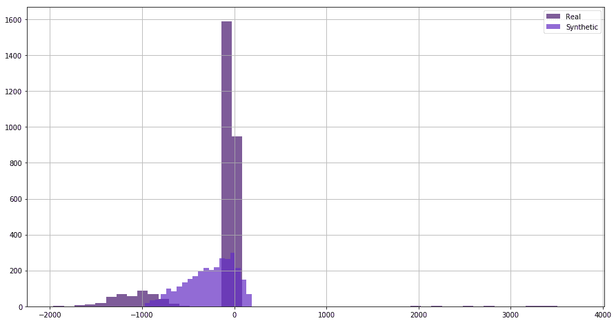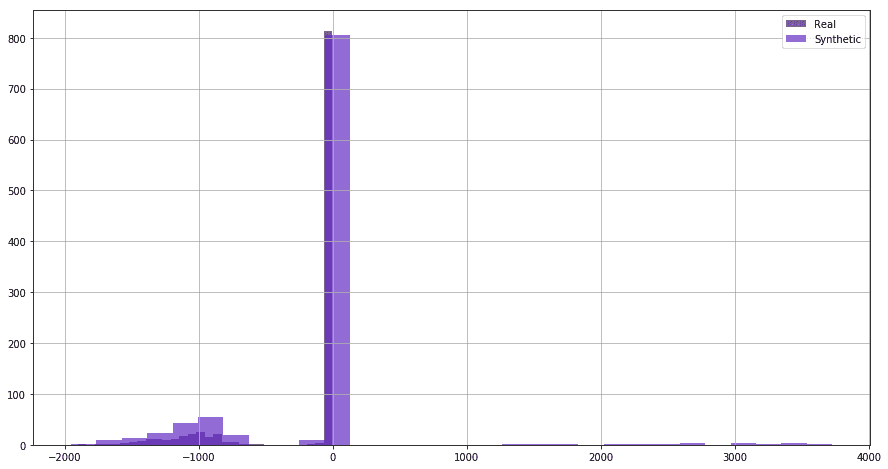

**图 9** :使用连续编码(上)和二进制独热编码(下)生成的实际数量与。

然后，我们使用模糊度量来计算**相似性得分。**该分数是三个分数的平均值:直方图和 histogram2D 相似性(真实和合成数据直方图重叠的程度)以及列之间的互信息。该分数确定了合成数据保持列间相关性的程度。

当将*数量*视为连续变量时，我们得到的相似性得分为 **0.57** ，当我们将其二进制化为 20 个箱时，我们得到的相似性得分为 **0.63** 。相似性得分如下获得:

```
from hazy_trainer.evaluation.similarity import Similarity
sim = Similarity(metrics=['hist','hist2d','mi'])
score = sim.score(real_df[cols], formated_df[cols])
print(score['similarity']['score'])
```

然而，我们注意到，这个数字并没有真正说明全部情况，因为它没有明确地测量合成数据序列的时间一致性——它独立地处理每一行。

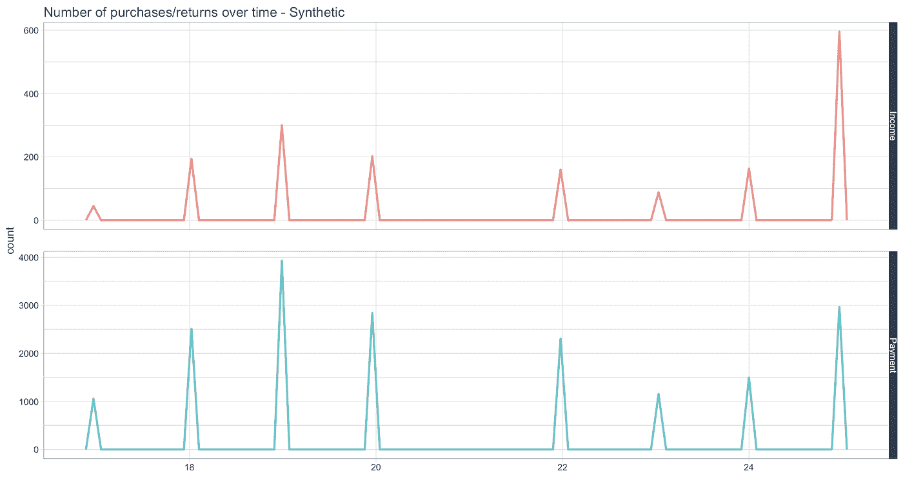

**图 10** :一段时间内模型生成的交易量(资金进出)。

为此，我们使用了一个额外的关键指标:**自相关**，它衡量在时间 *t* 发生的事件*与在*时间*t—∈*发生的事件*之间的关系，其中∈是时间延迟。为了衡量这种关系，我们用以下方式进行比较:*

AC = I = 1T(Areali-Asynthetici)2/I = 1T(Areali)2

下面是真实数据和合成数据的总支出(按天累计)的自相关图。我们可以看到两者有非常相似的模式。

这只适用于数字数据。对于分类，我们可以使用互信息。对于我们的数据，我们得到 AC = 0.71

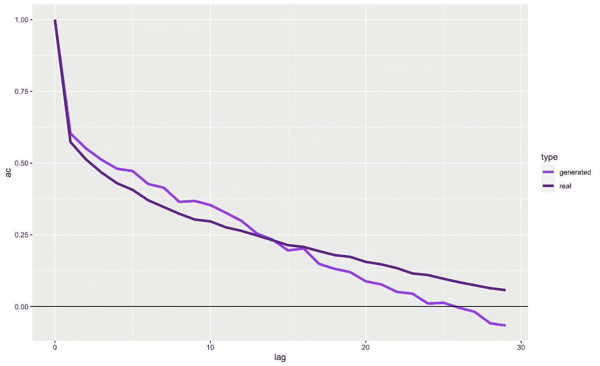

**图 11** :银行交易数据集真实数据和合成数据的自相关。

# 交通数据集

为了证明顺序数据生成器的能力，我们在另一个更具挑战性的数据集上测试了它:地铁州际交通量数据集。这是一个数据集，包含 2012 年至 2018 年的每小时交通数据。正如我们在接下来的图中看到的，随着时间的推移，数据相对一致，具有一些每日和每周模式以及较大的每小时可变性。源自发生器的合成数据必须再现所有这些趋势。

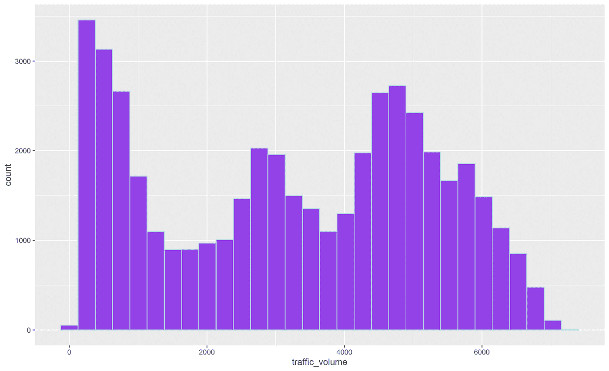

**图 12** :车流量直方图(每小时车流量)。

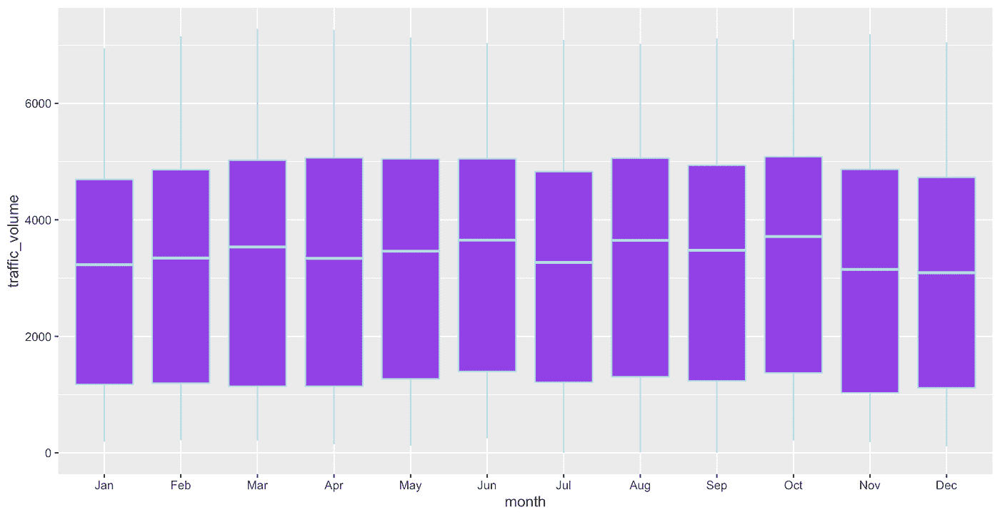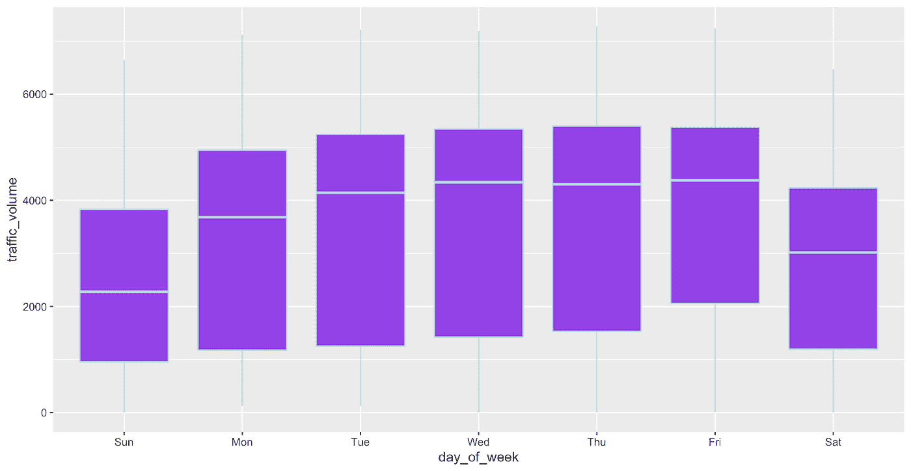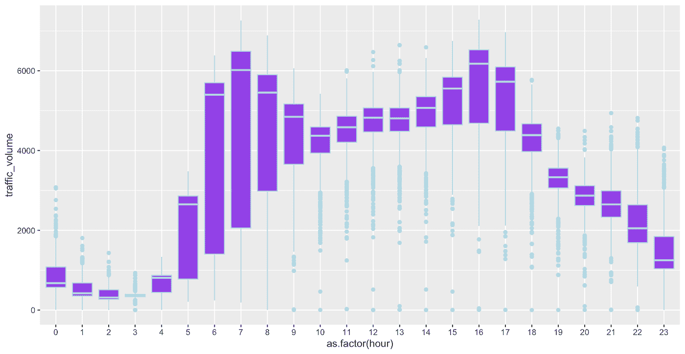

日常模式可能相当复杂，如下图所示，包含第一个月(2012 年 10 月)的流量:

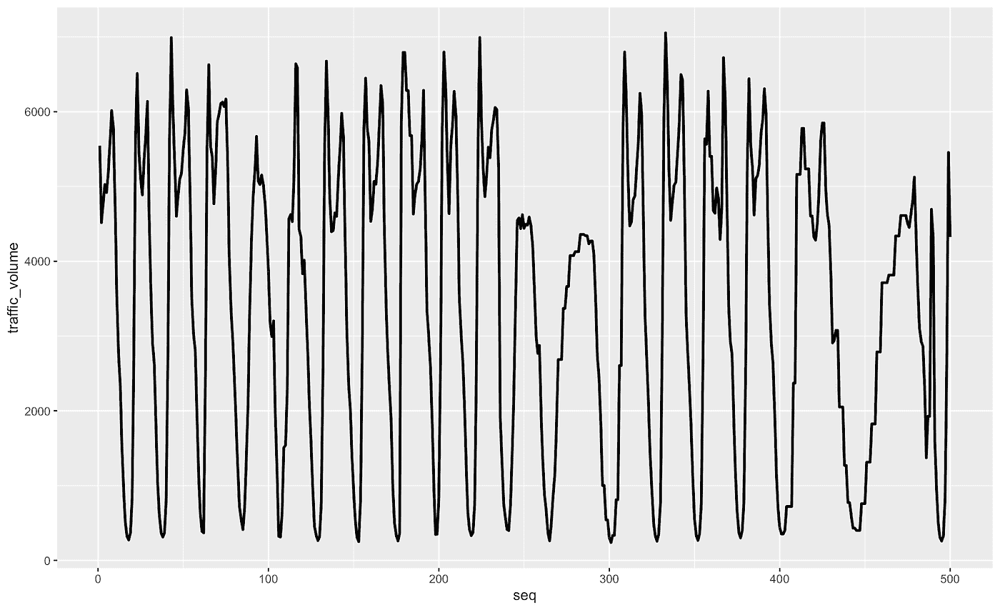

**图 14**:2012 年 10 月的每小时交通模式。每一滴代表一天。在低流量模式下，周末是可见的。

为了生成高质量的合成数据，网络必须预测正确的每日、每周、每月甚至每年的模式，因此长期相关性非常重要。

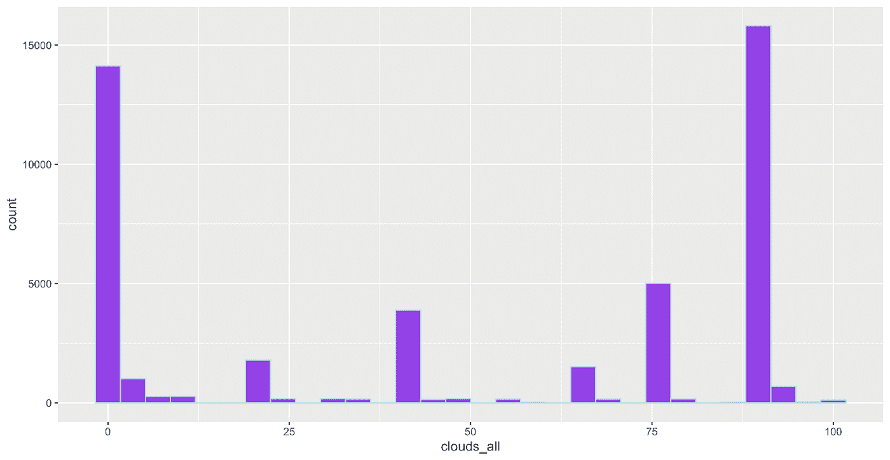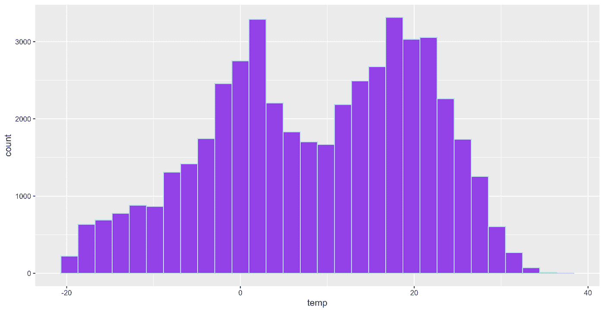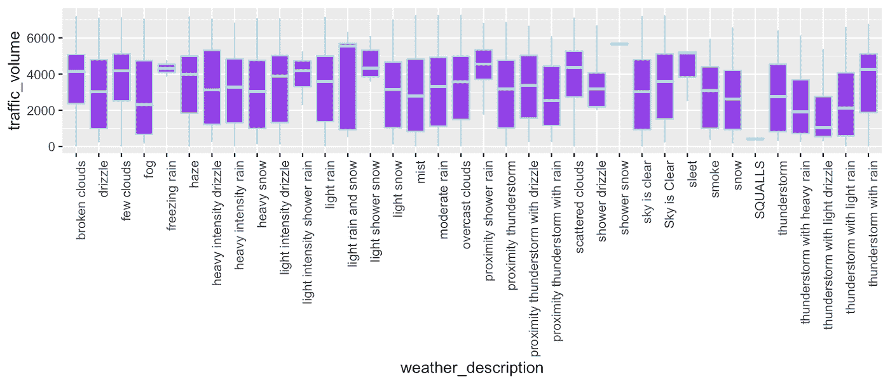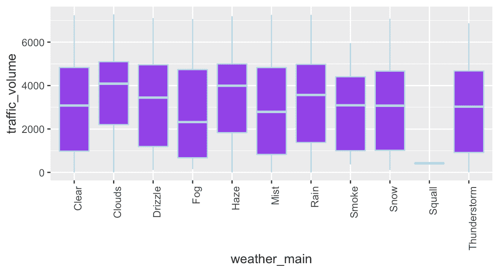

**图 15** :数据的更多分布。

在自相关方面，我们可以看到平滑的每日相关性，这是有意义的，因为大多数流量具有对称行为。早上的高强度与晚上的高强度相关。

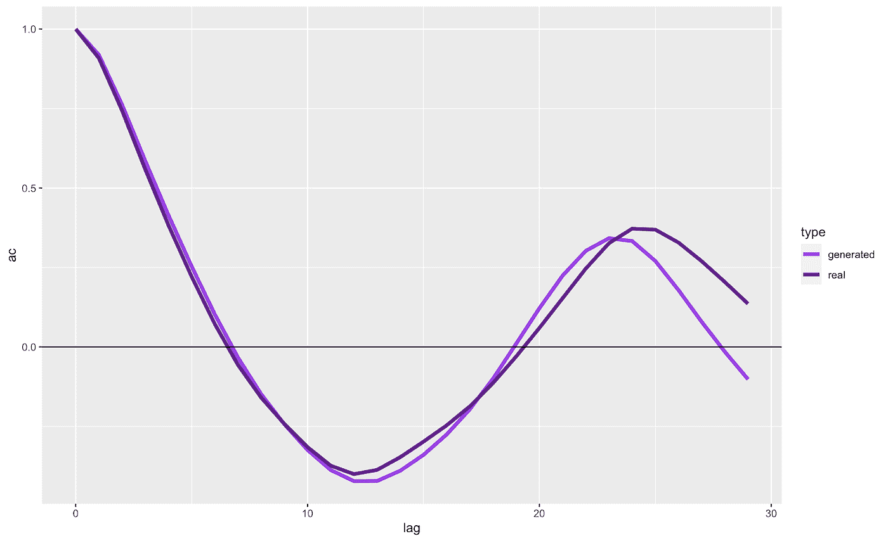

**图 15** :真实交通数据与生成交通数据的自相关。对于较长的腿，合成数据的自相关开始偏离从真实数据获得的自相关

# 运行模型

在这种情况下，序列长度是固定的。为了准备数据，我们使用每月和每周数据的滑动窗口生成了 50，000 个序列。这个数据集比前一个数据集大得多，我们希望模型能够平稳运行，不会出现模式崩溃。

在这种情况下，我们也有更多的属性。一些，像*星期几*和*月份*，是从数据中构建的:

*   温度
*   Rain_1h
*   Snow_1h
*   云 _ 全部
*   天气 _ 描述
*   天气 _ 主要
*   假期
*   星期几
*   月

作为特色，我们只有每小时的*流量*。因为我们希望以最高的粒度捕获这个变量，所以所有的数值都被离散到 20 个箱中，除了交通量被离散到 50 个箱中。该模型运行了 200 个时期，批次大小为 20，学习速率与之前相同。

# 结果

图 17 包含一个真实的生成样本。我们可以看到，循环模式保持得很好，数据看起来很真实。

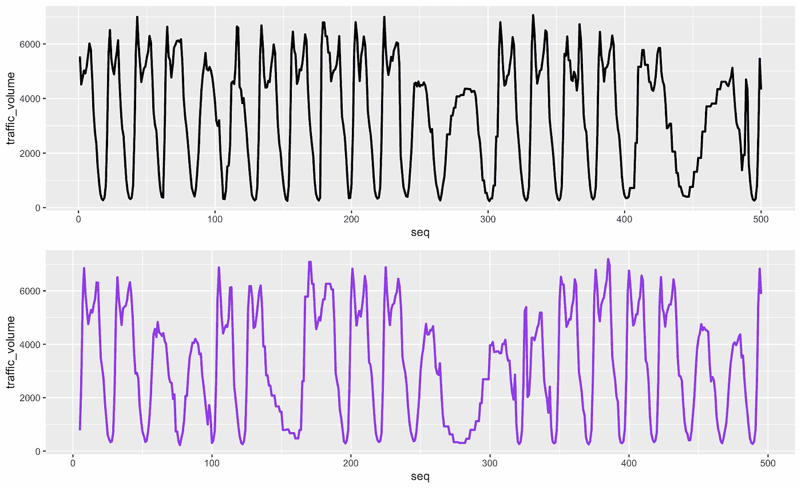

**图 17**:500 小时内的真实(上)和生成(下)序列。这个模型是无条件运行的。我们可以看到，合成数据很好地捕捉了每日和每周的模式。

为了测试生成数据的质量，我们提供了一些指标，见表 2:

*   **相似度** —通过直方图的重叠和互信息来度量
*   **自相关**——超过 30 个时间滞后的真实和合成之间的比率
*   **效用** —用真实数据和合成数据训练时预测误差的相对比率来衡量

我们使用 LSTM(长短期记忆)模型和自举作为基线。这个 [LSTM 模型](https://en.wikipedia.org/wiki/Long_short-term_memory)由两层组成，每层 100 个神经元，使用 30 小时的滑动窗口。属性通过密集层添加，并连接到网络的最后一个隐藏层。

从表 2 中可以看出，用每周数据训练的 dopper 表现相对较好，远远超过了 bootstrapping 技术。

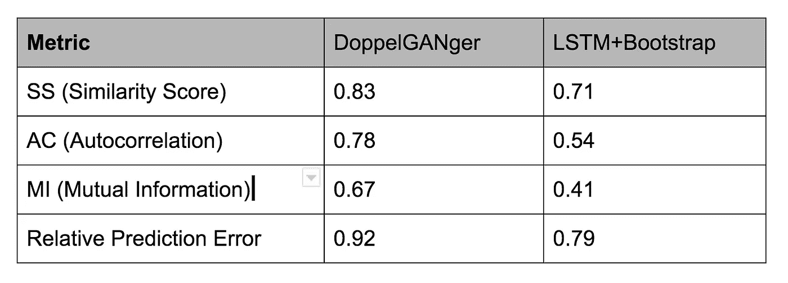

表 2:流量数据集的结果。

我们添加了第三个度量标准，即**顺序互信息** (SMI)。它在包含 *T* 列的矩阵上评估交互信息，其中每一列对应于之前 T、t-1、t-2、… t-T 时间步发生的事件，并在属性子集上求平均。

我们应该注意到，模型可以以属性为条件，因此我们可以为特定的天气条件或一周或一月中的某一天生成样本。

# 差分隐私实验

在最初的工作中，作者通过向鉴别器添加噪声并剪裁其梯度的众所周知的技术——DPGAN,在模型中引入了差分隐私。

然而，他们发现，一旦隐私预算ε变得相对较小——这意味着合成数据变得更安全，它也开始失去质量——通过相对于真实数据的时间一致性来衡量。如果数据的最终用途是提取详细的时间信息，如事件之间的因果关系，这可能是一个大问题。

基于[最近围绕 PPGAN](https://arxiv.org/pdf/1910.02007.pdf) (隐私保护生成对抗网络)的工作，我们对注入鉴别器梯度的噪声进行了一些修改。[矩的会计师](https://arxiv.org/pdf/1607.00133.pdf)将隐私损失问题框定为一个随机变量，使用其矩生成函数来控制变量的密度分布。这个性质使得 PPGAN 模型训练更加稳定。当产生非常长的序列时，与 DPGAN 的差异尤其显著。

噪声由下式给出:

ɸ=f+N(0,σ2𝜍f2)

其中𝞷是对来自两个相邻点 *x* 和 *x* 的查询 *f* 的敏感度:

△f = maxf(x)-f(x’)2

该表达式意味着，最具信息性的点(最高灵敏度)会将更多的噪声添加到渐变中，因此不会影响其他点的质量。通过使用这种精心设计的噪声，我们能够在流量数据上保持 88%的自相关，直到ε = 1。

# 结论

合成顺序数据生成是一个尚未完全解决的具有挑战性的问题。通过上述测试，我们证明了 GANs 是解决这一问题的有效方法。
请访问 Hazy 网站，了解[合成时序数据](https://hazy.com/blog/2020/07/09/how-to-generate-sequential-data)的业务用例