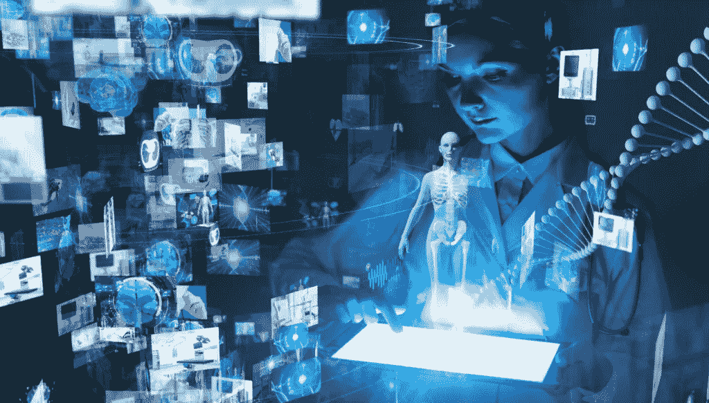

# 为临床评估报告获取正确的数据:人工智能驱动的方法

> 原文：<https://pub.towardsai.net/getting-the-right-data-for-clinical-evaluation-reports-an-ai-powered-approach-7e9db990b3ad?source=collection_archive---------2----------------------->

## [人工智能](https://towardsai.net/p/category/artificial-intelligence)

假设您是一家医疗器械制造商，在欧盟(EU)有任何业务(销售、运营或其他)。在这种情况下，你可能已经知道[欧盟 MDR](https://eumdr.com/)——一个比其前身医疗器械指令(MDD)对临床证据有更严格要求的监管制度——于今年早些时候生效。

坏消息呢？对于大多数公司来说，与他们以前处理的任何事情相比，遵守 MDR 意味着更多的时间、专业知识和费用。

这种资源紧张主要是由于寻找正确数据以满足欧洲 [MEDDEV](https://ec.europa.eu/health/sites/default/files/md_sector/docs/md_guidance_meddevs.pdf) (医疗器械文档)指南的耗时任务，该指南管理临床评估报告的创建( [CER](https://www.mondaq.com/unitedstates/healthcare/579260/clinical-evaluation-reports-how-to-leverage-published-data) )。为了保持合规性并获得在欧盟境内销售的 CE 标志，医疗器械制造商必须提交一份 CER——一份基于已发表和未发表的内部文献的公正的临床器械评估——并保持更新。所有 cer 必须证明符合 MEDDEV 2.7/1 Rev. 4 附录 1 中的安全和性能基本要求。

所有这些加起来的工作量令人难以置信——尤其是考虑到 MDR 在设备分类、技术文档、上市后监督和其他领域的新[要求](https://www.kolabtree.com/blog/what-is-a-clinical-evaluation-report/)。

人工智能和自然语言处理(NLP)技术是强大的工具，可以帮助医疗设备制造商创建并保持全面的 cer 最新。但是具体怎么做呢？

让我们找出答案。

## 什么造就了 CER？

其核心是，cer 是极其详细的收益/风险评估。它们确保每种医疗设备的优势超过任何潜在的劣势，并且可以包括与特定设备相关的数据或关于等效设备的数据。

CER 的生产通常分为五个不同的阶段:

*   阶段 0:范围定义和规划
*   阶段 1:确定相关数据
*   阶段 2:评估相关数据
*   阶段 3:临床数据分析
*   阶段 4:临床评估报告的定稿

cer 被提交给 MDR 下指定的[认证机构](https://ec.europa.eu/growth/tools-databases/nando/index.cfm?fuseaction=directive.notifiedbody&dir_id=34) (NBs ),他们权衡诸如以下问题:设备是否能按预期运行？会安全吗？它是否优于替代护理方法？在评估这些和其他查询后，NB 然后确定该设备是否可以在欧洲销售，或者在批准前是否需要额外的临床数据。

## 确定核证的排减量中的相关数据

为了完成上面的第 1 和第 2 阶段，CERs [需要](https://www.mondaq.com/unitedstates/healthcare/579260/clinical-evaluation-reports-how-to-leverage-published-data)大量来自内部和外部(通过 PUBMED、EMBASE、Cochrane 和谷歌学术等数据库)的关于设备的有利和不利数据。

公司必须提交一份完整的评估报告，评估该设备在安全性和性能方面的所有技术特性和测试结果，包括:

*   用于验证和确认的临床前测试数据(包括台架和/或动物测试)
*   测试或其他过程中的任何设备故障
*   制造商生成的临床数据，例如:

a)上市前临床调查

b)上市后临床数据

c)投诉报告

d)移植装置评估

e)现场安全纠正措施

使用说明

纳入的其他关键[数据点](https://www.trilogywriting.com/publications/the-clinical-evaluation-report-bringing-it-together/)围绕医疗器械的可用性，通过人为因素研究和相关临床领域的技术水平(SOTA)审查确定。

## cer 的数据收集:常见挑战和错误

然而，如果执行不当，识别相关数据的过程在最好的情况下会产生误导，在最坏的情况下会造成灾难。事实上，由于搜索专业人员的能力加上一些常见的错误和挑战，手动文献搜索的结果可能会大幅波动，正如 Indani 等人在 2017 年的一项研究[中详细描述的那样。](https://www.academia.edu/31268142/Literature_Search_for_Scientific_Processes_in_Medical_Devices_Challenges_Errors_and_Mitigation_Strategies)

## 典型的数据包含错误

因达尼等人。详细说明几个常见错误，这些错误可能会延迟或破坏任何科学文献搜索，包括:

1.  **包含错误(即数据过多)**。使用模糊或笼统的搜索术语、非专门化的医学数据库和错误的布尔逻辑会导致大量特定和非特定的信息，以及大量半相关、不相关或重复的数据。
2.  **排除错误(即数据太少)**。当搜索词过于具体时，或者如果排除布尔逻辑(如“与”运算符)被过度使用，可能会导致相反的问题——缺乏不包括所有相关信息的可用数据。
3.  **包含排除错误**。这些错误包括基于预期结果进行文献搜索的人的关键字和数据选择偏差。
4.  **独家夹杂物错误**。这些错误限制了搜索结果，因为使用了极其排他的搜索词，包括没有考虑当地方言和拼写，或者排除了常见的同义词。
5.  **排除性错误(有限相关性)**。当搜索带有偏见和太多的特殊性，导致一个片面的数据集，没有足够的信息。

这些挑战及其导致的错误的严重程度不一，从 CER 生产延迟到被 MDR 指定的 NBs 直接拒绝。

## NLP 是你搜索 CER 文献的秘密武器

出于这些和其他原因，研究人员表示，通过人工智能和自然语言处理实现自动化是提高 CER 研究的效率、成本效益、速度和准确性的关键。“基于人工智能和自然语言处理的具有认知能力的工具为文献搜索提供了近乎完美的解决方案，”[Indani 等人说。](http://www.ijsrp.org/research-paper-0217/ijsrp-p6234.pdf)

研究人员还表示，基于自然语言处理的自动化减少了偏见，通过算法重用和定制减少了多次搜索的需要，允许自动翻译其他语言的来源，并可以将文献选择和提取的过程加快几个数量级，“大大减少了手动搜索和过滤适当内容所需的时间。

“自动化将最终减少整个过程中的成本、时间和资源(需求)，”他们说。“一个好的文献搜索工具和一个训练有素的文献搜索专业人员的结合可以是避免文献搜索的错误和局限性的最佳解决方案。”

## CapeStart 可以改进您的 CER 文献搜索

[CapeStart 的](https://www.capestart.com/) NLP 自动化、主题专家和智能工作流程提供了一个可重复、透明的流程，使制作和提交 cer、保持 cer 的最新状态以及在您的所有产品和业务部门中实现 cer 的标准化变得更加容易和便宜。我们的 NLP 模型从审稿人的输入中学习，根据相关性不断评估和重新排序科学文献，与手动方法相比，显著提高了文献审核的准确性、效率和速度。

这意味着医疗器械制造商可以通过现成的表格模板、自动化质量保证、重复识别和常见错误识别(如包含排除或排除包含)来生产审计就绪的合规 cer，有时所需时间不到手动方法的一半。