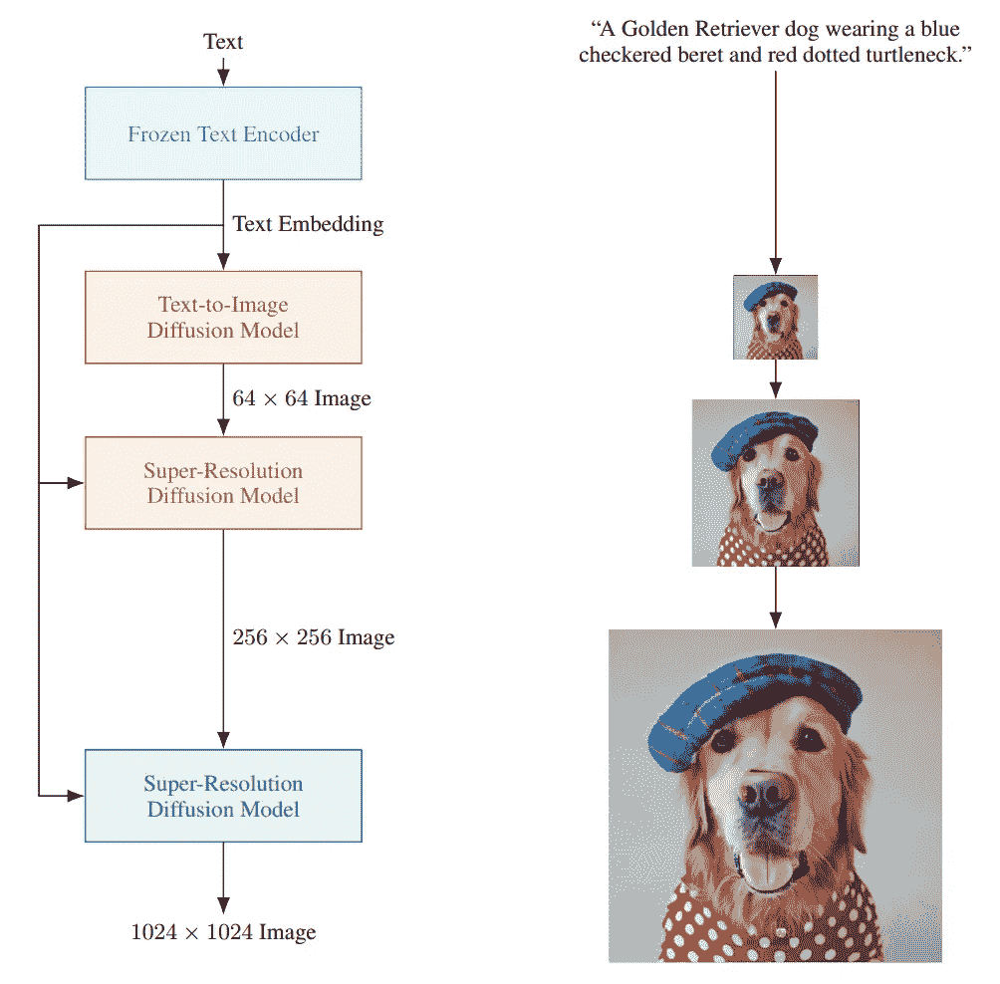

# 谷歌大脑的新模型 Imagen 甚至比 Dall-E 2 更令人印象深刻！

> 原文：<https://pub.towardsai.net/google-brains-new-model-imagen-is-even-more-impressive-than-dall-e-2-be00740ba2bd?source=collection_archive---------0----------------------->

## 一个比 Dall-e 2 更好地从输入文本中创建照片级逼真图像的人工智能！

> 最初发表于 [louisbouchard.ai](https://www.louisbouchard.ai/google-brain-imagen/) ，前两天在[我的博客](https://www.louisbouchard.ai/google-brain-imagen/)上读到的！

## 观看视频

如果你认为 [Dall-e 2](https://youtu.be/rdGVbPI42sA) 有很好的效果，那就等着看谷歌大脑的这个新模型能做什么吧。Dalle-e 令人惊叹，但往往缺乏真实感，这就是该团队通过这款名为 [Imagen](https://youtu.be/qhtYPhPWCsI) 的新模型所要解决的问题。他们在他们的项目页面上分享了许多结果以及一个基准，他们引入该基准是为了比较文本到图像的模型，在这方面他们明显优于 [Dall-E 2](https://youtu.be/rdGVbPI42sA) 和以前的图像生成方法。看上面视频里的结果！

这个基准测试非常酷，因为我们看到越来越多的文本到图像模型，很难比较结果——除非我们假设结果真的很差，而我们经常这样做。但是这个模型，和 dall-e 2，绝对无视这些可能性。

TL；dr:这是一个新的文本到图像的模型，你可以和 Dalle-E 2 相比，根据人类测试人员的说法，它更真实。

结果示例。图片来自 Imagen 项目网站。

因此，就像我一个月前报道的 Dall-E 一样，这个模型采用类似“一只金毛猎犬，戴着蓝色方格贝雷帽，穿着红色圆点的高领毛衣”的文本，并试图从这个奇怪的句子中生成一个逼真的图像。这里的要点是，Imagen 不仅可以理解文本，还可以理解它生成的图像，因为它们比所有以前的方法都更真实。

当然，我说的理解，是指它自己那种和我们不一样的理解。模型并不真正理解它生成的文本或图像。它肯定有一些相关的知识，但它主要理解这种带有这些物体的特殊句子应该如何用图像上的像素来表示。但我不得不承认，当我们看到这些结果时，它看起来确实理解了我们发送给它的内容！

结果示例。图片来自 Imagen 项目网站。

显然，你可以用一些看起来不真实的非常奇怪的句子来欺骗它，就像这个，但它有时会击败你自己的想象，创造出一些惊人的东西。

Imagen 模型架构。图片来自[纸张](https://gweb-research-imagen.appspot.com/paper.pdf)。

然而，更令人惊奇的是它是如何使用我从未在频道上讨论过的东西工作的；扩散模型。但是在使用这个扩散模型之前，我们首先需要了解文本输入。这也是与 Dall-e 的主要区别。他们使用了一个巨大的文本模型，类似于 [GPT-3](https://youtu.be/gDDnTZchKec) ，尽人工智能系统所能理解文本。因此，他们不是用图像生成模型来训练文本模型，而是简单地使用一个大的预训练模型，并将其冻结，以便它在图像生成模型的训练期间不会改变。从他们的研究来看，这导致了更好的结果，而且似乎模型更好地理解了文本。

所以这个文本模块是模型理解文本的方式，这种理解用我们所说的编码来表示，这就是模型在巨大的数据集上被训练做的事情，将文本输入转换成它可以使用和理解的信息空间。现在，我们需要使用这种转换后的文本数据来生成图像，正如我所说，他们使用了扩散模型来实现这一点。

但是什么是扩散模型呢？

扩散模型是生成模型，通过学习如何迭代地反转高斯噪声，将像这样的随机高斯噪声转换成图像。它们是超分辨率或其他图像到图像转换的强大模型，在这种情况下，使用一种经过修改的 [U-Net](https://youtu.be/HBvUbjKtKsE?list=PLO4GrDnQanVfSvkbEGDFdJ-fXxuFZAtYF) 架构，我在以前的视频中多次提到过，所以我不会在这里进入架构细节。

基本上，该模型被训练成从纯噪声中去除图像的噪声，他们使用文本编码和一种称为无分类器指导的技术来定向图像，他们说这对于结果的质量至关重要，并在他们的论文中清楚地解释了这一点。我会让你阅读更多关于这种技术的信息，链接在下面的参考文献中。

现在，我们有了一个模型，它能够采用随机高斯噪声和我们的文本编码，并在文本编码的指导下对其进行降噪，以生成我们的图像。但是正如您在上面展示模型的图中看到的，它并不像听起来那么简单。我们刚刚生成的图像非常小，因为更大的图像需要更多的计算和更大的模型，这是不可行的。相反，我们首先使用我们刚刚讨论过的扩散模型生成一个真实感图像，然后使用其他扩散模型来迭代地提高图像的质量。我已经在过去的视频中介绍过[超分辨率](https://youtu.be/GFm3RfrtDoU)型号，所以我不会在这里进入细节，但让我们做一个快速概述。同样，我们希望有噪声而不是图像，因此我们再次用一些高斯噪声破坏了这个最初生成的低分辨率图像，并且我们训练我们的第二扩散模型来获取这个修改的图像并对其进行改进。

Imagen 模型架构。图片来自[报](https://gweb-research-imagen.appspot.com/paper.pdf)，由作者编辑。

然后，我们用另一个模型重复这两个步骤，但这一次只使用图像的碎片来做相同的放大比例，并保持计算上的可行性。

瞧！我们最终得到了逼真的高分辨率图像！

结果示例。图片来自 Imagen 项目网站。

当然，这只是这个令人兴奋的新模型的概述，结果非常酷。我肯定会邀请您阅读他们的伟大论文，以深入了解他们的方法和详细的结果分析。

而你，你觉得成绩比得上 dall-e 2 吗？他们是更好还是更差？我确信它是 dall-e 目前的主要竞争对手。让我知道你对这个新的谷歌大脑出版物和解释的看法。

我希望你喜欢这篇文章，如果你喜欢，请花一秒钟在[视频](https://youtu.be/qhtYPhPWCsI)下留下一个赞来支持我的工作，并关注博客以了解令人兴奋的 AI 新闻！

下周我会带着另一篇精彩的论文来看你！

## 参考

观看视频:[https://youtu.be/qhtYPhPWCsI](https://youtu.be/qhtYPhPWCsI)
论文:Saharia 等人，2022，Imagen —谷歌大脑，[https://gweb-research-imagen.appspot.com/paper.pdf](https://gweb-research-imagen.appspot.com/paper.pdf)项目链接:[https://gweb-research-imagen.appspot.com/](https://gweb-research-imagen.appspot.com/)
我的简讯(每周向您的电子邮件解释的新 AI 应用！):[https://www.louisbouchard.ai/newsletter/](https://www.louisbouchard.ai/newsletter/)