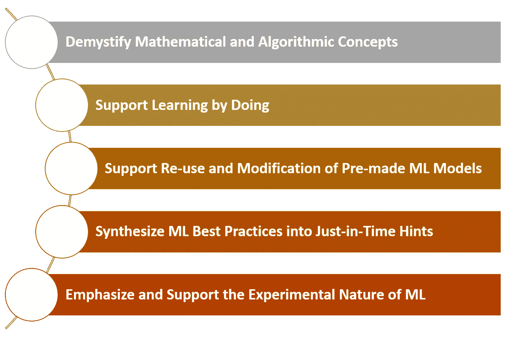

# 谷歌机器学习成为主流的五大原则

> 原文：<https://pub.towardsai.net/google-five-principles-for-machine-learning-to-go-mainstream-411da34b353f?source=collection_archive---------0----------------------->

## [机器学习](https://towardsai.net/p/category/machine-learning)

## 谷歌研究概述了五个关键里程碑，应该达到这些里程碑才能指数级增加机器学习技术的采用。

来源:https://newrelic.com/blog/nerd-life/comet-integration

> 我最近创办了一份专注于人工智能的教育时事通讯，已经有超过 10 万名订户。《序列》是一份无废话(意思是没有炒作，没有新闻等)的 ML 导向时事通讯，需要 5 分钟阅读。目标是让你与机器学习项目、研究论文和概念保持同步。请通过订阅以下内容来尝试一下:

 [## 序列|子堆栈

### 订阅人工智能世界中最相关的项目和研究论文。受到 110，000+的信任…

thesequence.substack.com](https://thesequence.substack.com/) 

机器学习(ML)可能是下一代软件应用程序中最重要的元素，然而，它的使用仅限于高技能的开发人员。与以前的技术趋势不同，机器学习没有显示出进入主流开发人员采用的明确过渡路径。这种摩擦的部分原因是，就计算机科学知识而言，大多数机器学习框架仍然需要非常高的切入点。2020 年，谷歌研究院[发表了一篇论文](https://ai.googleblog.com/2020/03/toward-human-centered-design-for-ml.html)，概述了打破摩擦点的五个关键原则，并设计了可以被更广泛的开发者采用的机器学习框架。

# 补锅匠 vs .科学家:机器学习中的冒名顶替综合症

在 1978 年发表的一篇著名文章中，Pauline R. Clance 博士描述了一种现象，在这种现象中，有成就的个人经历了自我感觉的智力虚假或被欺骗的感觉。Clance 博士将这种现象称为“冒名顶替综合症”，这已经成为现代心理学中的一个常用术语。冒名顶替综合症存在于现代社会的各个领域，但它在需要高智能的场景中绝对普遍。我认为这种现象的一个版本正在对机器学习技术的采用产生负面影响，因为许多开发人员认为他们没有必要的数学和计算机科学技能来跳入太空。

软件开发技术行业一直在寻求增加采用的切入点。从早期的编程语言到最近的移动开发等运动，软件开发技术经历了几个简化周期，以吸引更广泛的开发人员群体。自从早期的编程语言和图形界面以来，大多数软件开发栈已经创建了一层又一层的抽象，隐藏了底层的计算机科学细节。移动和 web 技术经历的大规模开发人员采用部分依赖于吸引开发人员，其中许多是没有计算机科学背景的“修补者”和实干家。在机器学习的情况下，这种简化的途径似乎不是很明显。

谷歌的研究正确地揭示了许多开发人员害怕进入机器学习技术，因为他们缺乏所需的数学技能。尽管有大量自学成才的黑客修补机器学习模型的证据，但大多数开发人员将机器学习专家视为具有线性代数和统计方面深刻知识的人；冒名顶替综合症的教科书定义。在我看来，有几个因素无助于缓解这一挑战:

1)**ML 框架文档中的数学术语:**今天，大多数机器学习框架的文档读起来像数学课，而不是开发者框架。

2) **人工智能(AI)研究的加速:**AI 研究的快速增长是一件令人着迷的事情。然而，非常有规律的机器学习框架被迫采用缺乏适当开发者经验的新研究技术。

3) **缺乏 ML 生命周期管理工具:**调试或测试机器学习模型的过程感觉就像是一个永无止境的练习，调整数百个主流开发者不理解的晦涩参数。现有的工具集是机器学习空间仍然太有限，主流采用。

# Google 关于更好的 ML 框架的五个原则

设计更好的机器学习框架以简化开发人员的采用是人工智能领域未来十年的关键挑战之一。基于他们的研究，谷歌确定了机器学习框架设计者应该考虑的五个关键方面，以降低开发者的入门点:

## 1)揭开数学和算法概念的神秘面纱

尽管正在努力降低机器学习的障碍，尽管有大量的 ML 新人渴望学习，但令人惊讶的是，许多开发者认为当前的资源是为更高级的受众准备的。新的机器学习框架应该将这些数学模型抽象成可消化的实用概念。例如，大多数开发人员不知道什么是梯度下降，但他们肯定能理解调整模型的学习速率。

## 2)支持边做边学

今天，大多数强调机器学习最佳实践的教程都需要大量的代码。将最佳实践抽象成可供初级开发人员使用的小代码块，对于那些喜欢“边做边学”来掌握新技术的开发人员来说是必不可少的。

## 3)支持预先制作的 ML 模型的重用和修改

补充前一点似乎很重要，包括规范的模型，可以帮助开发人员从他们现有的编程工作流中偶然地意识到机器学习的特质。此外，降低开发人员的起点，也有助于加强程序间的一致性。

## 4)将 ML 最佳实践综合成及时的提示

诸如首先微调哪个参数或者在模型中使用多少层之类的决策可能需要多年的机器学习开发经验。构建使用战略指针的更好的可视化和可解释性工具可以帮助开发人员克服这一挑战。

## 5)强调和支持 ML 的实验性质

机器学习应用的生命周期不同于以往的技术趋势。具体来说，机器学习应用程序需要大量的实验和反复试验。尽管针对特定场景使用了最佳模型，但为了确保其最佳性能，需要进行大量的实验。促进实验过程应该是未来机器学习框架的另一个重点。

这些是谷歌研究所认为简化机器学习框架的采用所需的一些建议。最终，新的开发者团队需要在整合新的研究方法和简单的开发者体验之间取得平衡，以促进更广泛的开发者的采用。