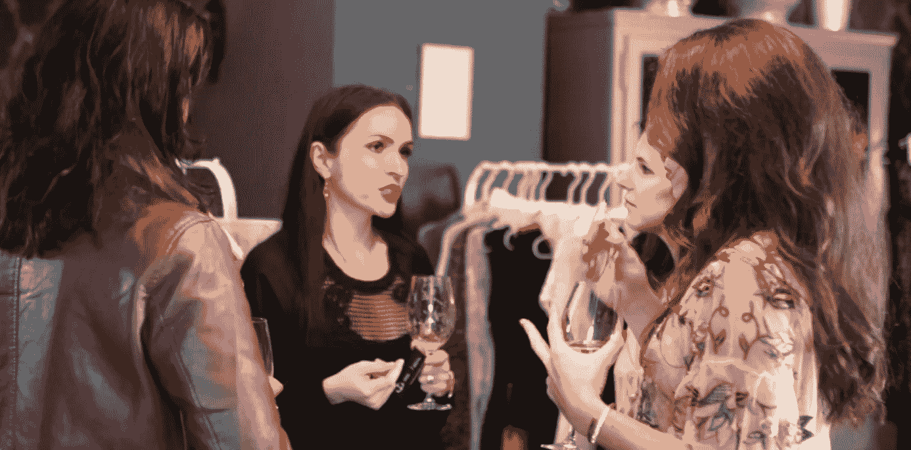
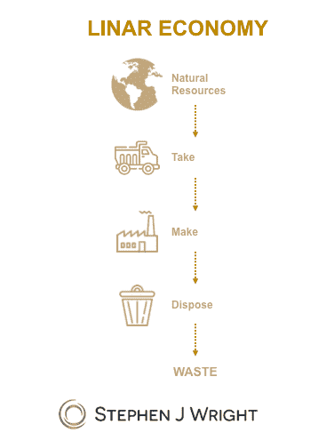
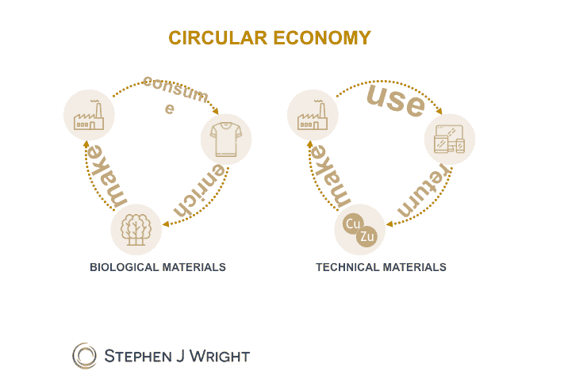
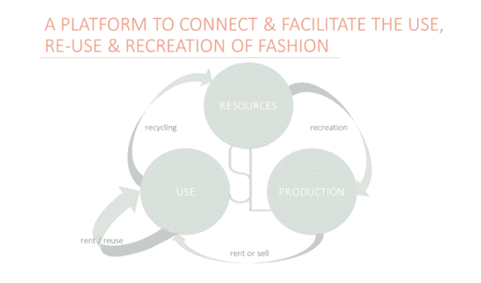
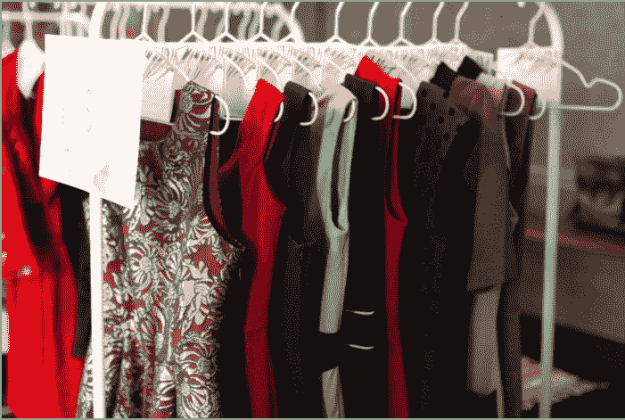
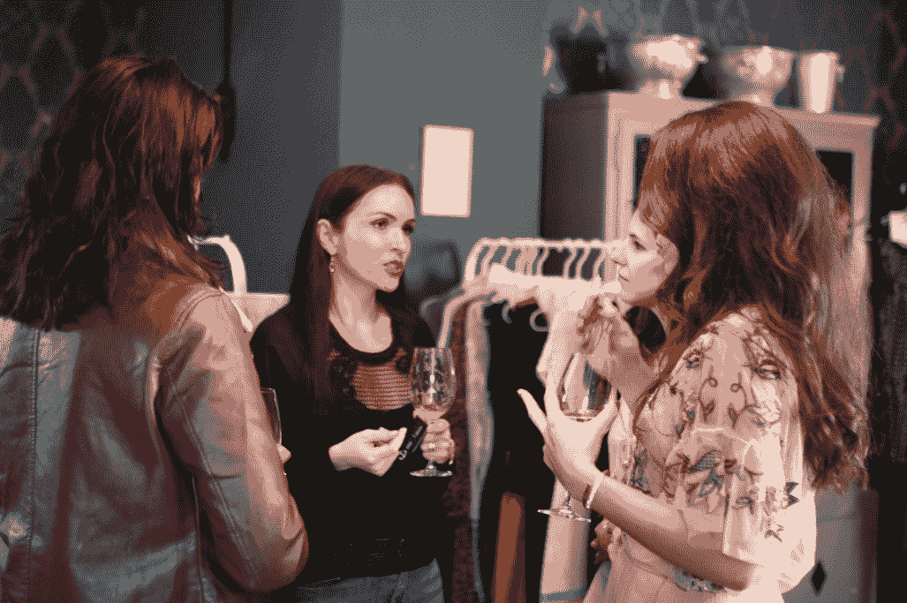
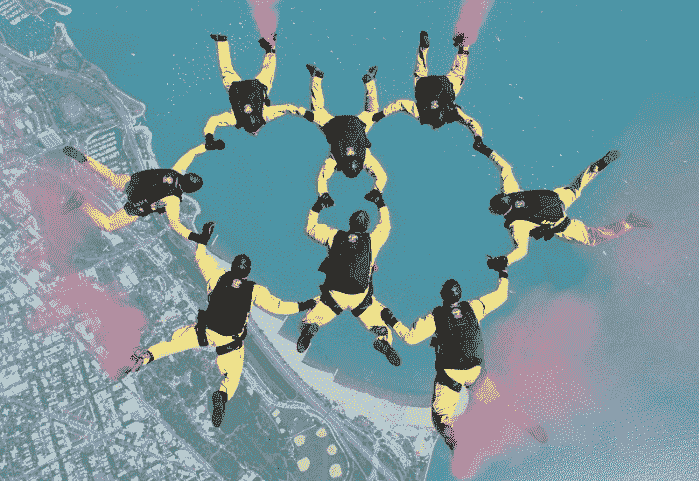

# 人工智能和循环经济如何拯救时尚产业

> 原文：<https://pub.towardsai.net/how-ai-and-circular-economy-can-save-the-fashion-industry-2dcdbeb0da86?source=collection_archive---------0----------------------->

*本文与*[*Pia-Maria Laux*](https://www.linkedin.com/in/pia-marialaux/)*合著。作者的简介在文章的最后。*

让我们看看一些事实:

1.  到 2050 年，我们将需要 70%以上的食物，但今天我们浪费了 30%[1]。
2.  电子垃圾的数量在两年内增加了 8%，但只有 20%被回收利用。
3.  如果我们继续像现在这样运作，那么到 2100 年，全球人口产生的垃圾将是现在的 3 倍。每天 1100 万吨[3]。
4.  据估计，当今时装业每年会产生 9200 万吨纺织废料[4]。
5.  80%到 90%的欧盟城市生活垃圾中的家具废物被焚烧或送往垃圾填埋场，约 10%被回收。欧盟 28 国每年消费€680 亿欧元，消费约 1050 万吨家具[5]。

上述每一项统计数据都应该给我们敲响警钟。如果我们继续以这种方式发展，我们需要将我们的资源增加两倍，直到 2050 年，这无论如何都是不可持续的，在某些领域甚至是不可行的。

# 我们当前的经济体系

工业革命使得大规模生产和大规模消费成为可能。由于规模经济，许多商品变得普通人负担得起，中产阶级的形成为努力发展的经济奠定了基础。由不断增长的需求推动的多年来的技术进步不断地推动着这一系统。该系统也运行良好——人们正在摆脱贫困，这是人类历史上从未有过的。今天，大约 10%的世界人口生活在极端贫困中，而在 1990 年，相应的数字约为 37%。两个世纪前，世界上几乎每个人都生活在极度贫困之中。

然而，这种经济体系的主要缺点是它遵循线性的“获取、制造和处置”方法。为了经济和社会的发展，我们需要加快创造和消费的步伐。这给我们的星球带来了很大压力，并增加了对原材料的需求。今天，人类开采和使用的自然资源比 30 年前多 50%，每年约 600 亿吨原材料。这相当于大约 41，000 座帝国大厦的重量。鉴于目前的增长趋势，到 2030 年，我们对自然资源的开采可能会增加到 1000 亿吨[7]。因此，这一体系需要改变，以维持全球中产阶级的快速增长，而不会被负面的环境和社会影响淹没。

> 我们不能指望人们停止消费，尤其是。几代人以来一直生活在贫困中的数十亿人，第一次经历了一些财富和繁荣。

另一方面，我们不能指望人们停止消费，尤其是。几代人以来一直生活在贫困中的数十亿人，第一次经历了一些财富和繁荣。我们怎么能要求一个在贫困中长大，最近获得财富的人停止使用像洗衣机或洗碗机这样的便利设施，因为水是宝贵的？预计随着时间的推移，随着教育水平的提高和经历更长时间的财富，人们将开始变得更加清醒，减少消费，就像许多西方社会一样。但这需要几代人的时间，不幸的是，我们没有那个时间。为了在短期内修复这样一个系统，我们必须建立一个替代的经济模式。

# 循环经济模式

循环经济模式为这种加速废物产生的线性系统提供了一种替代方案。它的目的是通过用服务代替产品和设计在材料被回收之前可以重复使用的东西来保护自然资源。最后，材料被回收并循环成为新的资源，反映了自然系统中元素的循环，其中“一个过程中的废物是另一个过程的食物”[8]。从长远来看，减少浪费似乎是人类维持生活水平的唯一途径。

这种方法的优势是巨大的。例如，研究表明，到 2030 年，欧洲的循环经济可以创造 1.8 万亿欧元的净效益，同时解决日益增加的资源相关挑战，创造就业机会，刺激创新，并产生巨大的环境效益[9]。循环经济可以改变几乎所有的消费领域，像电子、时尚、家具。

在这篇文章中，我们进一步探讨了服装行业的循环经济。

# 时尚产业的循环经济

循环经济基于三个原则[10]:

浪费和污染是设计出来的。今天的产品成为明天的资源，消除了对自然系统的负面影响。这可以通过明智地选择自然资源和尽可能选择使用可再生或性能更好的资源的技术和工艺来实现。

产品和材料一直在使用。这包括增加产品和重复使用的活动。例子包括耐久性设计、维修、再利用、再制造和回收。

自然系统是再生的。再生是再生的过程，而不仅仅是简单地回收或更新资源。为此，需要明智地选择材料，以便可持续地再生它们。此外，人们需要思考这些经济体如何在地方、区域和全球范围内促进生态和社会再生[11]。

# 案例研究

Sharealook[12]是一家位于苏黎世的初创公司。它正在审视一个互联的圆形时尚界的愿景。

他们从我们作为消费者所拥有的开始，一个装满衣服的衣柜，其中至少 40%的衣服我们不穿或很少穿[13]。作为用户，你可以创建自己的个人资料，并上传你想出租给其他用户的物品或全套服装的照片。然后，该平台会将你与周围正在寻找租赁类似服装、具有相同身体特征和风格偏好的其他用户进行匹配。然后，匹配者可以看到服装在她的头像上看起来如何，如果她喜欢，就可以租借你的服装。

这种方式 *Sharealook* 将增加服装的使用率和寿命。这是令人振奋的，因为研究表明，仅增加 9 个月的积极使用衣物就可以减少 20%至 30%的碳、水和废物足迹[14]。

此外，作为一个副作用，用户将开始购买质量更高、更耐穿的服装。服装变成了一件有价值的物品，应该尽可能地经久耐用，而不是一次性产品。该平台还创造了洗衣、送货或保险的生态系统。智能学习系统根据个人资料和环境需求提供最方便的解决方案。从长远来看，这样一个平台提供了无限的再制造和回收机会。想象一下，与其花 20€买一件在可疑环境下生产的套衫，不如花 200€从当地设计师那里买一件可持续的套衫。你穿一两次，然后开始以每 4 天 20€的价格出租给社区。如果你这样做 10 次，你就为你的高质量套衫提供了资金，并改善了你的环境足迹。但这并没有结束。当套衫结束其第一个生命周期时，该平台将连接到一个设计师，你可以出售你的套衫，作为一种新的升级产品的原材料基地。

# 人工智能如何帮助循环经济？

“N *新的数据来源、新技术和新的分析方法，如果应用得当，可以实现更加敏捷、高效和基于证据的决策，并可以以包容和公平的方式更好地衡量可持续发展目标(SDG)的进展*”[15]。

人工智能可以提供分析方法，以三种主要方式增强和实现各行业的循环经济创新[10]:

1.设计圆形产品、组件和材料。人工智能可以通过迭代的机器学习辅助设计过程来增强和加速新产品、组件和材料的开发，以适应循环经济，从而实现快速原型开发和测试[10]。例如，在服装领域，人工智能可以用于创建以用户为中心的服装设计。目标是围绕用户可以、想要或需要如何使用衣服来优化衣服，而不是强迫用户改变他们的行为来适应新的设计。

2.运营循环商业模式。通过结合来自产品和用户的实时和历史数据，人工智能可以通过定价和需求预测、预测性维护和智能库存管理来帮助提高产品流通和资产利用率[10]。例如，利用人工智能，可以识别正确的客户群——比如从事户外运动的女性——并根据他们的需求提供高度定制的运动服。

3.优化循环基础设施。人工智能可以帮助改进产品分类和拆卸、再制造组件和回收材料的流程。例如，人工智能可以帮助识别知识和技能，以寻找合适的材料和合适的生态产品供应商。最终，人工智能可以应用于重新设计整个网络和系统的复杂任务，如在任何部门重新布线供应链和逆向物流基础设施。

# 循环经济的未来:合作模式

与前几十年相比，消费者对环境、社会和道德问题更加敏感。三分之一的千禧一代强烈认为，他们更有可能从重视社会责任的公司购买产品，而 51 岁以上的人中只有四分之一这么认为。通过教育、信息和激励，消费者可以逐渐改变他们的习惯。关键是建立一个生态系统，鼓励行业的所有部分在重大问题上合作。但是今天分散的、支离破碎的计划、会员资格、认证等等可能会让品牌、供应商、创新者和捐赠者感到困惑。整合不可避免地要集中时间、精力和金钱”[16]。

像 Sharealook 这样的循环经济公司必须利用社区的力量，通过实现价值链上多个利益相关者的协作，来建立一个可持续的循环经济平台。这种雄心超越了对等交易，对等交易只是代表了品牌计划的起点。除了终端消费者，循环经济平台还必须让各种利益相关者参与进来，并提供他们各自的技能和服务。从长远来看，将不得不邀请制造商加入该平台，以便从用户那里重新获得产品/原材料，进行回收利用。摆脱旧的线性模式也意味着摆脱竞争和排外的心态，转而确信在一个循环和相互关联的经济中，不仅有空间，甚至还需要每个人的贡献。

> 摆脱旧的线性模式也意味着摆脱竞争和排外的心态，转而确信在一个循环和相互关联的经济中，不仅有空间，甚至还需要每个人的贡献。

要真正实施循环经济，我们必须创造一个完整的循环，让经济的各个部分的人们能够合作。这种合作模式将拥有分散的网络和市场，以释放未充分利用的资产的价值，以及消费，如租赁、借贷和交换。

# 关于作者:

Rudradeb Mitra 是人工智能专家、演讲者、作者和导师。他目前的兴趣是创建协作的人工智能学习环境和构建具有社会价值的产品。

Pia-Maria Laux 是一名企业家、时尚行业专家和循环经济爱好者。她专注于技术驱动的解决方案，以实现更公平、更可持续的时尚经济。

# 参考资料:

[1][http://www . FAO . org/file admin/templates/wsfs/docs/expert _ paper/How _ to _ Feed _ the _ World _ in _ 2050 . pdf](http://www.fao.org/fileadmin/templates/wsfs/docs/expert_paper/How_to_Feed_the_World_in_2050.pdf)

[2][https://www . renewable energy hub . co . uk/blog/the-environmental-and-economic-effect-of-large-scale-tech-recycling/](https://www.renewableenergyhub.co.uk/blog/the-environmental-and-economic-effect-of-large-scale-tech-recycling/)

[3][http://www . world bank . org/en/news/feature/2013/10/30/global-waste-on-pace-to-triple](http://www.worldbank.org/en/news/feature/2013/10/30/global-waste-on-pace-to-triple)

[4][https://globalfashionagenda . com/WP-content/uploads/2017/05/Pulse-of-Fashion-Industry _ 2017 . pdf](https://globalfashionagenda.com/wp-content/uploads/2017/05/Pulse-of-the-Fashion-Industry_2017.pdf)

[5][http://www . furn 360 . eu/WP-content/uploads/2018/10/Circular-economy-in-the-furniture-industry-11092018 . pdf](http://www.furn360.eu/wp-content/uploads/2018/10/Circular-economy-in-the-furniture-industry-11092018.pdf)

[https://ourworldindata.org/poverty-at-higher-poverty-lines](https://ourworldindata.org/poverty-at-higher-poverty-lines)

[7][https://cdn . friendsoftheearth . uk/sites/default/files/downloads/over consumption . pdf](https://cdn.friendsoftheearth.uk/sites/default/files/downloads/overconsumption.pdf)

[8][http://www . furn 360 . eu/WP-content/uploads/2018/10/Circular-economy-in-the-furniture-industry-11092018 . pdf](http://www.furn360.eu/wp-content/uploads/2018/10/Circular-economy-in-the-furniture-industry-11092018.pdf)

[9][https://www . ellenmacarthur Foundation . org/assets/downloads/publications/TCE _ Ellen-MacArthur-Foundation _ 26-Nov-2015 . pdf](https://www.ellenmacarthurfoundation.org/assets/downloads/publications/TCE_Ellen-MacArthur-Foundation_26-Nov-2015.pdf)

[10][https://www . ellenmacarthur foundation . org/publications/人工智能与循环经济](https://www.ellenmacarthurfoundation.org/publications/artificial-intelligence-and-the-circular-economy)

[11]https://www.gaiaeducation.org/news/circular-economy-101/

[12][https://www.youtube.com/watch?v=lbgqmZJotE0](https://www.youtube.com/watch?v=lbgqmZJotE0)

[13][https://www . Greenpeace . org/international/story/6956/什么是微纤维，为什么我们的衣服会污染海洋/](https://www.greenpeace.org/international/story/6956/what-are-microfibers-and-why-are-our-clothes-polluting-the-oceans/)

[http://www.wrap.org.uk/content/extending-life-clothes](http://www.wrap.org.uk/content/extending-life-clothes)

[15][https://www . un . org/en/sections/issues-depth/big-data-sustainable-development . html](https://www.un.org/en/sections/issues-depth/big-data-sustainable-development.html)

[16][https://globalfashionagenda . com/WP-content/uploads/2017/05/Pulse-of-Fashion-Industry _ 2017 . pdf](https://globalfashionagenda.com/wp-content/uploads/2017/05/Pulse-of-the-Fashion-Industry_2017.pdf)