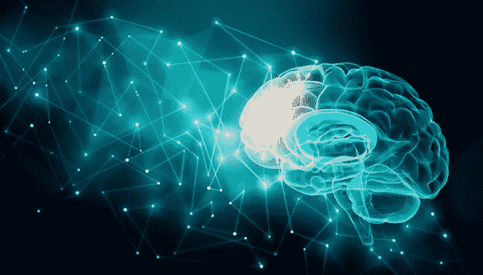
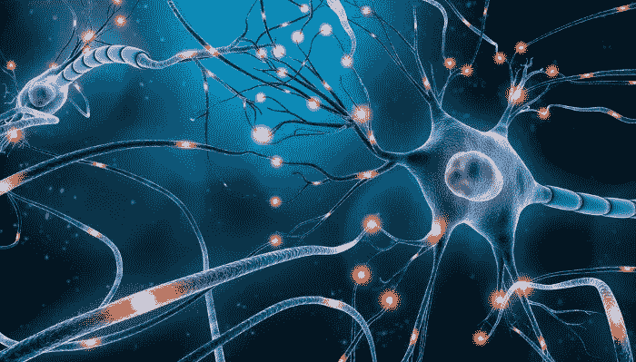

# 人工智能和神经科学是如何结合在一起造福两个学科(和社会)的

> 原文：<https://pub.towardsai.net/how-ai-and-neuroscience-are-coming-together-to-benefit-both-disciplines-and-society-ece89694baf4?source=collection_archive---------1----------------------->

## [人工智能](https://towardsai.net/p/category/artificial-intelligence)，[神经科学](https://towardsai.net/p/category/neuroscience)

生物医学工程师 Chethan Pandarinath 开发假肢——但不是任何假肢。这是因为埃默里大学和佐治亚理工学院的研究人员的目标是通过大脑发出的信号，使那些四肢瘫痪的人能够像使用自己的手臂一样使用这些手臂。

Pandarinath 希望通过分析瘫痪者的大脑活动记录来识别与特定运动对应的神经模式，从而实现这一目标。理论上，这些模式可以为连接到假肢的人工智能(AI)系统提供动力，实现对本质上是附着在身体上的异物的类似运动控制。

如果这听起来很复杂，那是因为它非常复杂，Pandarinath 在 [*自然*](https://www.nature.com/articles/d41586-019-02212-4) 中说道。但肯定不是科幻。这主要是由于人工智能和神经科学的日益融合。

# 人工智能和神经科学:一枚硬币的两面

毕竟，这两个学科有着共同的目标，那就是理解人类认知的秘密。这意味着了解大脑是如何工作的，这反过来可以启发人工神经网络的设计和开发，同时重申以前开发的算法的有效性。事实上，现代人工智能和深度学习系统的持续改进(在准确性、资源密集度以及用更少的数据更有效地学习和调整的能力方面)需要对人类大脑的工作有一个基本的了解。

人工智能和神经科学之间最强有力的联系之一是基于奖励的学习的概念，这是自 20 世纪 80 年代以来一些计算机科学研究人员的焦点。从人工智能和计算机科学的角度来看，很容易明白为什么:基于奖励的学习系统可以通过内置的奖励和惩罚系统进行自主学习。这意味着这些系统使用一个根据经验不断调整的[奖励预测](https://www.analyticsinsight.net/ai-neuroscience-can-help-progress/)系统，而不是人类指令。

这些基于奖励的系统包括[时差(TD)学习](https://en.wikipedia.org/wiki/Temporal_difference_learning)，这是 20 世纪 80 年代末和 90 年代初开发的一种里程碑式的方法。TD 学习不同于传统的学习方法，因为它不断地对环境进行采样，并根据接收到的与预期的对比来调整其奖励预测。通过这种方式，TD learning 可以及时匹配每个时刻的预期回报和收到的回报，不断调整预期(进而提高算法的准确性)。

根据人工智能研究公司 [DeepMind](https://www.deepmind.com/blog/article/Dopamine-and-temporal-difference-learning-A-fruitful-relationship-between-neuroscience-and-AI) 的说法，将人工智能和神经科学永久联系起来的灵光一现发生在几年后，即 20 世纪 90 年代中期。就在那时，研究人员注意到大脑中的神经元似乎使用了类似的奖励预测——通过研究活体动物的大脑，他们能够看到，如果动物获得的奖励多于或少于预期，特定的多巴胺神经元就会激活。他们很快提出，人类大脑也使用 TD 学习算法，这一假设已经通过无数其他实验证明了其有效性。

从那以后，大多数人工智能研究人员都专注于深度强化学习，使用先进的方法，如[分布式强化学习](https://www.nature.com/articles/s41586-019-1924-6)，使他们能够处理越来越复杂的问题。分布式强化学习通过其预测更广泛的可能回报的能力来改进传统的 TD 学习。最近发表在《自然》*杂志上的 DeepMind 研究论文[走得更远，表明人类大脑也使用分布式强化学习。](https://www.nature.com/articles/s41586-019-1924-6.epdf?shared_access_token=3Bcr-ZWATXBxuAME25rI7tRgN0jAjWel9jnR3ZoTv0OgnvLoVhK46-VND2gsGkjz89fNskUJsDZNDD1PQ0vP4GRakb69mL9k_JklOh9EofWr26Xzkg5xKBwi24XiemaDtez3u5DhPPuVfqxLmAcCIw%3D%3D)*

*“我们发现大脑中的多巴胺神经元对悲观或乐观的程度各不相同，”作者写道。“如果他们是一个合唱团，他们不会都唱同一个音符，而是和谐一致——每个人都有一致的音域，就像男低音和女高音歌手一样。在人工强化学习系统中，这种多样化的调整创造了更丰富的训练信号，大大加快了神经网络的学习速度，我们推测大脑可能出于同样的原因使用它。”*

# *人工智能和神经科学如何让彼此变得更好*

*关于大脑，我们还有很多不了解的地方。此外，目前绝大多数的人工智能算法也有自然神经网络的几个缺点，研究人员(到目前为止)还没有能够克服。这些挑战包括他们对大型训练数据集的贪得无厌，以及需要大量的能量来匹配甚至一个蹒跚学步的孩子纠正错误的能力。与大脑复杂的电路相比，深度学习算法仍然是初级的，而即使是最强大的当前人工智能算法在遇到超出其明确目的的任何事情时也很容易崩溃。“(通常)深度学习算法需要数百万个训练样本，而人类，尤其是孩子，只需一击就能学会一个新概念或运动技能，”[举例说明](https://singularityhub.com/2019/02/19/giving-neural-nets-an-innate-brain-like-structure-could-bolster-deep-learning/)神经科学家和科学作家 Shelley Fan。*

*然而，尽管如此，这两个学科——部分归功于几个合作伙伴和具有人工智能和神经科学背景的研究人员——由于强化学习的共享框架，正越来越多地激励和改善彼此。“(深度学习)与类似大脑的先天结构相结合，可能会引领我们走向像人类一样快速、灵活和直观地学习的机器，”[范](https://singularityhub.com/2019/02/19/giving-neural-nets-an-innate-brain-like-structure-could-bolster-deep-learning/)说。魏茨曼科学研究所的 Shimon Ullman 博士补充说，神经科学有几种方法可以进一步改善人工智能和深度学习，包括:*

1.  ***天然神经元的力量。**如前所述，与人脑中发现的复杂性相比，当前的人工神经网络相对简单，包括天然神经元，研究人员刚刚开始了解其力量。利用对人脑中神经元功能和行为的新见解可以彻底改变人工神经网络的有效性。*
2.  ***电路连通性。**同样，与大脑错综复杂的线路相比，人工神经网络和神经元层内的连接非常简单。揭示人脑中神经元如何相互作用的更深层知识，可能会导致人工网络中神经元之间更复杂的连接。*
3.  ***先天认知结构。**当婴儿出生时，他的大脑中已经有了几个根深蒂固的概念，包括识别人的手或脸的能力。通过研究这些先天结构，研究人员可以开发人工智能系统，在最少甚至没有训练的情况下解决复杂问题。*

*因为这两个学科有一种共生关系，本质上是从不同的角度解决类似的问题，人工智能也对神经科学产生了深远的影响。人工智能分析更大数据集的能力比研究人员几年前认为的可能还要大，但还有其他能力，包括使用人工智能算法来重新评估我们对大脑在执行复杂任务和运动时如何工作的想法。“如果你可以训练一个神经网络来做到这一点，”谷歌大脑的大卫·苏西洛博士说，“那么也许你可以理解这个网络是如何运作的，然后用它来理解生物数据。”*

*人工智能和神经科学之间的这种内在关系是埃默里大学和佐治亚理工学院的 Pandarinath 非常了解的，他是开发人工智能假肢的研究人员。他[解释说](https://www.nature.com/articles/d41586-019-02212-4)“这项技术正在回到原点，并被应用于理解大脑”，这可能有助于刺激各种疾病的新疗法。伦敦大学学院盖茨比计算神经科学小组的 Maneesh Sahani 对此表示同意。“我们实际上在研究同样的事情，”他说。*

*“在一种情况下，我们问如何用数学方法解决这个学习问题，以便它可以在机器中有效地实现。在另一种情况下，我们正在寻找唯一可以解决这个问题的现有证据——也就是大脑。”*