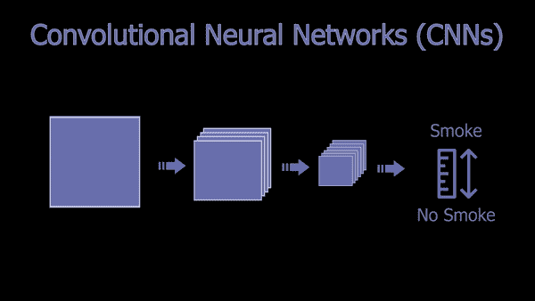
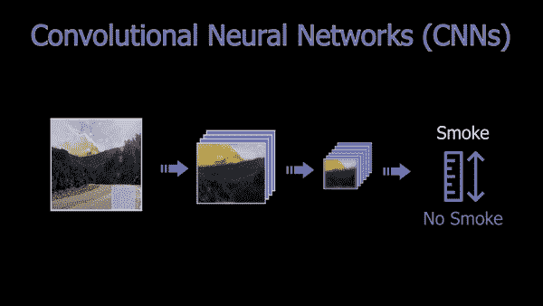
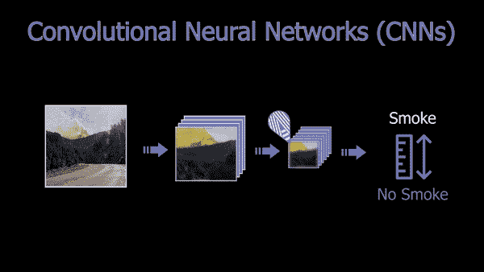

# 人工智能如何用简单的术语理解图像

> 原文：<https://pub.towardsai.net/how-ai-understand-images-in-simple-terms-957286d3486c?source=collection_archive---------1----------------------->

## [机器学习](https://towardsai.net/p/category/machine-learning)

## AI 无处不在；了解其工作原理并构建最强大的应用程序

> 原载于 [louisbouchard.ai](https://www.louisbouchard.ai/how-ai-understand-images/) ，前两天在[我的博客](https://www.louisbouchard.ai/how-ai-understand-images/)上看到的！

用于烟雾探测的基本卷积神经网络结构(CNN)。

本文旨在解释世界上使用最多的人工智能模型之一。我会尽量把它说得非常简单，这样任何人都能明白它是如何工作的。人工智能围绕着我们的日常生活，它只会变得更加现实，所以你需要了解它是如何工作的，我们在哪里，以及未来会发生什么。你对人工智能了解得越多，你就越会意识到，由于其狭隘的智能，它并不像大多数人认为的那样先进，但它对个人和公司来说有着强大的应用。了解它的工作原理将有助于你更好地理解可能的应用和限制，并与你的技术员工和同事更好地沟通。

计算机视觉中最强大的深度神经网络架构之一是卷积神经网络(CNN)，它是任何涉及图像的基于视觉的应用。对于基于视觉的应用，CNN 是一种强大且广泛使用的深度学习架构。简单来说，它的工作方式就是图像被迭代压缩。该网络关注我们需要的关于图像的信息，同时移除冗余和非通用的空间特征。我们最终得到一个置信度，告诉我们图像是否包含我们想要的内容。这个焦点可以是任何东西，从探测猫、人、物体，到探测烟雾。这完全取决于它被训练的数据，但整体架构和工作将保持不变。通过训练，我指的是迭代地将我们所有的图像输入到模型中以尝试和改进其性能的过程，正如我们将在本文中探讨的那样。

你可以看到 CNN 在压缩图像，在每一步都专注于图像的特定特征，随着我们在网络中的深入，越来越压缩，越来越与我们想要的相关。

本文将关注一个令人兴奋的应用程序，其中人工智能用于帮助识别图像中的野火，以帮助减少平均检测时间和火灾造成的损失。正如你所料，我们的过滤器将集中在烟雾和火灾的特点。

卷积神经网络中的滤波器。

这是通过使用过滤器来完成的，过滤器将穿过整个图像，将焦点放在特定的特征上，例如具有特定方向的边缘。用多个滤波器进行一次卷积来重复这个过程，这些滤波器就是在训练期间学习到的。在第一次卷积后，我们为每个滤波器获得一个新的更小的图像，我们称之为特征图，每个图像专注于特定的边缘或特征。因此，它们看起来都像是图像的怪异和模糊的放大版本，突出了特定的特征。我们可以根据需要使用尽可能多的过滤器来优化我们的任务。

然后，这些新图像中的每一个都被发送到相同的过程中，一遍又一遍地重复，直到图像被压缩到我们有许多根据我们需要的信息优化的这些微小的特征地图，适应我们的数据集包含的许多不同的图像。添加的每个卷积都是添加到我们网络的“深度”的一层，当它在图像和分类结果之间有多个层时，使它成为一个深度神经网络。简而言之，我们有越多的过滤器，我们就可以为我们的任务覆盖越多不同的图像，考虑到我们在用于训练它的数据中有所有的变化。这里重要的是找到每层使用的过滤器数量和我们的网络深度与需要实现的任务的复杂性之间的最佳平衡点。

最后，这些微小的特征地图被发送到我们称之为“完全连接的层”中，以使用权重提取相关信息。

在我们的 CNN 的结尾，是用于分类的完全连接的层。

这最后几层包含所有连接的权重，这些权重将根据输入的图像了解模型应该关注哪个特征，并将信息传递给我们的最终分类。这个过程将进一步压缩信息，最终以一定的置信度告诉我们是否有烟雾。因此，假设模型训练有素，最终结果将是一个模型，它的压缩集中在图像中的烟雾特征上，这就是为什么它如此适合于这项任务或任何涉及图像的任务。良好的训练意味着模型已经正确地调整了它的权重(或过滤器)以识别它需要识别的特征。在这个例子中，网络将基于烟和火来得到结果，而当两者都不出现在图像中时，给出低到没有响应。这种权重/滤波器自适应是通过向网络提供示例并基于网络所说的内容和我们希望它所说的内容之间的差异来更新权重值而迭代进行的。最初，网络的行为非常随机，因此网络会定期更新其权重。久而久之就会越来越接近真相，我们也就结束了训练。

当然，关于训练过程还有更多技术细节，但这足以理解深度网络在接收图像时如何能够给出分类。

(左)来自有烟图像的高滤波器响应和(右)来自无烟图像的低滤波器响应。

如果有烟雾，过滤器将产生高响应，我们最终将得到一个网络，它以很高的可信度告诉我们图像中有烟雾。如果没有烟雾，这些压缩结果将产生较低的响应，让我们知道在我们试图检测的图像中没有发生任何事情，在这种情况下是火灾。它还将产生置信度在无烟和明显冒烟之间的结果。瞧，你有了你的野火探测器！

感谢您的阅读，

—路易

## 观看短视频！

如果你喜欢我的工作，并想与人工智能保持同步，你绝对应该关注我的其他社交媒体账户( [LinkedIn](https://www.linkedin.com/in/whats-ai/) 、 [Twitter](https://twitter.com/Whats_AI) )并订阅我的每周人工智能[简讯](http://eepurl.com/huGLT5) ！

# 支持我:

*   支持我的最好方式是成为这个网站的成员，或者如果你喜欢视频格式，在[**YouTube**](https://www.youtube.com/channel/UCUzGQrN-lyyc0BWTYoJM_Sg)**上订阅我的频道。**
*   **在经济上支持我在 T21 的工作**
*   **跟我来这里上 [**中**](https://whats-ai.medium.com/)**