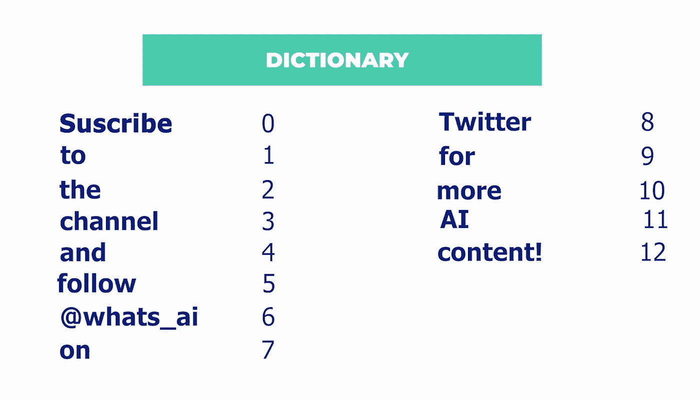
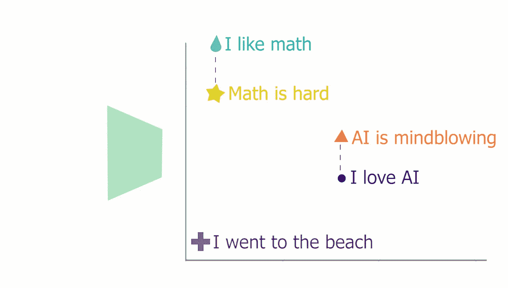
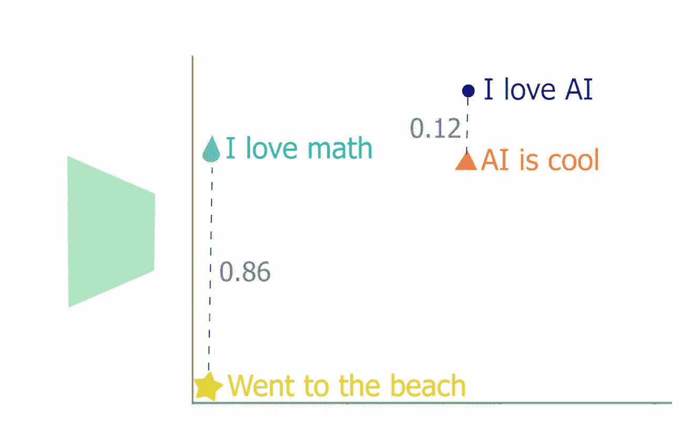
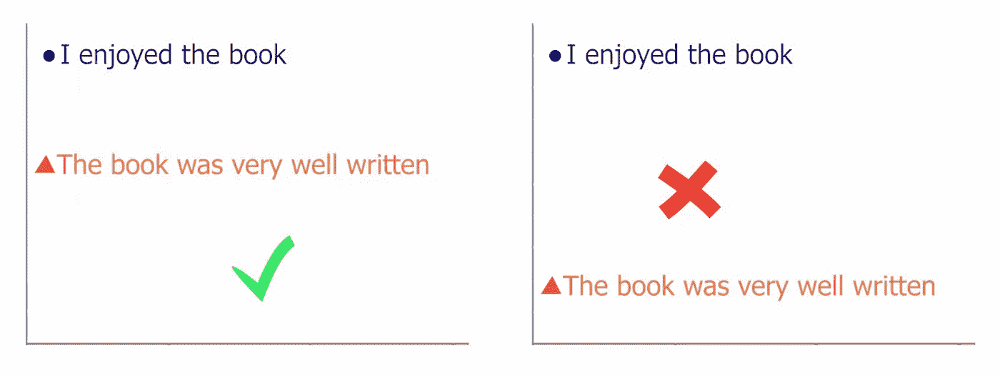
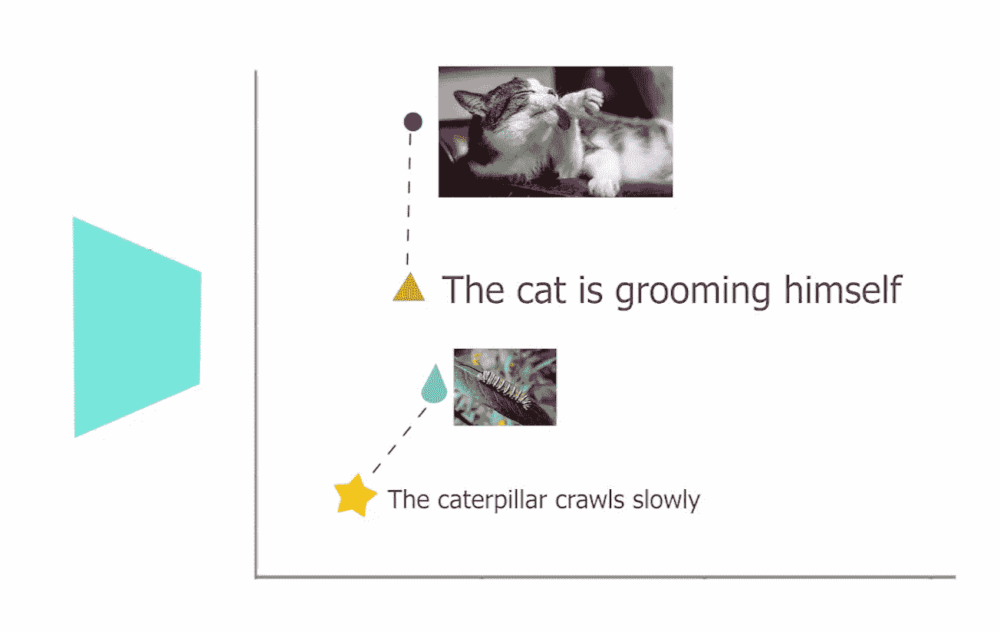
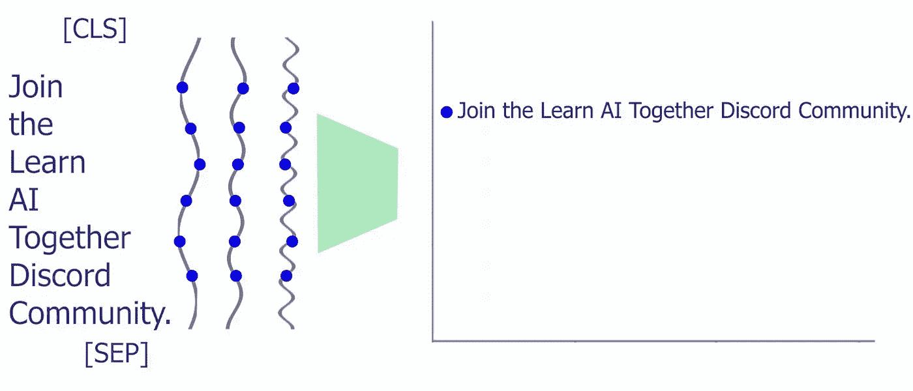
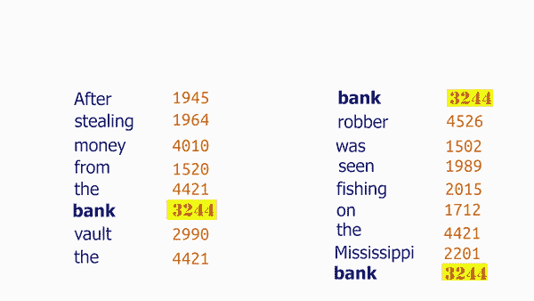
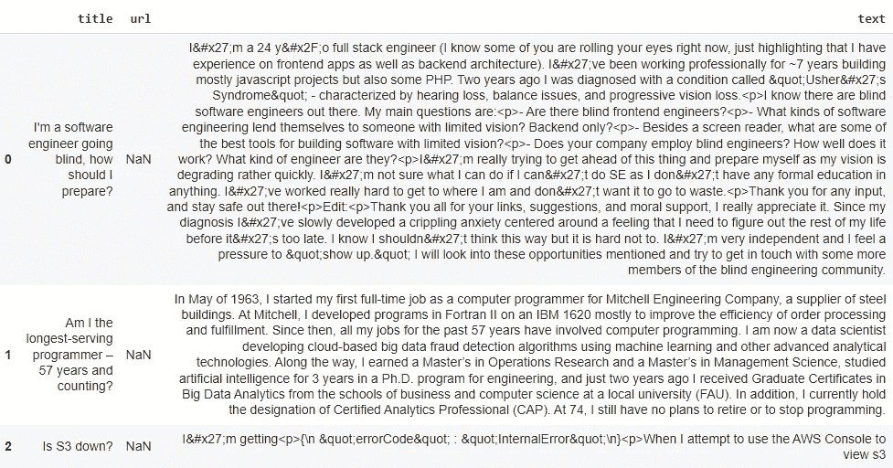
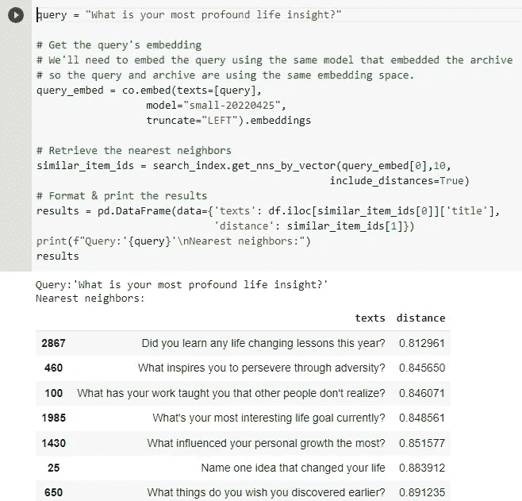
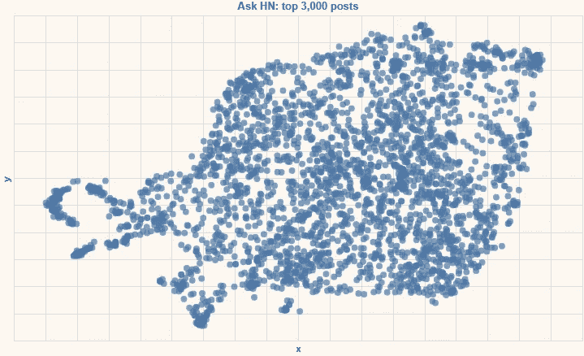

# 人工智能如何理解单词

> 原文：<https://pub.towardsai.net/how-ai-understands-words-56b1858787c1?source=collection_archive---------1----------------------->

## 解释了文本嵌入

> 最初发表于 [louisbouchard.ai](https://www.louisbouchard.ai/text-embedding/) ，前两天在[我的博客上读到的！](https://www.louisbouchard.ai/text-embedding/)

## 观看视频

大型语言模型。

你以前一定听过这些话。它们代表了一种特定类型的基于机器学习的算法，能够理解并生成语言，这个领域通常被称为[自然语言处理或 NLP](https://youtu.be/_O41tuCTXWg) 。

你肯定听说过最著名和最强大的语言模型: [GPT-3](https://youtu.be/gDDnTZchKec) 。GPT-3，正如我在[中描述的，覆盖它的视频](https://youtu.be/gDDnTZchKec)能够获取语言，理解它并生成语言作为回报。但是这里要小心；它并没有真正理解它。其实远不了解。GPT-3 和其他基于语言的模型只是使用我们称之为单词字典的东西来将它们表示为数字，记住它们在句子中的位置，仅此而已。

使用一些数字和位置数字，称为嵌入，他们能够将相似的句子重新分组，这也意味着他们能够通过将句子与已知的句子进行比较来理解句子，例如，我们的数据集。图像合成模型也是同样的过程，它们用你的句子生成图像，它们并不真正理解它，但它们可以将它与相似的图像进行比较，从而对你句子中的概念产生某种理解。

在本文中，我们将通过 [Cohere](https://dashboard.cohere.ai/welcome/register?utm_source=influencer&utm_medium=social&utm_campaign=whatsai) 提供的一个例子来看看那些强大的机器学习模型看到了什么而不是单词，称为单词嵌入，以及如何产生它们。

我们已经讨论了嵌入和 GPT-3，但是这两者之间有什么联系呢？嵌入是模型所看到的，以及它们如何处理我们所知道的单词。为什么要使用嵌入？嗯，因为，到目前为止，机器还不能处理文字，我们需要数字来训练那些大型模型。由于精心构建的数据集，我们可以使用数学来测量嵌入之间的距离，并根据该距离来校正我们的网络，迭代地使我们的预测更接近真实意义，并改善结果。

嵌入也是 CLIP、Stable Diffusion 或 DALLE 等模型用来理解句子和生成图像的方式。这是通过比较同一嵌入空间中的图像和文本来完成的，这意味着该模型既不理解文本也不理解图像，但是它可以理解图像是否与特定文本相似。因此，如果我们找到足够多的图像-标题对，我们就可以训练一个像 DALLE 这样巨大而强大的模型来获取一个句子，嵌入它，找到它最近的图像克隆，然后生成它作为回报。

所以对文本的机器学习就是比较嵌入，但是我们如何得到那些嵌入呢？

我们使用另一个模型来获得它，该模型被训练为找到最佳方式来为相似的句子生成相似的嵌入，同时与使用直接的 1:1 字典相比，保持相似单词在含义上的差异。句子通常用特殊的记号来表示，标记我们文章的开始和结束。

然后，如我所说，我们有我们的位置嵌入，它表示每个单词相对于彼此的位置，通常使用正弦函数。如果你想了解更多，我在参考资料中链接了一篇关于这方面的文章。

最后，我们有我们的单词嵌入。我们首先把所有的单词分解成一个数组，就像一个单词表。从现在开始，它们不再是词语。它们只是整个英语词典中的记号或数字。

你可以看到，所有的单词现在都用一个数字表示，表示它们在字典中的位置，因此单词库有相同的数字，尽管它们在我们的句子中的意思不同。

现在，我们给它增加一点智能，但不要太多。这要归功于一个经过训练的模型，它接受这个新的数字列表，并进一步将其编码为另一个数字列表，以便更好地理解句子。例如，这里的两个单词“bank”不再有相同的嵌入。这是可能的，因为用于这样做的模型已经在大量带注释的文本数据上训练过，并学会了对意思相近的相邻句子和相反的相距较远的句子进行编码，从而使我们的嵌入比我们最初拥有的简单的 1:1 单词:索引嵌入更少受到我们选择的单词的影响。

克里斯·麦考密克的例句。

下面是一个很短的 NLP 例子中使用嵌入的情况。下面有更多的链接来学习嵌入和如何自己编码。

这里，我们将获取一些黑客新闻帖子，并构建一个能够检索与新输入句子最相似的帖子的模型。

首先，我们需要一个数据集。在这种情况下，它是一个预先嵌入的三千个黑客新闻帖子的集合，这些帖子已经嵌入到数字中。

图片来自 [Cohere 关于文本嵌入的笔记本](https://colab.research.google.com/github/cohere-ai/notebooks/blob/main/notebooks/Basic_Semantic_Search.ipynb)。

然后，我们构建一个内存，保存所有这些嵌入，以便将来进行比较。我们基本上只是以一种有效的方式保存这些嵌入。

图片来自 Cohere 关于文本嵌入的笔记本。

然后，当一个新的查询完成时，例如，在这里问“你最深刻的人生感悟是什么？”，您可以使用相同的嵌入网络生成其嵌入。通常，它是 BERT 或它的一个版本，我们将嵌入空间中的距离与我们记忆中所有其他黑客新闻帖子进行比较。请注意，无论是生成数据集还是查询数据集，始终使用相同的网络非常重要。正如我所说，这里没有真正的智慧，也没有真正理解文字。它只是被训练在嵌入空间附近嵌入相似的句子，仅此而已。

图片来自 [Cohere 关于文本嵌入的笔记本](https://colab.research.google.com/github/cohere-ai/notebooks/blob/main/notebooks/Basic_Semantic_Search.ipynb)。

如果您将您的句子发送到不同的网络以生成嵌入，并将该嵌入与您从另一个网络获得的嵌入进行比较，则没有任何效果。

就像上周在 ECCV 试图用希伯来语和我交谈的人一样。只是它不在我大脑能理解的嵌入空间中。

对我们来说幸运的是，我们的大脑可以学会从一个嵌入空间转移到另一个嵌入空间，就像我可以用法语和英语一样，但这需要大量的工作和练习，对机器来说也是一样。

无论如何，回到我们的问题，我们可以找到最相似的职位。这很酷，但我们如何实现这一点呢？正如我提到的，这是因为网络，在这种情况下是 BERT，学会了从相似的句子中创建相似的嵌入。我们甚至可以把它想象成这样的二维图像，你可以看到两个相似的点代表相似的主题。

图片来自 [Cohere 关于文本嵌入的笔记本](https://colab.research.google.com/github/cohere-ai/notebooks/blob/main/notebooks/Basic_Semantic_Search.ipynb)。

一旦有了这些嵌入，你就可以做许多其他事情，比如提取关键词、执行语义搜索、进行情感分析，甚至生成图像，就像我们在之前的视频中所说和演示的那样。感谢 Cohere 团队，我有很多关于这些的视频，并列出一些有趣的笔记本来学习编码。

感谢您的阅读！

路易斯（号外乐团成员）

## 参考

BERT Word 嵌入教程:[https://mccormickml . com/2019/05/14/BERT-Word-Embeddings-Tutorial/# why-BERT-Embeddings](https://mccormickml.com/2019/05/14/BERT-word-embeddings-tutorial/#why-bert-embeddings)
Cohere 的笔记本来自代码示例:[https://colab . research . Google . com/github/Cohere-ai/notebooks/blob/main/notebooks/Basic _ Semantic _ search . ipynb](https://colab.research.google.com/github/cohere-ai/notebooks/blob/main/notebooks/Basic_Semantic_Search.ipynb)我的简讯(每周向您的电子邮件解释的新 AI 应用！):[https://www.louisbouchard.ai/newsletter/](https://www.louisbouchard.ai/newsletter/)