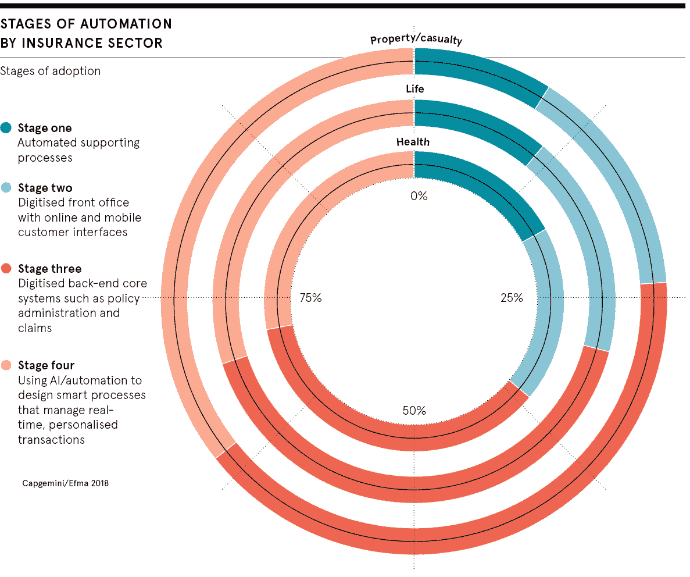

# 人工智能对保险业的变革

> 原文：<https://pub.towardsai.net/how-artificial-intelligence-serving-insurance-industry-4260db09cfe1?source=collection_archive---------0----------------------->

## 人工智能是如何服务于保险行业的

人工智能可能是一个如今被广泛使用的术语，几乎每个人都熟悉这个概念，如果不是专家的话。理所当然！这项技术正在各个行业掀起波澜。这包括保险业。

## 什么是人工智能？

人工智能是一种使计算机能够执行与人类相同的通信任务的技术。除了交流，计算机还可以执行其他任务。这些包括收集信息，通过运行模型分析给定的一组数据，并最终根据收集的数据做出决策。

人工智能的增长现在正处于上升阶段，几乎所有其他行业都在以这样或那样的方式利用它。我第一次接触人工智能驱动的机器是在我为自己的业务设置比较互联网服务提供商的时候。在打电话给[考克斯商业客户服务部](https://www.visioneclick.com/cox/)时，我惊讶地意识到我不是在和一个真正的人说话。这才叫了不起！

让我们来看看几个你会觉得很有趣的数据。

## 实施人工智能的领域

保险公司的目标是专注于在以下领域使用人工智能:

*   19%的产品创新。
*   58%的客户体验。
*   流程优化占 43%。

下面的图表将帮助您更好地了解保险业自动化的各个阶段。

自动化的阶段| [来源](https://www.raconteur.net/risk-management/ai-insurance)

看了这些数据之后，现在让我们来讨论人工智能已经或未来可以帮助保险行业的方式。

# 人工智能改变保险业的方式

## 面部识别

保险业是人脸识别功能在各种场景中的首批用户之一。例如，一家名为 Lapetus 的保险公司已经利用人脸识别功能，通过点击自拍来购买人寿保险。

你可能无法理解它。但是面部识别技术允许公司更深入地挖掘一个人的习惯，比如吸烟。从而使公司能够相应地设计人寿保险计划。这使个人免于经历昂贵的医学测试。

## 机器学习

保险业已经在广泛使用聊天机器人。聊天机器人允许这些公司与客户建立最初的对话。这反过来有助于公司降低运营成本。聊天机器人帮助与顾客交谈。这也是聊天机器人可以快速建立并回应的对话类型。

## 个性化

客户只有有限的保险计划可供选择的时代可能要结束了。因为人工智能允许公司根据每个人和他的习惯来定制计划。现代保险业的核心是定制和客户体验。一个计划越是定制化，客户就越满意。

事实上，一些公司已经在他们的网站上为他们的客户提供建立自己的保险计划的机会。

## 索赔很快得到解决

人工智能还使保险公司能够快速解决客户的索赔问题。因为评判一家保险公司的主要能力之一是其足够快的理赔能力。如果做不到这一点，它就会失去客户。

这是因为机器比人类更快更有效率。因此，允许保险公司取悦他们的客户。

## 行为溢价定价

保险业最具创新性的技术之一是收集客户信息的可穿戴传感器。一个例子是在汽车上安装这种设备，以帮助他们收集有关司机驾驶方式的信息。

这反过来可以帮助保险公司为相关人员提供保险。

目前，金融模型是基于统计数据构建的。这意味着这些公司研究客户的过去记录，并在此基础上建立预测。然而，这种新方法允许公司访问实时信息。这意味着可以根据个人的行为定制保险费。