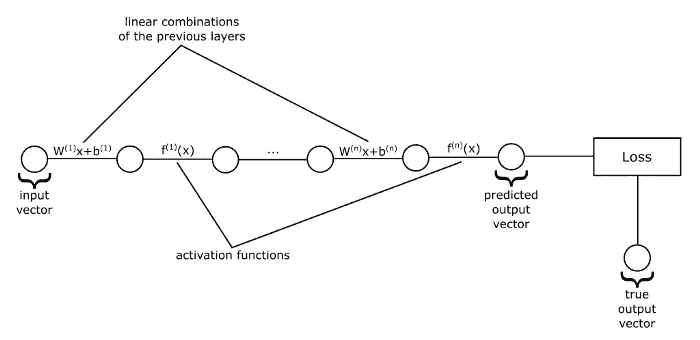
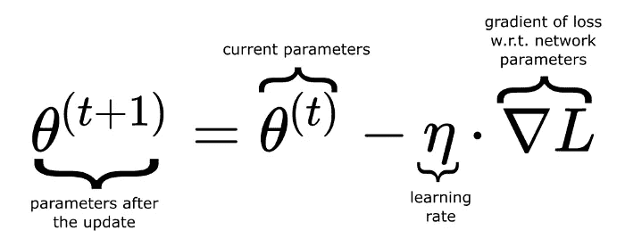
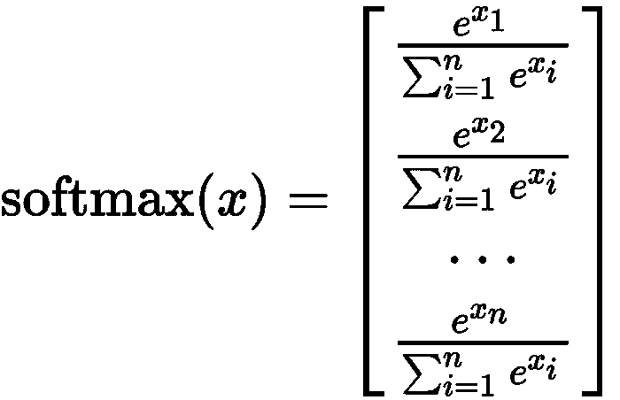

# 神经网络是如何学习的？

> 原文：<https://pub.towardsai.net/how-do-neural-networks-learn-61686d2aea20?source=collection_archive---------0----------------------->

## [机器学习](https://towardsai.net/p/category/machine-learning)

## 在亏损的版图上走下坡路

[梁杰森](https://unsplash.com/@ninjason?utm_source=unsplash&utm_medium=referral&utm_content=creditCopyText)在 [Unsplash](https://unsplash.com/s/photos/robot-reads?utm_source=unsplash&utm_medium=referral&utm_content=creditCopyText) 上的照片

毫无疑问，神经网络是当今最流行的机器学习技术。所以，我认为了解他们实际上是如何学习的是值得的。

为此，让我们先来看看下图:

如果我们将每一层的输入和输出值表示为向量，将权重表示为矩阵，将偏差表示为向量，那么我们将得到上面的神经网络的扁平化视图，它只是一系列向量函数应用。也就是说，函数将向量作为输入，对其进行一些转换，然后输出其他向量。在上图中，每一行代表一个函数，可以是矩阵乘法加偏置向量，也可以是激活函数。圆圈代表这些函数操作的向量。

例如，我们从输入向量开始，然后将它输入第一个函数，该函数计算其分量的线性组合，然后我们获得另一个向量作为输出。我们将最后一个向量作为激活函数的输入，依此类推，直到到达序列中的最后一个函数。最后一个函数的输出将是我们网络的预测值。

到目前为止，我们已经讨论了神经网络如何获得我们感兴趣的输出，它只是通过一系列函数传递其输入向量。但是这些函数依赖于一些参数:权重和偏差。

为了获得好的预测，我们实际上如何学习这些参数？

好吧，让我们回忆一下神经网络实际上是什么:它只是一个函数，一个由按顺序应用的较小函数组成的大函数。这个函数有一组参数，因为一开始，我们不知道它们应该是什么，我们只是随机初始化它们。所以，首先，我们的网络只会给我们随机的值。我们如何改进它们？在尝试改进它们之前，我们首先需要一种评估网络性能的方法。如果我们没有一种方法来衡量我们的模型做得有多好或有多差，我们应该如何改进我们的模型的性能呢？

为此，我们需要设计一个函数，将我们网络的预测和数据集中的真实标签作为输入，并给出一个代表我们网络性能的数字。然后*我们可以把学习问题转化为寻找这个函数的最小值或最大值的优化问题*。在机器学习社区中，这个函数通常衡量我们的预测有多糟糕，因此它被命名为**损失函数**。我们的问题是找到使这个损失函数最小的网络参数。

## 随机梯度下降

你可能熟悉微积分课上的求函数最小值的问题。在那里，你通常取函数的梯度，将其设为 0，找到所有的解(也称为临界点)，然后从中选择一个使你的函数具有最小值的解。这是全球最小值。我们能在最小化我们的损失函数中做同样的事情吗？不完全是。问题是神经网络的损失函数不像你通常在微积分教科书中找到的那样好和紧凑。这是一个极其复杂的函数，有几千、几十万甚至几百万个参数。甚至不可能找到这个问题的封闭解。这个问题通常通过迭代方法来解决，这些方法不试图找到直接的解决方案，而是从随机的解决方案开始，并试图在每次迭代中改进它。最终经过大量的迭代，我们会得到一个相当好的解。

一种这样的迭代方法是**梯度下降**。你们可能知道，函数的梯度给了我们最陡上升的方向，如果我们取梯度的负值，就会给我们最陡下降的方向，也就是我们可以最快到达最小值的方向。因此，在每次迭代(也称为历元)中，我们计算损失函数的梯度，并将其从旧参数中减去(乘以一个称为*学习速率*的因子)，以获得我们网络的新参数。

其中θ (theta)表示包含所有网络参数的向量。

在标准梯度下降法中，梯度是在考虑整个数据集的情况下计算的。通常，这是不可取的，因为它可能计算量很大。在实践中，数据集被随机划分成更多的块，称为批，并且对这些批中的每一个进行更新。这叫做**随机梯度下降**。

上述更新规则在每一步仅考虑在当前位置评估的梯度。这样，在损失函数表面上移动的点的轨迹对任何扰动都是敏感的。有时，我们可能希望让这个轨迹更加稳健。为此，我们使用一个来自物理学的概念:**动量**。这个想法是，当我们进行更新时，也要考虑以前的更新，这就累积成一个变量δθ。如果更多的更新是在同一个方向上完成的，那么我们将“更快”地向那个方向前进，并且不会因为任何微小的扰动而改变我们的轨迹。想象一下速度。

其中α是确定过去梯度贡献的非负因子。当它为 0 时，我们就不用动量了。

## 反向传播

我们如何计算梯度呢？回想一下，神经网络和损失函数只是函数的组合。我们如何计算复合函数的偏导数？使用链式法则。让我们看看下面的图像:

如果我们想要计算第一层权重的损失 w.r.t. ( *相对于*)的偏导数:我们取第一个线性组合 w.r.t .的导数，然后我们乘以下一个函数(激活函数)w.r.t .的导数，再乘以前一个函数的输出，等等，直到我们乘以损失 w.r.t .的导数，最后一个激活函数。如果我们想计算第二层重量的导数呢？我们必须执行相同的过程，但这一次我们从第二个线性组合函数对其权重的导数开始，之后，当我们计算第一层权重的导数时，我们必须相乘的其余项也会出现。因此，我们将**向后**，而不是一遍又一遍地计算这些项，因此得名**反向传播**。

我们将首先计算损耗对网络输出的导数，然后通过保持导数的连续乘积将这些导数向后传播到第一层。注意，我们有两种导数:一种是计算函数对输入的导数。我们将这些乘以导数的乘积，目的是跟踪网络从输出到算法中当前点的误差。第二种导数是那些我们想要优化的参数。我们不将它们与导数乘积的其余部分相乘，而是将它们存储为梯度的一部分，稍后我们将使用它来更新参数。

因此，在反向传播时，当我们遇到没有可学习参数的函数(如激活函数)时，我们只取第一类导数，只是为了反向传播误差。但是，当我们遇到具有可学习参数的函数时(如线性组合，我们有想要学习的权重和偏差)，我们对两种类型都进行求导:第一种是误差传播的输入，第二种是权重和偏差，并将它们存储为梯度的一部分。我们从损失函数开始做这个过程，直到我们到达第一层，在那里我们没有任何要添加到梯度的可学习参数。这是反向传播算法。

## Softmax 激活和交叉熵损失

分类任务中最后一层常用的激活函数是 softmax 函数。

softmax 函数将其输入向量转换为概率分布。如果你看上面，你可以看到 softmax 的输出向量的元素都是正的，它们的和是 1。当我们使用 softmax 激活时，我们在最后一层创建与数据集中的类数量一样多的节点，softmax 激活将为我们提供可能的类的概率分布。因此，网络的输出将为我们提供输入向量属于每一个可能类别的概率，我们选择具有最高概率的类别，并将其报告为我们网络的预测。

当 softmax 被用作输出层的激活时，我们通常使用交叉熵损失作为损失函数。交叉熵损失衡量两个概率分布的相似程度。我们可以将输入 x 的真实标签表示为概率分布:其中真实类别标签的概率为 1，其他类别标签的概率为 0。这种标签表示也称为一键编码。然后，我们使用交叉熵来衡量我们网络的预测概率分布与真实概率分布的接近程度。

其中 y 是真实标签的独热编码，y hat 是预测的概率分布，yi，yi hat 是那些向量的元素。

如果预测的概率分布接近真实标签的独热编码，那么损失将接近于 0。否则，如果它们相差很大，损失可能会增长到无穷大。

## 均方误差损失

softmax 激活和交叉熵损失主要用于分类任务，但是神经网络可以通过仅使用适当的损失函数和最后一层中的激活而容易地适应于回归任务。例如，如果我们有一个想要近似的数字列表，我们可以使用均方误差(简称 MSE)损失来代替类别标签作为基本事实。通常我们在使用 MSE 损失时，使用的是最后一层的身份激活(即 f(x) = x)。

总之，神经网络的学习过程只不过是一个优化问题:我们希望找到使损失函数最小化的参数。但是这并不是一件容易的事情，有很多关于优化技术的书籍。此外，除了优化之外，还出现了为给定任务选择哪种神经网络结构的问题。

我希望这些信息对你有用，感谢你的阅读！

这篇文章也贴在我自己的网站[这里](https://www.nablasquared.com/how-do-neural-networks-learn/)。随便看看吧！