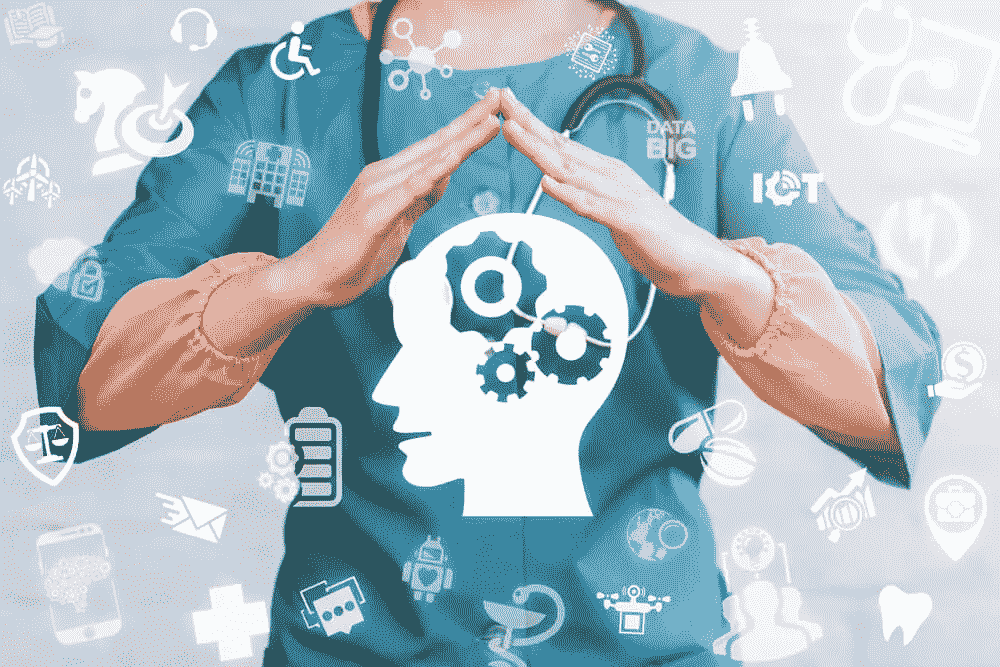

# 用于医疗保健的可解释人工智能(XAI)如何帮助建立用户信任——即使在生死攸关的决策中

> 原文：<https://pub.towardsai.net/how-explainable-ai-xai-for-health-care-helps-build-user-trust-even-during-life-and-death-584603cf81a8?source=collection_archive---------2----------------------->

## [人工智能](https://towardsai.net/p/category/artificial-intelligence)，[观点](https://towardsai.net/p/category/opinion)

想象一下:当一个人工智能模型推荐一个似乎没有意义的行动过程时，你正在使用它。然而，因为模型不能自我解释，所以你无法理解推荐背后的推理。你唯一的选择是相信或不相信它——但是没有任何背景。

对于许多从事人工智能(AI)系统工作的人来说，这是一种令人沮丧但又熟悉的经历，在许多情况下，人工智能系统充当所谓的“[黑匣子](https://en.wikipedia.org/wiki/Black_box)”，有时甚至连它们自己的创造者都无法解释。对于某些应用来说，黑盒式的 AI 系统是完全合适的(甚至是那些宁愿不解释其专有 AI 的人的首选)。但在其他背景下，一个错误的人工智能决策的后果可能是深远的，极具破坏性的。例如，人工智能系统在[司法系统](https://www.technologyreview.com/2019/01/21/137783/algorithms-criminal-justice-ai/)或医疗保健中犯下的错误可能会毁掉一个人的生活或生计——这反过来会侵蚀公众和用户对这些系统的信任，并破坏它们的实用性。

这就是为什么可解释的人工智能(XAI)对医疗保健行业如此重要。提供者和患者需要了解重大人工智能建议(如外科手术或住院治疗)的[原理](https://datamathstat.files.wordpress.com/2018/08/explainableaiinhealthcarekdd2018.pdf)。XAI 以自然语言或其他易于理解的表达方式提供可解释的解释，使医生、患者和其他利益相关者能够理解建议背后的推理，并在必要时更容易质疑其有效性。

## XAI 在什么时候和什么情况下是必要的？

医疗保健专业人员使用人工智能来加快和改善众多任务，包括决策，预测，风险管理，甚至诊断，通过扫描医学图像来识别人眼无法检测的异常和模式。人工智能已经成为许多医疗保健从业者的一个重要工具，但往往不容易解释——导致提供商和患者感到沮丧，特别是在做出高风险决策时。

[根据 Ahmad 等人的](https://datamathstat.files.wordpress.com/2018/08/explainableaiinhealthcarekdd2018.pdf)，在以下任何情况下都需要 XAI:

*   当公平至关重要时，当最终用户或客户需要一个解释来做出明智的决定时
*   当一个错误的人工智能决策的后果影响深远时(例如建议进行不必要的手术)
*   当错误的代价很高时，例如恶性肿瘤的错误分类导致不必要的经济损失、健康风险增加和个人创伤
*   当人工智能系统得出一个新的假设，必须由领域或主题专家验证时
*   出于合规性目的，例如根据欧盟的《一般数据保护条例》(GDPR)，该条例承诺当用户数据通过自动化系统运行时，拥有“[获得解释](https://www.law.ox.ac.uk/business-law-blog/blog/2018/05/rethinking-explainable-machines-next-chapter-gdprs-right-explanation#:~:text=The%20GDPR%20provides%20an%20unambiguous,of%20automated%20data%20processing%20systems.)的权利

一些专家表示，T2 在医疗保健领域相对缓慢地采用人工智能系统是因为几乎不可能验证黑箱系统的结果。数字健康和医疗设备专家 Erik Birkeneder 在 [*Forbes*](https://www.forbes.com/sites/erikbirkender/2019/10/16/explainable-ai-in-health-care-gaining-context-behind-a-diagnosis/?sh=29e60b884bee) 中解释说:“医生接受的训练主要是识别异常值或不需要标准治疗的奇怪病例。“如果一个人工智能算法没有用适当的数据进行适当的训练，我们无法理解它是如何做出选择的，我们就不能确定它会识别出那些异常值或以其他方式正确诊断患者。”

事实上，对于医生来说，仔细检查由复杂的深度学习系统做出的诊断——例如验证磁共振成像和 CT 扫描等医学图像中识别的可疑肿块——如果他们不知道这样一个诊断的背景，那几乎是不可能的。Birkeneder 指出，这种模糊性也是美国美国食品药品监督管理局(FDA)经常出现的问题，因为它负责验证和批准医疗保健中的人工智能模型。2019 年 9 月的一份 FDA [草案指南](https://www.fda.gov/regulatory-information/search-fda-guidance-documents/clinical-decision-support-software)称，医生必须独立验证人工智能系统的建议，否则这些系统可能会被重新归类为医疗设备(这些设备具有更严格的合规标准)。

## 在医疗保健领域实现 XAI:保持简单(目前)

正如 Cognylitica 的 Ron Schmeltzer [解释](https://www.forbes.com/sites/cognitiveworld/2019/07/23/understanding-explainable-ai/?sh=2fff92997c9e)的那样，在医疗保健中实现功能性 XAI 的最简单方法是通过“内在可解释的”算法这意味着可以使用更简单的解决方案，如决策树、回归模型、贝叶斯分类器和其他透明算法，而不是复杂的深度学习或集成方法，如随机森林，“而不会牺牲太多的性能或准确性。”

Birkeneder [预测](https://www.forbes.com/sites/erikbirkender/2019/10/16/explainable-ai-in-health-care-gaining-context-behind-a-diagnosis/#6eb50a854bee)随着可解释算法的改进并成为“医疗保健中的主导算法”，这些性能问题将最终消失但是事实仍然是，尽管这些算法类型更容易解释，但是它们目前没有那么强大，也不能像更复杂的 ML 技术那样处理那么多的用例。[牛津大学可解释的人工智能医疗保健 AXA 主席 Thomas Lukasiewicz](https://axa-research.org/en/project/thomas-lukasiewicz) 补充说，除了更难解释之外，深度学习算法也可能存在偏见或鲁棒性问题。

然而，研究人员 [Bellio 等人](https://cpb-eu-w2.wpmucdn.com/blogs.ucl.ac.uk/dist/e/653/files/2019/06/ExplainableAI_Bellio_final.pdf)说，性能与可解释性的辩论在某种程度上忽略了一点，为了准确性而牺牲性能不一定是长期的。在他们看来，医疗保健 XAI 应该像任何其他高性能产品一样运行，如汽车或笔记本电脑，其中大多数用户不知道他们各自引擎盖下的复杂工作，但当他们工作不正常时可以很快注意到。

“我们不指望人类掌握复杂的计算，”他们写道。“事实上，解释应该根据对人重要的东西来定制，而不是基于对模型的深刻理解。做到这一点的一个方法可能是通过解释结果和理解系统何时工作或不工作。例如，我关心的是我的汽车以安全有效的方式根据需要移动、停止和转向，而不是真正关心发动机的运行细节。那么，是什么让我信任我的车呢？这不仅是对制造过程的信心，也是我及时发现问题的能力。”

Bellio 等人继续解释了医疗保健领域的高级人工智能在不牺牲性能的情况下变得更加可解释和可信的三种方式:

1.  **更好地计算泛化错误**:更容易地识别算法中的偏差或泛化错误的方法可以帮助用户确定模型何时工作不正常，并提供上下文来帮助用户确定模型的建议是否可信。
2.  **依赖角色的 XAI** :人工智能系统所需的解释水平很大程度上取决于用户的角色——例如，医生可能比人力资源人员规划员需要人工智能建议背后更详细的背景。基于用户角色和需求定制解释可能会产生更令人满意的结果。
3.  **交互式用户界面**:直观的图形用户界面可以帮助用户更好地了解系统的准确性，同时也让用户更全面地了解特定人工智能系统的准确性。

## 驾驭人工智能能力的“第三次浪潮”

根据牛津大学的 Thomas Lukasiewicz 的说法，当前 XAI 系统的局限性意味着现在需要“第三波”人工智能技术。第一波人工智能系统是基于规则或逻辑的，第二波系统构成了机器学习和深度学习。他说，第三波人工智能技术必须结合前两种技术的优势和弱点。其中第一个擅长推理，第二个擅长统计学习和预测，“因此，一个非常自然的想法是将它们结合起来……并创造第三波人工智能系统，我们也称之为神经符号人工智能系统。”

这位教授解释说，这种新型人工智能对医疗保健有着巨大的影响，包括改善疾病预防，更有效和更便宜的诊断，更好的治疗和药物产品设计——以及对所有类型的用户，从医生到医院工作人员，到病人和保险公司，都有内在的解释。