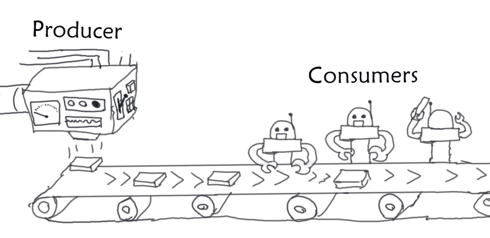
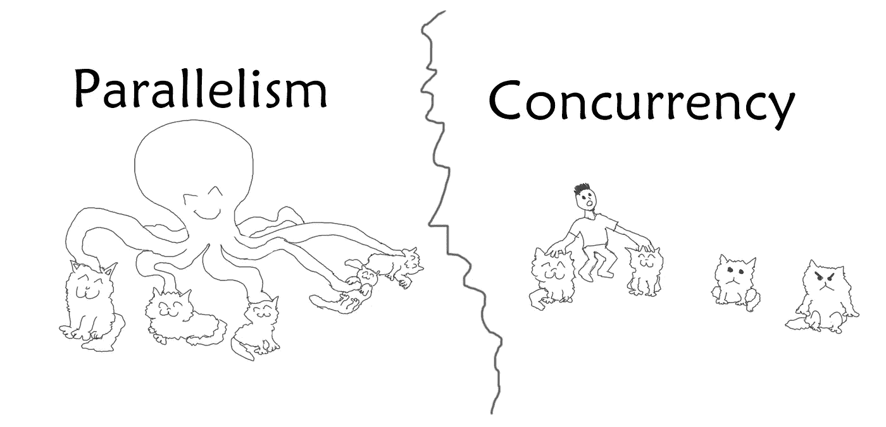
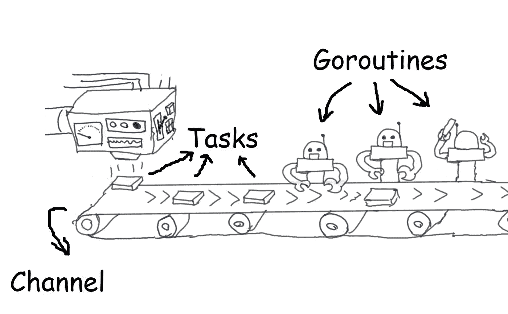

# How Go 帮助我加快了机器学习计算的速度

> 原文：<https://pub.towardsai.net/how-go-helped-me-accelerate-my-machine-learning-computations-b2ea961130ad?source=collection_archive---------1----------------------->

## [机器学习](https://towardsai.net/p/category/machine-learning)

# **TL；博士:很久了，你不想读了？**

很好，我支持你:在这里，我分享我使用 **Go 语言**将我项目的**机器学习**计算时间从一周减少到 24 小时以内的故事。为了赶上最后期限，我必须在 3 天内提交我的结果。

说服够了吗？:D 接着跟着一起走！

# 背景故事

作为一名硕士生，我有一大堆事情要做，包括写论文、申请博士职位、可能的实习等等。最重要的是，我必须准备好提交给目标会议的研究报告。事实上，我已经得到了我的大部分结果，并且和我的研究顾问一起写了我的手稿并修改了几次。我想添加更多的结果来支持我的方法。

然而，就像任何其他研究生一样，我有一个主要问题:**时间！**

离会议的最后期限只有 3 天了。我需要至少 7 整天来完成计算，并花半天时间来填充我的结果。我有两个选择:

1.  放弃目标会议，另找一个目标。
2.  想办法提高我的计算速度。

我的选择是什么？你正在读这篇文章的事实本身就说明了一切。

(本人照片)

我用来开发和实现我的实验的主要工具是 **PyTorch。**它是一个非常稳定且易于理解的框架，利用**NVIDIA****GPU**的力量来完成机器学习任务。我开发了自己的方法，并且已经有了结果。然而，对于基线方法，我更喜欢通过使用一个稳定的、写得好的和文档记录好的库来节省时间。但是有一个问题:这个库只使用了 **NumPy** 开发了其中一个方法(姑且称之为 **too_long_method** ),没有任何 GPU 加速的实现。too_long_method 由一个长循环中的大量迭代组成。因此，对于单个数据点，大约需要 15 分钟才能完成。为了能够计算出所有数据的结果，我在几个实例中运行了代码。然而，这不是一个选项。即使在具有 8 个物理内核的游戏系统上，这样的配置也需要 7 天才能完成。

# 可能的解决方案？

考虑到上述所有问题，我可以想出几种方法来解决这个问题:

1.  在 PyTorch 中重写 **too_long_method** 的代码。(**不可选项！:**因为开发和调试将花费更多的时间，并导致混乱和挫折。)
2.  使用云服务来分担众多计算机的计算负担。(**不可选项！那会花掉我很多钱。此外，弄清楚如何利用这些特定的云服务需要一段时间。)**
3.  使用 PyTorch 内置的多处理能力以某种方式并行运行代码(**不是一个选项！尽管一开始我尝试过，但我很快意识到这不会有多大帮助，原因我将在后面解释。)**
4.  在多个实例中运行代码(但与上一次不同，在小批数据上运行)(**我的选择！！！我发现运行多个程序实例并让操作系统代表我处理并行和多线程的负担要容易得多。)**

# 我的路线图

我选择在多个实例中运行我的代码。为此，我编写了两段具有两个主要功能的代码:

**生产者:**一个单独的程序，它将迭代地向代码实例的外部池提供数据点。

**消费者:**包含 **too_long_method** 的代码，将处理提供给它的小批量数据点，并存储结果。

整个系统的总体架构可以描述如下:

生产者和消费者(图片由本人提供)

我尝试了以下场景，但没有成功获得我期望的性能:

*   PyTorch 的多重处理能力:当我试图以这种方式解决问题时，我面临的问题是，我必须在不同的进程之间管理数据点的划分，这将需要不同的时间来完成。另外，在我看来，增加子进程的数量不会增加整个系统的吞吐量。然而，很明显，系统的资源如 CPU 内核和 RAM 并没有像我预期的那样被使用。(不管怎样，永远不要忘记！我没有太多时间去寻找和询问可能的解决方案。所以，我可能错了。)
*   我试着用 python 写制作人。然而，我注意到它不能运行超过虚拟 CPU 数量的外部程序实例。我认为这是一个瓶颈，因为 CPU 资源仍然可用，尽管事实上代码正在以其最高的能力运行。我寻找了与 python 解释器相关的不同配置，但是想不出 python 方面有任何可能的瓶颈。

在上面的场景中玩了几个小时，没有任何结果，让我筋疲力尽。所以，我决定用 python 之外的编程语言来编写生产者代码。幸运的是，几年前我已经阅读并了解了关于 [**围棋**](https://golang.org/) 的知识。我知道它内置的处理并发的能力。所以，我决定试一试。

# **你想知道的一些编程概念:**

在深入研究代码之前，让我首先提供一些我使用过的概念的简要定义，以防您对它们不太熟悉。然而，如果你从未用过围棋，有大量的资源可以帮助你轻松地学习围棋和快速地学习。

**并行性:**在独立的处理单元上同时运行多个任务(实际上，大部分是相同的任务，但是在不同的数据块上)。并行性的要点在于，在每一个时刻，参与并行处理的每一个处理单元都在独立处理不同的数据。

**并发性:**处理不需要相同时间完成的多个任务。这不一定需要分布在不同的处理单元中。举个例子，当你打开一个网站时，下载和显示网站需要一些时间。然而，当你的计算机等待输入数据完全到达时，它可以让你移动鼠标和做其他事情。即使您的计算机只有一个处理单元。因此，在您考虑并发任务的随机时刻，您可能会看到 CPU 只处理其中一个任务，而其他任务由于等待外部因素而暂停。

他们说一张照片胜过千言万语:

并行性与并发性(我自己的图像)

以下是来自 **Go** 语言的一些单词和定义:

**Go routine:**Go 中的内置结构，那是一个轻量级的线程。它在 Go 程序中提供并发性。

通道:可以看作是一个数据管道，goroutines 可以向它发送数据，也可以从它接收数据。因此，允许 goroutines 一起处理数据。通道可以具有任意大小的长度，以提供某种类型的数据对象队列(缓冲通道)。

任务:这不是一个专门针对任何语言或语境的技术术语。在这里，通过使用“任务”，我指的是一个 python 代码，它对给定的数据执行特定的耗时的机器学习方法。

路线、频道、任务。与由 goroutines 调用的外部程序不同，生成器运行在程序的主线程上。(图片由本人提供)

# 好了，我们现在可以看代码了吗？

我已经在我的 github 账号上发布了代码，这样你就可以直接看到了。

代码从 **main()** 函数开始。主函数中无限 for-loop 的一般结构只是为用户提供一组菜单选项的[状态设计模式](https://www.tutorialspoint.com/design_pattern/state_pattern.htm)。整个魔术开始的最重要部分如下:

让我们一行一行地看一下它的重要部分:

在第 3 行，创建了一个等待组，这是 Go 中并发性所必需的。所有的神奇都发生在 8 号线上！首先，创建一个缓冲通道来处理任务(tasks_chan)。这可以被认为是可以从不同的例程访问的先进先出(FIFO)队列。对于我的应用程序，在运行了几次代码之后，我发现 32 是工作人员的最佳数量。即没有一个进程会由于缺少计算资源而停止的工作进程的最大数量，并且在没有来自任何子进程的任何**存储器异常**的情况下，存储器使用将达到其最高可能值。

在接下来的几行中， **call_workers()** 函数实际上创建了一个 goroutines 池，并将对 tasks_chan 的引用传递给它们。以便他们每个人都可以访问任务队列。事实上，这些 goroutines 中的每一个都在单独的线程中运行 **spawn_worker()** 函数:

每当代码到达 **go** 关键字时，它不会停止执行。相反，它继续运行主线程。因此，for 循环会一直运行，直到所有 worker goroutines 都被调用。每个工人都有一个号码。以便我们可以跟踪终端中每个工人的状态。我们可以看到，一旦打印出“所有工人在线”，这个函数就完成了执行。

让我们看看 **spawn_worker** 函数，看看调用它时会发生什么:

这个函数的第一行在整个函数体完全运行后执行。所以让我们暂时忘记它。在第 4 行，开始了一个无限 for 循环。在 for 循环内部，有一个特殊的**选择用例**结构。任何首先被触发的 case 语句，其主体都会被执行。例如，如果有任何对象可以从 tasks 通道中选取，那么第 6 行的情况就会触发。并且调用另一个函数(spawn_pytorch)来执行该任务(在第 9 行)。任务结束后，第 15 行的 break 语句结束 select 语句。因此，无限 for 循环进入下一次迭代，select 语句从头开始。

另一方面，在输入 select - case 语句后，如果 10 秒钟过去了而没有执行其他 case，那么第 17 行的 case 语句将被触发。在这种情况下，函数返回。此时，第一行功能(即 defer wg。Done())通知线程组(wg)它已经完成。

因此，在开始时，当 call_workers 开始在单独的 goroutines 中生成 worker 时，所有生成的 worker 都开始等待 10 秒钟，直到它们完全停止执行。

回头看看主函数，在调用 call_workers 之后，一旦所有的 worker 都准备好了，就调用函数 **generate_tasks()** 。我们还需要将任务通道传递给这个函数。这个函数开始用任务填充任务缓冲区，直到缓冲区满了。一旦缓冲区满了，它就在第 8 行(或者最后在第 15 行)阻塞主线程的执行。

因此，当这个线程生成任务并将它们发送到通道时，worker goroutines 一看到通道中有可用的任务就开始读取任务。这就是 Go 为您处理所有这些复杂问题的方式！

现在，这个程序如何工作的一般结构已经变得更加清楚，让我们进入运行任务的更多细节。在 spawn_worker 函数的第 9 行，调用了 **spawn_pytorch()** 函数。它实际上将批处理文件作为外部应用程序运行。批处理文件包含设置 pytorch 虚拟环境的命令。然后，包含机器学习逻辑的 python 文件的实际执行(即 too_long_method，remmeber？).任务的规格是 task_index 和 batches_count。这些 too 数字决定了 too_long_method 的每个实例应该考虑数据集的哪个块来进行计算。

spawn_pytorch 其实是这样定义的:(后面再解释)

从第 5 行到第 14 行，定义了一个外部命令对象，并准备运行一个名为 **python_job.bat** 的批处理文件。

从第 15 行到第 18 行，task_index 和 batches_count 被定义为命令对象的参数。

在第 19 到 24 行，命令实际上正在运行。

就好像一个人在 PyTorch 虚拟环境中用给定的参数调用 python 代码一样。如果在此过程中出现任何错误，该函数将返回 false。否则，它返回 true。

# **遗言**

毫无疑问，在编程中有很多方法可以达到某个目标。然而，这就是我如何面对这个问题，并设法加速我的计算，这可能需要连续 7 天以上才能完成，现在不到 24 小时。围棋语言的优势[近年来吸引了很多人的兴趣](https://www.zdnet.com/article/developers-say-googles-go-is-most-sought-after-programming-language-of-2020/)。这也是分享我的故事的另一个动机。请让我知道你对这篇文章的看法，如果你在这篇文章中发现任何问题，请随时联系我。

# 参考资料:

[1]https://github.com/k-timy/go_producer_consumer

[2][https://www . zdnet . com/article/developers-say-Google-go-is-most-seen-after-programming-language-of-of-2020/](https://www.zdnet.com/article/developers-say-googles-go-is-most-sought-after-programming-language-of-2020/)