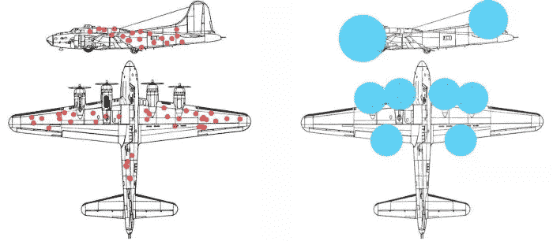
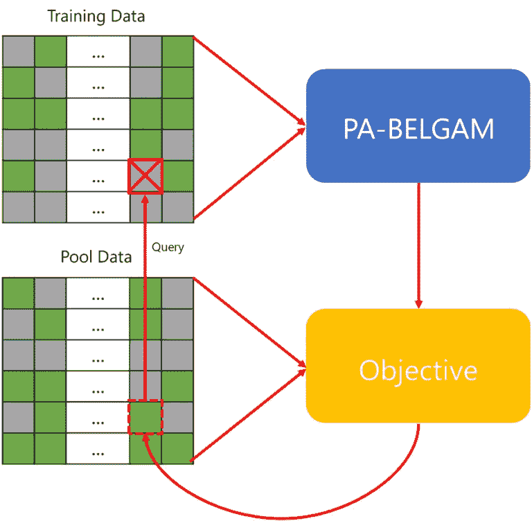
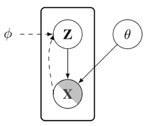
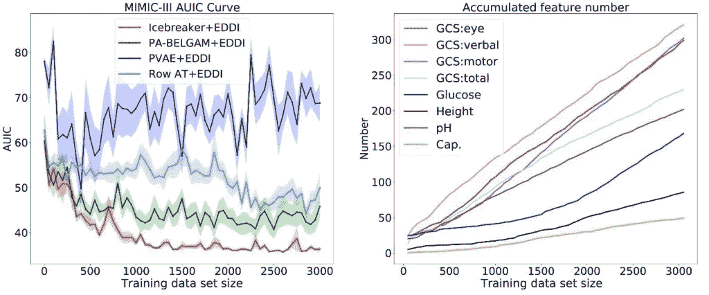

# 微软破冰者如何解决机器学习模型中的冷启动挑战

> 原文：<https://pub.towardsai.net/how-microsoft-icebreaker-addresses-the-cold-start-challenge-in-machine-learning-models-dc68fdb0fee1?source=collection_archive---------1----------------------->

## [机器学习](https://towardsai.net/p/category/machine-learning)

## 这项新技术允许部署用最少的训练数据运行的机器学习模型。

来源:[https://www . elegantthemes . com/blog/business/great-breaker-games-your-employees-will-really-enjoy](https://www.elegantthemes.com/blog/business/great-icebreaker-games-your-employees-will-actually-enjoy)

> 我最近创办了一份专注于人工智能的教育时事通讯，已经有超过 70，000 名订户。《序列》是一份无废话(意思是没有炒作，没有新闻等)的 ML 导向时事通讯，需要 5 分钟阅读。目标是让你与机器学习项目、研究论文和概念保持同步。请通过订阅以下内容来尝试一下:

 [## 序列

### 该序列解释了主要的机器学习概念，让你与最相关的项目和最新的…

thesequence.substack.com](https://thesequence.substack.com/) 

训练数据的获取和标记仍然是主流采用机器学习解决方案的主要挑战之一。在机器学习研究社区内，为了解决这个问题，已经创建了诸如弱监督学习或一次性学习之类的几种努力。微软研究院最近孵化了一个名为 Minimum Data AI 的团队，致力于为机器学习模型提供不同的解决方案，这些模型无需大型训练数据集即可运行。最近，[该小组发表了一篇论文，揭示了破冰船](https://papers.nips.cc/paper/9621-icebreaker-element-wise-efficient-information-acquisition-with-a-bayesian-deep-latent-gaussian-model)，这是一个“明智的训练数据获取”框架，允许部署可以在很少或没有训练数据的情况下运行的机器学习模型。

机器学习研究和技术的当前发展优先考虑监督模型，这些模型需要在产生任何相关知识之前对世界有相当多的了解。在现实世界中，获取和维护高质量的训练数据集非常具有挑战性，有时甚至是不可能的。在机器学习理论中，我们将这种困境称为冰(冷)启动问题。

# 知道你不知道的:机器学习中的冰启动挑战

ice-start 问题/困境指的是使机器学习模型有效所需的训练数据量。从技术上来说，大多数机器学习代理需要从大量的训练数据集开始，并在后续的训练运行中开始有规律地减少其大小，直到模型达到所需的精度水平。ice-start 挑战指的是模型在缺乏训练数据集的情况下有效运行的能力。

解决冷启动问题的方法可以用一句流行的话来描述:“知道你不知道的”。在生活中的许多情况下，理解当前环境中缺失的知识已被证明与现有知识同等重要或更重要。统计迷们经常引用二战中的一则著名轶事来说明这一困境。

第二次世界大战期间，五角大楼召集了一个由全国最著名的数学家组成的团队，以开发统计模型，在战争期间为盟军提供帮助。这种天赋令人惊讶。后来创建哈佛统计系的弗雷德里克·莫斯特勒就在那里。伦纳德·吉米·萨维奇也是如此，他是决策理论的先驱，也是后来被称为贝叶斯统计学的领域的伟大倡导者。麻省理工学院数学家、控制论的创始人诺伯特·维纳和未来的诺贝尔经济学奖得主米尔顿·弗里德曼也是该小组的成员。该小组的第一个任务包括评估美国飞机应该增加的额外保护水平，以便在与德国空军的战斗中幸存下来。像优秀的统计学家一样，该小组收集了遭遇纳粹后返航的飞机所遭受的损失。

对于每架飞机，数学家们计算了飞机不同部分(门、机翼、发动机等)的弹孔数量。然后，专家组就飞机的哪些区域应该得到额外保护提出了建议。不足为奇的是，绝大多数建议集中在弹孔较多的地区，假设这些地区是德国飞机的目标。这个小组中有一个例外，一位名叫[亚伯拉罕·瓦尔德](https://en.wikipedia.org/wiki/Abraham_Wald?source=post_page---------------------------)的年轻统计学家建议将额外的保护集中在库存飞机中没有显示任何损坏的区域。为什么？很简单，这位年轻的数学家认为输入数据集(飞机)只包括在与德国人的战斗中幸存下来的飞机。虽然严重，但这些飞机遭受的损失还不至于灾难性地让他们无法返回基地。因此，他得出结论，没有返回的飞机很可能在其他地区遭受了撞击。很聪明吧？

这一课告诉我们，理解给定上下文中缺失的数据与理解现有数据一样重要。外推至机器学习模型，*解决 ice-start 问题的关键是要有一个知道自己不知道什么的可扩展模型，即量化认知的不确定性。这些知识可用于指导训练数据的获取。直观的，不熟悉的，但是信息丰富的特征对模型训练更有用。*

# 破冰船

微软破冰船是一个新颖的解决冰面启动挑战的方案。从概念上讲，破冰船依赖于深度生成模型，该模型可以最大限度地减少训练机器学习模型所需的数据量和成本。从架构的角度来看，破冰者使用了两个组件。第一个组件是深度生成模型(PA-BELGAM)，显示在上面模型的上半部分，它具有一个新颖的推理算法，可以显式量化认知的不确定性。第二个组件是一组用于数据采集的新的基于元素的训练数据选择目标，如模型的下半部分所示。

来源:[https://papers . nips . cc/paper/2019/hash/c 055 DCC 749 c 2632 FD 4d d 806301 f 05 ba 6-abstract . html](https://papers.nips.cc/paper/2019/hash/c055dcc749c2632fd4dd806301f05ba6-Abstract.html)

破冰者的核心是 PA-BELGAM 模式。该模型基于一种能够管理缺失元素和解码器权重的变分自动编码器。Icebreaker 没有使用标准的深度神经网络作为解码器来映射来自潜在表示的数据，而是使用贝叶斯神经网络，我们在解码器权重上放置了先验分布。

来源:[https://papers . nips . cc/paper/2019/hash/c 055 DCC 749 c 2632 FD 4d d 806301 f 05 ba 6-abstract . html](https://papers.nips.cc/paper/2019/hash/c055dcc749c2632fd4dd806301f05ba6-Abstract.html)

微软在不同大小的不同数据集上对破冰者进行了评估。如下图所示，与最先进的模型相比，该模型显示了相关的改进。左边的图表表明，breaker 的性能优于几个基线，用较少的训练数据实现了更好的测试精度。右图显示了随着数据集总大小的增长，八个特征的数据点数。

来源:[https://papers . nips . cc/paper/2019/hash/c 055 DCC 749 c 2632 FD 4d d 806301 f 05 ba 6-abstract . html](https://papers.nips.cc/paper/2019/hash/c055dcc749c2632fd4dd806301f05ba6-Abstract.html)

微软破冰者是一个创新的模型，能够部署在很少或没有数据的情况下运行的机器学习模型。通过利用新颖的统计方法，Icebreaker 能够为给定的模型选择正确的特性，而不需要大型数据集。微软研究院开源了一个早期版本的破冰船来补充研究论文。