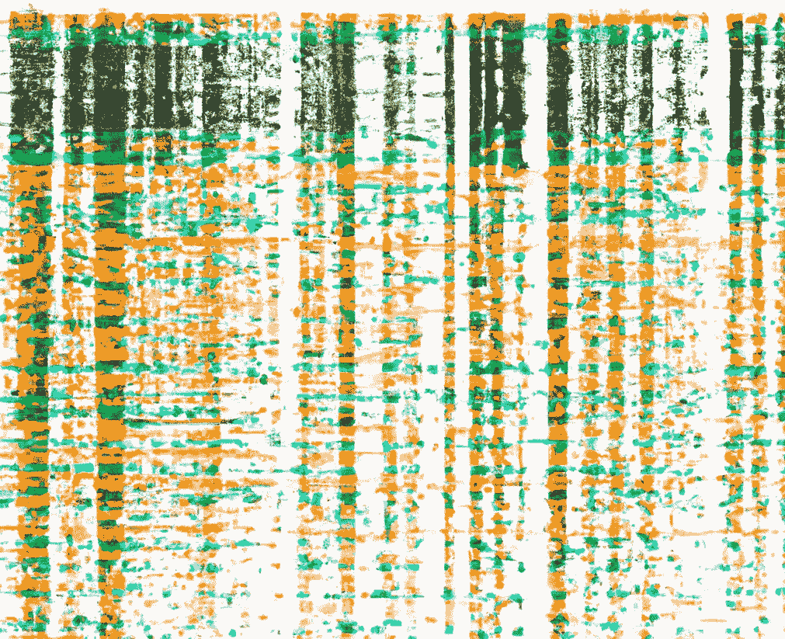

# 机器学习需要多少数据？

> 原文：<https://pub.towardsai.net/how-much-data-is-needed-for-machine-learning-a60ea495fe39?source=collection_archive---------5----------------------->

## 数据是机器学习的命脉。没有数据，就没有训练和评估 ML 模型的方法。但是机器学习需要多少数据呢？在这篇博文中，我们将探讨影响 ML 项目所需数据量的因素、减少所需数据量的策略以及帮助您开始使用较小数据集的技巧。

作者图片

机器学习(ML)和预测分析是现代计算中最重要的两个学科。ML 是人工智能(AI)的一个子集，专注于建立可以从数据中学习的模型，而不是依赖于显式的编程指令。另一方面，数据科学是一个跨学科领域，它使用科学方法、流程、算法和系统从结构化和非结构化数据中提取知识和见解。

随着 ML 和数据科学的日益普及，人们最常问的一个问题是:建立一个机器学习模型需要多少数据？

这个问题的答案取决于几个因素，例如

*   正在解决的问题类型，
*   模型的复杂性，
*   数据的准确性，
*   和标记数据的可用性。

根据经验，最好从比数据集中要素数量多十倍的样本开始。

此外，统计方法(如功效分析)可以帮助您估计各种类型的机器学习问题的样本大小。除了收集更多的数据，还有一些特定的策略来减少 ML 模型所需的数据量。这些包括特征选择技术，如 LASSO 回归或[主成分分析(PCA)](https://en.wikipedia.org/wiki/Principal_component_analysis) 。像[自动编码器](https://www.analyticsvidhya.com/blog/2021/06/dimensionality-reduction-using-autoencoders-in-python/)这样的维度缩减技术，流形学习算法，以及像[生成对抗网络(GANs](https://assets.researchsquare.com/files/rs-754281/v1_covered.pdf?c=1631875556) )这样的合成数据生成技术也是可用的。

虽然这些技术有助于减少 ML 模型所需的数据量，但重要的是要记住，在训练一个成功的模型时，质量仍然比数量更重要。

# 需要多少数据？

## 影响所需数据量的因素

当涉及到开发一个有效的机器学习模型时，获得正确数量和质量的数据是必不可少的。不幸的是，并非所有数据集都是平等的，有些数据集可能比其他数据集需要更多的数据来开发一个成功的模型。我们将探索影响机器学习所需数据量的各种因素，以及减少所需数据量的策略。

## 正在解决的问题类型

机器学习模型所解决的问题类型是影响所需数据量的最重要因素之一。

例如，需要带标签的训练数据的监督学习模型通常比不使用标签的无监督模型需要更多的数据。

此外，某些类型的问题，如图像识别或自然语言处理(NLP)，由于其复杂性，需要更大的数据集。

# 模型的复杂性

影响机器学习所需数据量的另一个因素是模型本身的复杂性。模型越复杂，正确、准确地进行预测或分类所需的数据就越多。具有许多层或节点的模型比那些具有较少层或节点的模型需要更多的训练数据。此外，使用多种算法的模型，如[集成方法](https://www.toptal.com/machine-learning/ensemble-methods-machine-learning#:~:text=Ensemble%20methods%20are%20techniques%20that,winning%20solutions%20used%20ensemble%20methods.)，将比那些只使用单一算法的模型需要更多的数据。

作者图片

# 数据的质量和准确性

数据集的质量和准确性也会影响机器学习需要多少数据。假设数据集中有很多噪音或不正确的信息。在这种情况下，可能有必要增加数据集的大小，以从机器学习模型中获得准确的结果。

此外，假设数据集中有缺失值或异常值。在这种情况下，这些必须被删除或估算，模型才能正确工作；因此，增加数据集大小也是必要的。

# 估计所需的数据量

在任何数据科学项目中，估计机器学习(ML)模型所需的数据量都至关重要。准确确定所需的最小数据集大小可以让数据科学家更好地了解他们的 ML 项目的范围、时间表和可行性。

在确定 ML 模型所需的数据量时，诸如所解决问题的类型、模型的复杂性、数据的质量和准确性以及标记数据的可用性等因素都会发挥作用。

估计所需数据量有两种方法:

*   **经验法则法**
*   **或统计方法**

估计样本量。

# 经验法则方法

经验法则通常用于较小的数据集。它包括根据过去的经验和当前的知识进行猜测。然而，使用统计方法来估计较大数据集的样本大小是至关重要的。这些方法允许数据科学家计算确保其模型足够准确和可靠所需的样本数量。

> 一般来说，关于机器学习的经验法则是，你需要的行(数据点)至少是数据集中特征(列)的十倍。
> 
> *这意味着如果您的数据集有 10 列(即要素)，您应该至少有 100 行才能获得最佳结果。*

最近的调查显示，大约 80%的成功 ML 项目使用超过 100 万条记录的数据集进行训练，大多数项目使用的数据远远超过这个最低阈值。

# 数据量和质量

当决定机器学习模型或算法需要多少数据时，您必须考虑所需数据的数量和质量。

除了满足上面提到的行数和要素数之间的比率之外，确保给定数据集中不同类或类别的充分覆盖也至关重要，否则称为[类不平衡](https://developers.google.com/machine-learning/data-prep/construct/sampling-splitting/imbalanced-data#:~:text=A%20classification%20data%20set%20with,smaller%20proportion%20are%20minority%20classes.)或采样偏差问题。确保适当数量和质量的适当训练数据将有助于减少此类问题，并允许在此较大集合上训练的预测模型随着时间的推移获得更高的准确度分数，而无需稍后进行额外的调整/细化工作。

关于行数与要素数的比较的经验法则有助于入门级数据科学家决定他们应该为 ML 项目收集多少数据。

因此，确保在实现机器学习技术时存在足够高质量的输入，可以大大有助于避免常见的陷阱，如样本偏差和部署后阶段的欠拟合。它也有助于更快地实现预测能力&在更短的开发周期内，无论是否可以访问海量数据。

图片由作者提供:有许多缺口的“脏”数据

# 减少所需数据量的策略

幸运的是，有几种策略可以减少 ML 模型所需的数据量。主成分分析(PCA)和递归特征消除(RFE)等特征选择技术可用于识别和移除数据集中的冗余特征。

奇异值分解(SVD)和 t 分布随机近邻嵌入(t-SNE)等降维技术可用于减少数据集中的维数，同时保留重要信息。

最后，可以使用合成数据生成技术，例如生成式对抗网络(GANs ),从现有数据集中生成额外的训练样本。

# 减少 ML 模型所需数据量的技巧

除了使用特征选择、维数减少和合成数据生成技术，其他几个技巧可以帮助入门级数据科学家减少他们的 ML 模型所需的数据量。

首先，他们应该尽可能使用预训练模型，因为这些模型比从头构建的定制模型需要更少的训练数据。第二，他们应该考虑使用迁移学习技术，这种技术允许他们在用较少的训练样本解决另一个相关任务时利用从一个任务中获得的知识。

最后，他们应该尝试不同的超参数设置，因为有些设置可能比其他设置需要更少的训练示例。

# 使用较小数据集的成功项目示例

数据是任何机器学习项目的重要组成部分，所需的数据量可能会因模型和所解决问题的复杂性而异。

但是，使用较小的数据集也有可能获得成功的结果。

我们现在将探索一些使用较小数据集完成的成功项目的例子。最近的调查显示，许多数据科学家可以用较小的数据集完成成功的项目。

> *根据 Kaggle 在 2020 年进行的一项调查，近 70%的受访者表示，他们已经完成了一个样本不足 1 万的项目。此外，超过一半的受访者表示，他们已经完成了一个样本少于 5，000 的项目。*

许多成功项目的例子都是使用较小的数据集完成的。例如，斯坦福大学的一个团队使用只有 1000 张图像的数据集创建了一个可以准确诊断皮肤癌的人工智能系统。

麻省理工学院的另一个团队使用了一个只有 500 张图像的数据集来创建一个人工智能系统，该系统可以在眼睛扫描中检测糖尿病视网膜病变。

这只是使用小数据集创建强大的机器学习模型的两个例子。

对于机器学习项目，使用较小的数据集显然可以获得成功的结果。

> *通过利用特征选择技术和降维技术，有可能减少 ML 模型所需的数据量，同时仍然实现准确的结果。*

# 结论

归根结底，机器学习项目所需的数据量取决于几个因素，例如正在解决的问题的类型、模型的复杂程度、数据的质量和准确性以及标记数据的可用性。要准确估计给定任务需要多少数据，您应该使用经验法则或统计方法来计算样本大小。此外，还有一些有效的策略来减少对大型数据集的需求，如特征选择技术、降维技术和合成数据生成技术。

最后，使用正确的方法和可用的技术，使用较小数据集的成功项目是可能的。

*原载于 2022 年 12 月 15 日*[*【https://graphite-note.com】*](https://graphite-note.com/how-much-data-is-needed-for-machine-learning)*。*