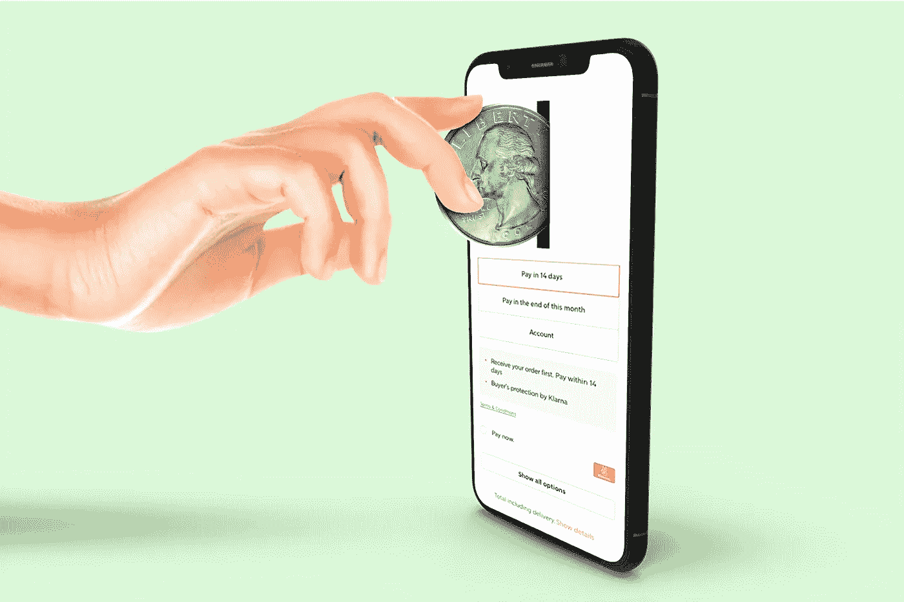

# 你的个人数据值多少钱？

> 原文：<https://pub.towardsai.net/how-much-is-your-personal-data-worth-b6b922be601f?source=collection_archive---------4----------------------->

## [隐私和安全](https://towardsai.net/p/category/privacy-and-security)

## 你的工作、关系状态和健康状况对你的数据价值的影响比你可能知道的要大。

照片来源:unsplash.com

在剑桥分析公司丑闻的余波中，脸书留给人们比以往更多的问题，同时开启了对客户数据真正价值的讨论。根据《经济学人》的一篇文章，“数据是新的石油”，像脸书和谷歌这样的大型科技巨头通过出售数据赚了数十亿美元，这已经不是什么秘密了。但是作为一个*个人*你的个人数据到底值多少钱呢？

事实证明，这取决于谁在问，他们的目标是什么。也不是所有的数据都相等。在美国，用户收集的数据通常价值不到 1 美元，但拥有庞大网络和巨大影响力的影响者的数据价格比普通人高。2013 年，[金融时报](https://ig.ft.com/how-much-is-your-personal-data-worth/)创造了一种计算器，可以根据个人背景和生活方式显示个人数据的价格。举个例子，如果你要结婚或生孩子，你比没有孩子的单身人士更有价值。如果你经常逛商店或者身体不好，你的数据也会更有价值。

这是一个奇怪的世界，所以让我们深入这个广为人知却鲜为人知的话题，了解更多在一些最常见的类别中，你的个人数据的价格标签是如何计算的。

# 经济地位和职业

这里我们可以看到，一个正常收入的会计师价值 0.079 美元，而一个百万富翁会计师的价值上升到 0.195 美元。有趣的是，企业家的数据值是 0.107 美元，高于列出的任何其他工作，包括飞行员、律师和董事长。学生作为一种职业甚至没有包括在内，所以他们的数据价值可能是最低的。

# 关系和孩子

如果你结婚了，你的数据价值会比没有结婚时增加 50%。如果您最近结婚或离婚，您将获得 0.010 美元的额外价值。如果你有孩子，你的数据也更有价值，但是如果你正在期待一个婴儿，你的数据价值从 0.112 美元上升到 0.207 美元。如果是你的第一个孩子，你的数据价值会增加 50%。

# 健康状况

你病得越重，数据的价格就越高。只有一种健康状况会给你带来额外的 0.260 美元的数据价值，同样的价值会累积到每一种健康状况中。因此，如果你有过敏症，你的数据价值 0.367 美元，如果你有过敏症*和*偏头痛，它会上升到 0.627 美元，并且列表还会增加。

# 活动

拥有像船、房子或飞机这样的财产会让你的数据更有价值，如果你也是一个旅行/健身/巡航爱好者，它会增加价值。有趣的是，如果你参加能让你减肥的活动，你的数据值会上升 50%。

# 购物

你在网上搜索或访问的网站越多，数据的价格就越高。这里的在线搜索包括食物、烹饪、教育、八卦、政治、旅游和游戏。如果你想买一个产品，比如汽车、手机、衣服或旅游，你的数据价值也会增加。

# 脸书和谷歌从你的数据中获利多少？

众所周知，脸书和谷歌从客户数据中获利巨大。我们注册后可以“免费”使用他们的服务，作为交换，他们可以分析我们的个人信息并卖给广告公司。[谷歌](https://seotribunal.com/blog/google-stats-and-facts/)2017 年广告收入 954 亿美元，[脸书](https://www.thestreet.com/technology/how-does-facebook-make-money-14754098)同年收入 399 亿美元。广告收入是一笔大生意，而且还在不断增长。快速了解一下这些科技巨头的用户群，我们就能很好地理解其中的原因。今天，脸书有 23.7 亿用户，谷歌每年有 2 万亿次搜索。此外，谷歌拥有全球 90%的搜索引擎市场份额。

越来越多的隐私担忧并没有影响到脸书或谷歌，因为他们的利润每年都在增加，越来越多的人注册了他们的服务。难怪用户数据是一个大产业。因此，即使你个人的数据可能不到 1 美元，但你的数据加上全世界其他人的个人数据的总价值是数十亿美元。

下次当你在搜索引擎中输入像“袜子”这样普通的东西时，让我们想想。

*这篇文章最初发表在我的博客上。更多阅读请查看我的博客页面*[*https://tashina.se/blog/*](https://tashina.se/blog/?utm_source=Medium&utm_medium=social&utm_campaign=DataValue)