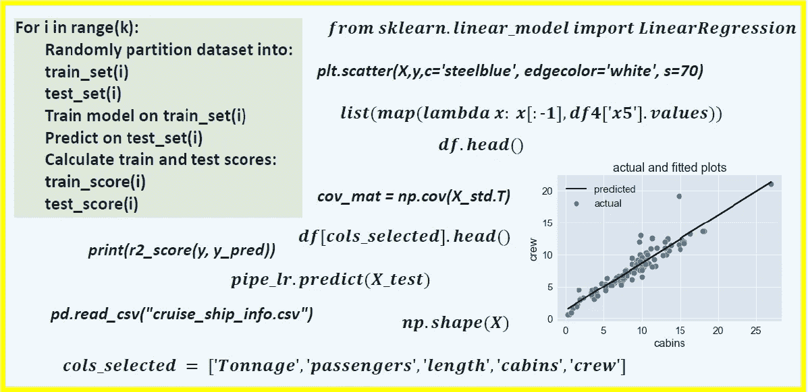

# 数据科学需要多少编程？

> 原文：<https://pub.towardsai.net/how-much-programming-do-i-need-in-data-science-64356fdb9ef2?source=collection_archive---------1----------------------->



Benjamin O. Tayo 的图片

## [数据科学](https://towardsai.net/p/category/data-science)，[编程](https://towardsai.net/p/category/programming)

## 数据科学不是计算机科学。专注于使用现有的库和包。了解每个包背后的数学背景。

# 一.导言

如果您是数据科学的追求者，您无疑会有以下问题:

***很少或者没有编程背景可以成为数据科学家吗？***

***数据科学中哪些必备的编程技能很重要？***

有许多优秀的软件包可用于构建预测模型或生成数据可视化。一些最常见的描述性和预测性分析包包括:

*   Ggplot2
*   熊猫
*   Numpy
*   Matplotlib
*   海生的
*   sci kit-学习
*   脱字号
*   张量流
*   PyTorch
*   克拉斯

多亏了这些软件包，任何人都可以构建模型或制作数据可视化。然而，为了能够有效地使用这些包来构建模型，掌握一些基本的编程技能是很重要的。在本文中，我们将讨论数据科学中需要的一些基本编程技能。我们假设 Python 是默认的编程语言。

# 二。基本编程技能

*   数据类型:了解数组、列表、元组、字典和数据框等基本数据类型。
*   赋值语句
*   函数定义
*   流程和控制:如和*在*循环时要熟悉*。*
*   python 的面向对象方面:理解 Python 对象、参数、方法和属性。Python 中的大多数机器学习库都是使用 Python 的面向对象特性构建的，例如 *LogisticRegression()* 分类器。

# 三。标准库和包

您应该熟悉以下标准库和包:

**Pandas** :用于向 Python 导入和导出数据

Numpy :用于处理数组和矩阵

**Matplotlib，Seaborn，PyTorch** :用于生成各种类型的数据可视化，如线图、散点图、热图、密度图、条形图、箱线图等。

**Scikit-learn** :用于机器学习应用。熟悉以下评估者:

*   *train_test_split()*
*   *标准标量()*
*   *LogisticRegression()*
*   流水线估计器

可以使用下面的代码访问这些估算器:

```
from sklearn.model_selection import train_test_splitfrom sklearn.preprocessing import StandardScalerfrom sklearn.linear_model import LinearRegressionfrom sklearn.linear_model import LogisticRegressionfrom sklearn.pipeline import Pipelinepipe_lr = Pipeline([('scl', StandardScaler()),('lr',    
                     LinearRegression())])
```

scikit-learn 软件包中包含的其他重要回归器和分类器包括:

*   KNeighborsRegressor
*   支持向量回归机
*   近邻分类器
*   支持向量分类器
*   朴素贝叶斯
*   决策图表

Scikit-learn 还包含深度学习应用的估算器:

*   克拉斯
*   张量流

# 四。使用 Python 文档

Python 文档是学习 Python 命令的非常有用的工具。可以在给定命令前使用问号来访问文档。

*   例如，要找到更多关于 *pd.read_csv()* 方法的信息，我们可以使用下面的代码。

```
import pandas as pd?pd.read_csv
```

这将把您带到 Python 文档，在那里您可以了解更多关于 *pd.read_csv()* 方法*、*的信息，包括它的各种可调参数。

*   要了解有关逻辑回归分类器的更多信息，可以使用以下代码来访问 Python 文档文件:

```
from sklearn.linear_model import LogisticRegression?LogisticRegression
```

这将打开包含关于 *LogisticRegression* 分类器更多信息的文档，包括所有参数和属性的详细解释。

使用 scikit-learn 库构建模型时，理解每个估计器的各种可调参数是很重要的。使用默认参数并不总能产生最佳结果。例如，逻辑回归有以下参数:

```
LogisticRegression**(**penalty**='l2',** dual**=False,** tol**=0.0001,** C**=1.0,** fit_intercept**=True,** intercept_scaling**=1,** class_weight**=None,** random_state**=None,** solver**='liblinear',** max_iter**=100,** multi_class**='ovr',** verbose**=0,** warm_start**=False,** n_jobs**=1)**
```

对于逻辑回归， *C* 参数(正则化参数)非常重要，因此，在选择产生最佳性能的 *C* 值之前，最好针对不同的 *C* 值调整模型性能，而不是使用默认值。

# 动词 （verb 的缩写）个案研究

下面的两个案例研究说明了如何将重点放在将可用的库和包用于数据科学和机器项目上，而不是从头开始编写自己的代码:

[绝对初学者的线性回归基础知识](https://medium.com/towards-artificial-intelligence/linear-regression-basics-for-absolute-beginners-68ed9ff980ae)

[机器学习过程教程](https://medium.com/swlh/machine-learning-process-tutorial-222327f53efb)

# 不及物动词总结和结论

总之，我们已经讨论了数据科学实践所需的基本编程技能。感谢 ***numpy*** 、 ***熊猫*** 、 ***matplotlib、scikit-learn*** 等软件包的可用。，任何有一些基本编程背景的人都可以建立机器学习模型。然而，重要的是理解每个模型背后的[数学](https://medium.com/towards-artificial-intelligence/how-much-math-do-i-need-in-data-science-d05d83f8cb19)，以便能够调整各种超参数，从而获得具有最佳性能的模型。使用默认超参数构建模型并不总能产生最佳模型。

# 其他数据科学/机器学习资源

数据科学需要多少数学知识？

[数据科学最低要求:开始做数据科学需要知道的 10 项基本技能](https://towardsdatascience.com/data-science-minimum-10-essential-skills-you-need-to-know-to-start-doing-data-science-e5a5a9be5991)

[数据科学课程](https://medium.com/towards-artificial-intelligence/data-science-curriculum-bf3bb6805576)

[机器学习的基本数学技能](https://medium.com/towards-artificial-intelligence/4-math-skills-for-machine-learning-12bfbc959c92)

[进入数据科学的 5 个最佳学位](https://towardsdatascience.com/5-best-degrees-for-getting-into-data-science-c3eb067883b1)

[数据科学的理论基础——我应该关心还是仅仅关注实践技能？](https://towardsdatascience.com/theoretical-foundations-of-data-science-should-i-care-or-simply-focus-on-hands-on-skills-c53fb0caba66)

[机器学习项目规划](https://towardsdatascience.com/machine-learning-project-planning-71bdb3a44349)

[如何组织你的数据科学项目](https://towardsdatascience.com/how-to-organize-your-data-science-project-dd6599cf000a)

[大型数据科学项目的生产力工具](https://medium.com/towards-artificial-intelligence/productivity-tools-for-large-scale-data-science-projects-64810dfbb971)

[数据科学作品集比简历更有价值](https://towardsdatascience.com/a-data-science-portfolio-is-more-valuable-than-a-resume-2d031d6ce518)

如有问题和疑问，请发邮件给我:benjaminobi@gmail.com