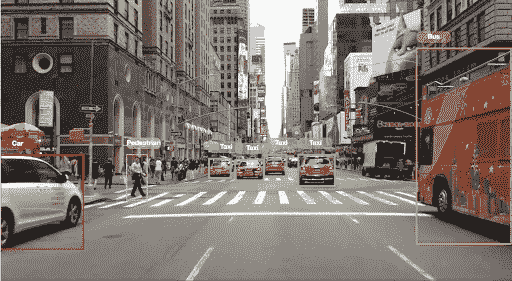

# 机器学习需要多少训练数据？

> 原文：<https://pub.towardsai.net/how-much-training-data-do-you-require-for-machine-learning-5da51e5d166d?source=collection_archive---------0----------------------->

## [机器学习](https://towardsai.net/p/category/machine-learning)

图片由 startuphub.ai 提供

它是机器学习(ML)的重要组成部分，拥有适当质量和数量的数据集对于准确的结果至关重要。机器学习算法可用的训练数据越多，模型就能越好地识别不同种类的对象，从而更容易在现实生活的预测中区分它们。

然而，你将如何确定多少训练对于你的机器学习是足够的呢？由于数据不足会影响模型的预测准确性，而数据过多会产生最佳结果，问题是您是否可以管理大数据或大量数据集，以及您是否可以使用深度学习或更复杂的方法将这些数据输入算法。

你的模型的复杂性、机器学习算法以及数据训练或验证程序都会影响机器学习需要多少[训练数据](https://medium.com/anolytics/how-data-annotation-companies-manually-label-their-data-b94d6afcca0b)。并且，在某些情况下，需要多少证据来表明一个模型优于另一个模型。在确定适当数量的数据集时，所有这些考虑因素都允许我们更深入地研究多少数据对于机器学习来说是足够的问题。

# **你为什么要询问这个？**

理解您为什么询问训练数据集所需的大小至关重要。

你的下一步行动可能会受到回应的影响。

考虑以下场景:

**1。**你有过量的数据吗？考虑创建一些学习曲线来确定样本的大小。或者，利用大数据框架来利用所有可访问的数据。

**2。**你是不是数据量不够？确认你确实没有足够的数据。考虑收集额外的数据或利用数据扩充技术来人为增加样本量。

**3。你收集到任何数据了吗？考虑收集一些信息并确定这些信息是否足够。如果为了研究或数据收集而花费昂贵，考虑与领域专家和统计学家交谈。**

*更常见的是，你可能有更世俗的顾虑，比如:*

*   我应该从数据库中导出多少条记录？
*   达到所需性能水平所需的最小样本数是多少？
*   训练集需要多大才能获得模型性能的良好近似值？
*   需要多少数据才能说明一个模型优于另一个模型？
*   我应该使用 k 倍交叉验证还是训练/测试分割？

# **那么，你需要多少训练数据？**

***1。*** *看情况，没人确切告诉你*

没有人能告诉你你的预测建模挑战需要多少数据；没有人能告诉你你需要多少数据。它是不可知的:这是一个难题，需要通过实证调查来寻找解决方案。

机器学习所需的数据量由许多因素决定，包括:

由于问题的复杂性，未知的基础函数最好地将输入变量链接到输出变量。

学习算法的困难，用于从特定情况归纳学习未知的底层映射函数。

***2。*** *比喻作为推理的手段*

在你之前，许多人致力于许多应用机器学习挑战。

他们中的一些人已经公开了他们的发现。

也许你可以看看与你的情况类似的研究，以了解你需要多少数据。

类似地，关于算法性能如何随数据集大小扩展的研究也很流行。这样的研究也许能告诉你运行某个算法需要多少数据。

你也许可以将许多研究的结果平均起来。

***3。*** *利用你的领域知识*

您将需要一个来自您的问题的数据样本，这是您正在处理的典型问题。

一般来说，实例必须平等独立地分布。

请记住，我们正在学习机器学习中的一个将输入数据转换为输出数据的函数。你所学习的映射函数的好坏取决于你给它学习的数据。

这意味着必须有足够的数据来捕捉输入要素之间以及输入要素和输出要素之间可能存在的关系。

使用您的领域专业知识或寻求领域专家来推理领域和数据量，这可能是捕获问题的有用复杂性所必需的。

***4。*** *非线性算法需要更多信息*

非线性算法通常用于描述更复杂的机器学习方法。

他们可以通过定义学习输入和输出特性之间复杂的非线性关系。你可能已经在使用或计划使用这些算法。

这些方法通常更加灵活，在某些情况下是非参数的(它们可以计算出除了这些参数值之外，还需要多少参数来为您的问题建模)。它们也是高方差的，这意味着预测会根据用于训练它们的数据而不同。这种增加的灵活性和能力是以更多的训练数据(通常是大量数据)为代价的。

事实上，某些非线性算法，如深度学习方法，可以随着更多数据的提供而提高其性能。

如果线性方法在每个类有数百个实例的情况下表现良好，那么像随机森林或人工神经网络这样的非线性方法可能需要每个类有数千个实例。

***5。*** *比较数据集的大小来建模的技巧。*

当创建一个新的机器学习算法时，通常会展示甚至解释算法如何响应数据量或任务难度。

这些研究可能由算法的创建者进行或发布，也可能不存在于您正在处理的算法或问题类型中。

我建议使用您自己的数据和单个高性能算法(如随机森林)进行您自己的研究。

***6。*** *获取更多数据(不惜一切代价！？)*

虽然大数据和机器学习经常被放在一起讨论，但大数据可能并不需要符合您的预测模型。

有些问题需要大量数据或全部数据。简单的统计机器翻译，例如:

如果你在做经典的预测建模，训练集的规模几乎肯定会达到一个收益递减的点，你应该调查你的问题和模型，找出那个点在哪里。

请记住，机器学习是一个归纳过程。模型只能捕捉它所看到的。如果您的训练数据不包括边缘案例，它们很可能不受模型支持。

[https://www.youtube.com/watch?v=xGa5VHA899U](https://www.youtube.com/watch?v=xGa5VHA899U)

# 不要等待；现在就开始吧。不要等着为你的问题建模，现在就开始建模吧。

允许[训练数据大小](https://hackernoon.com/what-is-training-data-really-adf0b97a116c)的问题阻止你开始你的预测建模挑战是一个错误。

在许多情况下，我把这个问题看作是推迟做任何事情的借口。

收集尽可能多的信息，充分利用你所拥有的信息，评估模型在解决你的问题上有多成功。

学习一些东西，然后通过做进一步的分析、扩充或从你的领域收集新数据，用它来提高你对你所拥有的东西的理解。

# 尾注

训练数据的质量和数量是机器学习工程师和数据科学家在建立模型时评估的两个最关键的方面。然而，在未来几年里，机器学习模型建立需要多少训练数据将变得越来越清楚，但就目前而言，“越多越好。”因此，如果您能够获取尽可能多的数据并加以利用，那将是更好的选择，但是长时间等待获取投标数据可能会导致项目延迟。

有几家公司提供高质量的机器学习和人工智能[训练数据集](https://medium.com/cogitotech/how-much-do-image-annotation-services-cost-f79db6680649)。他们收集数据，对其进行分类，并通过[图像注释服务](https://medium.com/anolytics/anolytics-types-and-use-cases-of-image-annotation-for-computer-vision-in-ai-2dcf962e2fa6)对其进行分类，以便以低成本提供监督良好的训练数据。

(原始)