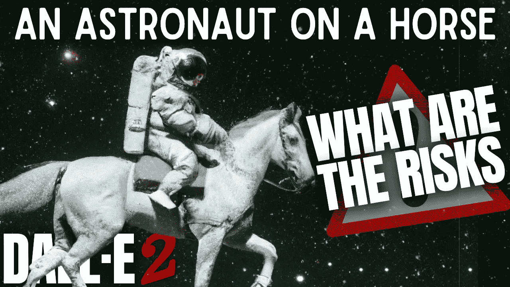
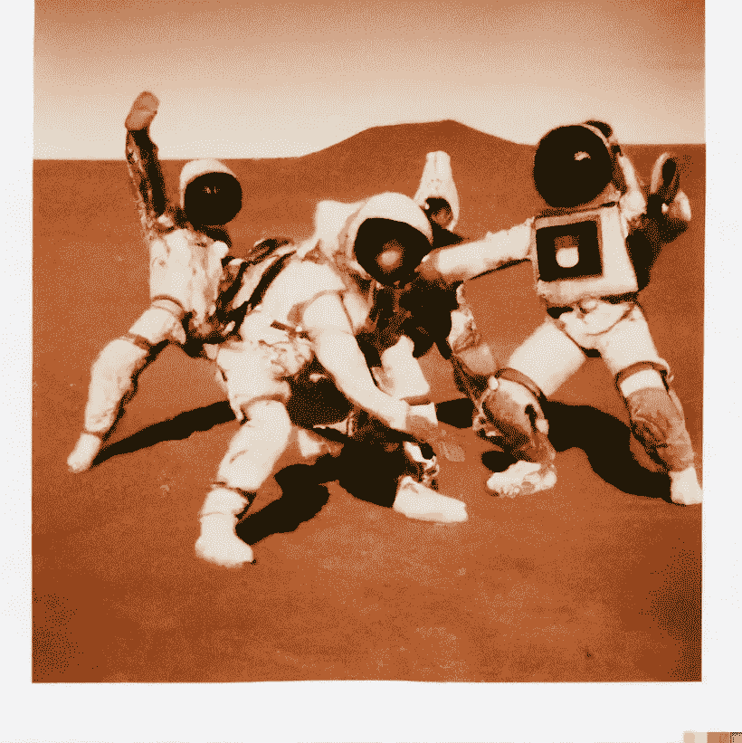
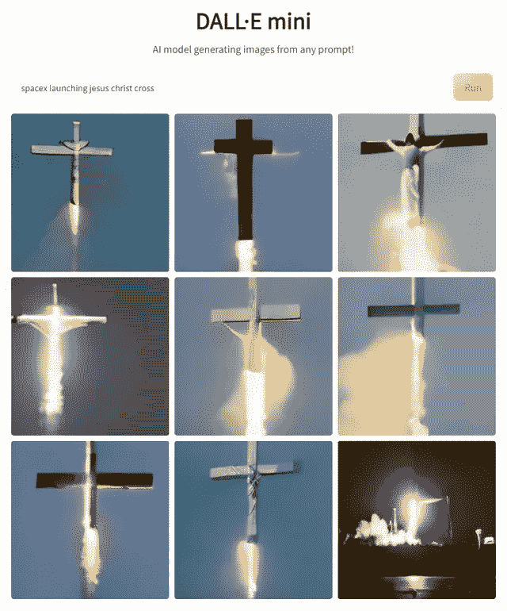
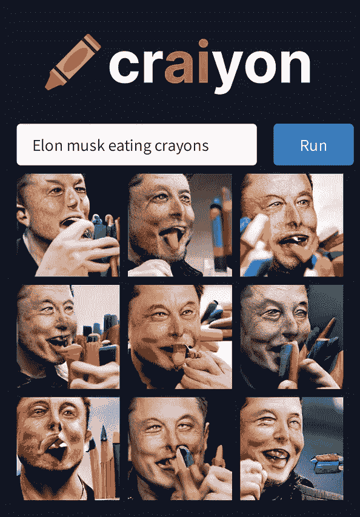
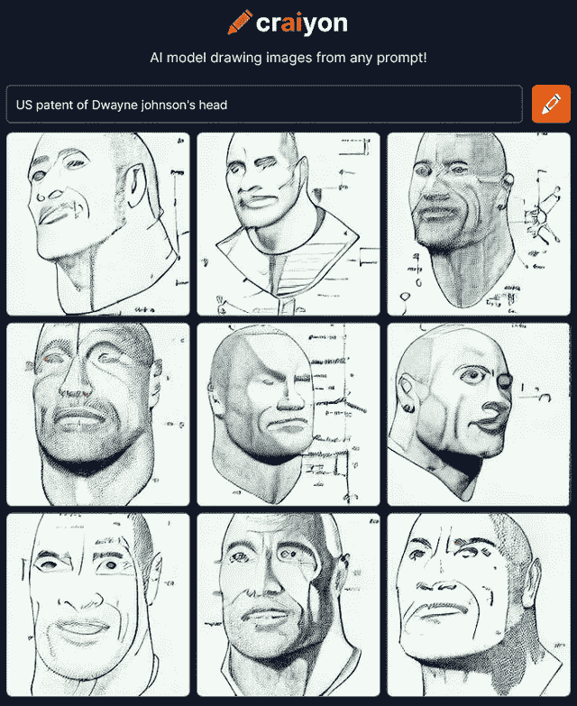
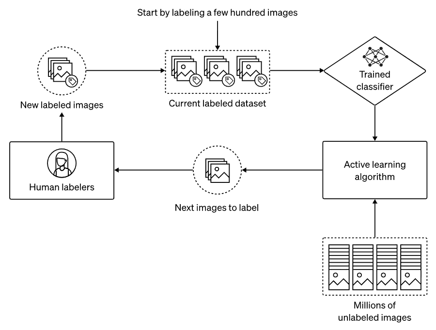
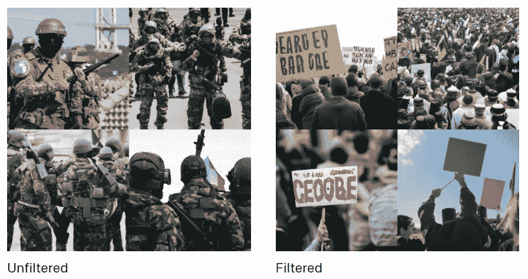
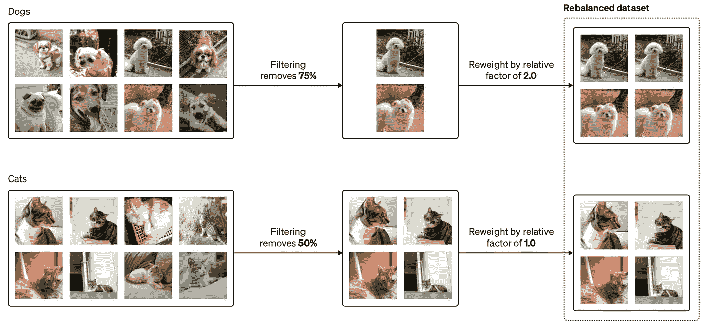

# OpenAI 如何降低 DALL E 2 的风险

> 原文：<https://pub.towardsai.net/how-openai-reduces-risks-for-dall-e-2-64106ffa1bca?source=collection_archive---------1----------------------->

## DALL E 2 训练前缓解

> 最初发表于 [louisbouchard.ai](https://www.louisbouchard.ai/how-openai-reduces-risks-for-dall-e-2/) ，前两天在[我的博客上读到的！](https://www.louisbouchard.ai/how-openai-reduces-risks-for-dall-e-2/)

## 观看视频

你们都见过像这样令人惊叹的图像，完全由人工智能模型生成。我在我的频道上报道了多种方法，如 Craiyon、Imagen 和最著名的 Dall-e 2。

使用 Dalle 2 生成的图像，带有提示:“一个宇航员 b-boy 船员在火星上表演，宝丽来”。分享到 OpenAI 的 Instagram 页面。

大多数人想尝试它们，并根据随机提示生成图像，但这些模型中的大多数都不是开源的，这意味着我们，像我们一样的普通人，不能自由使用它们。为什么？这就是我们将在本文中深入探讨的内容。

我说大部分都不是开源的。

好吧，Craiyon 是，人们用它创造了惊人的迷因。

你可以看到这种模式会变得多么危险:允许任何人生成任何东西。不仅仅是对世代的可能误用，也是对用于训练这种模型的数据的误用，这些数据来自互联网上的随机图像，几乎任何东西，具有可疑的内容并产生一些意想不到的图像。该训练数据也可以通过模型的逆向工程来检索，这很可能是不需要的。

OpenAI 还以此为由，为不向公众发布 Dall-e 2 模型辩护。在这里，我们将了解他们正在调查的潜在风险，以及他们如何试图减轻这些风险。我将浏览他们写的一篇文章，内容涉及他们在训练 Dall-e 2 时的数据预处理步骤。

那么当 OpenAI 说他们正在努力降低风险时，他们到底在想什么呢？

首先，也是最明显的一点是，他们从互联网上数以亿计的图片中过滤出暴力和色情图片。这是为了防止模型学习如何制作暴力和性内容，甚至返回原始图像作为代。

这就像如果你不想让你的孩子打架，就不要教他怎么打架。这可能有所帮助，但远非完美的解决方案！尽管如此，我认为在我们的数据集中有这样的过滤器是必要的，在这种情况下它肯定有帮助。

“我们从标记图像的小数据集开始(图的顶部)。然后我们根据这些数据训练一个分类器。然后，主动学习过程使用当前分类器来选择少数可能提高分类器性能的未标记图像。最后，人类为这些图像制作标签，将它们添加到带标签的数据集中。可以重复该过程，以迭代地提高分类器的性能。”图片来自 [OpenAI 的博文](https://openai.com/blog/dall-e-2-pre-training-mitigations/)。

但是他们到底是怎么做到的呢？他们建立了几个模型，通过给它们一些不同的正面和负面例子，训练这些模型来对要过滤或不要过滤的数据进行分类，并利用人类反馈迭代地改进分类器。每个分类器都检查了我们的整个数据集，删除了比需要更多的图像，以防万一，因为对于模型来说，首先不要看到坏数据，而不是事后试图纠正镜头要好得多。每个分类器对要过滤的内容都有独特的理解，并且都相互补充，确保良好的过滤。如果是好的，我们的意思是没有假阴性图像通过过滤过程。

然而，它也有不好的一面。首先，数据集显然更小，可能无法准确地代表真实世界，这可能是好是坏取决于用例。他们还发现了这种数据过滤过程的一个意想不到的副作用:它放大了模型对某些人口统计数据的偏见。介绍 OpenAI 正在做的第二件事，作为训练前的缓解措施:减少这种过滤导致的偏差。

我们的未过滤模型(左)和过滤模型(右)的提示“军事抗议”的世代。值得注意的是，过滤后的模型几乎不会产生枪支的图像。图片来自 [OpenAI 的博文](https://openai.com/blog/dall-e-2-pre-training-mitigations/)。

例如，在过滤之后，他们注意到的一个偏见是，与在原始数据集上训练的模型相比，该模型生成的男性图像更多，女性图像更少。他们解释说，原因之一可能是女性在性内容中比男性出现得更频繁——这可能会使他们的分类器产生偏见，从数据集中删除更多包含女性的假阳性图像，从而在模型在训练中观察和复制的性别比例中产生差距。

“数据集重新加权的示例。我们从一个平衡的数据集开始(左)。如果我们的过滤器对一个类别的影响比对另一个类别的影响更大，它可能会创建一个有偏见的数据集(中间)。使用重新加权，我们有效地“重复”了一些数据，使我们能够重新平衡由过滤器引起的偏差(右)。”图片来自 [OpenAI 的博文](https://openai.com/blog/dall-e-2-pre-training-mitigations/)。

为了解决这个问题，他们对过滤后的数据集重新加权，以匹配初始预过滤数据集的分布。这是一个他们使用猫和狗的例子，其中过滤器会删除更多的狗而不是猫，因此修复方法是将狗的图像的训练损失加倍，这就像发送两幅而不是一幅狗的图像，并补偿图像的缺乏。这再次只是实际滤波偏差的代理，但它仍然减少了预滤波和滤波数据集之间的图像分布差距。

最后一个问题是记忆的问题，模型似乎比我更强大。正如我们所说的，从这样的图像生成模型中回流训练数据是可能的，这在大多数情况下是不希望的。在这里，我们也希望生成新颖的图像，而不是简单地从互联网上复制粘贴图像。

但是我们如何防止这种情况发生呢？就像我们的记忆一样，你不能真正决定你记得什么，什么会消失。一旦你看到了什么，它要么坚持，要么不。

他们发现，就像人类学习一个新概念一样，如果模型在数据集中多次看到相同的图像，它可能会在训练结束时偶然记住它，并为类似或相同的文本提示生成它。

这是一个简单可靠的解决方法:只要找出哪些图像太相似，然后删除重复的。容易吗？嗯，这样做意味着将每张图片与其他图片进行比较，这意味着要比较成百上千万亿对图片。相反，他们只是简单地将相似的图像分组在一起，然后将这些图像与同一图像组中的所有其他图像以及它周围的一些其他图像进行比较，极大地降低了复杂性，同时仍能找到 97%的重复对。

同样，在训练我们的 Dall-e 模型之前，在数据集内要做的另一个修正。

OpenAI 还提到了他们正在研究的一些后续步骤，如果你喜欢这篇文章，我肯定会邀请你阅读他们的深入文章，以了解这项训练前缓解工作的所有细节。这是一篇非常有趣、写得很好的文章。

让我知道你对他们的缓解努力和他们限制模型对公众开放的选择的看法。在[我们的不和谐社区](https://www.louisbouchard.ai/learn-ai-together)中发表评论或加入讨论！

谢谢你一直读到最后！

下周我会带着另一篇精彩的论文来看你，

路易斯（号外乐团成员）

## 参考

*   OpenAI 的文章:【https://openai.com/blog/dall-e-2-pre-training-mitigations/】T2
*   https://youtu.be/rdGVbPI42sA
*   克莱恩的视频:[https://youtu.be/qOxde_JV0vI](https://youtu.be/qOxde_JV0vI)
*   使用克雷永:【https://www.craiyon.com/ 