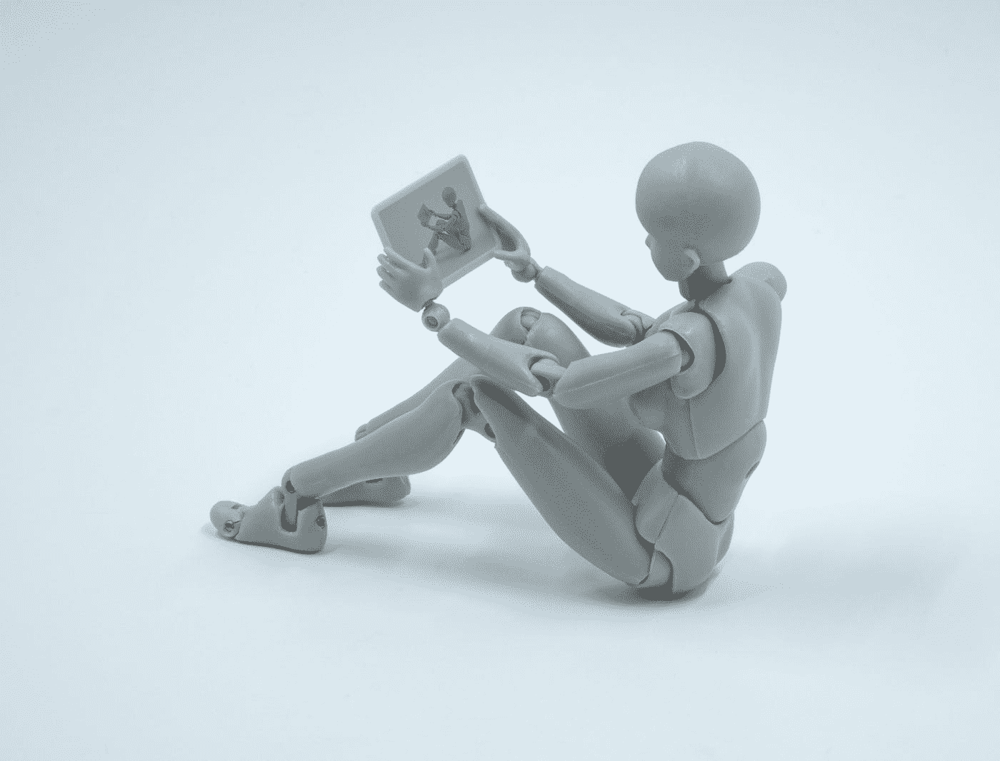

# 机器人是如何进化的

> 原文：<https://pub.towardsai.net/how-robots-have-evolved-5c2e28922659?source=collection_archive---------2----------------------->

## 一个关于不同代机器人的博客。

布雷特·乔丹在 [Unsplash](https://unsplash.com?utm_source=medium&utm_medium=referral) 上的照片

在过去的几十年里，机器人技术取得了长足的进步。事实上，它经历了如此多的变化，已经经历了四代进化。在这篇博客中，我们将看看不同代的机器人技术，以及我们是如何发展到现在这一代的。

## 1.什么是机器人？

在很大程度上，机器人是被创造出来为人类工作的机器。它们被用于工厂生产线，监测天气状况，或探索太空。机器人也可以通过编程在家里完成简单的任务。有些任务，如清洁地板或吸尘，可能是乏味和耗时的。当你坐下来放松时，机器人可以被编程来工作。许多人担心机器人会取代他们的工作，但是机器人还不能做人类做的大多数工作。事实上，大多数机器人都是为了完成一项特定的任务而制造的。

## 2.什么是二代机器人？

机器人已经不仅仅是工厂里的一个劳动力。机器人变得更加先进，它们已经成为第二代机器人。第二代机器人，它们是什么？嗯，他们被称为合作机器人或合作机器人。这些新的机器人模型被设计成与人类并肩工作。从某种意义上说，它们是合作的，它们可以被编程来帮助完成一项任务，并从它们的错误中学习。

艾萨克·阿西莫夫通常被认为是第一个在出版物中使用机器人这个词的人。他的短篇小说《逃避》发表在 1942 年 5 月出版的《令人震惊的科幻小说》上。这是他的机器人故事中第一个以机器人这个词为特色的故事。机器人这个词是由机器人这个词衍生而来的。机器人是一种机械装置，能够根据特定的指令自动执行一系列复杂的动作。机器人也可以以更灵活的方式使用，例如在装配线上或作为通用工具。机器人学这个术语来源于机器人这个词。波兰语中“机器人”一词的意思是“工人”，卡雷尔·恰佩克在 1921 年的戏剧《机器人》(Rossumovi Univerzální Roboti，Rossum 的通用机器人)中首次使用该词，该剧被普遍认为是第一部以人形机器人为主角的科幻作品。

## 3.第三代机器人是什么？

早在人类存在之前，机器人就已经存在了很长时间。但是，纵观历史，已经有过三代独立的机器人。第一代机器人是由人类建造的机械机器，如古希腊的赫尔墨斯雕塑或中国古代的机械乐器。第二代机器人是基于计算机的，它们是在没有真实物理存在的计算机上制造的。这些包括虚拟助手和电脑游戏。第三代机器人是现实世界中存在的机器人，由金属和塑料制成，但不是人类制造的。这包括无人机和自动驾驶汽车。

机器人现在正在成为现实，它们在日常生活中被使用，并且会一直存在下去。今天已经在使用的机器人有三代。他们是第三代机器人:第三代机器人与第二代机器人非常相似，都是完全自主的，但它们能够学习和适应。这一代机器人能够学习周围的环境。它们能够通过一个称为“反向运动学”的过程来解决问题，这是一种有趣的说法，即系统可以从错误中学习，并在未来做出更好的决定。

第三代机器人是机器人能够在没有人类监督的情况下与人类一起工作。在这一代，机器人能够在与现实世界中的机器人相似的环境中工作。这包括制造工厂、仓库，甚至住宅。这一代机器人能够完成人类难以完成的任务。例如，拿起和放下物体。这一代机器人几乎构成了今天使用的所有机器人。

## 4.第四代机器人是什么？

机器人每一代都在进化，而且还会继续进化。第一代机器人只是由遥控器或电脑控制的简单机器。第二代机器人由计算机控制，可以执行简单的任务。这种类型的机器人是最常见的，对需要帮助的人来说也是最有用的。第三代机器人几乎和人类一样。这些机器人可以执行更复杂的任务，但仍然需要计算机来控制它们。第四代机器人可以完成简单的任务，但不需要电脑或遥控器来控制。他们是完全自主的。

第四代机器人，或称“社交机器人”，是那些可以使用人类手势和语言与人类互动的机器人。这一代机器人被设计成对人类友好，能够在家庭和公共场所与人类并肩工作。它们被设计来与人类合作，而不是与人类竞争。有几种不同类型的机器人属于这一类别，包括个人机器人、娱乐机器人和助理机器人。

自从 20 世纪 50 年代第一批工业机器人爬出工厂以来，机器人已经走过了漫长的道路。虽然第一代机器人简单、机械、缓慢，但它们为第二代机器人铺平了道路。这些第二代机器人与第一代相似，但它们更精确，允许机器人在更危险的环境中工作。第三代机器人创建于 20 世纪 80 年代，它们是第一批能够使用人工智能执行各种任务的机器人。这些第三代机器人是第一批能够执行曾经被认为是不可能的任务的机器人。今天，这些机器人涉及各种行业，并用于许多不同的目的。

> **结论:**

第四代机器人具有自愈和自学习能力。