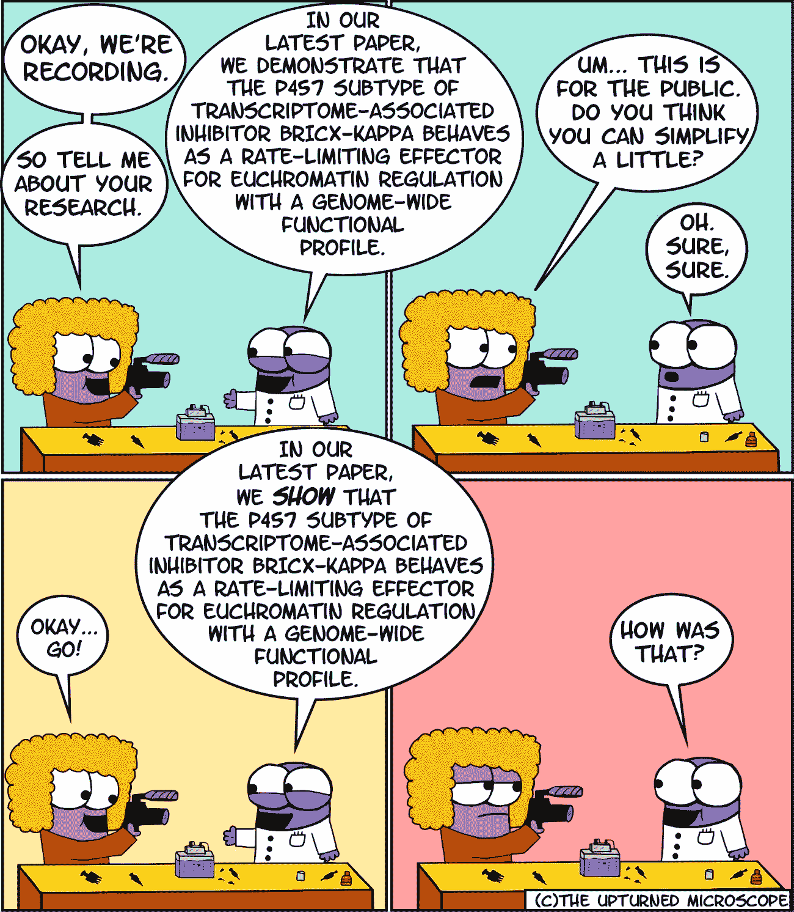
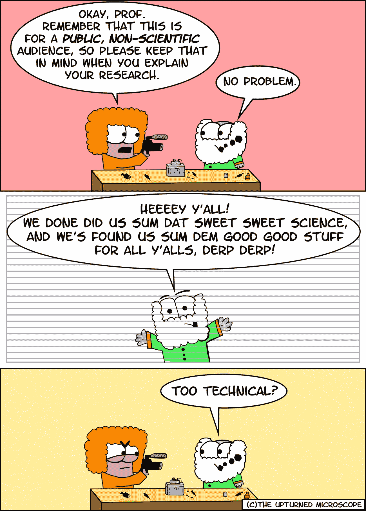

# 如何与非技术风险承担者沟通

> 原文：<https://pub.towardsai.net/how-to-communicate-with-non-technical-stakeholders-c78fc76f7a41?source=collection_archive---------1----------------------->

## 你需要知道的提示

杰森·古德曼在 [Unsplash](https://unsplash.com?utm_source=medium&utm_medium=referral) 上的照片

向非技术人员传达你的想法可能会非常棘手。无论是向非技术团队领导演示还是通过电子邮件交流。这种将技术见解转化为不那么充满行话、容易理解的金块的技能对每个人都至关重要，但数据科学家应该更严格地实践这种技能。为什么？作为数据科学家，我们经常与来自金融、营销、物流、社交媒体等不同团队的非技术受众合作，他们负责将您的见解付诸行动。因此，这种能力对于成为一名成功的数据科学家极其重要。

作为我 MSBA 项目的一部分，在近十个月的实习项目中，我学到了很多。我发现了成功的数据科学项目与失败的区别。我们项目的目标是通过利用机器学习和先进的数据科学，帮助一家非营利性金融科技公司实现有针对性的营销。我们的日常工作包括与非技术营销、销售和客户成功管理利益相关方合作。在这个博客中，我将分享我从我的项目中学到的一些经验，如何以一种任何人都能理解的方式交流技术概念。

[图像来源](https://theupturnedmicroscope.com/comic/science-communication)

> "如果你不能用简单的术语解释某事，你就不理解它。"—理查德·费曼

简单的东西组成世界，简单的想法组成知识。因此，任何见解或想法都可以用每个人都能理解的简单明了的方式来解释。然而，这种技能不是天生的；这需要大量的练习。

但是为什么掌握这项技能如此困难呢？这主要是因为演讲者太容易失去他或她的听众。这通常是由于演讲者缺乏技巧，比如没有让观众容易理解。作为一名演讲者，你的工作是让你的演讲有趣，让观众惊叹，并帮助你以清晰易懂的方式说出你想说的话。

[图像来源](https://theupturnedmicroscope.com/comic/science-communication-2/)

所以，这里是我实习经历的一些收获:

# **量身定制的内容**

在的每一次演讲中，我都尽量将技术内容保持在最低限度，并避免假设我的听众熟悉我正在讨论的主题。我试图在会议前了解我的听众，这样我就可以把我的演讲引向我相信听众会喜欢的方向。最重要的目标是让你的陈述尽可能地具有关联性。让我以我的实习项目为例。当我与营销团队会面时，我将关注这些见解对底线和所需时间的影响。另一方面，与软件团队的会议将关注他们部署这些见解所需的努力，以及解释为什么这个项目如此重要。

# **抓住观众的注意力**

由[卢卡斯·布拉塞克](https://unsplash.com/@goumbik?utm_source=medium&utm_medium=referral)在 [Unsplash](https://unsplash.com?utm_source=medium&utm_medium=referral) 上拍摄

人们的注意力持续时间很短，所以我的演讲的每一个方面都应该吸引人，在视觉上吸引我的观众，同时保持专注于主题。

将你的见解转化为易于理解的视觉效果是使演示更具视觉吸引力的一种方法。然而，并不是所有的可视化都是有效的；它们必须是精心设计的。当向我的实习伙伴介绍时，我使用以下关键思想:

*   可视化最好尽量简单(你不会想写一篇如何阅读的文章)，而且应该是不言自明的。
*   将注意力吸引到你希望观众关注的地方
*   每个视觉效果都应该包括行动号召、关键要点以及如何使用它们

# 讲述一个故事

[农 V](https://unsplash.com/@californong?utm_source=medium&utm_medium=referral) 在 [Unsplash](https://unsplash.com?utm_source=medium&utm_medium=referral) 上拍照

好故事让人听下去。讲一个引人入胜的故事，你的听众将能够理解你所包含的任何技术细节。一个好的故事是伟大的叙事、易于理解的视觉效果和数据洞察力的结果。

试着想一个每个人都能理解的故事，并确保你用他们的语言说话，即将分析转化为可操作的见解。以下是吸引人的故事所必需的一些准则:

*   解释:简明的叙述，解释数据发生了什么，以及为什么某些指标在整体趋势方面比其他指标更重要
*   启发:通过突出可视化中的关键模式和趋势，你可以将观众的注意力吸引到重要的元素上，否则这些元素可能会被忽略。
*   引人入胜:最后，通过将视觉效果和数据见解与引人入胜的叙述相结合，您可以创建一个引人入胜的故事，让每个人都能轻松理解

# 就这些吗？

除此之外，我喜欢用具体的轶事来解释复杂的技术话题。例如，神经网络可以用复杂的大脑结构来解释，在回到神经网络的更多技术方面之前，每个方面都要尽可能地解释。

我试着通过遵循上面提到的指导方针，把自己放在你的目标受众的位置上。这些可能看起来很简单，但是试试看它们有多有效。

# 感谢阅读！

你同意/不同意我的观点吗？请在下面的评论中告诉我。