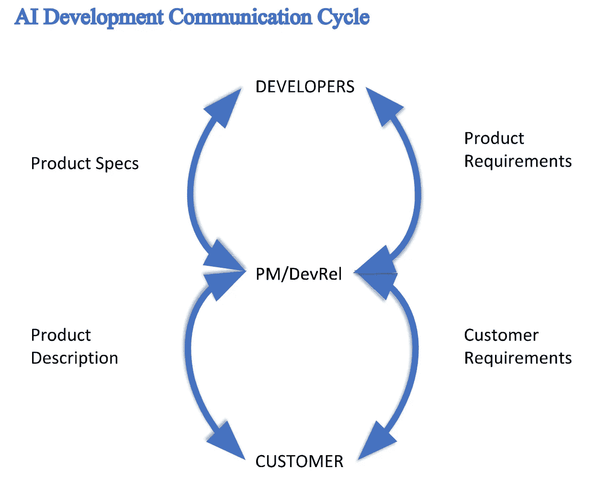
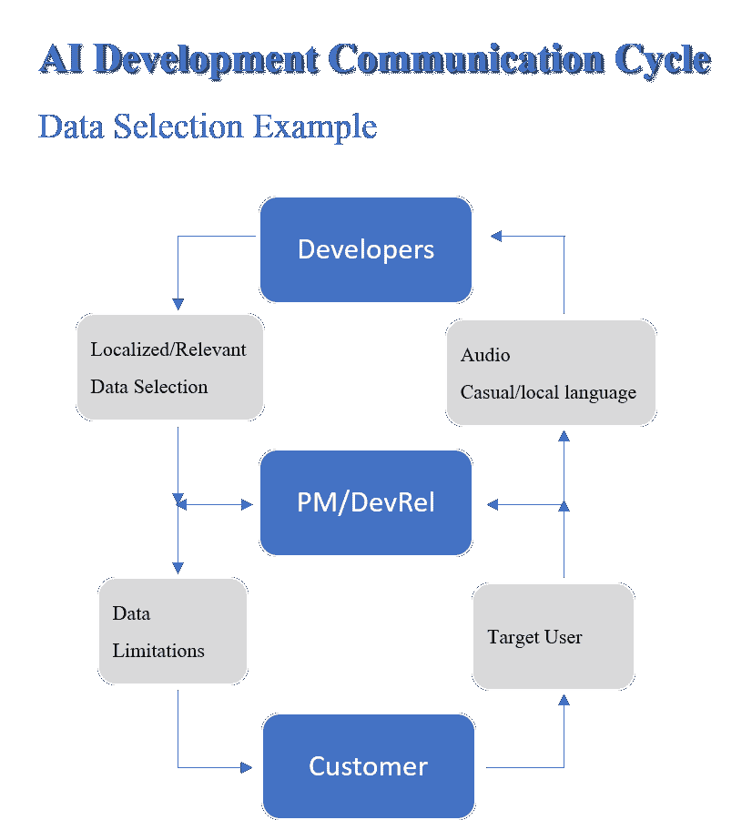
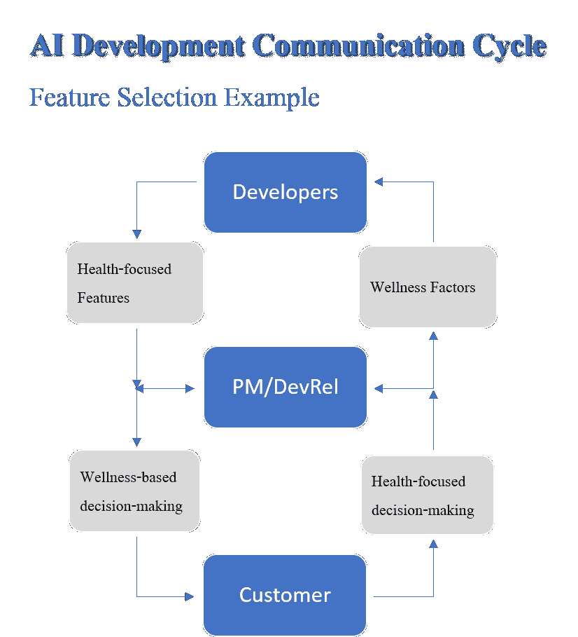
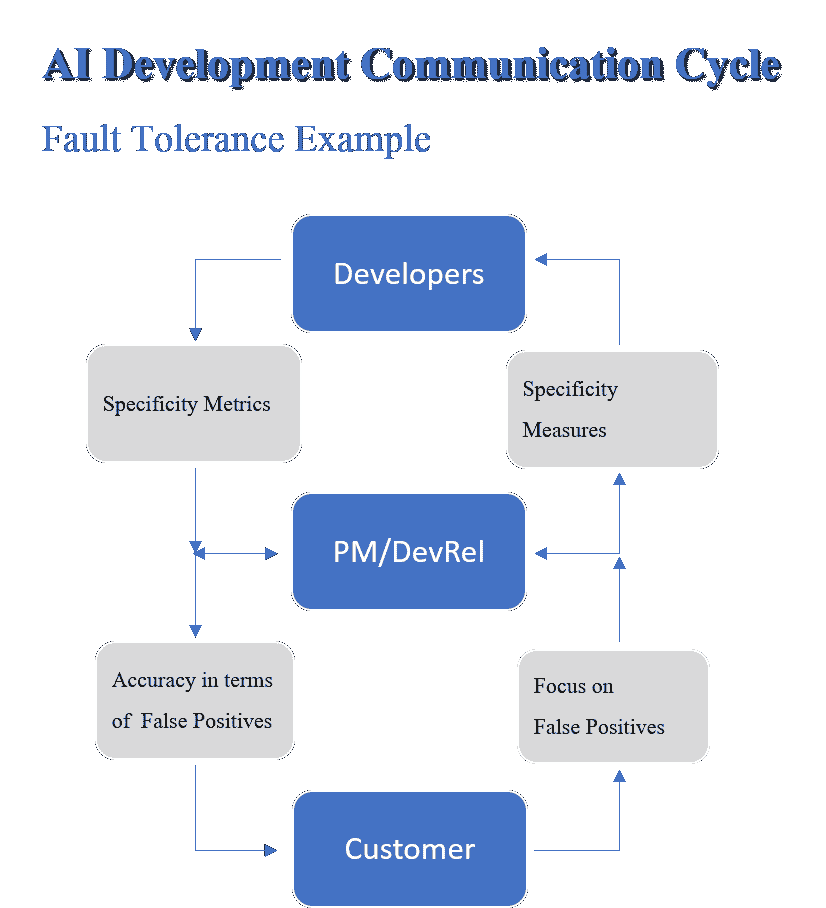

# 如何确保你正在设计的人工智能适合它的用途(第 1 部分)

> 原文：<https://pub.towardsai.net/how-to-ensure-the-ai-you-are-designing-is-fit-for-its-purpose-part-1-48660f03a822?source=collection_archive---------2----------------------->

## [人工智能](https://towardsai.net/p/category/artificial-intelligence)，[产品管理](https://towardsai.net/p/category/product-management)

负责任的人工智能的核心原则之一是确保模型适合其目的，并将限制传达给利益相关者。[ [1](https://ai.google/responsibilities/responsible-ai-practices/) ]这个宗旨可以分解成一个相互关联的沟通循环:

人工智能开发交流周期图解

为了让开发人员创建符合客户目的的负责任的人工智能，他们不仅必须理解应用程序要完成什么，还需要知道*应用程序如何*完成这些目标。客户不仅需要分享应用的基本功能集，还需要分享应用所在行业/公司的具体价值观及其使用环境，以及这些行业设定的任何界限。开发人员和客户之间的接口角色，特别是产品管理(PM)和开发人员关系(DevRels)，非常适合将这些非技术术语转化为相关的需求。特别是关于数据集需求、感兴趣的特征类型以及客户/行业的故障类型和容差的要求。

客户需要了解已经创建的应用程序，以便负责任地使用人工智能。开发人员不仅需要分享应用程序和培训材料，还需要分享创建应用程序时使用的假设以及数据集的限制。PMs 和 DevRels 非常适合将这些技术输出转化为客户友好的术语。具体来说，这些角色可以向客户传达应用程序的假设和限制如何与客户提供的上下文、价值和边界相关联。

我们将通过检查三个用例来更深入地探索这一过程，在这三个用例中，这种通信周期的使用将极大地影响人工智能应用程序的适用性。

# 数据选择

NLP/NLU 的目的是教机器像人类一样说话。但是人类是怎么说话的呢？假设我们用于训练的数据和用于训练的模型是普遍适用的。但是很明显，所有的人类都不会说同一种语言。即使我们在技术上讲同一种语言，我们也有无数种不同的表达方式。

目前，我们训练模型的方式很大程度上与我们学习自己的方式相同，使用正式语言:正式文档、古典文学、维基百科、电子邮件。如果你和任何在正式场合学过第二语言的人交谈，他们可能会告诉你，他们在国内使用这种语言时学到的第一件事是，他们很少遇到他们所学语言的版本。我们参与的大多数谈话都没有学校里教的那么正式。此外，文学和写作导师会告诉你，你在一般对话中使用的语言版本和你用来写作的语言是非常不同的。口语和书面语的正式程度有很大的不同。

那么这对 NLP 有什么影响呢？NLP 模型传统上是在正式的书面语言上训练的。正式的讲话可能适用于商业用途的应用程序(呼叫中心、聊天机器人等)。).但是如果预期的使用将会遇到大多数口语化的单词或非正式的句子结构呢？例如，如果该应用程序旨在对 911 电话进行分类，或者在刑事案件中执行法律转录。在这些环境中使用的语言类型和水平往往比目前培训的模型要不正式得多。还有地方注入的差异。口语改变了单词的形态:“就像，快结束了，所以我就像，我要走了。”语法也可能明显不同:“他不在附近”，“他来告诉我要拿走电视”。"[ [2](https://pdfs.semanticscholar.org/fafe/18a459472c647d882017bab2febf499335c0.pdf) 一个没有根据包含这种语言结构的数据进行训练的模型在实践中会失败，可能会让普通公民失去生命或生计。

# 整合人工智能开发交流周期

人工智能开发交流周期的使用将如何促进用于 911 呼叫分类的 NLP 应用程序的创建？该流程从客户分享应用程序的使用环境开始，即应用程序的目标用户:

人工智能开发交流周期图解—针对数据选择示例进行了修改

911 应用程序的目标用户是处于巨大压力下的当地社会成员。PM/DevRel 角色将把目标受众的环境转化为需求。具体来说，开发应用程序时使用的数据需要以音频形式出现，并且应该尽可能地融入非正式语言和当地语言。

这将通知开发团队在可访问的音频数据集中搜索具有大量口语或非正式语言的数据子集，最好是类似的语言环境。如果无法找到重要的数据，该团队可以寻找技术方法来增强神经网络，以尝试解决数据缺乏多样性的问题。[ [3](https://svivek.com/research/publications/li2019augmenting.pdf)

一旦应用程序令人满意地满足了产品需求，开发团队将与 PM/DevRel 分享他们为应用程序开发选择本地化数据所做的努力。然后，PM/DevRel 将通过解释数据中的限制，将这些努力转化为客户，让客户决定该应用程序是否适合在他们所在的地区接听 911 电话。

# 特征选择(保健预测算法)

最近发现，一个被广泛使用的医疗保健预测算法对少数民族患者有明显的偏见。该算法的任务是“识别严重疾病风险最高的患者”，并发现“与同样患病的黑人相比，白人患者更有可能获得额外的医疗关注。”[ [4](https://www.reuters.com/article/us-health-administration-bias/widely-used-healthcare-algorithm-racially-biased-idUSKBN1X32H8) 根本原因很容易确定。在定义“疾病”特征时，开发人员选择利用最容易获得的数据:医疗保健支出。很明显，这个决定与医疗保健行业的价值观不一致。一旦发现不一致，解决方法就很简单了——更新算法，根据健康相关数据定义“疾病”。

# 整合人工智能开发交流周期

人工智能开发交流周期的使用会如何促进一个更公平的应用程序的创建？该流程始于客户分享业内决策的可接受因素:

人工智能开发交流周期图解—针对功能选择示例进行了修改

医疗保健行业重视循证决策。[ [6](https://www.ncbi.nlm.nih.gov/pmc/articles/PMC3270906/) ]这从根本上要求以健康为重点的数据作为决策过程的核心输入。PM/DevRel 角色将把这个行业标准转化为需求。具体来说——“疾病”特征必须基于患者健康数据。

这将通知开发团队在开发他们的模型时选择或设计与健康相关的特征。一旦应用程序令人满意地满足了产品需求，开发团队将与 PM/DevRel 分享他们在应用程序中利用的功能以及这些功能背后的数据。然后，PM/DevRel 将通过解释支持算法决策的健康相关指标，将这些努力转化为客户，让客户决定该应用程序是否适合进行医疗保健预测。

# 容错(COMPAS)

COMPAS 是一种风险评估算法，主要用于指导成人矫正人群的安置决策。[ [7](https://www.equivant.com/practitioners-guide-to-compas-core/) 它是当今刑事系统中使用的最大、最普遍的风险需求评估产品。2011 年，当“首席法官会议和州法院行政人员会议批准了一套将风险和需求评估信息纳入判决的原则”时，其使用范围扩大到刑事判决过程。[8]然而，使用 COMPAS 作为刑事判决建议在法庭上受到质疑，[9]一项广为流传的研究表明，COMPAS 算法对黑人被告有偏见。[ [10](https://www.propublica.org/article/machine-bias-risk-assessments-in-criminal-sentencing)

法律从公平的角度来衡量准确性，这需要与开发人员使用的校准不同的校准。当谈到人身保护令状这一质疑监禁合法性的宪法权利时，Harlan 大法官将其目的定义为“首先，确保没有人被监禁在一个造成无辜者被定罪的不可允许的巨大风险的程序之下……”[11]COMPAS 从准确性、公平性和预测均等性方面评估了其算法的准确性。[12]但是这种软件正被用于判决，而判决是“受不同的指导原则支配的”。[13]

# 整合人工智能开发交流周期

人工智能开发交流周期的使用会如何促进一个更公平的应用程序的创建？该流程从客户分享行业容错能力开始:

人工智能开发通信周期图解—针对容错示例进行了修改

法律行业的容错侧重于最小化误报。这意味着对特异性的关注。PM/DevRel 角色将把这个行业标准转化为需求。具体来说，应该使用特异性测量来测量应用程序的准确性。

这将通知开发团队在评估他们的模型时查看负比率，并结合以特异性为重点的指标，如预测平等[[15](https://www.mckinsey.com/industries/public-sector/our-insights/when-governments-turn-to-ai-algorithms-trade-offs-and-trust)或平等机会分类器[16]来测量准确性。一旦应用程序令人满意地满足了产品需求，开发团队将与 PM/DevRel 共享他们用来评估应用程序准确性的指标。然后，PM/DevRel 会通过解释这些指标如何评估误报，将这些指标翻译给客户，让客户决定该应用程序是否适合做出保释决定。[17]

# 结论

在开发符合其目的的负责任的人工智能方面，每个团队都有自己的角色。[ [18](https://www.euractiv.com/wp-content/uploads/sites/2/2020/01/AI-white-paper-EURACTIV.pdf) ]开发团队的角色是在创建产品时考虑客户和行业特定的需求——选择和开发数据集、选择和设计功能、确定准确性指标，以及其他任务。开发团队的任务还包括向客户解释清楚产品的限制和假设。客户有责任确保他们了解如何使用应用程序、应用程序的预期使用环境及其局限性。客户还需要使用这些信息来确定交付的应用程序是否符合其预期目的。PMs 和 DevRels 可以在将部署环境和行业/公司价值和界限转化为工程团队的技术术语方面发挥关键作用。他们还处于独特的位置，以业务用户和非工程利益相关者可以理解的方式传达来自工程团队的技术信息。因此，使客户能够确定开发的应用程序是否适合其预期目的。

本系列的第 2 部分将介绍制定人工智能开发沟通周期的初始问题框架——[客户与项目管理沟通](https://medium.com/towards-artificial-intelligence/how-to-ensure-the-ai-you-are-designing-is-fit-for-its-purpose-part-2-d6dca5391643)。

# 脚注

[1][https://ai . Google/responsible/responsible-ai-practices/](https://ai.google/responsibilities/responsible-ai-practices/)

[2] [机器翻译与白话:解读非正式](https://pdfs.semanticscholar.org/fafe/18a459472c647d882017bab2febf499335c0.pdf)；诺拉·田 2016 年 12 月 15 日

【3】[用一阶逻辑扩充神经网络](https://svivek.com/research/publications/li2019augmenting.pdf)；李涛，Vivek Srikumar 2019 年 6 月 14 日

[4]琳达·卡罗尔。[广泛使用的医疗保健算法带有种族偏见](https://www.reuters.com/article/us-health-administration-bias/widely-used-healthcare-algorithm-racially-biased-idUSKBN1X32H8)。路透社:健康新闻。2019 年 10 月 24 日。

[5]穆莱纳坦，森迪尔。有偏见的算法比有偏见的人更容易修复。纽约时报:经济观点。2019 年 12 月 8 日。

[6]拉派格，韦罗尼克。[全球化背景下的循证决策:卫生保健组织领导者和管理者的“为什么-什么-如何”](https://www.ncbi.nlm.nih.gov/pmc/articles/PMC3270906/)*风险管理和医疗保健政策*第 2 卷(2009):35–46。土井指数:10.2147/RMHP。S4845

[7](2019 年 4 月)。[COMPAS Core 从业者指南](https://www.equivant.com/practitioners-guide-to-compas-core/)。诺斯波因特公司。

[8] "COMPAS 是一个计算机化的、经过统计验证的风险需求评估(RNA)系统，用于支持关于罪犯安置、监管水平和改造方案的刑事司法决策。因此，它与法院、缓刑、假释、社区矫正和其他矫正机构特别相关。”(2015 年 3 月)。Brennan，Ilarraza，A. [联系要点:用风险-需求-责任原则支持基于证据的量刑决定](http://equivant.wpengine.com/wp-content/uploads/EBP_RNR_Whitepaper_FINAL.pdf)。诺斯波因特公司。

[9] *州诉卢米斯*。西北区 881 号 749。(Wis. 2016)。

[10](2016 年 5 月)。Angwin，j .、Larson，j .、Mattu，s .、Kirchner，L. [机器偏差](https://www.propublica.org/article/machine-bias-risk-assessments-in-criminal-sentencing)。支持公共事业。

[11]蒂格诉莱恩，美国最高法院判例汇编第 489 卷，第 288 页(1989 年)第 312 页。

[12]“如果一个风险量表能够对两个不同的群体，如黑人和白人，同样好地区分惯犯和非惯犯，那么它就能表现出准确性和公平性。风险等级展示了*预测奇偶校验*例如，如果分类器对两个不同的群体(如黑人和白人)获得了相似的预测值，在给定高风险分数的情况下，黑人和白人的复发概率是相似的。”【着重号后加】(2016 年 7 月)。Dieterich，W. Mendoza，C. Brennan，T. [COMPAS 风险等级:证明准确性、公平性和预测均等性](http://go.volarisgroup.com/rs/430-MBX-989/images/ProPublica_Commentary_Final_070616.pdf)。诺斯波因特。

[13]同上。

[14](2018 年 5 月)。维尔马，s，鲁宾，J. [公平定义解释](https://doi.org/10.1145/3194770.3194776)。在 Fair-Ware'18: IEEE/ACM 软件公平性国际研讨会上，2018 年 5 月 29 日，瑞典哥德堡。美国纽约州纽约市 ACM，7 页。

[15](2019 年 2 月)。当政府转向人工智能:算法、权衡和信任。麦肯锡公司。

[16]“如果违约者是少数民族，平等机会分类确实使他们更容易获得贷款，但激励措施是恰当地结合在一起的。在利润最大化的情况下，一个小群体可能不值得去弄清楚如何分类，因此受到不公平的对待，因为分类器不能识别合格的个体。在机会均等的情况下，这种分类差的群体反而比分类好的群体受到更好的待遇。因此，成本由使用分类器的公司承担，它可以决定投资于更好的分类，而不是被分类的集团，后者不能。”(2016 年 10 月)。Hardt，m .，Price，e .，Srebro，N. [监督学习中的机会均等](https://ttic.uchicago.edu/~nati/Publications/HardtPriceSrebro2016.pdf)。

[17]“量刑决定受正当程序保护的指导，这种保护可能不适用于许多普通的教养决定。这种区别非常重要，因为风险和需求评估工具是为惩教部内部人员设计的，而且这种设计正在向受不同指导原则管辖的判决场所过渡。”卢米斯西北 881 街 41 号。

[18] [人工智能白皮书的结构——欧洲的方法](https://www.euractiv.com/wp-content/uploads/sites/2/2020/01/AI-white-paper-EURACTIV.pdf)。欧洲委员会。*截至 2012 年 12 月的草案。*