# 如何使用 Google Sheets 和 Apps 脚本在 Tableau 中提取和可视化 YouTube 数据

> 原文：<https://pub.towardsai.net/how-to-extract-and-visualize-youtube-data-in-tableau-using-google-sheets-and-apps-script-e77dac3cfc8b?source=collection_archive---------2----------------------->

## [数据可视化](https://towardsai.net/p/category/data-visualization)

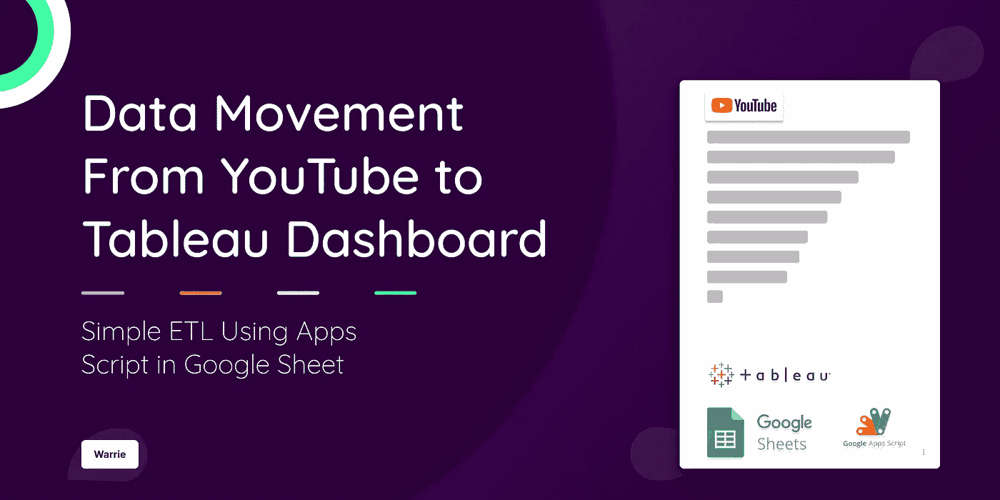

作者图片，灵感来自[普拉内·阿加瓦尔@普拉内 _ 设计](https://www.figma.com/@pranay_design)

数字数据收集很有趣，那么收集你看的和喜欢的东西呢？

想象一下这样一个场景，您想要跟踪您最喜欢的 YouTube 频道的详细信息。这些细节可以包括订户数量、观看次数和最近的视频日期。更进一步，您可能希望将这些细节保存在方便的地方，大概是保存在一个简单的文本文件中，并且希望每隔一段时间更新一次。
那么，你如何以一种简单的方式做到这一点呢？

在本文中，您将学习如何使用 Google Apps 脚本将 YouTube 频道中的数据提取到 Google Sheets 中，然后使用 Tableau 显示这些数据。

# 背景

## Google 应用程序脚本

[Google App Scripts](https://developers.google.com/apps-script/overview) 是一个低代码的云服务平台，允许用户毫不费力地扩展 Google 产品的功能，还允许跨这些平台的交互，而不需要软件开发过程中的大量知识。App Script 使用 JavaScript、HTML、CSS 等流行的编程语言来构建服务。

app script 还有其他扩展功能，但我们的重点将是使用 app script 以编程方式与 Google Sheets 进行交互，作为从 YouTube 自动输入数据的一种方式。

## （舞台上由人扮的）静态画面

大多数数据分析师可能听说过 Tableau，这是一个可视化交互平台，有一个优秀的、令人兴奋的社区。在本文中，我们将使用 Tableau Public，这是一个允许您在线发布数据可视化的免费平台。Tableau 将通过连接到其平台上的 Google Sheets 连接器来可视化我们的最终数据。

让我们开始吧，但首先是你需要知道的。

# 先决条件

*   一个谷歌[账户](https://accounts.google.com/SignUp?hl=en)，用于访问谷歌表单和应用程序脚本。
*   一个 Tableau public a[account](https://public.tableau.com/s/)和 [Software](https://public.tableau.com/en-gb/s/download) ，如果你还没有的话。
*   初学者的 JavaScript 知识没问题。
*   谷歌云平台账号。

现在你已经知道需要什么，让我们开始行动的步骤。

# 编辑一个 YouTube 频道 id 列表

在开始构建之前，您需要有一个 Youtube 频道 id 列表。这个 ID 对于一个通道是唯一的，将用于从 API 中提取通道的详细信息。

为此，您必须在新的 Google 表单中手动填充您喜爱的频道列表。该信息不必包含信道的实际名称。填充这些名称的本质是获得目标 YouTube 频道的高级视图；然后，对于每个名称，搜索它们各自的 url_id。

创建一个名为*“最受欢迎的 Youtube 喜剧演员”*的新谷歌表单

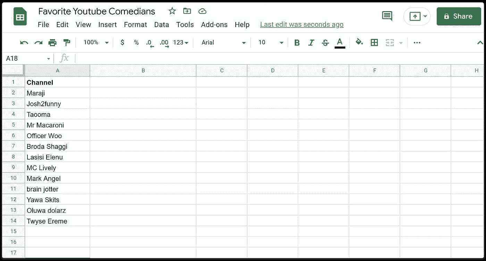

YouTube 频道名称列表(图片由作者提供)

## 获取频道 ID

这一部分处理获取与帐户相关联的惟一 ID。每个频道在其 URL 中都有一个唯一的 ID。

在 YouTube 的[上，搜索填充的频道名称，在返回的视频列表中点击频道名称，并从 URL(](http://youtube.com)[https://www.youtube.com/channel/UCfvmvOEGw6Nqd6E9qMryE3A](https://www.youtube.com/channel/UCfvmvOEGw6Nqd6E9qMryE3A))复制 ID。

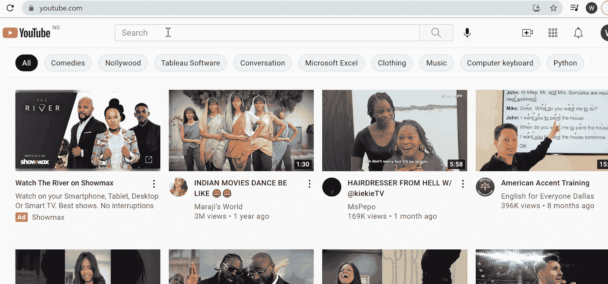

*搜索频道名称并从 YouTube URL 复制 ID*(图片由作者提供)

之后，创建一个新的列—**Channel ID**——并将 ID 粘贴到与通道所在行相关的单元格中的列下。确保对每个通道都这样做。

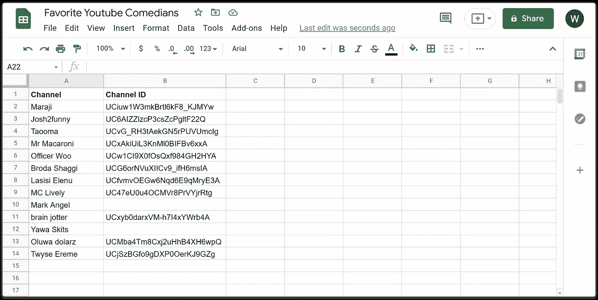

频道名称及其 ID(图片由作者提供)

相反，你会注意到一些 URL 不同于传统的基于 ID 的 URL。这些频道的 URL 使用 youtube 传统用户名，并且不在 URL 中暴露它们的 id；因此，提取通道的 ID 需要不同的技术。

使用旧用户名 URL 的频道(图片由作者提供)

为了解决这个问题，您将利用 Youtube 数据 API

*   从 URL 中复制频道的用户名。比如在 URL-[*https://www.youtube.com/user/MarkAngelComedy*](https://www.youtube.com/user/MarkAngelComedy)中，用户名为***markangelcomyce***。
*   在浏览器中导航至 [Youtube API](https://developers.google.com/youtube/v3/docs/channels/list) ，从 YouTube API explorer 中检索频道 ID。确保您已经使用 Google 帐户登录。
*   点击 API 网页上的`list (by YouTube *username*)`。
*   将***Google developers***替换为右侧面板标题为 **Try this API** 的`forUsername`文本框中的渠道用户名。

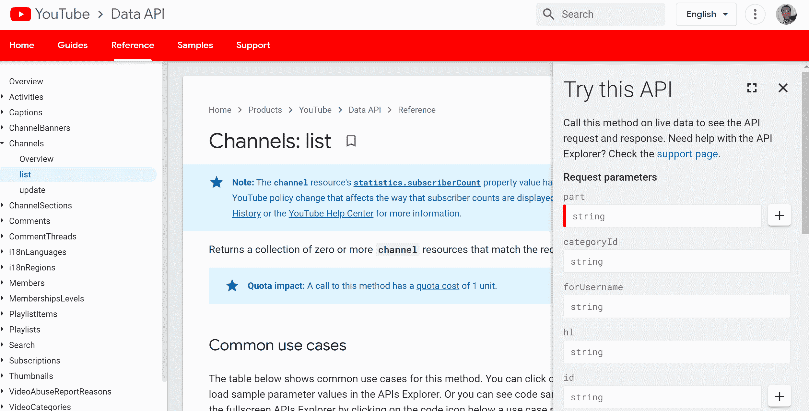

从 Youtube API 提取频道 ID(图片由作者提供)

之后，点击面板底部的**执行**按钮。此操作将要求您验证您的 Google 帐户，并授予访问 YouTube API 的权限。一旦授权访问，就会显示 API 的响应，如上图，从中可以得到 JSON 值`id` > `items`下的通道 ID。

对于这种场景下的后续频道，您只需替换`forUsername`文本框中的用户名，然后运行**执行**命令，之后您就可以复制 ID 并将其粘贴到您的 google sheet 中。

当然，在这个过程完成时，您现在在一个列中有了完整的通道 id 列表。

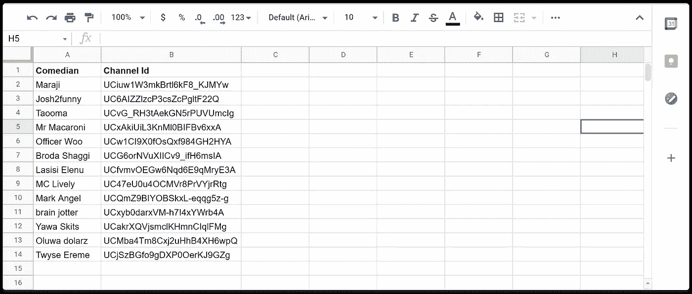

完整的频道 id(图片由作者提供)

# Google AppScript 设置

## 步骤 1:访问谷歌应用程序脚本

现在您已经在电子表格中拥有了所有的渠道 id，您将不得不访问绑定到 google sheet 的 apps 脚本。这个编辑器将促进 Youtube 和工作表之间的数据交互。

*   点击表单菜单栏中的**扩展>应用程序脚本**编辑器。该操作将创建一个新的脚本项目，并在 app 脚本编辑器界面上实例化一个文件 **code.gs** 。该界面看起来像常规的代码编辑器，但这一次，它运行在云平台上，并从 google sheet 实例化。也可以在函数中编写代码，并将其存储在单独的文件名中。
*   重命名您的项目名称。在脚本编辑器的左上方，将其从“**无标题项目**”更改为“**最喜爱的 Youtube 频道**

应用程序脚本项目重命名(图片由作者提供)

## 步骤 2:设置 Youtube 服务

Apps script 提供了内置的 google 服务，因此由于您需要 YouTube 频道的详细信息，您将需要 YouTube 数据 API 服务来将数据拉入工作表中。
在 Apps 脚本中启用此 YouTube 服务；

*   点击左侧面板中的**服务< >** 。
*   选择 **YouTube 数据 API v3** 并点击**添加**。

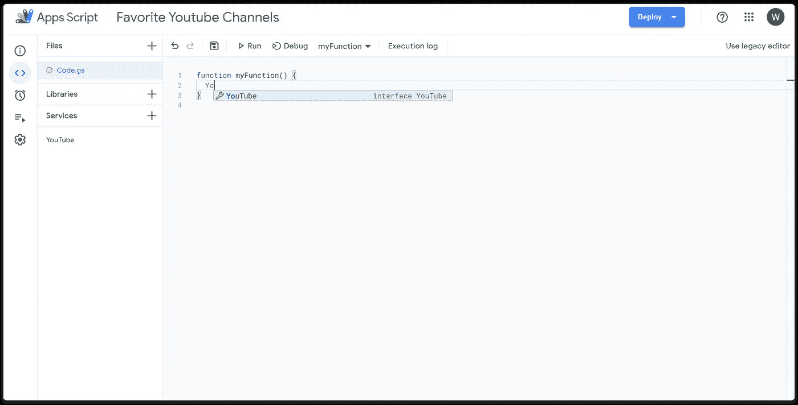

显示 YouTube 服务可用性的自动建议(图片由作者提供)

完成后，您就可以访问 Youtube 数据服务了，如上图所示。在下一节中，您将经历使用这个接口将数据从 Youtube API 提取到表单中的过程。

# 数据析取

完成上一节中的设置后，您就可以用 javascript 编写代码来从 YouTube 频道中检索详细信息了。
在本文中，您将提取以下渠道详情:

*   标题
*   出版日期
*   订户数量
*   视图计数:累积的视图总数
*   视频计数:上传的视频总数。
*   视频上传播放列表 Id
*   上次上传日期
*   收视率最高的视频标题
*   观看次数最多的视频

为了实现这些目标，你必须采取以下行动。但是首先，创建 9 个标题，指定您将提取到工作表中的详细信息的列。

频道详细信息的标题(作者图片)

以下是如何提取这些细节的概述；

1.  从工作表中读取频道 id。
2.  使用 IDs 从 Youtube API 提取数据。
3.  将数据写入工作表。

随后将详细解释这些功能及其执行。

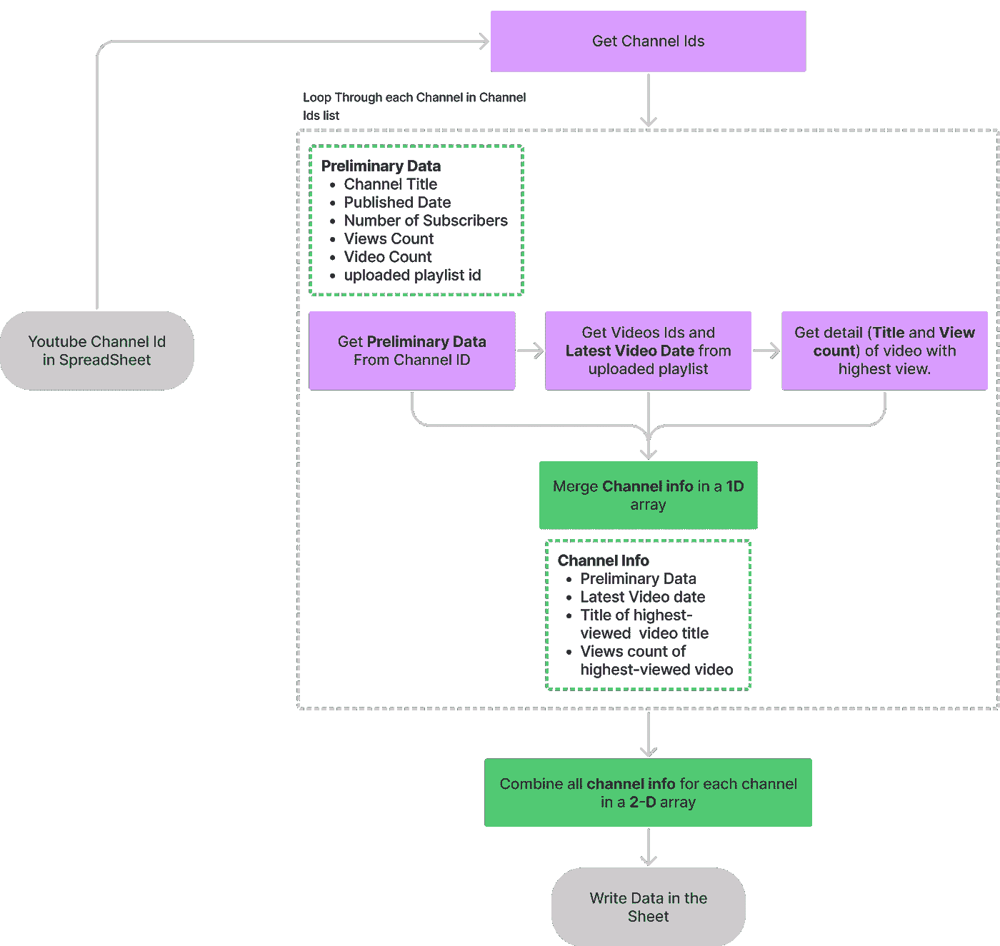

数据提取过程(图片由作者提供)

## *从表单中读取频道 id*

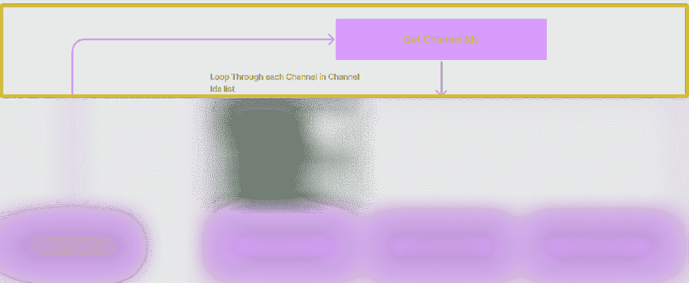

(图片来自作者)

在这一节中，您需要构建一个函数`getChannelID()`。该函数将工作表中的 id 检索到 Apps 脚本中。请注意，id 将用于检索频道的详细信息。

在编辑器中，用下面的代码替换`function myFunction(){}`:

稍后，我们将解释每个代码的功能。暂时，
保存脚本，点击菜单栏上的**运行**按钮。这将把您重定向到一个页面，以验证您的 google 帐户，并授予对您的 Google 帐户的脚本信息访问权限。一旦您接受了该流程，您的操作结果将显示在下面。

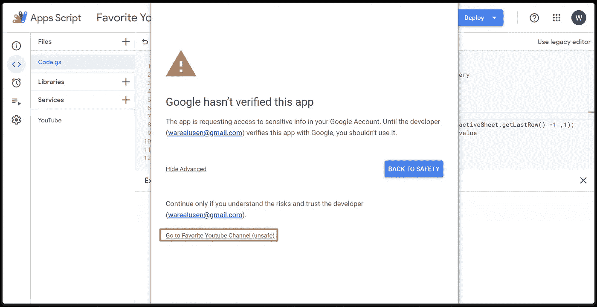

应用程序脚本中的谷歌认证页面(图片由作者提供)

在响应提示中，您不必担心安全性，因为脚本是由您创建的。但是在访问您不了解的脚本时要小心。
要继续，点击 ***转到喜爱的 Youtube 频道(不安全)***

一旦您的帐户验证完成，您现在可以在编辑器中重新运行该功能。

回到解释代码片段。
在这个代码片段中，我们实例化了来自 S [preadsheet 服务](https://developers.google.com/apps-script/reference/spreadsheet/)的类`SpreadsheetApp.getActiveSpreadsheet()`——一个内置的 Google 库，允许访问和操作我们当前的电子表格。在我们的例子中，工作表是 *Sheet1* ，电子表格是*最喜欢的 YouTube 喜剧演员。* —不要混淆[电子表格和](https://www.computerhope.com/jargon/s/spreadsheet.htm)工作表之间的区别。

之后，我们使用方法`getSheetValues()`访问工作表中通道 id 所在的范围，该方法接受 4 个参数`(startRow,startCol,numRow,numCol)`，描述要检索的值的范围。
该函数的结果是一个二维数组中的所有频道 id。
你可以用`console.log(col_channel_ids)`代替`return col_channel_ids`函数来打印出二维数组中的数据结果。

要运行代码，请在菜单栏中选择函数名，然后单击 run 按钮。

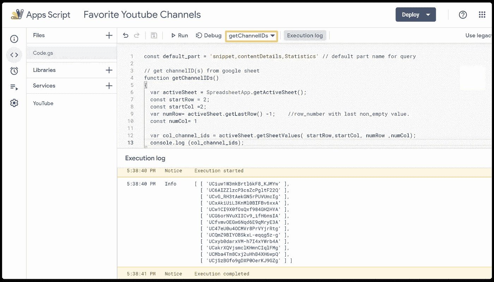

应用程序脚本中的频道 id(图片由作者提供)

## *从通道 ID* 获取数据

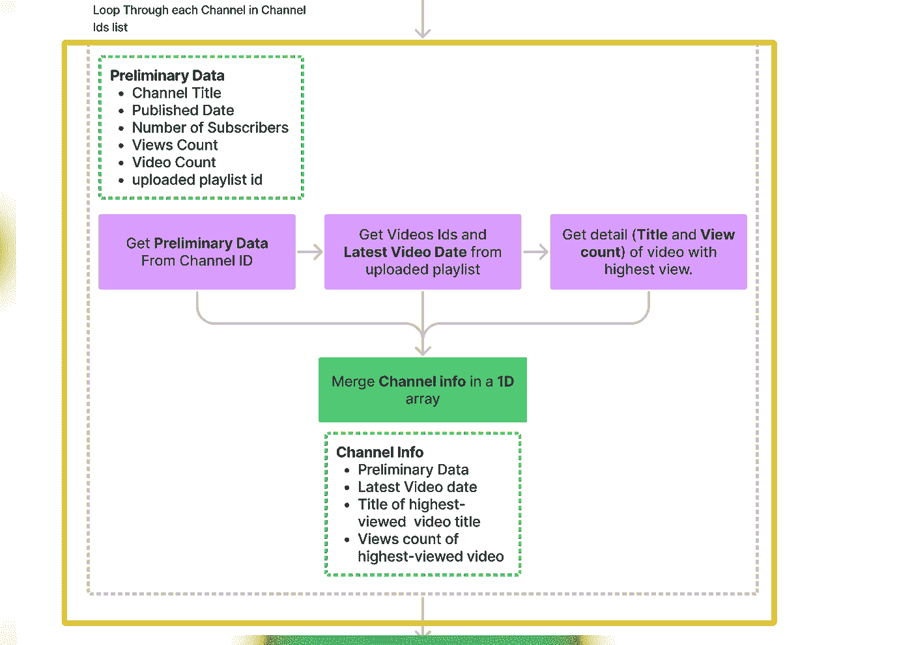

数据提取过程(图片由作者提供)

现在，我们已经可以访问应用程序脚本上的频道 ID，下一个动作是查询 YouTube 库，以获得第一组细节——`*Title*`、`*Published date*`、`*View Count: Total number of views accumulated*`、`*Video Count: Total number of videos uploaded*`和`*Video Uploaded Playlist Id*`——这些细节将从 Youtube 服务
中的`channels.list()`方法获得。首先，创建一个名为`getDataFromChannelID()`的函数，并包含下面的代码片段；

从代码片段来看，这个函数接受两个输入参数，`part`和`channelID`，并返回关于通道的具体细节。它使用`Youtube.Channels.list()`方法获取通道的数据。

在第 18-25 行；因为来自 API 的响应是以 JSON 的形式出现的，所以我们对输入中指定的部分参数进行索引，以获得我们感兴趣的响应。part 参数表示需要从 API 返回的信息的类别。在这个场景中，我们需要 API 中嵌套在`snippets`、`statistics`和`contentDetails`下的信息。输出是所有初步数据细节的数组。

getDataFromChannelID 的示例响应(图片由作者提供)

## 检索视频详细信息

需要从频道获取的下一组信息与视频细节有关:`Last Upload Date`、`Highest-Viewed Video Title`和`Number of views for the highest-viewed video.`、
要获取这些信息，您需要使用视频 id 访问频道中的所有视频，通过视频 id 可以检索视频细节。

在 app 脚本和代码部分，这将涉及以下步骤:

1.  获取频道中与视频上传相关的播放列表 ID。
2.  使用播放列表 ID 检索所有上传的视频 ID 和上次上传日期。
3.  使用视频 id 检索观看率最高的视频细节。

**检索所有上传的视频 ID 和最后上传日期**
上传的播放列表 ID 已经在前面的部分中检索过了，因此您将使用该值来获取每个频道中所有上传的视频的 ID 和最后上传日期。该函数在下面的代码片段中实现。

从上面可以看出，该函数将上传的播放列表 id 作为输入参数。关于代码的更多内容解释如下:

在函数体中，该函数查询方法`Youtube.PlayListItems.list()`，并使用 while 语句遍历频道上传的播放列表中的视频列表，仅在该方法中没有更多页面可查询时停止，这由变量`nextPageToken`跟踪。

在迭代中，首先记录位于第一页查询结果顶部的`Last Upload Date`。

之后，在第 27 行，由于方法`Youtube.PlayListItems.list()`逐页返回视频内容列表，我们使用 map 函数从每个页面提取内容，然后索引到第 28 行的响应中，以获得`video IDs`，这些内容随后被追加到一个数组中。

最终结果是一个包含所有`video IDs`和`Last Upload Date`的数组。

视频 id 数组和最后上传日期(图片由作者提供)

**使用视频 id**
检索观看率最高的视频细节在获得上一节中的视频 id 后，您将在本节中计算剩余的视频细节— `Highest-Viewed Video Title`和`Number of views for the highest-viewed video`。

创建功能`getHighestViewedFromID().`

这个函数接受一个视频 id 列表，一次遍历 50 个 id，并检索它们的视频细节。每次调用 50 次检索的本质是减少对 API 的查询次数。

这是要点。我们正在尝试使用服务 API 方法`YouTube.Videos.list()`检索每个视频的观看次数。每次查询到 API 成本 [1 单位](https://developers.google.com/youtube/v3/docs/videos/list)。然而，针对单个视频细节点击一次 API 的成本与针对多个视频细节的成本相同。因此，我们批量检索视频细节，以获得最佳的单位费用。
即使有这种多重检索功能，每次调用最多允许检索 50 个视频。这就需要拆分视频 id 列表，并为单个查询实例以 50 个为一批来检索它们的详细信息。

不过，在迭代中，第 23 行，您可以看到我们通过索引响应的`snippet`部分中的`title`和响应的`statistics`部分中的`viewCount`获得了感兴趣的信息；表示视频名称和视频被观看的次数。
有了这个 now，才能获得最受关注的视频细节；该数组按照视图数量降序排序，如第 28 行所示，第一个元素被弹出。这个场景中的第一个元素是一个数组，其中包含了观看次数最多的视频及其观看次数。

完成此操作后，您现在已经检索到了所有需要的数据。下一个调用点将需要将这些数据写入表中。

## 将数据写入工作表

这是将我们的数据存储到 Google sheet 中的最后一个帮助函数。将数据推送到工作表需要利用电子表格库方法`getActiveSpreadsheet()`。如代码片段所示，

该函数接收最终结果:一个二维值数组。它利用接受 4 个参数的`getRange()`函数将数据存储在工作表中，其中第 3 个参数表示行数，即通道数，第 4 个参数指定二维数组中某项的长度——列数/通道细节。

## 把所有东西放在一起

现在我们所有的管道和助手函数都准备好了，我们可以把所有的东西放在一起了。前面几节涉及到处理单个通道的助手函数。您将把事情整合到处理多个频道中，就像在我们的多个喜剧频道的用例中一样。

我们将使用一个名为`executeAll()`的函数。首先，使用在前面的[部分](#cfca)中创建的方法`getChannelIDs()`，以二维数组的形式从电子表格中检索所有频道 id。我们使用 map 函数遍历 id 列表。使用 map 函数，我们可以只调用一次数组中的每一项，并处理它以返回二维数组中的新值。

递归函数中的第一个动作从通道 ID 返回初步数据，这些数据是(`Title`、`Published date`、`Number of subscribers`、`number of views`、`number of videos`和`uploaded playlistID`)。

然而，在循环内部，第 7 行中的下一个动作从初始数据中提取出`uploaded playlist ID`，并将其传递给变量`uploaded_playlist_id`。然后，我们使用`uploaded_playlist_id`作为方法`getUploadedVideoIDs_LastDt()`的输入参数，检索视频 id 列表和最新上传日期。

下一个动作使用方法`getHighestViewedFromID()`中的`video IDs`来获取每个频道中观看率最高的视频的详细信息。

之后，所有需要的数据在一个二维数组中耦合在一起，该函数返回由`preliminary data`、`latest-upload date`、`highest_viewed_video_title`和`highest_viewed_video_count`组成的数据。

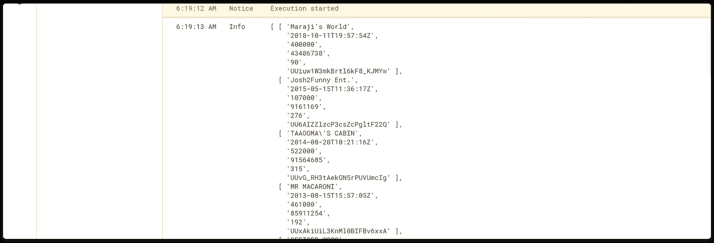

二维阵列中的样本响应(图片由作者提供)

最后，包含每个通道细节的二维数组数据被写入电子表格。

完整的代码片段

记得按以下顺序创建列标题:*标题、发布日期、订阅人数、总浏览量、总上传量、上传播放列表 Id、最后上传日期、最高观看视频和最高观看视频计数。*

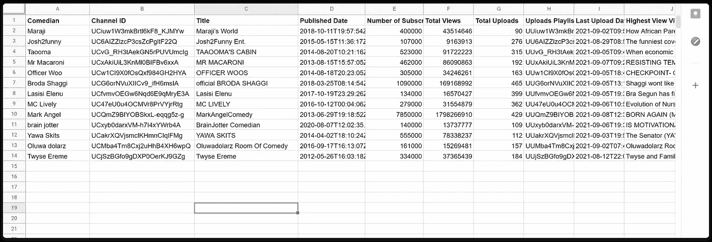

谷歌表单中的最终数据(图片由作者提供)

# 自动化数据提取

你现在在谷歌表单中有了我们的数据。我们的下一个需求点将涉及在特定时间段触发该数据的更新，这将通过应用程序脚本中的时间驱动触发器来完成。

[时间触发器](https://developers.google.com/apps-script/guides/triggers/events)是在特定时间触发事件的保留功能。在这个上下文中，事件是更新工作表中的数据；您希望每隔 12 小时定期进行一次该事件。

在应用脚本页面上，点击左侧面板上的`**Triggers**`按钮，如下图所示。

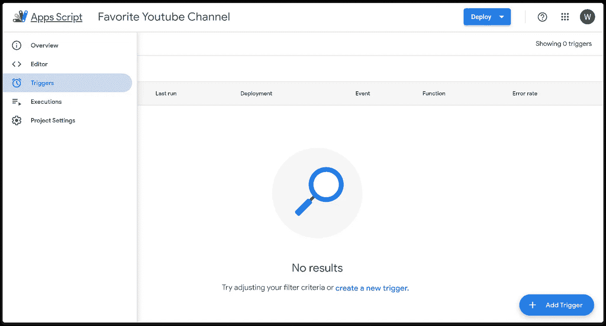

触发页面(作者图片)

完成此设置将涉及以下步骤:

*   点击按钮`Add Trigger`。该操作将打开提示页面，因此我们可以根据触发器填充这些值。
*   在文本`choose which function to run`下，选择`executeAll()`功能；它包含从工作表中提取数据所需的所有算法；其他函数是帮助主进程的辅助函数。
*   在`select event resource`上选择`Time-Driven`，
*   在`Select type of time-based trigger`下选择`*hour timer*`。然后选择小时间隔为每`12 hours`。

最后将`Failure notifiction settings` 设置为`Notify me immediately`。这将在您的代码出现问题时立即发送通知消息。请注意，此消息将被发送到您的 google 帐户的电子邮件中。
然后点击 ***保存*** 按钮。

保存后，触发器将从当前保存时间开始每 12 小时执行一次。在某些情况下，它从 12 点开始读取。

您可以选择以编程方式为提示页面上不可用的触发间隔创建自定义的时间驱动触发器。

# 数据可视化

最后一部分是在 Tableau 中创建一个简单的数据可视化。在这个演示阶段，您将把 Google Sheets 中的数据连接到 Tableau，并创建一个简单的条形图，显示视频上传数量最多的频道；以及`number of subscribers` vs `published date`之间的零散剧情。因此，这就是我们为实现这一目标将要做的事情。

## 将数据连接到 Tableau Public

在 Tableau public 上，点击***Google sheet connector***

*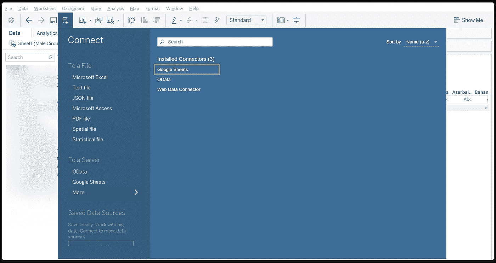*

*Tableau 中的 Google 工作表访问(图片由作者提供)*

*Tableau 将请求在您的浏览器中访问您的 Google Sheets，因此单击您各自的帐户并访问它。完成后，您将看到一个屏幕，通知您成功访问。*

*你可以安全地关闭，回到你的舞台上。*

*在屏幕上，你会看到一个谷歌表列表，选择一个是为这项工作创建的。然后点击下面选项卡上的 ***第 1 页*** 开始可视化。*

*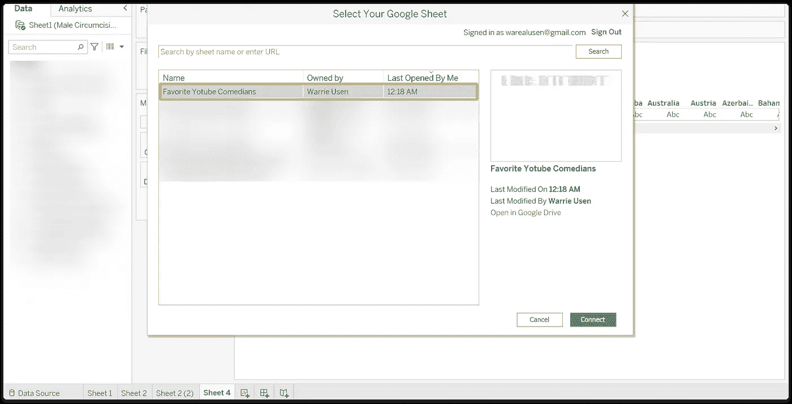*

*访问表(图片由作者提供)*

## *准备数据*

*请注意，在左侧面板上，您会看到图标`Abc`靠近表格面板中的变量名`Last upload Date`和`Published Date`。这意味着 Tableau 错误地将这些日期-时间变量检测为文本，因此我们必须将它们转换为日期-时间数据类型。*

*为此，我们将采取以下步骤:*

*   *选择`Last Upload Date`和`Published date`。*
*   *右键单击并选择**更改数据类型>日期&时间。***

*日期-时间列现在成功地处于其适当的数据类型中。*

## *变量可视化和格式化*

*在这一阶段，您将创建每个变量的图形表示。从一个简单的视频上传数量条形图开始。要做到这一点；*

*   *将左侧面板中的`*Total Uploads*`拖动到**列**中，将`Title`拖动到**行**中。*
*   *再次拖动`Total Uploads`到**标签卡中的**，**标记***

*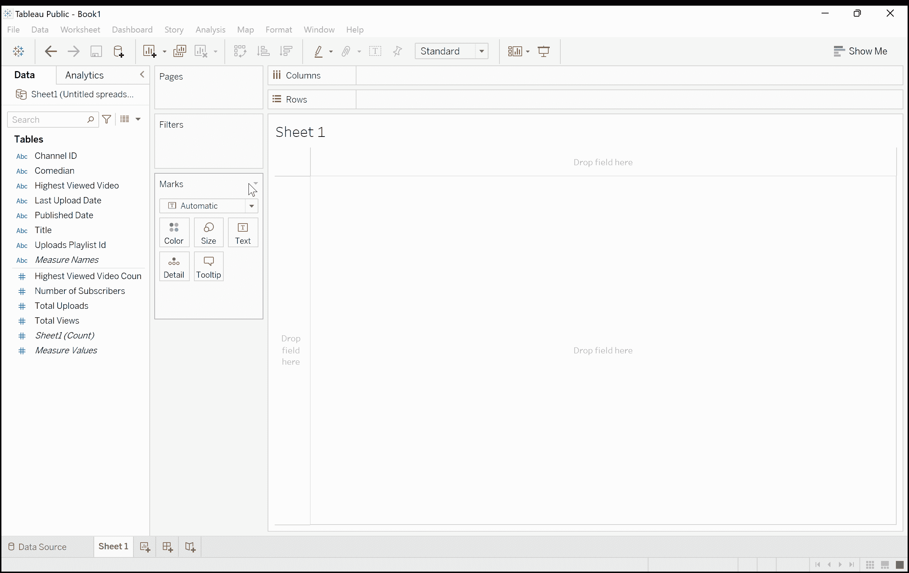*

*简单条形图(作者 gif)*

*为了进一步探索，您可以创建一个散点图来显示`Published date`和`Number of subscribers`之间的关系。*

*首先，打开一个**新工作表**；分别拖动`Published date`和`Number of subscribers`到**列**和**行**货架。*

*默认情况下，Tableau 将数据和时间变量聚合到年份。因此，您需要按天汇总`published date`,因为我们希望看到某个特定日期的关系。*

*接下来，右键单击**列**架中的`Published date`，并单击`select Day`，如下图所示。*

*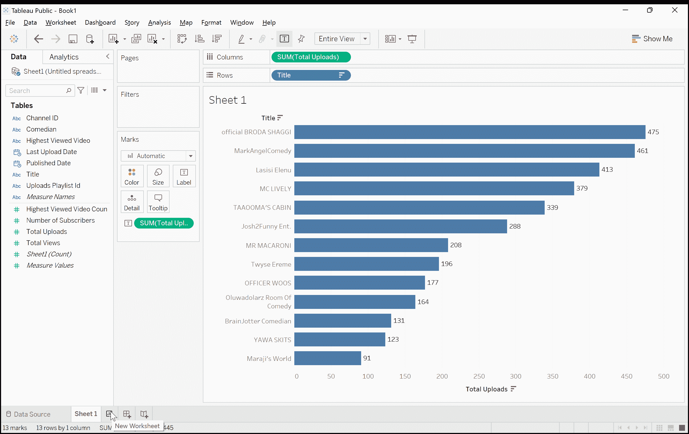*

*散点图(作者 gif)*

*在**标记**卡上选择**圆**然后拖动`Title`变量到**标记**。这将显示图表中每个圆圈的频道名称。*

## *仪表板创建*

*现在进一步创建一个包含两个构建图表的仪表板。*

*点击菜单栏上的**仪表盘>新建仪表盘**。
然后将条形图拖到仪表板的右侧面板，将散点图拖到左侧面板。
然后选择**尺寸**为**自动**。
要添加标题，右击顶部菜单栏中的仪表板，并选择`show title`。从那里，您可以删除标题，并根据您喜欢的标题名称重新命名。在这个示例中，我们使用了“*我最喜欢的 Youtube 喜剧分析”*。*

*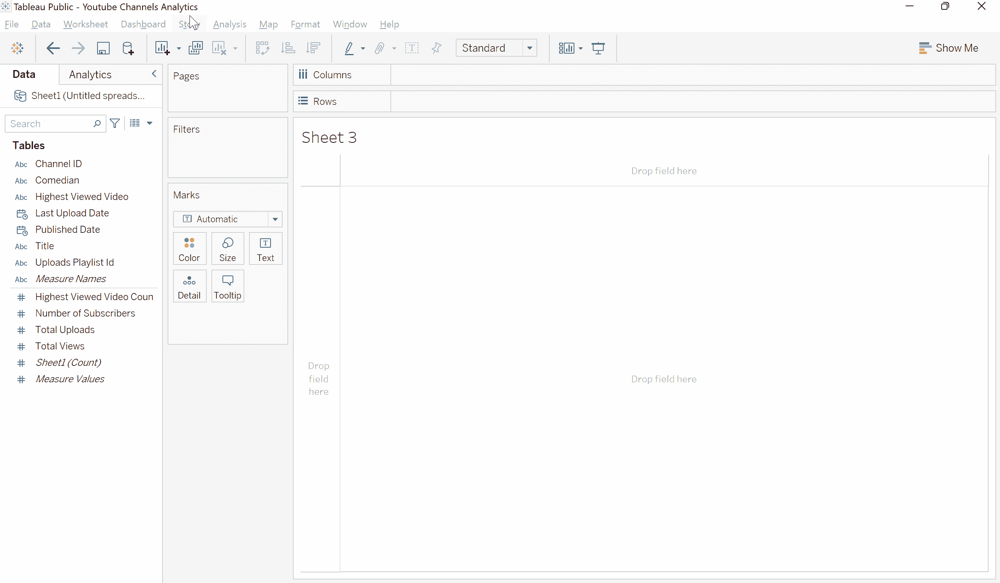*

*仪表板创建(作者图片)*

*完成后，点击 **Ctrl + S** 保存 Tableau public 上的分析。确保您勾选了操作按钮，“ ***保持我的数据与 Google sheet 同步，并嵌入我的凭据。*** "然后点击保存按钮。*

*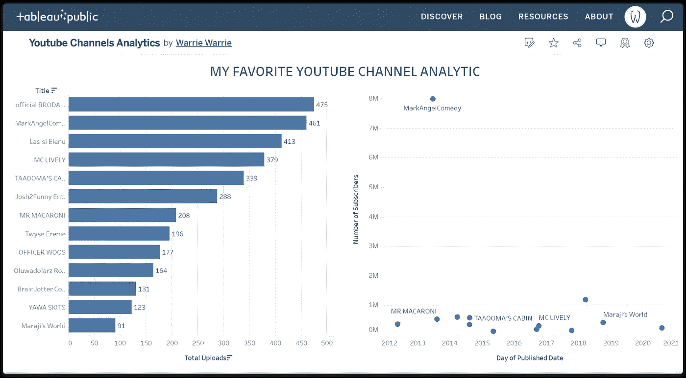*

*YouTube 频道分析仪表板(图片由作者提供)*

*你现在可以查看你最喜欢的 [YouTuber 的分析图片](https://public.tableau.com/app/profile/warrie.warrie/viz/YoutubeChannelsAnalytics/Dashboard1?publish=yes)。
但是，这并没有结束，因为您可以尝试基于可用数据的其他类型的分析；例如跟踪最后的上传日期或分析具有最高观看次数的视频。*

# *临别赠言…*

*恭喜你，你现在有了来自你最喜欢的 YouTube 频道的数据，可以通过利用 apps 脚本在 Tableau 上查看、跟踪和分析这些数据。你可以利用这个想法来追踪你最喜欢的 youtube 频道的其他方面。并且在 Tableau 中创建更好更漂亮的数据可视化。本教程中使用的数据可以在这里找到[，代码可以在这里](https://docs.google.com/spreadsheets/d/19U338q1Lu4ZqckEjMp5xJt4dOYDq9Y702HfoR_zztwA/edit#gid=0)找到[。](https://gist.github.com/warrienelly/bdf5a7a436db464f67e5cdb80195a216)*

*谢谢大家！👋*

# *参考*

*   *[https://developers.google.com/apps-script/advanced/youtube](https://developers.google.com/apps-script/advanced/youtube)*
*   *Javascript 库:[https://developer . Mozilla . org/en-US/docs/Web/JavaScript/Reference/Global _ Objects/Array/map](https://developer.mozilla.org/en-US/docs/Web/JavaScript/Reference/Global_Objects/Array/map)*
*   *地图参考:[https://developers . Google . com/apps-script/guides/sheets/functions #优化](https://developers.google.com/apps-script/guides/sheets/functions#optimization)*
*   *[https://developers . Google . com/apps-script/guides/services/authorization](https://developers.google.com/apps-script/guides/services/authorization)*
*   *[https://developers . Google . com/apps-script/guides/triggers/events](https://developers.google.com/apps-script/guides/triggers/events)*