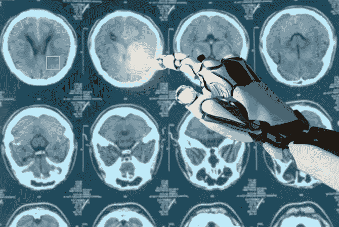
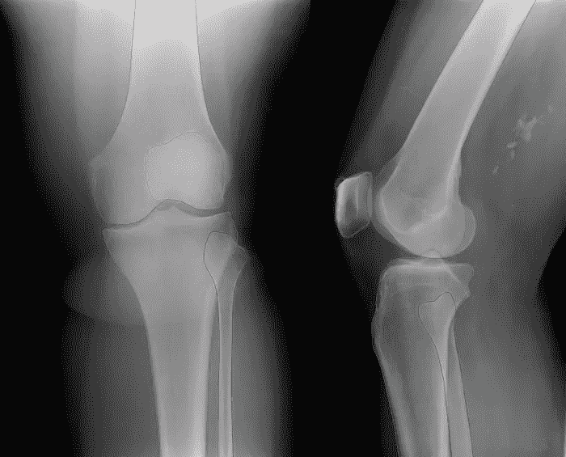

# 如何让基于 AI 和 ML 的医学图像分析做得更好

> 原文：<https://pub.towardsai.net/how-to-make-ai-and-ml-based-medical-image-analysis-better-69d4a6640a2f?source=collection_archive---------2----------------------->

## [人工智能](https://towardsai.net/p/category/artificial-intelligence)，[科技](https://towardsai.net/p/category/technology)

对于医疗保健研究人员、提供商及其患者而言，计算机断层扫描(CT)、磁共振成像(MRI)、乳房 X 线照片、X 射线类型(如荧光透视和血管造影)以及超声波等医学图像是潜在的救命数据宝库。

但是，这些类型的图像也提出了独特的挑战，传统上限制了放射科医生在诊断和治疗各种疾病的有效性。考虑到当今的大多数医学图像分析仅由一小组(通常超负荷工作)放射科医生或临床医生执行。这意味着对这些扫描的解释，往好里说，是非常主观的，往坏里说，可能是完全错误的。

事实上，医学专家表示，由于审查者疲劳和图像本身日益复杂等挑战，四分之一的患者[在医学图像审查中出现假阳性](http://www.mddionline.com/radiological/consider-promises-and-challenges-medical-image-analyses-using-machine-learning)。虽然假阳性比假阴性稍微好一点——假阴性可能导致潜在的致命情况得不到治疗——但它们肯定不好玩，因为它们可能导致不必要的随访甚至手术(以及对患者不必要的压力和医疗系统的成本)。

# 人工智能扫描医学图像的前景

多年来，传统的手动医学图像审查流程挽救了无数人的生命，但这并不意味着这些流程不能改进。事实上，机器学习(ML)技术可以从大量数据中分析和学习，同时对图像进行计算机视觉(CV)分析，以发现人眼无法捕捉的细微差异——这已经显示出巨大的前景。连同深度学习(DL)，一种基于人工神经网络的机器学习形式，这些技术已经使自动化、精确和超快速的医学图像分析成为现实。

根据医学和技术研究人员的说法，ML 和 DL 可以在分析医学图像时实现高性能的检测、分割、分类和预测。研究人员表示，使用人工智能算法的图像扫描通过涉及多学科团队临床、成像和技术专业知识来开发它们，从而实现了更好的结果。“传统上由放射科医生执行的几项任务，如病变检测、分割、分类和监控，可以使用深度学习技术实现自动化，”研究人员写道。

除了明显的诊断功能，[研究人员表示](http://www.healthcareitnews.com/news/europe/ai-improves-value-radiology-needs-more-clinical-evidence)人工智能还可以发挥作用，根据患者的病情、医疗记录、潜在过敏反应和其他数据，确定哪种成像程序和(如有必要)[治疗选择策略](http://clincancerres.aacrjournals.org/content/26/12_Supplement_1/IA04)最有意义。这些研究人员表示，人工智能可以用于确定如何在检查前进行对比，并改善医学图像在图像存档和通信系统(PACS)中的显示方式。“通过使用以前的模式，并根据偏好识别可能有用的图像系列，DL 可以帮助自动安排图像显示，”他们说，并补充说，其他研究人员正在试验基于“深度卷积神经网络(CNN)的人工智能系统，对成人胸片进行自动实时分类。”

在英国，这些研究人员[说](http://www.healthcareitnews.com/news/europe/ai-improves-value-radiology-needs-more-clinical-evidence)，这些系统已经帮助将关键成像发现的平均报告时间从 11.2 天缩短到 2.7 天——这是一个显著的(并且可能挽救生命的)差异。

AI 和 ML 为寻求改善和加快医学图像分析结果的放射科医生和临床医生提供了几个证据充分的[优势](http://www.mddionline.com/radiological/consider-promises-and-challenges-medical-image-analyses-using-machine-learning)，包括:

*   **速度和一致性:**人工智能可以更快、更一致地评估大量变量，并可以自动化工作流，以确保时间敏感的案例首先被发现。
*   放射科医生支持: AI 可以自动化日常任务，消除人为错误，让放射科医生有时间做更重要的事情，如复杂的研究或与患者互动。它还可以帮助辅助决策和提高诊断准确性，并可以通过模式识别和分类以其他方式辅助图像分析。
*   **提高客观性:**因为人类是主观的动物，具有不同程度的能力，人工智能算法的定量和客观性质可以帮助消除临床诊断中的自然认知偏差、偏见和预设。

# 人工智能和医学图像分析的挑战

但是，仅仅因为人工智能显示出极好的前景，并不意味着它是自动的灵丹妙药。培训是一个问题。ML 模型的性能取决于训练数据的质量。训练 [ML 模型](http://developers.google.com/machine-learning/crash-course/descending-into-ml/training-and-loss)的准确性是标准程序，但对于医学成像应用来说可能特别繁重，因为它们通常需要大量精确标记和注释的数据——通常比当前可用的数据更多。[DA Wood 等人认为](https://www.capestart.com/services/reliable-data-preparation-annotation/)为训练高容量神经网络而标记大数据集是开发基于深度学习的医学成像应用的主要障碍。

不同于传统的计算机视觉任务，在传统的计算机视觉任务中，图像注释是简单的(例如，标记狗、猫、鸟等)。)并且存在用于大规模标记的解决方案…将放射性标记分配给磁共振成像(MRI)扫描是一个复杂的过程，需要大量的领域知识和经验。” [CapeStart](https://www.capestart.com/) 提供注释和标记制药、牙科、眼科和其他医学图像的服务，如 CT 扫描、核磁共振成像、X 射线、乳房 x 光或超声波。

由于临床情况的性质，为临床使用部署 ML 模型也是具有挑战性的，在临床情况下，成千上万的变量可能会起作用——甚至不同于大量的训练数据。在这些情况下，诊断和其他医疗保健相关的 ML 模型可能会遇到困难，在只有几个变量的受控环境之外，还会面临测试和获得[监管批准](http://www.fda.gov/medical-devices/software-medical-device-samd/artificial-intelligence-and-machine-learning-software-medical-device)的挑战。

# AI 现在和未来能为放射学做什么？

我们不太可能很快看到完全由人工智能驱动的诊断。但这项技术仍然可以作为人类放射科医生的助手提供巨大的帮助，从而改善医疗保健结果。事实上，[传统上由放射科医师执行的几项任务](http://insightsimaging.springeropen.com/articles/10.1186/s13244-019-0832-5)如检测、分割、预测、分类、质量检查和监控可以部分甚至完全自动化，但需要专家人工监督。

除了帮助放射科医生自动化平凡而耗时的任务，ML 模型在提高医学图像和放射学分析和报告的速度和质量方面显示出巨大的前景，事实上，已经证明了它们的价值。例如，乳房 x 线照片中的自动组织密度评估可以帮助预测哪些患者可能处于最大风险中，从而为他们提供更高的优先级和潜在的更及时的治疗。

临床医生表示，ML 和 DL 可以帮助跟踪一经诊断的病变和肿瘤，这通常是一项乏味的工作，需要对患者进行不懈的随访。“我们的许多 CT 扫描是对我们每三个月随访一次的癌症患者进行的，我们需要跟踪病变并测量它们以调整他们的治疗，”宾夕法尼亚大学放射学教授兼副主席 Charles E Kahn 在*医疗保健 IT 新闻中说。“*这不仅是一项乏味的工作，也是一个用人工智能改善所有这些测量的真正机会。”