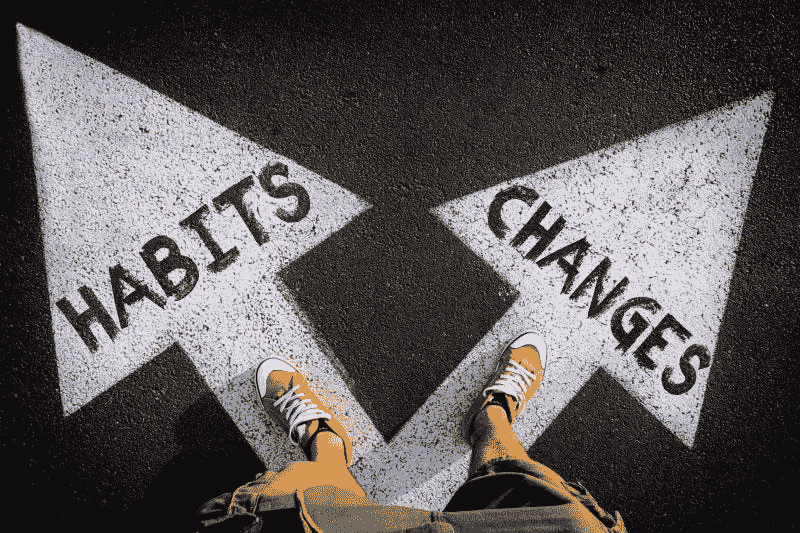
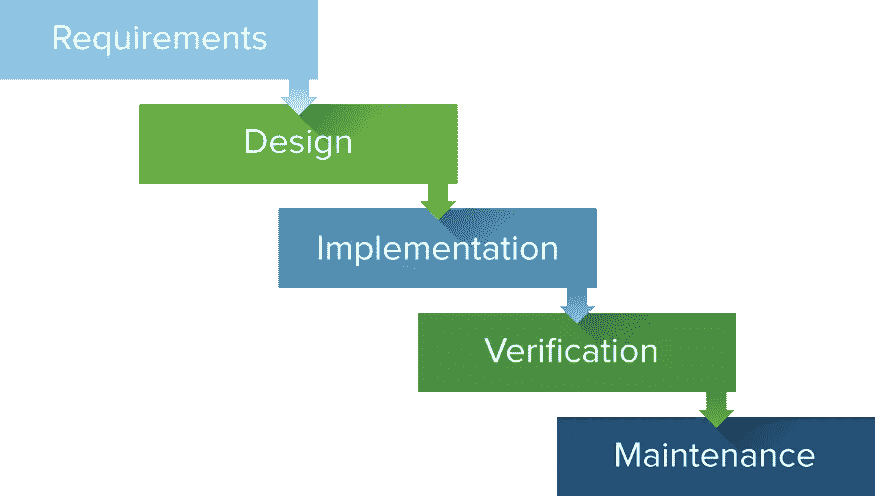
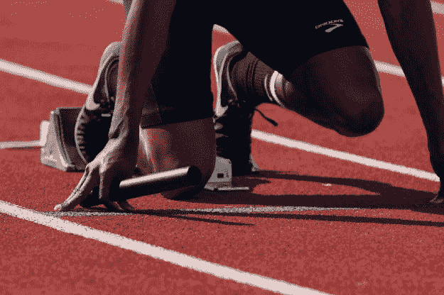

# 如何用敏捷克服自己的坏习惯？—数据专家的方法

> 原文：<https://pub.towardsai.net/how-to-overcome-your-bad-habits-with-agile-a-data-guys-approach-879168794fbb?source=collection_archive---------4----------------------->

## [产品管理](https://towardsai.net/p/category/product-management)

照片由 badman 制作于 Getty Images/iStockphoto

你尝试过多少次打破坏习惯，或者养成新习惯？你有没有考虑过吃得更健康，减肥，戒烟，或者最后抓起角落里那把生锈的吉他去学你最喜欢的鲍勃·迪伦的歌？

我们都在与自己的习惯作斗争。我们中的一些人可能对自己更容易，而另一些人在第一眼看到失败时就放弃了。实现我们的目标需要很大的意志力和决心，但是我们尝试实现目标的方法会对结果产生影响。以下是你可能做错的地方。

# 为什么瀑布是瀑布

我们中的一些在数据和分析领域工作的人经常犯这样的错误:我们有多个目标，并且我们计划了很多。我们研究了许多文章(你现在可能正在做的事情)，咨询了朋友和专业人士，制定了一个严格的时间表，并因面对想法而感到困惑。我们可能无法决定走哪条路，最终堆积了大量的信息，却没有真正朝着我们的目标迈出一步。我们竭尽全力计划行刑的每一个瞬间。

图 1:瀑布模型

*瀑布*模型的问题就在于此:计划必须在我们开始实际工作之前完成。这个阶段很容易在没有完全理解我们的目标的情况下完成。

> 我要快乐的生活！

你可能有类似的、模糊的想法，但是可能会以无助于你个人幸福的行动和要求而告终。你宁愿采取你听说可能有帮助但不是为你量身定做的一般步骤。明确你想要实现的目标，确定引导你实现目标的步骤，然后**收集足够的信息，这样你就可以开始**走自己的路了！

# “21”天神话

这个神话被认为是麦克斯韦·马尔茨创造的。它指出养成一个新习惯需要 21 天。有一篇[很棒的文章](https://jamesclear.com/new-habit)揭穿了它，所以我只总结一下要点:

3 周的时间短到可以实现，长到可以相信。事实上，一种新行为变成第二天性需要大约 2 个月的时间。大多数人放弃是因为他们没有很快看到结果。

好消息是:你不必完美，因为偶尔的错误不会对长期习惯的形成产生大的影响。只要找到一个快速的方法回到正轨，继续做你做的事情，不要对自己苛刻。耐心点，接受你的缺点。

# 你是你行动的产物

把你的生活看作是一种产品。你的任务是将新的*特性*(习惯)交付给所述产品。你想尽可能快地运送准备好的部分(实现的习惯)来满足你的产品所有者(你自己、家人、朋友、老板、女朋友/男朋友等。).

图 2: Scrum

一点一点的，你可以建立一个*的人生路线图*，在那里明确你的长期目标，你可以按照所说的长期目标，把你想实现的更小的任务联系起来。考虑到这个路线图会随着时间的推移而改变，作为一个实际的敏捷产品路线图，它永远不会完全完成。

# 作为一个…我需要…这样…

首先，写下你的愿望，你想在生活中实现或改变什么，创建一个*产品积压*。这些应该根据重要性进行优先排序，但是如果有帮助的话，您可以更改顺序。例如，我喜欢用一些速赢的东西开始一个项目，这些速赢的东西给了我动力和最初的满足感，推动了剩下的工作。因此，你可能不想马上“T10”吃青蛙，而是想快速取胜，然后关注更大的挑战。

无论如何，你应该有一个按优先顺序排列的*故事*(有相关利益的详细行动)列表，它遵循本段标题中提到的结构。一些例子可能是:

> **作为一个**高效的人，**我需要**每天早上[整理床铺](https://www.youtube.com/watch?v=3sK3wJAxGfs)，**这样**我就能完成一天的第一项任务，给我一种小小的自豪感，并让我的周围井井有条

，或者

> 作为一个适应力强的人，我需要在早上避开新闻和社交媒体，这样我就能以良好的心情开始新的一天。

# 冲刺的时间到了

[布拉登·科拉姆](https://unsplash.com/@bradencollum?utm_source=medium&utm_medium=referral)在 [Unsplash](https://unsplash.com/?utm_source=medium&utm_medium=referral) 上拍摄的照片

现在你已经有了一个定义良好的用户故事列表，从你的产品清单中挑选一些你将在第一个 *sprint* 中处理的。这可以按顺序来做，或者你可以挑选一些可以互补的小习惯。例如，如果你想知识更丰富，晚上睡得更好，你可以在睡觉前 1 小时关闭设备，这样发出的蓝光就不会干扰你的睡眠。在你现在没有网飞的一个小时里，你可以读一些你已经在书架上尘封太久的书。

**一次冲刺的时间应该是形成一个新习惯的时间**。如果你一开始对此毫无头绪，也不要担心。你可以使用经验法则，比如 66 天，或者甚至 21 天，如果这些是你认为可以在更短时间内实现的小习惯。

下一步是**估计活动的规模**:你认为把它们融入你的日常生活有多难？需要多久才能适应他们参与你的生活？这些大小可以是斐波纳契数列或者任何适合你的数字。知道了每个任务的工作量和时间需求，您应该能够开始计划您的第一次迭代。

请记住，你定义活动和规模的方式不应该感觉像是“工作”本身。如果你对严格遵循这些原则不放心，挑选适合你的，发明你自己的方式来优先考虑/评估你觉得最舒服的。

# 迭代以求完美

一旦你解决了所有的问题，是时候开始你的工作了。在您估计的时间内，从 sprint backlog 开始开发您的特性。这不是形成实际习惯所需的时间，而是初步成功所需的时间。例如，如果你的 sprint 的目标是在 2 个月内更加积极地锻炼身体，那么当你尽最大努力将这个程序纳入你的时间表时，一个迭代可能是 2-3 周。在下一次迭代中，你可能会根据你的经验做出改变:如果你不喜欢跑步，尝试 TRX、壁球或其他可能帮助你更容易实现目标的活动。在你认为合适的时候，改变活动的频率和时间长度。

# 每日(或每周)Scrum

试着在一天(或一周)中腾出一些时间来思考你取得进步的迹象。很多时候我们只看到未来，看到我们的目标离自己还很远。回顾和欣赏我们迄今所做的事情是有益的。骄傲而不是羞耻推动着变革。

另一个方面是评估过程中哪里出了问题，并仔细检查。如果你的目标是吃得更健康，为什么上周四你最后点了一个大披萨并一个人吃完了？这种行为背后的环境、内心想法和动机是什么，下次你有这种诱惑时如何避免？(提示:正念练习有助于消除渴望的想法)。

最后但同样重要的是，当你向目标迈进一步的时候，想想下一次。*什么时候*你会做，*你会做什么*，*你会怎么做*，你面前有没有什么*阻击手*可能会阻止？试着消除所有阻碍**的障碍，让你的任务尽可能轻松**。如果你想去跑步，前一天晚上准备好鞋子和衣服。当时间到了，你只是跳进他们，不允许你有怀疑的想法，而你正在打扮。

# 冲刺回顾/回顾

一旦你在第一次冲刺中完成了头韵，试着寻找三个问题的答案:

1.  *进展顺利吗？承认你的成就，即使很小，也要为自己感到骄傲。*
2.  *什么不顺利？发现为什么你偏离了你的计划，以及你行动背后的内在动机。*
3.  *要采取什么行动？*从你的*步骤 1* 特征中寻找你可以用来实现其他目标的实践。理解*步骤 2* 特征背后的“为什么”。消除任何障碍，或者重复任务，保持最初的目标。

别忘了庆祝和犒劳自己完成第一个习惯——冲刺！你应得的！

你现在唯一要做的就是重复这个过程:从你的产品清单中寻找新的特性来工作(或者从你之前的 sprint 中挑选延迟的)，计划下一次迭代，继续一步一步地改变你的生活！

# 结论

我们的习惯定义了我们，它们给我们的生活提供了结构，它们是我们如何看待自己的主要因素。一些习惯为成长、友谊和进步创造机会，而另一些习惯则是破坏性的。

话虽如此，我认为在敏捷的背景下构建个人发展可以帮助人们计划和取得进步——因此最大限度地减少抽象和焦虑，这通常是由弄清楚如何向你想要的目标前进而引起的。这种思维方式显然不会吸引所有人——但所有自我开发技术都是如此:)

我希望这篇文章可以帮助你在生活中更容易地养成好习惯，改掉坏习惯，使用一些从 Scrum 和敏捷项目管理中精选的想法。