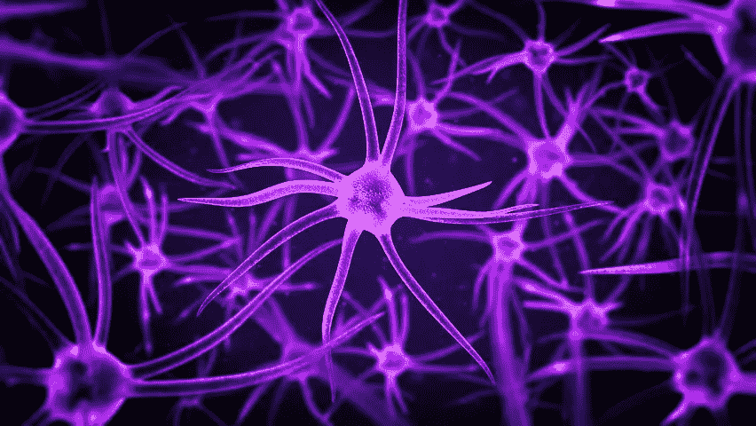
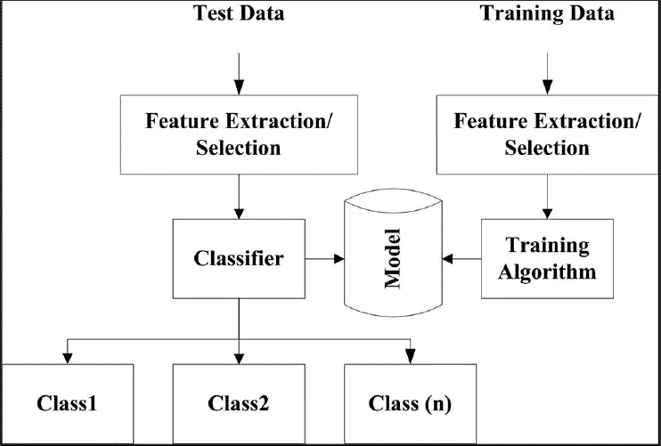
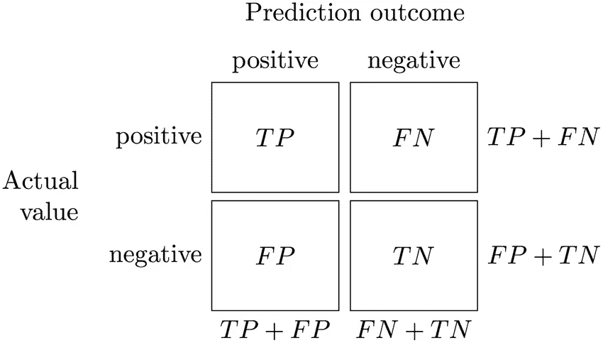
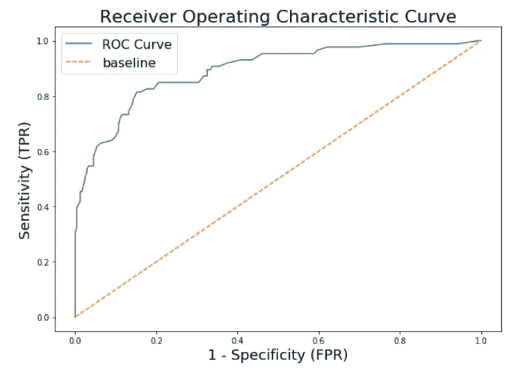
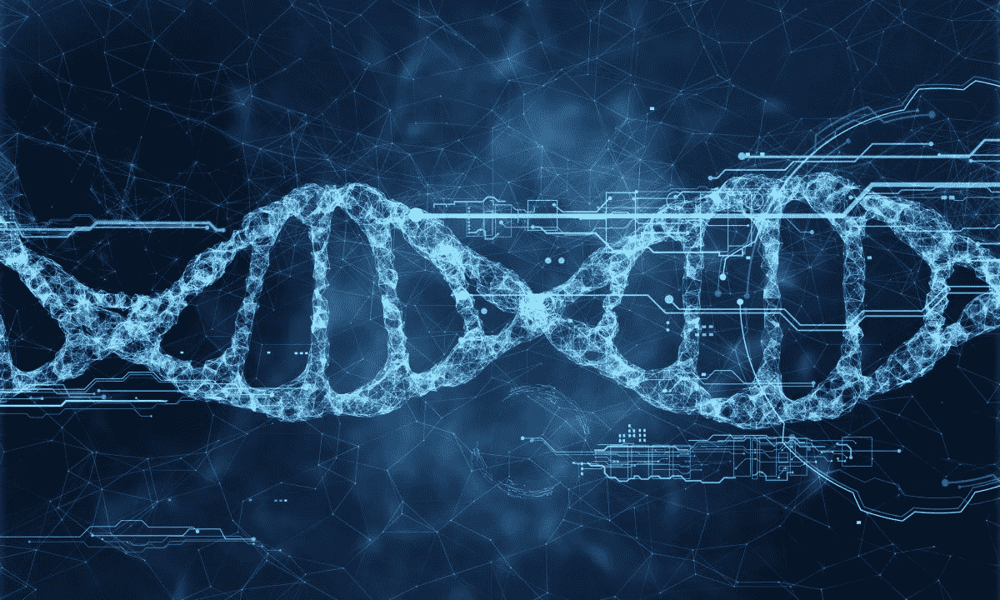
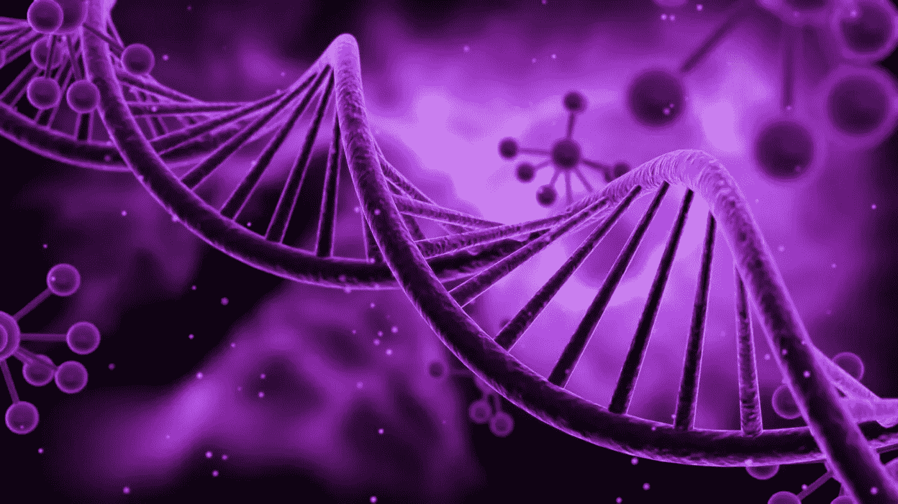
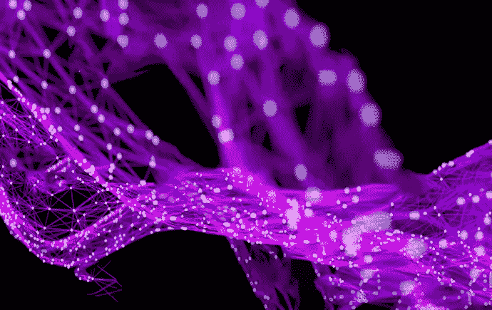

# 如何在生物信息学研究中使用机器学习(2)

> 原文：<https://pub.towardsai.net/how-to-use-machine-learning-in-bioinformatics-research-part-2-15372473004?source=collection_archive---------1----------------------->

## 生物信息学

生物信息学中的机器学习

生物信息学是许多领域的结合。我正在进行生物信息学的本科研究，我对机器学习和深度学习有着极大的热情。我的热情迫使我搜索关于集成机器学习和深度学习技术来解决生物信息学中的问题。所以我想分享我的知识来支持其他研究人员，帮助他们避免我在研究工作早期遇到的困难。

在我的第一篇文章[如何在生物信息学研究中使用机器学习第 1 部分](https://medium.com/towards-artificial-intelligence/how-to-use-machine-learning-in-bioinformatics-research-part-1-53d6f7a3c732)中，我讨论了生物信息学和几个应用机器学习技术从数据中提取知识的生物领域。我还讨论了为什么使用机器学习以及要遵循的优化标准。我答应在我的下一系列博客中讨论监督分类、聚类、概率图形模型和优化。所以在这篇文章中，我想讨论生物信息学研究中的监督分类。

# 监督分类法

监督分类法

在分类问题中，一组元素被分成几类。给定集合中的一个元素(或实例),一个类根据两件事来分配。

1.  该元素的一些功能
2.  一组分类规则(未知)

在许多实际情况下，这组规则是未知的，唯一可用的信息是一组带标签的示例(即一组与类相关联的实例)。监督分类方法是从数据中归纳分类规则的算法。

作为一个例子，我们将看到一种使用剪接位点预测作为监督分类问题的方法。待分类的实例将是给定大小的 DNA 序列(考虑一个例子，22 个碱基对，2bp 剪接位点的 10 个上游和 10 个下游)。这里，给定实例的属性将是序列中每个位置的核苷酸。在这个例子中，我们将假设我们正在寻找供体站点，因此该类的可能值将是真供体站点或假供体站点。当我们处理监督分类的问题时，我们需要一组标记的例子，即一组真的和假的供体位点序列以及它们的标记。此时，我们可以使用这个训练集来建立一个分类器。一旦训练了分类器，我们就可以用它来标记新的序列，使用每个位置上存在的核苷酸作为分类器的输入，并得到标签(真或假供体位点)作为输出。

在两组监督分类中，有一个特征向量 **X** ，其分量称为预测变量和一个标签或类别变量 **C** 。因此；任务是从训练数据中归纳出分类器，训练数据由一组从联合概率分布 **p(x，c)** 中抽取的 **N** 个独立观测值组成。分类模型将根据其预测变量的值为新实例分配标签。

# 分类算法的评估与比较

## 误差率和 ROC 曲线

当使用 0/1 损失时，所有误差都是同样糟糕的，我们的误差计算基于混淆矩阵。

混淆矩阵

在这种情况下，我们可以将错误率定义为(|FN|+|FP|)/N，其中 N=|TP|+|FP|+|TN|+|FN|是验证集中的实例总数。

为了微调分类器，另一种方法是绘制接收器操作特征(ROCs)曲线，该曲线显示真阳性率对假阳性率，即 1-特异性=|FP|/(|FP|+|TN|)对灵敏度=|TP|/(|TP|+|FN|)，其形式类似于下图。

受试者工作特征曲线

在每种分类算法中，都有一个参数，例如决策阈值，我们可以用它来改变真阳性与假阳性的数量。当增加真阳性的数量会增加假警报的数量时，减少假警报的数量也会减少命中的数量。根据我们特定应用的性价比，我们决定曲线上的一个点。接收器工作特性曲线下的面积被用作机器学习算法的性能度量。这被称为 AUC 分数。如果该值范围在 0.5 和 1 之间，则认为模型是好的。如果 AUC 得分为 1，则表示 is 模型是一个完美的分类模型。

## 估计分类误差

与设计的分类器相关的一个重要问题是，当使用该模型对看不见的(新的)实例进行分类时，如何估计其错误率。

以下技术可用于估计误差率。

1.  替代估计量(估计误差的最简单和最快的方法)
2.  k 倍交叉验证
3.  留一交叉验证
4.  自助方法
5.  支持误差估计

## 比较分类算法

给定两种学习算法和一个训练集，有趣的问题是知道由两种算法提供的预期错误率的估计的差异是否在统计上显著。

# 特征子集选择

特征子集选择

所有监督分类范例共有的一个问题是，当学习分类规则时，是否所有的 **n** 描述特征都有用。为了回答这个问题，我们将特征子集选择定义为给定一组候选特征，在某种学习算法下选择最佳子集。

四个基本问题决定了搜索过程的性质。

1.  搜索空间起点= >确定搜索的方向。
2.  搜索组织= >确定在大小为 **Pow(2，n)** 的空间中搜索的策略，其中 **n** 是问题中特征的个数。

搜索策略可以是最优的或启发式的。彻底评估所有可能子集的两种经典的最佳搜索算法是深度优先和宽度优先。否则，分支和界限搜索保证检测单调评估函数的最佳子集，而无需系统检查所有子集。当不能满足单调性时，根据特征的数量和使用的评估函数，穷举搜索可能是不切实际的。在这种情况下，启发式搜索是有趣的，因为它可以找到接近最优的解决方案，如果不是最优的。在启发式方法中，有确定性算法和随机算法。

一方面，经典的确定性启发式 FSS 算法是顺序向前和向后选择，浮动选择方法，或最佳优先搜索。它们是确定性的，因为所有的运行总是获得相同的解，并且由于它们的爬山性质，它们倾向于陷入由特征之间的相互依赖性引起的局部峰值。随机启发式 FSS 算法使用随机性来逃避局部最大值，这意味着人们不应该期望从运行的不同回合中得到相同的解决方案。遗传算法和分布估计算法已经应用于 FSS 问题。

3.Evaluation function = >在搜索算法选择了一个特定的特征子集进行检查之后，测量它的有效性

4.停止搜索的标准= >一种直观的方法是不改进备选子集的评估函数值。另一个经典的标准是确定几个可能的解决方案，与搜索一起访问。

# 分类范例

每种监督分类方法都有一个关联的决策表面，用于确定分类器可以解决的问题类型。

(1)贝叶斯分类器=> 1。朴素贝叶斯 2。半朴素贝叶斯 3。树增强朴素贝叶斯 4。k 相关贝叶斯分类器(KDB)

(2)逻辑回归

(3)判别分析=> 1。费希尔判别分析 2。线性判别分析

(4)分类树

(5)最近邻=> 1。k-最近邻规则

(6)神经网络=> 1。前馈神经网络 2。感知 3。多层感知

(7)支持向量机

(8)组合分类器=> 1。多数票 2。堆叠概括 3。Ada Boost 算法

# 生物信息学中的监督分类

生物信息学中的监督分类

这些是监督分类在生物学领域的一些应用。

## (1)基因组学

1.  基因发现问题
2.  在人类 DNA 中寻找蛋白质编码区(分类树)
3.  剪接位点预测问题(新的贝叶斯分类器)
4.  基因发现问题(特征子集选择)
5.  剪接位点预测问题(优化程序适用于 FSS)
6.  基因预测(结合不同来源的证据)
7.  搜索 RNA 基因(使用分类范例)
8.  功能性 RNA 基因的计算机识别(SVM 和神经网络)
9.  可能与遗传疾病有关的基因的全基因组鉴定(以不同保守分数和基因长度作为预测变量的分类树)
10.  从采用称为间隔寡核苷酸分型(C4.5 算法)的 DNA 分析技术(基因分型)生成的数据中发现可理解的知识规则
11.  利用光谱特征的氨基酸序列的重建已经通过使用动态编程来解决
12.  RNA 二级结构预测(动态规划)
13.  识别 RNA 结构元素(进化算法)
14.  RNA 三级结构测定(禁忌搜索)

## (2)蛋白质组学

1.  蛋白质二级结构的预测(最近邻)
2.  蛋白质二级结构的预测(基于分类树的一致性方法)
3.  预测参与蛋白质-蛋白质相互作用的蛋白质的表面残基(由支持向量机和贝叶斯分类器组成的两阶段方法)
4.  从 its 序列自动预测亚细胞蛋白质位置(模糊 k-最近邻算法)

## (3)微阵列

1.  微阵列数据中的模式识别
2.  基于表达数据同时选择用于癌症诊断的最优分类器和最优基因子集(支持向量机的贝叶斯推广)
3.  基因选择(在包装方法中，k-最近邻与遗传算法结合使用)
4.  癌基因表达谱的分类(集成学习(袋装和增强决策树)比单一分类树执行得更好)
5.  癌症基因表达研究(比较最近邻分类器、线性判别分析、分类树、bagging 和 boosting)
6.  具有 14 个肿瘤类别的分类问题(三个二元分类器(k-最近邻、加权投票和支持向量机)之间的比较)
7.  用于癌症诊断的 11 个数据集(几种主要分类算法(支持向量机、k-最近邻、神经网络和不同集成分类器)之间的比较)
8.  评估微阵列数据集中 7 个数据集的 21 种分类方法的性能。

## (4)系统生物学

1.  当模拟信号-反应级联时，该方法应用于使用信号蛋白的磷酸化水平预测细胞迁移速度(分类树)
2.  基因调节反应的预测(用分类树作为基本分类器的增强)

## (5)文本挖掘

1.  基于支持向量机和两个隐马尔可夫模型集成的文本蛋白质/基因识别新方法
2.  蛋白质亚细胞位置的预测(支持向量机)

## (6)其他应用

1.  质谱数据的使用
2.  使用质谱数据作为生物标志物检测早期卵巢癌患者(线性判别分析、二次判别分析、k-最近邻分类器、bagging 和 boosting 分类树、支持向量机和随机森林)
3.  使用从质谱技术获得的数据对新生儿的两种代谢紊乱进行分类(比较分类算法(判别分析、逻辑回归、分类树、k-最近邻分类器、神经网络和支持向量机))

# 最终想法

最终想法

我希望在我的下一系列博客中讨论聚类、概率图形模型和优化。我希望你能和我保持联系。

我要特别感谢我的大学讲师 C. T .温尼格博士。

谢谢大家！…未完待续。