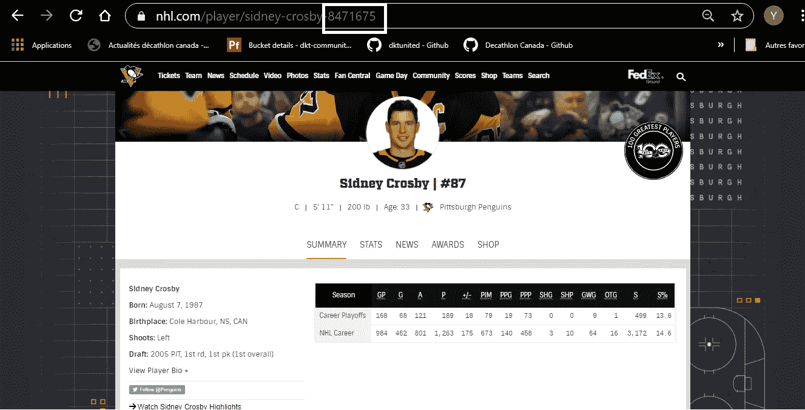
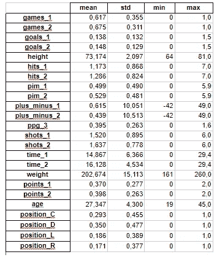
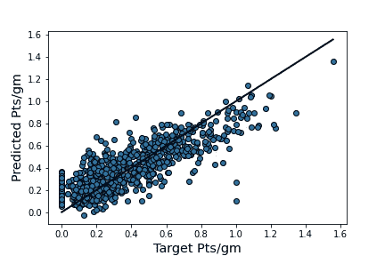
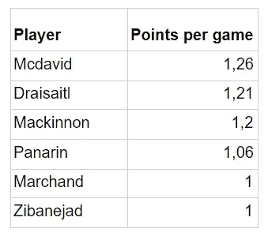

# 如何赢得你的非霍奇金淋巴瘤池甚至没有尝试

> 原文：<https://pub.towardsai.net/how-to-win-your-nhl-pool-without-even-trying-42bc03b9659?source=collection_archive---------2----------------------->


我正在参加由加拿大盲人曲棍球协会组织的 NHL 比赛。

## [机器学习](https://towardsai.net/p/category/machine-learning)

## 我如何使用机器学习来预测一名曲棍球运动员今年的得分

更新:如果你好奇的话，这个赛季现在已经结束了，我在 119 名参与者中名列第九，所以这个模特的表现令人印象深刻！明年我一定也会尝试一下:)

随着新的国家曲棍球联盟(NHL)赛季即将到来，我收到了一份意想不到的邀请，与来自[盲人曲棍球社区](https://canadianblindhockey.com/)的人们一起游泳。这个想法是从 24 组 6 名相似的球员中挑选一名球员组成你的球队。获胜者是其团队在赛季中得分最多的人。在尝试选择玩家几分钟后，我开始想知道训练一个帮助我完成这项任务的机器学习模型会有多难。在这篇博文中，我分享了我是如何建立这个模型并利用它来做选择的。


必须做出选择的例子。摘自 officepools.com

# 收集数据

每个好的机器学习项目的第一步都是找到一些数据。在我的情况下，我必须找到前几个赛季的球员数据。当我发现实际上有一个由 NHL 为此开发的 API 时，我下定决心要从 NHL.com 那里获取这些数据。它被 NHL 记录得非常糟糕，但是一个随机的家伙慷慨地制作了令人难以置信的文件，有惊人的细节，可以在这里找到。这是我最终用来收集数据的工具。

我选择的策略是使用过去 10 个赛季的数据，并使用连续两个赛季的球员数据来预测下一个赛季的得分。我不会详述我所有的代码，这些代码可以在这个 [colab 笔记本](https://colab.research.google.com/drive/1it07eDaWGDF8t7n3VsqW_Yua_00MBh7G?usp=sharing)中找到，但是我会描述主要的步骤。我首先使用 NHL API 的*排名*端点来提取 2010-2011 赛季和 2019-2020 赛季之间出现在 NHL 中的球队 id 列表。然后，我使用 *teams* 端点来获取每个感兴趣的赛季中每个球队的花名册。这是我会考虑的球员名单。

下一步是为这些玩家提取尽可能多的数据。为此，我不得不使用两个不同的端点。 *people* 端点为我提供了生日、身高和体重等个人信息，同一端点的 *stats* 扩展为我提供了球员每个赛季的进球、助攻和比赛等曲棍球统计数据。关于其他联赛赛季的统计数据实际上是可用的，所以我必须确保只选择我所在年份范围内的 NHL 赛季。以下是我用来收集数据的每个 URL 的示例:

```
list of teams playing in the 2019-2020 season:
*https://statsapi.web.nhl.com/api/v1/standings?season=20192020*List of players who played for the Pittsburgh Penguins (id=5) in 2019-2020:
*https://statsapi.web.nhl.com/api/v1/teams/5/?expand=team.roster&season=20192020*Personal information of Sidney Crosby (id=8471675):
*https://statsapi.web.nhl.com/api/v1/people/8471675*Career stats of Sidney Crosby (id=8471675):
*https://statsapi.web.nhl.com/api/v1/people/8471675/stats?stats=yearByYear*
```



玩家的 id 可以在他们的 NHL.com 网页的 URL 中找到

这个策略给了我总共`2115`名玩家的数据。不幸的是，这些球员中有很大一部分没有足够的上场时间作为训练数据，所以我不得不减少名单，只列出那些在十年内至少打了 3 个赛季和 100 场比赛的球员。我也去掉了守门员，因为他们和其他球员完全不同。这使得名单减少到了`1038`名玩家。

进入建模之前的最后一步是将数据转换为训练所需的格式，这是一个连续赛季对及其相应统计数据和下一个赛季得分的列表，用作标签。为了对只有一年历史的二年级球员做出好的预测，我保留了两个赛季中没有任何比赛的线。这给我留下了`5105`行的数据。

# 数据预处理

我收集了每个球员的很多数据，但不一定所有的数据都有助于预测下赛季的表现。数据也是非常原始的格式，所以我不得不清理了很多。以下是我最终保留的功能列表，以及它们是如何被处理的:

*   **高度**，换算成英寸
*   **重量**磅
*   **年龄**相关三人组第一季
*   **位置** (L、R、C、D)编码成四个指示器
*   两个赛季每场比赛的进球数
*   两个赛季中每场比赛的点数
*   **两个赛季中每场比赛的点击率**
*   两个赛季中每场比赛的投篮次数
*   两个赛季中每场比赛的处罚时间
*   两个赛季中每场比赛的冰上时间
*   在两个赛季的每一个赛季中，82 场比赛的分数
*   **加/减**总计，针对两个赛季中的每一个赛季

由于点数与比赛次数密切相关，所以我决定预测第三季每场比赛的点数。



处理后汇总收集的数据。这不是 NHL 人口统计的直接表现，因为不同的球员在这些统计中出现的次数不同。

即使在所有这些数据处理之后，仍然有一些功能不理想。事实上，众所周知，当特征是-1 和 1 之间的小数字时，机器学习算法工作得更好。这意味着我必须标准化(减去平均值，除以标准偏差)以下特征:身高、体重、年龄、加减和冰上时间。然而，非常重要的是，仅使用训练数据来执行这种标准化，而不是将关于测试数据的信息注入到模型中。因此，这一步是在将全部数据随机分成 85%用于训练，15%用于测试之后完成的。

# 建立模型

在开始复杂的建模之前，建立最简单的预测器作为基准总是一个好主意。这个设置的一个想法是简单地使用上个赛季每场比赛的点数，并且**假设玩家将保持相同的产量**。请注意，这是一个回归任务，因此使用的损失和度量与分类时不一样。在这种情况下，我选择了*均方误差* (MSE)和*均方根误差* (RMSE)，它就是 MSE 的平方根。根据测试数据评估基准模型的这些指标可以得出:

```
MSE: 0.0323
RMSE: 0.180
```

这意味着使用这种方法，我们平均每场错误 0.18 分。这当然不完美，但同时也不算太糟糕，因为这相当于一个 82 场比赛赛季的 15 分。

接下来，在处理回归时总是尝试的第一个模型是**线性回归**，我使用 *sklearn* 库实现了它。在拟合到训练数据之后，该模型在测试数据上实现了以下性能:

```
MSE: 0.0243
RMSE: 0.156
```

这些指标仍然不完美，但是它们显示了相对于简单基准的明显改进。

为了简单起见，我没有花几个小时玩不同的 sklearn 模型进行回归，而是直接跳到了**神经网络**，我使用 *autokeras* 库对其进行了训练。我不建议对每一个可能的任务都使用 autoML，因为人类的专业知识经常会击败它，但是对于这样一个简单的任务，不值得浪费我的时间来手动优化神经网络架构和超参数。令我惊讶的是，使用神经网络，我只对线性回归结果做了微小的改进。我在所有尝试中取得的最好结果是:

```
MSE: 0.0229
RMSE: 0.151
```

# 分析模型

总结这个项目的模型构建部分，我最终得到了两个相似的模型，在整个赛季中平均误差约为 12 点。有趣的是，预测似乎低估了优秀玩家的真实值，高估了一般玩家的真实值(见图)，但对于我的用例，我只关心比较相似的玩家，所以这不是一个大问题。



使用线性回归模型，比较每场比赛的预测得分和测试数据的真实值。

现在我有了我的最终模型，是时候对 2020-2021 赛季进行预测了，以便赢得我的奖金！在对数据进行了与之前相同的预处理并使用训练好的线性回归模型后，下面是我必须从中选择的第一组球员的预测:



预测 2020–2021 赛季为首选

这意味着我不得不选择康纳·麦克戴维，反正他是我的选择！对于好奇的读者来说，这里是该模型对本赛季前 5 名球员的预测:麦克戴维，德雷塞特，麦金农，帕斯特拉克，库切罗夫。

有趣的是，像摩根·吉吉这样一个不知名的球员进入了前 15 名，但这可以简单地解释为他在 NHL 只有 2 场比赛的经验，所以模型一定是随机猜测了他未来的表现。

## 改进模型？

不知何故，我对自己构建的模型感到满意，但当然还有很大的改进空间。还有很多其他因素会影响一个球员的表现，比如他的队友和线友。考虑过去两个以上的赛季并收集更多的总体数据也是有用的。也许更高级的数据对理解一个球员的潜力也很重要。

由于我很匆忙(赛季今晚开始…)我没有尽可能地专注于改进模型。我仍然很好奇这个模型会有什么表现，所以我会在这个赛季的晚些时候为那些关心的人发布一个更新:)