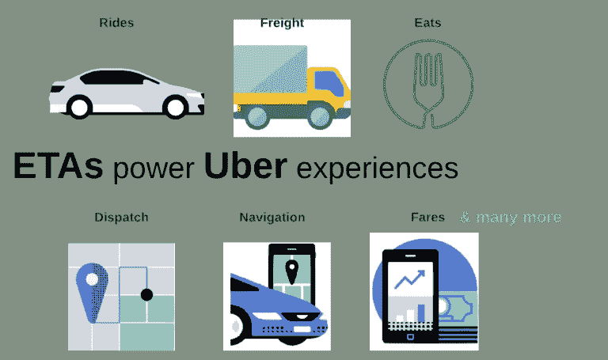
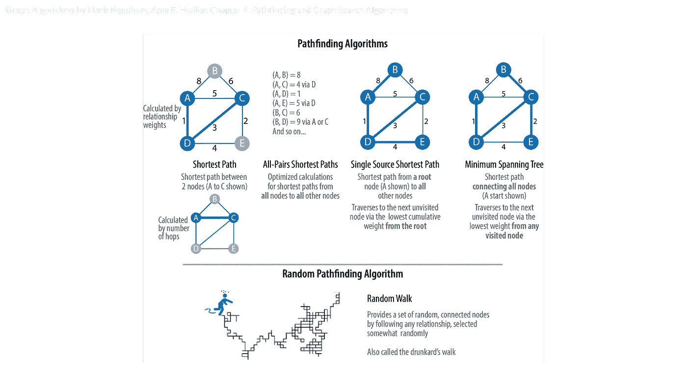
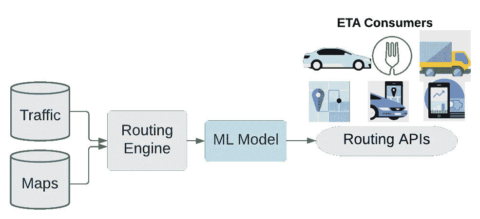
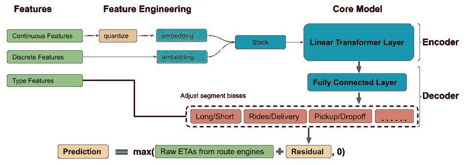

# 优步如何利用人工智能更好地为您服务

> 原文：<https://pub.towardsai.net/how-uber-uses-ai-to-serve-you-better-b576f904c49f?source=collection_archive---------1----------------------->

## 优步怎么能送餐并且总是准时或者提前几分钟到达呢？

> 最初发表于 [louisbouchard.ai](https://www.louisbouchard.ai/uber-deepeta/) ，前两天在[我的博客](https://www.louisbouchard.ai/uber-deepeta/)上读到的！

## 观看视频

优步怎么能送餐并且总是准时或者提前几分钟到达呢？他们是如何将骑手和车手匹配起来，让你总能找到优步的？同时还要管理所有的驱动程序。

我们将在本文中用它们的到达时间预测算法来回答这些问题:DeepETA。DeepETA 是优步使用深度学习估计到达时间的最先进算法。DeepETA 既用于优步，也用于 Uber Eats，它可以神奇地在后台组织一切，以便乘客、司机和食物尽可能高效地及时流畅地从 a 点到 b 点。

图片来自[优步的博客](https://eng.uber.com/deepeta-how-uber-predicts-arrival-times/)。

有许多不同的算法来估计这样的道路网络上的旅行，但我认为没有一个像优步的算法那样优化。以前的到达时间预测工具，包括优步，都是用我们称之为[的最短路径算法](https://en.wikipedia.org/wiki/Shortest_path_problem)构建的，这些算法不太适合现实世界的预测，因为它们没有考虑实时信号。

几年来，优步一直使用 XGBoost，这是一个著名的梯度推进决策树机器学习库。XGBoost 非常强大，在许多应用程序中使用，但在优步的情况下受到限制，因为它越发展，延迟就越大。他们想要更快、更准确、更通用的东西，用于司机、骑手和食品配送。所有正交的挑战都很难解决，即使是机器学习或人工智能。

迪贝塔来了。这是一个深度学习模型，在 XGBoost 的基础上有所改进。

*使用 ML 模型的 ETA 后处理混合方法*。图片来自[优步的博客](https://eng.uber.com/deepeta-how-uber-predicts-arrival-times/)。

DeepETA 非常强大和高效，因为它不只是简单地获取数据并生成预测。有一个完整的预处理系统来使这些数据更容易被模型消化。这使得模型更容易，因为它可以直接关注优化的数据，噪音和输入都少得多，这是优化延迟问题的第一步。

该预处理模块从获取地图数据和实时交通测量开始，以产生任何新客户请求的初始估计到达时间。

然后，模型将这些转换后的特征与空间起点和终点以及请求的时间一起作为时间特征。但这并没有停止。它还需要更多关于实时活动的信息，如交通、天气，甚至是请求的性质，如送货或拼车接送。所有这些额外的信息对于改进我们提到的最短路径算法都是必要的，这些算法非常高效，但远非智能或真实世界的证明。

这个模型用什么作为架构？

你猜对了:一个变形金刚！你惊讶吗？我绝对不是。

这直接回答了第一个挑战，即让模型比 XGBoost 更准确。我已经在我的频道上多次报道过[变形金刚](https://youtu.be/sMCHC7XFynM)，所以我不会在这篇文章中深入讨论它是如何工作的，但是我仍然想强调一下这个的几个具体特性。首先，你一定在想“但是变形金刚是巨大而缓慢的模型；它怎么可能比 XGBoost 的延迟更低？!"

嗯，你是对的。他们试过了，太慢了，所以他们做了一些改变。

影响最大的变化是改为使用一个[线性变压器](https://arxiv.org/pdf/2006.16236.pdf)，它与输入的尺寸而不是输入的长度成比例。这意味着，如果输入很长，变压器将会非常慢，这通常是因为它们有太多的信息和路由数据。相反，它随着维度而扩展，他们可以控制的维度要小得多。

速度上的另一个巨大改进是输入的[离散化](https://en.wikipedia.org/wiki/Discretization)。这意味着它们采用连续的值，并通过将相似的值聚集在一起使它们更容易计算。离散化在生产中经常被用来加速计算，因为它的速度明显超过了重复值可能带来的错误。

现在，只剩下一个挑战了，到目前为止，最有趣的是他们如何使它更普遍。

下面是完整的 DeepETA 模型来回答这个问题。

*DeepETA 模型结构示意图。*图片来自[优步的博客](https://eng.uber.com/deepeta-how-uber-predicts-arrival-times/)。

先对数据进行量化，然后将其嵌入并发送至我们刚刚讨论过的线性转换器。然后，我们有完全连接的层来进行预测，我们添加最后一步来使我们的模型通用:偏置调整解码器。

它将使用预测和我们在文章开头提到的“类型特征”,包含客户向优步提出请求的原因，以将预测定向到更适合该任务的值。他们定期使用他们自己的平台米开朗基罗重新训练和部署他们的模型，如果你感兴趣，我很乐意在接下来介绍。如果有，请在视频的[评论里或者通过 DMs/email 告诉我！](https://youtu.be/nU7ThZo4y7s)

瞧！

这就是优步目前在他们的系统中使用的尽可能高效地向每个人提供和提供乘车服务的方法！

当然，这只是一个概述，他们使用了更多的技术来改进架构，如果你感兴趣，你可以在下面链接的他们的博客文章中找到。我还想指出，这只是他们的到达时间预测算法的概述，我与优步没有任何关系。

我希望您喜欢本周的文章，它涵盖了一个应用于现实世界的模型，而不是一篇新的研究论文，如果是这样，请随时提出任何有趣的应用程序或工具。我很想看看你的想法！

感谢您的阅读，下周我将带着另一篇精彩的论文与您见面！

## 参考资料:

阅读全文:【https://www.louisbouchard.ai/uber-deepeta/
【优步】博文:[https://eng . Uber . com/deepeta-how-Uber-predicts-arrival-times/](https://eng.uber.com/deepeta-how-uber-predicts-arrival-times/)
什么是变形金刚:[https://youtu.be/sMCHC7XFynM](https://youtu.be/sMCHC7XFynM)
【线性变形金刚:[https://arxiv.org/pdf/2006.16236.pdf](https://arxiv.org/pdf/2006.16236.pdf)
【我的简讯(一个新的 AI 应用每周向你的邮件解释！):[https://www.louisbouchard.ai/newsletter/](https://www.louisbouchard.ai/newsletter/)