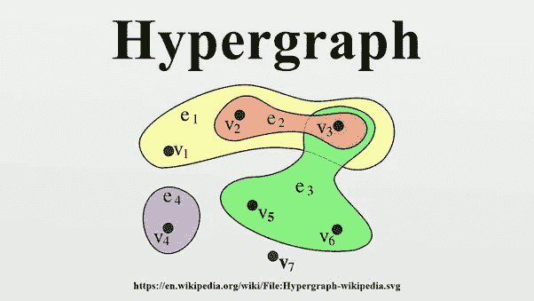

# 超图在机器学习中的应用

> 原文：<https://pub.towardsai.net/hypergraphs-applications-in-machine-learning-7850a20852a9?source=collection_archive---------0----------------------->

## [数据可视化](https://towardsai.net/p/category/data-visualization)

## 风险管理、可视化分类、新冠肺炎检测和许多其他使用案例

许多现实世界的问题比简单的图表所能模拟的要复杂得多。超图是一个比图更通用的术语，可以模拟复杂的网络。超图在建模基因交互、计算机网络、风险管理、视觉分类和社交媒体方面有许多用途。**在超图中，边，即所谓的超边，可以连接两个以上的顶点，不像图中一条边只能连接两个顶点。**这意味着一个超图通过连接许多顶点将边定义扩展到超边。

与超图相比，正则图中的关系是成对定义的。**成对的关系或相互作用无助于解释某些工程问题中顶点之间的高阶相互作用。**将高阶交互转换为两个顶点之间的成对交互时，信息会丢失。

超图可以表示群体关系，因此在解决技术问题方面有许多用途。超图的真实例子是像脸书或 Linkedin 这样的社交网络。每个用户都是一个顶点，可以是一个组的一部分。一个群是一个超边。简化超图中的高阶交互是至关重要的，并不总是具有反转属性。**网络中心性分析，如特征向量或介数中心性，不能从普通图一对一地转换到超图，需要根据您的解释进行调整。下面是一些使用超图解决问题的应用程序。**

# 关键基础设施风险管理的超图

关键基础设施系统，如 SCADA(监控和数据采集),控制和监测分布式系统，如天然气管道或铁路控制系统，是复杂的，包含许多高度相互依赖的组件。所有组件还具有组依赖性。**超边连接一组代表功能的组件。**

**一组组件可能是危害整个系统的安全攻击的来源。**组件故障也可能是系统故障的来源，必须在风险分析期间进行评估。**有缺陷的零件首先影响其代表功能的组件组，然后影响整个系统。**

# 视觉分类超图

所收集的传感器数据之间的复杂关系不允许通过成对关系用简单的图表来对系统建模。**超图可以对高度相关的数据进行建模。基于环境影响，视觉数据在许多领域具有相互依赖性和相关性。**根据[超图诱导卷积网络](https://zh.booksc.eu/book/73021398/83193a)，数据分类是高阶数据关联。学习过程优化了图像数据中的高阶相关性。

# 鉴别新冠肺炎病毒的超图

电晕疫情自 2019 年以来一直是一场全球危机，并大大改变了我们的生活。疫情早期使用 CT 成像来快速检测冠状病毒。**超图建模可以帮助区分新冠肺炎和其他肺部疾病。**这篇[论文](https://www.ncbi.nlm.nih.gov/pmc/articles/PMC7690277/)展示了如何在 CT 成像过程中使用超图来区分新冠肺炎病。

# 生物网络中的超图

由于多路径关系的特性，超图适合于对蛋白质复合物和代谢反应进行建模，如这篇[论文](https://bmcbioinformatics.biomedcentral.com/track/pdf/10.1186/s12859-021-04197-2.pdf)所示。生物系统有复杂的相互作用的实体网络。根据这篇文章，不同超图之间的**比较使得识别病毒感染的未知迹象成为可能。**