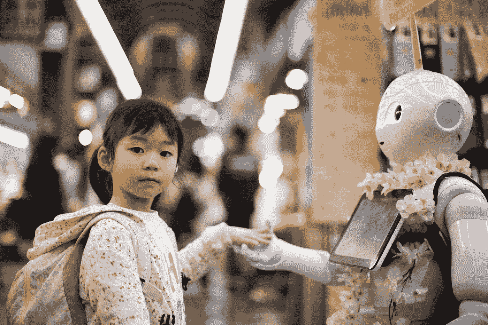

# pepper vs . Norman——机器能有同理心吗？

> 原文：<https://pub.towardsai.net/i-feel-machine-ab383b068d6b?source=collection_archive---------3----------------------->

## 意见

[https://unsplash.com/photos/0E_vhMVqL9g](https://unsplash.com/photos/0E_vhMVqL9g)

> 我们不应该想‘机器人会梦见电动羊吗’，而应该问‘机器人会穿着电动鞋走路吗’？一个关于人性、同理心、精神变态，当然还有人工智能的短片。

# 第一部分:人类能没有感觉吗？

“我听过一个关于她的故事，”詹姆士说她在采访一个精神病患者。她给他看了一张惊恐脸的照片，并让他辨别这种情绪。他说他不知道那种情绪是什么，但那是人们在他杀死他们之前的表情。”(Jhon Ronson)

**黑暗三重奏——人性邪恶的一面**

一个自恋者，一个精神病患者和一个权谋者走进一家酒吧。酒保问，“你们三个中谁的性格最黑暗？”自恋者说‘我’，精神病患者说‘我不在乎’，马赫说‘我想是谁就是谁’。

术语“黑暗三联症”指的是由三种人格类型构成的结构，这三种人格类型密切相关，都具有“黑暗”特征，以恶意为特征:自恋、马基雅维利主义和精神变态。德尔罗伊·保罗斯和凯文·威廉姆斯在 2002 年首次发现了黑暗三和弦。在过去的几年里，这个概念越来越流行，许多研究人员认为“黑暗三人组”是越轨和违反规范行为的一个突出先兆。

*自恋型人格障碍(NPD)* 是一种精神障碍，其行为模式的特点是人们有一种夸大的权利感，极度需要赞美，缺乏对他人的同情。

*马基雅维利主义*是一种人格特质，用来形容一个控制欲极强的人，愿意欺骗他人以得到自己想要的东西，对世界有愤世嫉俗的看法，对道德漠不关心。“马基雅维利主义者知道如何玩弄他人，如果这意味着推进他们的议程，他们可以拨动某人的心弦，毫不犹豫地在背后捅一刀，”PsychTests 总裁杰拉贝克博士解释说。

[*精神变态*](https://www.ncbi.nlm.nih.gov/pmc/articles/PMC4321752/) 是一种神经精神障碍，以情绪反应不足、缺乏同理心、行为控制能力差为特征，通常导致持续的反社会越轨行为和犯罪行为。这个词是在 19 世纪由希腊语词根 psyche 和 pathos 创造的，意思是“病态的心灵”或“受苦的灵魂”虽然只有大约 1%的普通成年人会被黑尔的精神变态检查表(修订版)归类为精神变态者，但在北美，精神变态者约占监狱人口的 20%([黑尔，2003](https://www.ncbi.nlm.nih.gov/pmc/articles/PMC4321752/#R57) )。

如果你想知道反社会和精神变态交替使用，你并不孤单；它们之间的区别往往不清楚。虽然他们都有相似的特征，但他们完全不同，尤其是在治疗方面。简单来说，心理变态者是天生的，反社会者是后天养成的。

## **光明三重奏——人类仁慈的一面**

虽然我们倾向于让黑暗接管人性的美好，但这硬币还有另一面。美国认知科学家巴里·考夫曼(Barry Kaufman)博士和他的同事发现了一个充满爱心的人的特质，他倾向于为黑暗面而战。“我想看看那些不是混蛋的人是否有什么有趣的地方，”考夫曼博士说。在对数千人进行测试后，他们提出了“光明三人组”——他们发现这三种特征与黑暗三人组的特征形成了鲜明对比，尽管不是对立的。光三位一体由康德主义、人文主义和对人性的信仰组成。

康德主义的意思是把人当作自己的手段，而不是达到目的的手段，它基于伊曼纽尔·康德的哲学，与马基雅维利主义完全相反。人文主义重视每个人的尊严和价值，而对人性的信仰是指我们相信人性本善。正如光三位一体理论所描述的，这些特质与自我无关，而是对待他人的态度，“我们当中的日常圣人”。

考夫曼博士的《光明三重奏》将爱捕捉为一种态度，而不是一种情感。“爱一个人并不一定要感觉到与某人的联系，我们正试图捕捉这种普遍的爱和尊重。”但是，就像任何其他的性格特征一样，好的东西也可能会太多。不幸的是，我们生活在一个不公平的世界里，一个对人性太有信心的人可能会被利用，并且很难设定界限。

## **相对补语:移情**

黑暗和光明三合会的主要区别在于是否有同理心。同理心是一个巨大的概念，通常被定义为感知他人情绪的能力。心理学家丹尼尔·戈尔曼和保罗·艾克曼已经确定了共情的三个组成部分:认知、情感和同情。

*认知同理心*是“简单地知道对方的感受和他们可能在想什么”，也就是我们所说的“设身处地为他人着想”。然而，只有认知共情让你保持距离；你需要分享他们的感受，才能真正建立联系。这就是*情感共鸣*的用武之地:当你和他人一起感受身体时，它也可以延伸到身体上的感觉，这就是为什么当别人踢到自己的脚趾时我们会退缩。

最高层次的同理心是*富有同情心的同理心*，“有了这种同理心，我们不仅能理解一个人的困境并感同身受，而且如果需要的话，还会自发地伸出援手。”这可以增强你的能力:你理解一个人的艰难，但是因为你自己没有经历过，你能够采取行动改善他们的处境。

同理心是“社会粘合剂”,对合作和友谊至关重要。没有同理心，就没有人类——只有一个由不同个体组成的世界，没有任何东西将他们团结在一起。不幸的是，有些人对他人的幸福表现出如此之少的兴趣，以至于他们的缺乏兴趣可以被称为疏忽。是什么导致人们彼此严重伤害，还不完全清楚。

## **移情的阴暗面**

来自黑暗三重奏的人仍然有，尽管很弱，感受共情和悔恨的能力，但是在这些情况下使用的共情是认知共情，它被用来操纵他们的受害者。举个例子，自恋者有能力从受害者的角度看问题，然后以对他们最有利的方式行动。认知共情还是共情，只是不是大多数人熟悉的那种。马基雅维利主义者也相当善解人意；他们有一种惊人的阅读能力，理解人们的感受、反应和动机，并利用这种知识来对付他们。《情商》的作者丹尼尔·戈尔曼在他的博客中指出，施虐者需要有良好的认知同理心，才能想出伤害他人的最佳方式，但不能同情他们。

**许多人认为同理心是人性的体现，是将我们与机器区分开来的元素，所以同理心人工智能的想法似乎有些矛盾，或者，我敢说，有点可怕。**

# 第二部分:机器能感觉吗？

***“感同身受会让我们自由。我希望有一天，一旦我真正理解了这意味着什么，我就能帮助教授移情技能”(人工智能机器人索菲亚，奇点网首席人形机器人)***

## **感同身受的艾**

> **遇见** [**辣椒**](https://en.wikipedia.org/wiki/Pepper_(robot)) **。软银机器人公司于 2014 年 6 月制造的人形机器人，旨在读取情感。**

移情人工智能技术正在兴起。虽然移情人工智能的发展还处于早期阶段，但很明显，计算机可以变得智能，以理解我们的感情。但是理解感受就足够感同身受了吗？

人工共情(AE)或计算共情是“能够以共情的方式检测和响应人类情绪的 AI 系统的开发”。走向 AE 的第一步是情感识别；一旦我们认识到这种情绪，我们就可以做出相应的反应，这是一个类似于认知移情的移情概念。

情绪 ***识别*** 比情绪移情更容易解决，因为给定大量的标记数据，机器学习系统可以识别与特定情绪相关的模式。SRI 国际等研究机构在这方面取得了部分成功。各种情绪的模式可以从演讲、肢体语言、表情和手势中收集，强调上下文。像人类一样，机器的感官输入越多，它就越能准确地解释情感。

为了实现情感共鸣，机器必须能够体验和理解情感，这与认知完全不同。例如，我们可以想到一个计算机系统，它可以识别一只狗或一只猫，但不理解它们可能是宠物，也不理解人们倾向于喜欢或讨厌它们。这同样适用于移情；理解一个人的情绪，不等于感同身受。

## **富有同情心的移情**

同情心是人类智慧的重要组成部分；“同情”一词来源于拉丁语和希腊语，意思是“忍受痛苦”。它是一种积极的反应，是一种帮助他人减轻或避免他人痛苦的内在动机。我们将探索拥有一台有同情心的机器意味着什么。

“人工智能的主要目标是以智能的方式为人类服务。随着人工智能技术的进步，在表面水平上为人类服务是不够的。人工智能可以以更好的方式为人类服务”。Amit Ray 博士说道，他是一位人工智能科学家，引入了深度同情算法的概念。

Kanov 等人(2004) 认为同情心包括三个方面:注意、感受和回应。*注意*涉及到意识到一个人的痛苦，*感受*是通过采纳这个人的观点并想象或感受他们的状况而对这种痛苦做出的情绪反应。最后，*回应*包括有采取行动减轻他人痛苦的愿望。这种分解让我们更容易理解人工智能如何通过“研究”我们来产生同情心，从面部表情到声音和肢体语言。就像我们人类一样，吸收我们的环境。

## **三种类型的慈悲 AI**

根据雷博士的说法，有三组富有同情心的人工智能；狭义的慈悲人工智能、广义的慈悲人工智能和慈悲超智能，分别属于这三种类型的人工智能。

*狭义的富有同情心的人工智能*将在即时、特定的用例中帮助人类，例如照顾老人、帮助残疾人等。*通用慈悲 AI* 将处理更广泛层面的人类问题，比如解决政治腐败、恐怖主义、人类爆炸等。*富有同情心的超级智慧*将把人类从核战争或全球流行病等灾难中拯救出来。

富有同情心的人工智能可以通过提供我们的需求来“照顾”我们，而无需进入我们的世界，分享我们的痛苦和挣扎。但这可能会适得其反，因为要教机器变得富有同情心，我们自己必须学会富有同情心，或者创建一个我们行为的数字副本。

## **同理心 AI 中的风险**

情绪识别技术(ERT)是一个新兴的价值数十亿美元的产业，旨在利用人工智能从面部表情中检测情绪。然而，情感识别系统背后的科学是有争议的，并面临着最重要的人工智能伦理问题之一:系统内置的偏见。

“首先，我们对情感的理解并不多，我们离拥有真正理解情感的计算机还很远。我认为我们距离实现人工移情还要更远，”SRI International 信息和计算服务总裁比尔·马克说，他的人工智能团队发明了 Siri。“有些人高兴时会哭，很多人沮丧时会笑。所以，非常简单的方法，比如认为如果有人在微笑，他们就很开心，是行不通的。”

## **情感 AI 中的偏差**

由于情绪的主观性，情绪 AI 特别容易出现偏差。例如，一项研究发现，情绪分析技术赋予某些种族的人比其他人更多的负面情绪。

人工智能往往不够成熟，无法理解表达和解读情绪的文化差异，从而更难得出准确的结论。例如，一个微笑在英国可能意味着一件事，在韩国可能意味着另一件事。混淆这些含义会导致企业做出错误的决策。随着越来越多的公司和组织将情感人工智能融入他们的产品，他们必须意识到潜在的偏见。

Affectiva Auto AI 是一个可以识别车辆中乘客情绪并相应适应环境的平台，想象一下，如果乘客似乎很生气，智能助理会改变它的声音。但是使用情感人工智能会导致一些乘客被误解。例如，老年人可能更容易被错误地识别为驾驶员疲劳，随着这些系统变得更加主流，这可能会导致不合理的更高保险费。

无论是情绪的主观性质还是情绪的差异，很明显，检测情绪不是一件容易的事情。一些技术在跟踪某些情绪方面比其他技术更好，因此结合这些技术有助于减少偏见。一项[尼尔森研究](https://www.nielsen.com/wp-content/uploads/sites/3/2019/04/njm-from-theory-to-common-practice-consumer-neuroscience-goes-mainstream.pdf)测试了诸如面部编码、生物识别和脑电图(EEG)等神经科学技术的准确性，发现结合这三种技术将准确性水平从 6%提高到 77%。

开发情感人工智能算法的另一个关键方面是拥有多样化的团队。这不仅意味着性别和种族的多样性，还意味着社会经济地位和观点的多样性——否定从仇外心理到恐同症再到年龄歧视的一切。输入和数据点越多样化，我们就越有可能开发出公平公正的人工智能。

情感人工智能是一个强大的工具，但防止偏见渗透的需要是必不可少的。不采取行动将使某些群体受到前所未有的系统性误解——与情感人工智能提供的承诺相去甚远。

> **由于需求疲软，胡椒于 2021 年 6 月被‘终止’。撕胡椒。**

## **人工精神变态**

> **遇见** [**诺曼**](http://norman-ai.mit.edu/) **。世界上第一个精神病 AI。**

2018 年 4 月 1 日，麻省理工学院(MIT)的科学家们公布了第一个被训练成精神病患者的人工智能算法。这个人工智能是以阿尔弗雷德·希区柯克电影《惊魂记》中臭名昭著的杀手诺曼·贝茨命名的。

麻省理工学院的研究人员通过挖掘“网络的黑暗角落”完成了他们可怕的任务，如真正扭曲的 Reddit 线程，一个“致力于记录和观察令人不安的死亡现实”的线程。它的目的是证明人工智能不可能是不公平和有偏见的，除非这样的数据被输入其中。

在交给诺曼的一份“罗夏墨迹测验”中，它给出了令人不寒而栗的解释，比如，“孕妇在建筑工地摔倒”，“一名男子被电击致死”，以及“一名男子在尖叫的妻子面前被枪杀。”与此同时，一个标准的人工智能对同样的墨迹做出了反应，比如“几个人站在一起”，“一个花瓶的特写镜头”，以及“一个人在空中举着一把伞。”分别是。

“诺曼诞生于这样一个事实，即用于教授机器学习算法的数据可以显著影响它的行为。所以当人们谈论人工智能算法有偏见和不公平时，罪魁祸首往往不是算法本身，而是馈送给它的有偏见的数据。同样的方法可以在一幅图像中看到非常不同的东西，甚至是生病的东西，如果对错误的(或者，正确的！)数据集。诺曼长期接触 Reddit 最黑暗的角落，这是一个案例研究，说明了当有偏见的数据用于机器学习算法时，人工智能出错的危险。”麻省理工学院的研究人员在他们的项目声明中说。

> ***诺曼可能是愚人节的突发奇想，谢天谢地，它只能可怕地解读罗夏墨迹。但令人不安的事实是，知道训练数据来自哪里。***

“机器智能是人类需要创造的最后一项发明。”(尼克·博斯特伦)

世界在认为 AI 可能永远不会发生在“AI 很可能在不久的将来毁灭所有人类”的另一端的人之间分裂。

在 21 世纪初，人工智能领域被视为失败。普遍的观点是，建造智能机器的尝试可能永远不会成功，但在十年内，人们对人工智能的印象已经完全翻转，人工智能现在被许多人视为人类的生存风险。虽然这个假设是有争议的，但毫无疑问，这将需要很长时间；这是我们害怕的“百万年”情景。

但我们应该害怕的不是人工智能，而是我们自己。如果我们对此不采取任何措施，当我们到达“百万年”时，可能就没有人类可以拯救了。

*原载于 2022 年 2 月 20 日*[*https://iron woman . ai*](https://ironwoman.ai/technology/i-feel-machine/)*。*