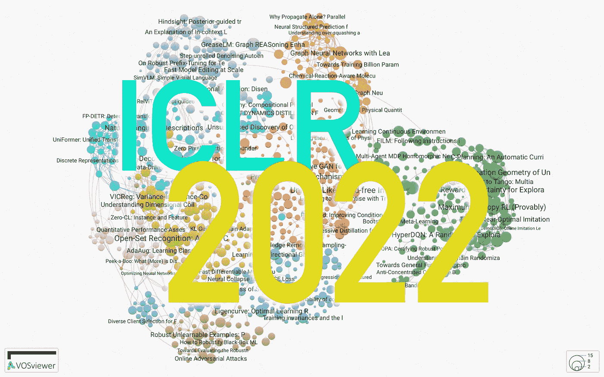
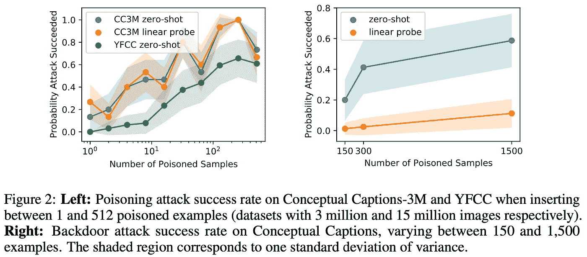
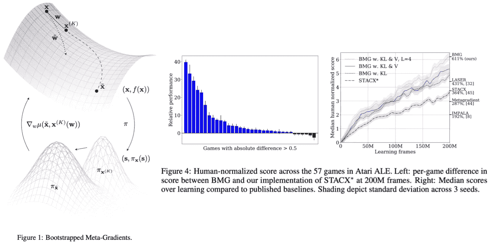
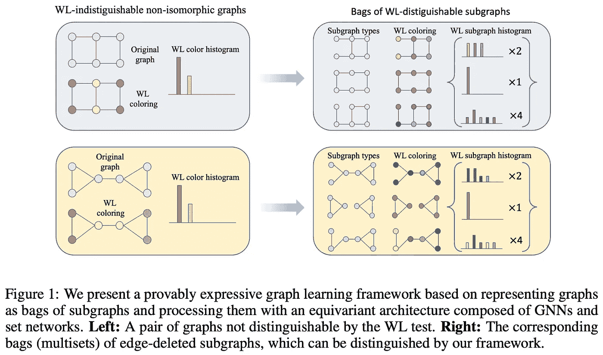
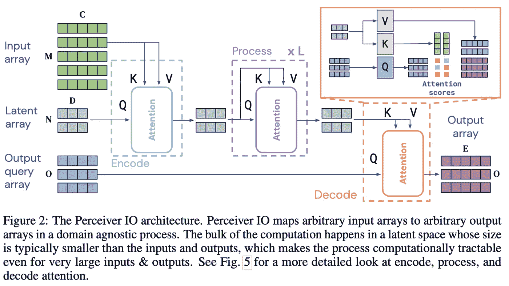
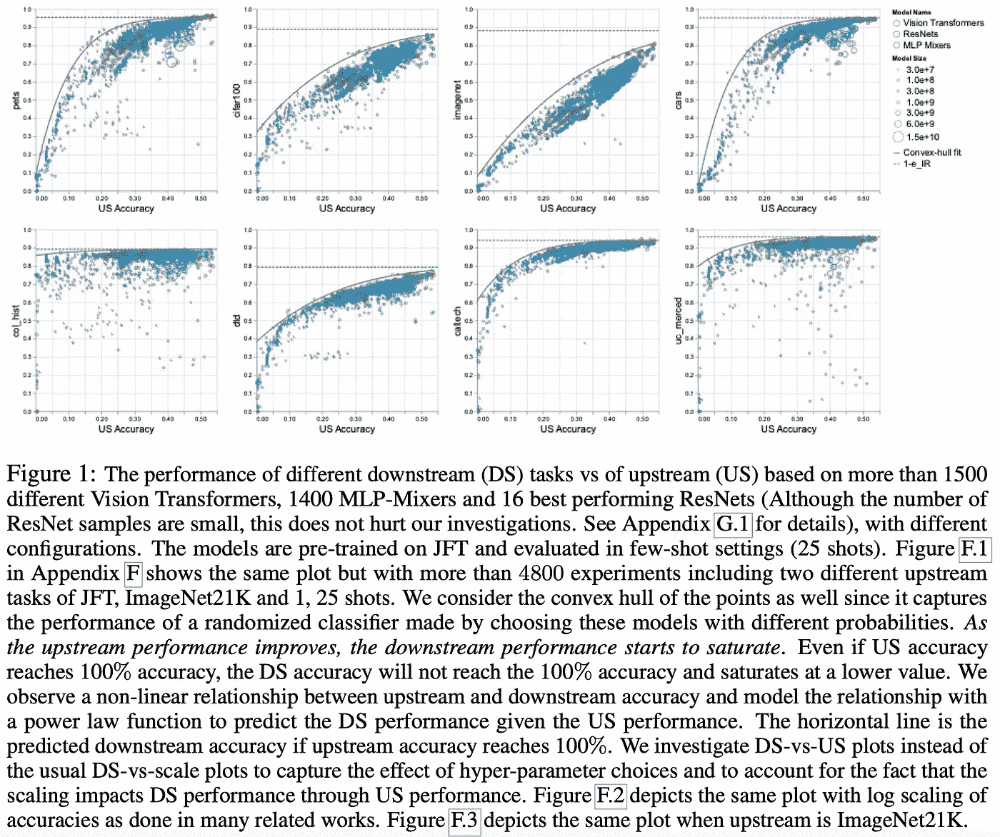
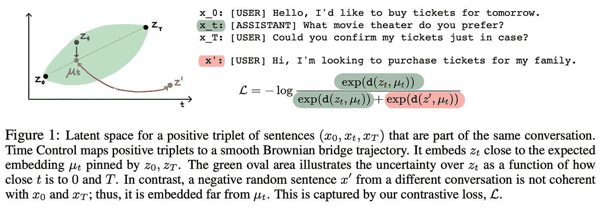
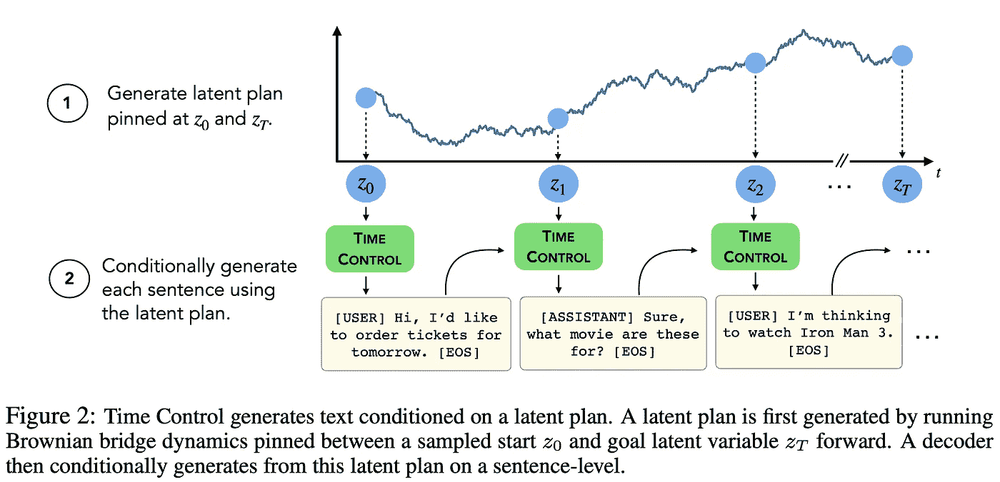
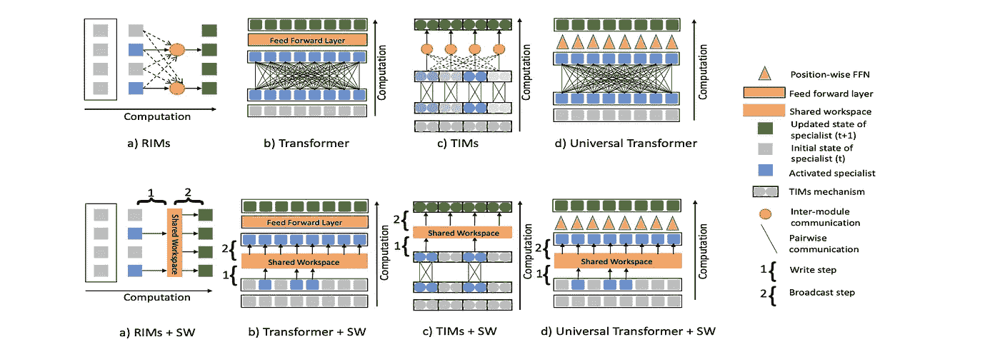
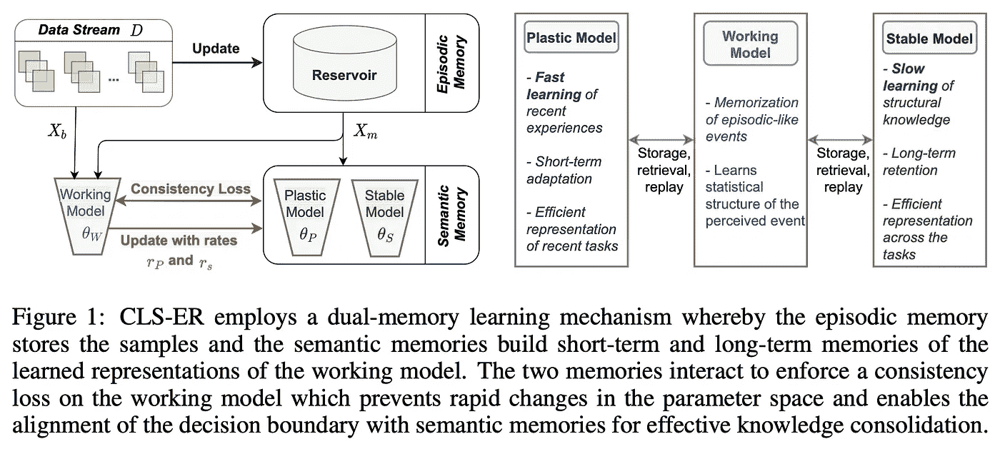

# ICLR 2022——你不该错过的 10 篇论文精选

> 原文：<https://pub.towardsai.net/iclr-2022-a-selection-of-10-papers-you-shouldnt-miss-fbc172553479?source=collection_archive---------0----------------------->

## 希望今年最后一次大型虚拟人工智能会议？学习表征国际会议在这里举行，它挤满了高质量的 R&D:超过一千篇论文，19 个研讨会，和 8 个特邀报告。从哪里开始？嗯，我们有一些建议！

图片由 Zeta Alpha 提供。

[学习表征国际会议(ICLR)](https://iclr.cc/) 将在网上举行(连续第三年！)从 4 月 25 日星期一到 4 月 29 日星期五。这是机器学习研究领域最大、最受欢迎的会议之一，今年也不例外:它包含了一千多篇论文，主题包括 ML 理论、强化学习(RL)、计算机视觉(CV)、自然语言处理(NLP)、神经科学等等。

他们中的一些人已经在 arxiv.org 呆了几个月了，人们已经在他们的基础上进行建设:例如，看看在会议即将开始时已经被引用的 ICLR 的论文:

在任何情况下，我们都希望对这一庞大的内容阵容有所了解，我们已经深入研究了会议内容，以精选出最能激起我们兴趣的论文。事不宜迟，这里是我们的选择！

## [1。自回归扩散模型](https://openreview.net/forum?id=Lm8T39vLDTE) |👾[代号](https://github.com/google-research/google-research/tree/master/autoregressive_diffusion)

作者:Emiel Hoogeboom，Alexey A. Gritsenko，Jasmijn Bastings，Ben Poole，Rianne van den Berg，Tim Salimans。

> **作者的 TL；DR →** 一个新的离散变量模型类，包括阶不可知自回归模型和吸收离散扩散。

**❓为什么→** 扩散模型在过去的一年里变得越来越受欢迎，它们正逐渐被吸收到深度学习工具箱中。本文为这些模型提出了一个重要的概念创新。

**💡关键见解→** 通俗地说，扩散模型通过在像素网格上反复添加“可微分噪声”来生成图像，最终成为看起来真实的图像。推断从采样某种“白噪音”图像开始。这项工作提出了一个类似的过程，但不是应用扩散步骤来同时迭代解码所有像素，而是一次自回归解码几个像素，然后在剩余的过程中保持固定(见下图)。

资料来源:https://openreview.net/pdf?id=Lm8T39vLDTE

此外，与达尔·e⁴等其他自回归图像生成方法相比，这种方法在解码图像时不需要特定的排序。甚至，在给定解码整个图像的步骤的固定预算的情况下，在每个扩散步骤解码的像素的数量可以由模型动态调整！

对于训练，类似 BERT 的去噪自动编码器自监督目标就足够了:给定一幅图像，屏蔽一部分像素，并预测其中几个像素的值。虽然结果不是惊天动地的，但这在概念上是扩散模型的简单而有效的演变，允许它们解码输出自回归，并应用于非从左到右的文本生成。如果你想更深入地研究这篇论文，Yannic Kilcher 有一个精彩的讲解视频，我强烈推荐。

## [2。中毒和走后门对比学习](https://openreview.net/forum?id=iC4UHbQ01Mp)

*尼古拉斯·卡里尼，安德烈亚斯·泰尔齐斯。*

> 一个乌瑟斯的 TL；DR →我们认为中毒和后门攻击是对多模态对比分类器的严重威胁，因为它们被明确设计为在来自互联网的未分类数据集上进行训练。

**❓为什么→** 利用从网络上搜集的数据进行大规模自我监督预训练是训练大型神经网络的基本要素之一。对于来自 OpenAI 的众所周知的剪辑，来自网络的嘈杂的未切割的图像-文本对被用于训练。什么会出错？嗯，这个。

**💡关键见解→** 本文探讨了对手可能如何毒害 CLIP 等模型的一小部分训练数据(使用来自网络的图像-文本对的对比学习进行训练),从而使模型将测试图像错误分类。为此，他们尝试了两种方法:

*   **目标中毒:**通过添加中毒样本来修改训练数据集，目的是使最终模型用错误的特定标签将特定图像错误分类。根据结果，这可以通过仅毒化 0.0001%的训练数据集来一致地实现，例如将 3 个图像对添加到 300 万个实例的数据集。
*   **后门攻击:**这种方法的目的是在任何图像上覆盖一小块像素，而不是有一个特定的目标图像，这样这将被误分类为一个期望的错误标签。通过毒害 0.01%的训练数据集，例如毒害 300 万个实例数据集中的 300 个图像，可以持续地实现这种更有野心的攻击。

来源:https://openreview.net/pdf?id=iC4UHbQ01Mp

任何人都可以操纵公共互联网数据，这使得这些攻击可行。这是使用未精确数据训练模型的一个新的弱点，在开发和部署模型时应该考虑这些数据。

## [3。自举元学习](https://openreview.net/forum?id=b-ny3x071E5)

*作者:塞巴斯蒂安·弗伦纳哈格，亚尼克·施洛克尔，汤姆·萨哈维，哈多·范·哈瑟尔特，大卫·西尔弗，莎廷德·辛格。*

> **作者的 TL；我们提出了一个梯度元学习算法，从元学习者自身或另一个更新规则引导元学习者。**

**❓为什么→** 众所周知，许多强化学习算法对超参数的选择非常敏感。元学习是一种有前途的学习范式，用于提炼学习者的学习规则(包括超参数)，以使学习更快、更稳健。

**💡关键见解→** 在元学习中，学习者配备了优化内部优化的“学习规则”的外部优化循环，这直接优化了学习目标(例如，通过梯度下降)。用非常简单的话来说，现有的元学习算法通常依赖于学习者的表现来评估学习规则:让学习者跑 k 步，如果学习改善了*就多做那件事*，如果学习变坏了*就少做那件事。*直接使用学习者目标的问题在于，元学习优化将(1)被约束到学习目标函数的相同几何形状，以及(2)优化将是短视的，因为它将仅针对 k 个步骤的范围进行优化，而超过这一范围的学习的动态可能要复杂得多。

坦率地说，这个过程的理论细节超出了我的理解范围，但它的要点是，元学习者首先被要求预测学习者在评估的 k 步之外的表现，然后它根据这个预测进行优化；换句话说，元学习者生成自己的优化目标。这使得元学习者能够针对更长的时间范围进行优化，而不需要实际评估这样长的时间范围，这在计算上是昂贵的。

资料来源:https://openreview.net/pdf?id=b-ny3x071E5

作者证明了这种方法的一些很好的理论性质，并且实验结果在 [ATARI ALE 基准](https://github.com/mgbellemare/Arcade-Learning-Environment)上实现了新的最先进的(SOTA)以及多任务学习中的效率改进。

## [4。等变子图聚合网络](https://openreview.net/forum?id=dFbKQaRk15w)

*作者:Beatrice Bevilacqua、Fabrizio 弗拉斯卡、Derek Lim、Balasubramaniam Srinivasan、蔡晨、Gopinath Balamurugan、Michael M. Bronstein、Haggai Maron。*

> **作者的 TL；DR →** 我们提出了一个可证明的表达性图学习框架，该框架基于将图表示为子图的多重集，并用等变架构处理它们。

**❓为什么→** 信息传递神经网络(mpnns)对图形的有限表达能力——这属于图形神经网络(GNNs)的范畴——是妨碍 GNN 研究人员晚上睡得好的根本问题之一。

**💡关键见解→** 如何知道两个图是否相同？你可能认为仅仅看着它们就够了，但是你错了。通过重新组织或允许节点的顺序，相同的图可以以不同的方式表示，使得给定的两个图可能很难识别它们是否是相同的，即同构的。

魏斯费勒-莱曼(WL)测试是一种算法，该算法基于其直接邻域递归地对图的节点进行分类。如果在所有这些过程之后，两个图的节点具有“不同的分类”，这意味着测试失败，意味着两个图是不同的(非同构的)。另一方面，如果这两个图在 WL 测试后“仍然相同”,那么它们可能是*同构的，但是不能保证！**WL 测试无法区分某些图形结构。***

来源:[https://openreview.net/pdf?id=dFbKQaRk15w](https://openreview.net/pdf?id=dFbKQaRk15w)

mpnn 可以理解为 WL 测试的可微分模拟，这就是为什么 mpnn 继承了 WL 测试的表达限制:它们不能区分某些图的子结构。更进一步，取决于 MPNNs 如何从他们的邻居那里收集信息，他们甚至可能没有 WL 测试的表达能力！

这项工作建立了所有这些联系，并提出了一种最大化 mpnn 表达能力的方法，该方法包括将一个图分解成一个子图包，并将 mpnn 应用于这些子图包。这篇论文相当密集，但是如果你想获得论文的主旨或者对开始学习 GNNs 感兴趣，我强烈推荐 Zak Jost 的 [ML Street Talk 插曲，其中](https://www.youtube.com/watch?v=jAGIuobLp60)[他们从第 47 分钟](https://youtu.be/jAGIuobLp60?t=2828)开始报道这篇论文。

**其他 GNN 在 ICLR 的工作:** [具有可学习的结构和位置表示的图形神经网络](https://openreview.net/forum?id=wTTjnvGphYj)

## [5。感知者 IO:结构化输入的通用架构&输出](https://openreview.net/forum?id=fILj7WpI-g)

*作者:Andrew Jaegle、Sebastian Borgeaud、让·巴普蒂斯特·阿拉拉克、卡尔·多伊尔施、卡特林·约内斯库、David Ding、塞犍陀·科普拉、Daniel Zoran、Andrew Brock、Evan Shelhamer、Olivier Hénaff、Matthew M. Botvinick、Andrew Zisserman、Oriol Vinyals、joo Carreira。*

> **作者的 TL；DR →** 我们提出了感知者 IO，这是一种通用架构，可以处理来自任意设置的数据，同时与输入和输出的大小成线性比例。

**❓为什么→** 通过尽可能少的假设对数据进行建模很有趣，因为它有可能很好地转移到不同的模态。

**💡关键见解→** 这项工作遵循与原始感知者相似的路线，通过增加灵活的查询机制，让模型具有任意大小的输出，而不是在模型末端需要特定于任务的架构。这支持各种大小和语义的输出，不再需要特定于任务的架构工程。

通过查看下图可以理解该模型的概况:输入可以是映射到潜在数组编码中的任意长的嵌入序列。这个过程允许对非常长的输入序列建模，假设潜在数组大小是固定的，当输入变得非常长时，没有二次复杂度爆炸。在这个“编码步骤”之后，模型应用由自关注层和前馈层的组合组成的公共 *L* 变换器块。最后，解码步骤接收一个输出查询数组，并将其与输入的潜在表示相结合，以产生所需维数的输出数组。

来源:[https://openreview.net/pdf?id=fILj7WpI-g](https://openreview.net/pdf?id=fILj7WpI-g)

许多现有的学习技术，如掩蔽语言建模或对比学习，也可以应用于这种架构。遵循每种模式的常见现有训练方法，该模型在 NLP 和视觉理解、多任务和多模式推理以及光流方面产生了很好的结果。见鬼，他们甚至将它插入到 AlphaStar 中(替换现有的变形金刚模块),在具有挑战性的星际争霸 2 游戏中取得了优异的成绩！

如果你对这项研究感兴趣，你应该看看感知者的最新版本，即[等级感知者](https://arxiv.org/abs/2202.10890) ⁷.

## [6。探索大规模预培训的极限](https://openreview.net/forum?id=V3C8p78sDa)

周欣宇·阿布纳、穆斯塔法·德赫加尼、贝南·内沙布尔、哈尼·塞德吉。

> **作者的 TL；DR →** 我们对具有广泛下游任务的图像识别中的少量拍摄和迁移学习的大规模预训练的限制进行了系统研究。

**❓为什么→** 规模一直是 ML 圈子里讨论的话题。我们经常强调论文，因为这肯定是该领域必须努力解决的重要问题之一:添加参数和数据在哪里不再有用？继续读。

**💡关键见解→** 类似于“随着我们提高上游精度，下游任务的性能会饱和”。

他们研究上游(US)任务(例如大规模 ImageNet 标签)的预训练性能如何转移到下游(DS)性能(例如鲸鱼检测)。然后做大量的实验——大量意味着**大量**——架构和规模:

> “对视觉变压器、MLP 混合器和 ResNets 进行 4800 次实验，参数数量从一千万到一百亿不等，在最大规模的可用图像数据上进行训练”。

因此，有趣的图表显示了上游绩效(US，预训练)和下游绩效(DS，最终任务)之间的关系。几乎是全面的，它最终会饱和。尽管如此，看到计算机视觉的不同架构还是非常有趣的！

来源:[https://openreview.net/pdf?id=V3C8p78sDa](https://openreview.net/pdf?id=V3C8p78sDa)

作者声称，他们的观察总体上看起来对诸如上游数据的大小或训练数量*和架构选择等选择是稳健的。他们还探讨了超参数选择的影响:一些超参数对美国非常好，但不能很好地转化为 DS 吗？是啊！他们在第 4 节中深入研究了这一现象，并发现，例如，重量衰减是一个特别显著的超参数，它以不同的方式影响着我们和 DS 的性能。*

在*没有人*真正从零开始训练模型，而是选择预先训练的模型来引导他们的应用的背景下，这项研究是关键。这篇论文不仅仅是几段话就能概括的，如果你想深入研究，它绝对值得一读！

## [7。通过随机过程进行语言建模](https://openreview.net/forum?id=pMQwKL1yctf)

罗斯·王锷，埃辛·杜马斯，诺亚·古德曼，桥本达森。

> 作者的 TL；我们引入了一个语言模型，它通过一个潜在的随机过程隐含地进行规划。

**❓为什么→** 现代大型生成式语言模型非常擅长写短文本，但当它们生成一个长文本时，全局一致性往往会丢失，事情不再有意义。本文提出了一种方法来减轻这一点。

**💡关键见解→** 典型语言模型(LM)仅在符号粒度级别生成文本，这严重偏向于模型学习短程交互，而不是长程交互，这正是实现连贯的全球叙事所需的*技能*。这项工作提出在句子的粗层次上对语言建模，作为一个随机过程，指导 LM 的生成是全局一致的。

提出的模型被称为时间控制，它将句子表征建模为潜在空间中的布朗运动。对于训练，给定两个开始和结束*锚定*句子，通过使锚定句子中的肯定句子落入潜在空间中锚定句子表示的“布朗桥”中，然后将否定样本推出来建立对比损失(图 1)。我以前也不知道布朗桥是什么:起点和终点位置固定的布朗(摇摆)轨迹。

对于推理，通过从潜在空间中的布朗过程中采样来生成句子级别的计划，然后在这个高级计划的条件下生成标记级别的语言(图 2)。

来源:[https://openreview.net/pdf?id=pMQwKL1yctf](https://openreview.net/pdf?id=pMQwKL1yctf)

结果非常有趣，尤其是在语篇连贯准确性方面，时间控制表现出色。这项工作提出了一个有希望的方向，让 LMs 克服经典的限制，而不需要去万亿参数规模制度。

**ICLR**的其他关于语言模型的相关工作有(FLAN) [微调语言模型是零命中率学习者](https://openreview.net/forum?id=gEZrGCozdqR)、[多任务提示训练实现零命中率任务泛化](https://openreview.net/forum?id=9Vrb9D0WI4)、 [Charformer:基于梯度子词标记化的快速字符转换器](https://openreview.net/forum?id=JtBRnrlOEFN)、 [GreaseLM:图形推理增强语言模型](https://openreview.net/forum?id=41e9o6cQPj)、 [HTLM:超文本语言模型预训练和提示](https://openreview.net/forum?id=P-pPW1nxf1r)或[微调扭曲了预训练的特征和不足](https://openreview.net/forum?id=UYneFzXSJWh)

## [8。通过共享的全局工作空间协调神经模块](https://openreview.net/forum?id=XzTtHjgPDsT)

*作者:Anirudh Goyal、Aniket Didolkar、Alex Lamb、Kartikeya Badola、Nan Rosemary Ke、Nasim Rahaman、Jonathan Binas、Charles Blundell、Michael 莫泽尔、Yoshua Bengio。*

> 作者 TL；DR → 不同专家之间使用共享工作空间进行交流，允许更高层次的互动。

**❓为什么→** 脑启发的模块化神经架构正在兴起；尽管他们在流行的计算机视觉或自然语言处理基准上缺乏成功，但他们在鲁棒性、域外泛化，甚至学习因果 mechanisms⁶.方面显示出了有希望的结果

**💡关键见解→** 全球工作空间理论(GWT)是一个提议的认知架构，用于解释人类有意识和无意识的思维过程是如何体现的。其核心假设之一是存在一个所有专家模块都可以访问的共享工作空间，从而使原本孤立的模块之间能够保持一致。本文将神经网络架构概念化，其中一组输入由专家神经网络处理，然后写入共享工作空间(一组向量)，然后再次广播给专家。

这听起来可能比实际情况更离奇。例如，想象一个处理输入序列的转换器，您可以将位置操作概念化为专家。共享工作空间对允许在共享全局工作空间中更新多少更新的隐藏状态施加了条件，施加了一定程度的稀疏性，这已被证明提高了鲁棒性和域外泛化。

来源:https://openreview.net/pdf?id=XzTtHjgPDsT

像往常一样，这些作品在不太受欢迎的任务和评估模式上表现良好，但在域内评估上不会优于单一网络，所以它们不会成为许多头条新闻。尽管如此，这是一个非常有趣的工作，值得关注。

**其他 ICLR 致力于面向对象归纳的新架构:** [组合注意:解开搜索和检索](https://arxiv.org/abs/2110.09419)，[变压器中的自适应控制流改善系统归纳](https://openreview.net/forum?id=KBQP4A_J1K)，[面向对象任务中反事实不变分类的不对称学习](https://openreview.net/forum?id=avgclFZ221l)，[通过混合分布的稀疏通信](https://openreview.net/forum?id=WAid50QschI)。

## [9。学得快，学得慢:一种基于互补学习系统的通用持续学习方法](https://openreview.net/forum?id=uxxFrDwrE7Y)

作者:埃拉赫·阿拉尼，法赫德·萨拉兹。

> **作者的 TL；DR →** 一种双记忆体验重放方法，旨在模拟快速学习和慢速学习机制之间的相互作用，以在 DNNs 中实现有效的 CL。

**❓为什么→** 由丹尼尔·卡尼曼推广的人类思维模式的二分法——快和慢*是人类思维方式的核心。本文从这个想法中得到启发，构建了一个利用快速学习和慢速学习来改进持续学习的架构。*

**💡关键见解→** 持续学习是一种让模型通过接触新数据或与动态环境交互来逐渐扩展其知识的方法。作为一个例子，考虑一个模型，它最初只学习用数字 0 到 7 对图像进行分类，并被教会识别数字 8 和 9，而不会忘记前面的数字。目标是能够利用现有的知识更有效地学习新事物，就像人类一样。

为此，本文提出了一个针对长时间和短时间两种时间尺度的记忆体验回放系统。一个主要的创新是语义记忆的使用:两个神经网络代表了塑料和稳定的模型。为了实现快速和短期学习，稳定模型由快速模型的指数移动平均组成:这使得两个模型具有一致的权重，但是稳定模型的演变比塑料模型更慢且更平滑，塑料模型对最新数据更敏感。这种方法已经在其他场合使用，比如像 BYOL⁵.的对比学习该储存器作为情节记忆，保留数据流的样本，减轻灾难性遗忘。

来源:https://openreview.net/pdf?id=uxxFrDwrE7Y

实验在 3 个任务上表现出很强的性能:

*   类别增量学习:在分类设置中逐渐增加新的类别。
*   领域增量学习:在不增加新类的情况下引入数据的分布转移。
*   一般的增量学习:将模型暴露给新的类实例和数据的快速分布，就像 MNIST 分类任务中的旋转数字。

## [10。自主强化学习:形式主义和基准测试](https://openreview.net/forum?id=nkaba3ND7B5)

Archit Sharma，Kelvin Xu，Nikhil Sardana，Abhishek Gupta，Hausman，Sergey Levine，Chelsea Finn。

**❓为什么→** 大多数 RL 基准测试都是阶段性的:代理通过在每次代理失败时都完全重启的环境中执行任务来学习。人类很少在这种环境中学习:当我们重新尝试做某事时，环境不会重新启动！如果机器人意味着在现实世界中，为什么我们仍然在情节基准中评估大多数 RL 算法？

来源:[https://archit Sharma 97 . github . io/earl _ benchmark/overview . html](https://architsharma97.github.io/earl_benchmark/overview.html)

**💡关键见解→** 这项工作提出了一个关注非情节性学习的基准，作者称之为自主强化学习环境(EARL ),希望它类似于*真实世界。*

从技术上来说，EARL 是一个很好的旧 RL 的子集，其中环境随着代理与它的交互而不断演变，而不是在每一集的结尾重置。然而，在实践中很少这样做，因此这项工作通过建立形式主义(例如，学习主体、环境、奖励、政策评估、干预等概念的定义和数学公式)来奠定基础。).

你可以在他们的[项目页面](https://architsharma97.github.io/earl_benchmark/environments.html)上找到这项工作的概述，并通过从 GitHub 克隆[基准库，开始使用基准来评估你的算法。](https://github.com/architsharma97/earl_benchmark)

**另一篇在 ICLR** 很受欢迎的 RL 论文是[最大熵 RL(可证明)解决了一些健壮的 RL 问题](https://openreview.net/forum?id=PtSAD3caaA2)。

我的选择到此结束，不幸的是，我无法包括许多绝对值得强调的有趣作品，所以你需要深入[会议论文的完整列表来找到它们](https://openreview.net/group?id=ICLR.cc/2021/Conference)。

*参考文献*

*【1】《街机学习环境:总代理评估平台》作者 Marc G. Bellemare、Yavar Naddaf、Joel Veness、Michael Bowling2012.*

*【2】《从自然语言监督中学习可转移的视觉模型》亚历克·拉德福德等 2021。*

*【3】《感知者:迭代注意的一般感知》安德鲁·耶格尔等 2021。*

*[4]“零镜头文本到图像的生成”Aditya Ramesh 等人 2021。*

Jean-Bastien Grill 等人的《引导你自己的潜能:自我监督学习的新方法》2020。

*【6】《循环独立机制》Anirudh Goyal 等人 2021。*

*【7】《等级感知者》若昂·卡雷拉等人 2022。*