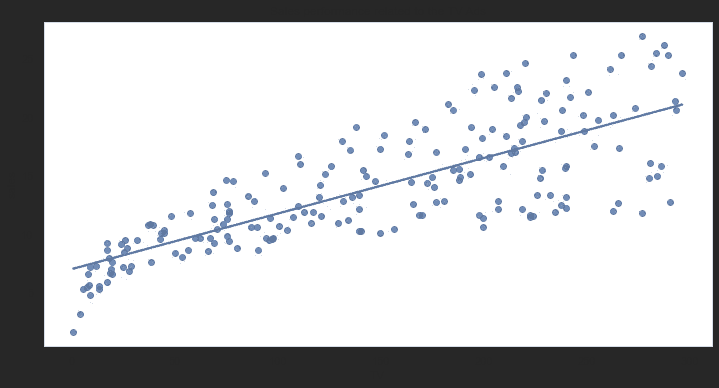
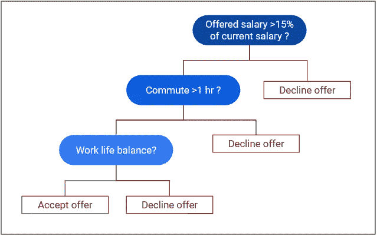

# 为您的营销用例确定最佳回归模型

> 原文：<https://pub.towardsai.net/identify-the-best-regression-model-for-your-marketing-use-case-c76bc4991722?source=collection_archive---------1----------------------->

## 用基于树的回归模型捕捉非线性趋势

布鲁克·拉克在 [Unsplash](https://unsplash.com?utm_source=medium&utm_medium=referral) 拍摄的照片

当建立一个企业，服务，或只是一个网站，我们考虑不同的客户人口统计属性，如性别，收入，年龄，家庭规模，教育等。其中，客户年龄起着至关重要的作用，但有时可能会被忽视。了解客户年龄对业务的影响可能非常重要。例如，如果你经营一家服装公司，你需要考虑时尚随着时间和个人年龄的变化而变化。不同年龄组在服装上的花费不同。根据 2021 年的统计，随着年龄的增长，支出持续上升，直到 40 多岁，然后逐渐放缓。有趣的是，在不同的顾客年龄组中，35 至 44 岁的年龄组是服装消费最高的年龄组，无论男女。

另一方面，在保险业，老年人口通常比年轻人口看医生更频繁，在药物上花费更多。正因为如此，保险费用也随着年龄的增长而增加。

这就是为什么在构建产品和服务时，拥有一个包含未来客户年龄的模型对企业成功至关重要。

在这篇文章中，我们将评估不同的机器学习算法，以发现客户随着年龄增长的消费趋势。为此，我们将评估线性回归和决策树。

完整的代码可以在[的 Deepnote 笔记本](https://deepnote.com/workspace/asish-biswas-a599-b6cca607-3c12-4ae6-b54d-32861e7e9438/project/analyticsoul-e10ea3a1-7bbf-415b-a1f8-e1884fe5241b/%2F07.%20Regression%20Models.ipynb)中找到。

## 线性回归

**线性回归**描述了一个或多个特征与标量响应(也称为自变量和因变量)之间的线性关系。这是现有的最简单、最容易解释的模型之一。正因为如此，它是商业和学术界最常用的模型。线性回归用于预测未来的产品销售、房价、GDP 增长、健康指标等。

在下图中，我们可以看到电视广告成本和销售额之间存在线性关系([数据集链接](https://www.kaggle.com/datasets/thorgodofthunder/tvradionewspaperadvertising))。由此，你可以很容易地预测，如果你增加或减少电视广告的支出，你将获得多少收入。

与电视广告相关的收入(图片由作者提供)

## 决策图表

决策树是一种基于树的算法，可用于分类和回归问题。它将数据集转换为单向条件控制语句的树状结构，并通过遵循树的条件步骤到叶节点来进行预测。
通过这个 [statquest 视频](https://www.youtube.com/watch?v=_L39rN6gz7Y)了解更多关于决策树的知识。

下图说明了回归树的结构。

通过决策树评估新的工作机会(图片由作者提供)

线性回归和决策树都有许多用例，其中一个可能比另一个表现得更好。在本帖中，我们将考察这样的场景，评估这两种模型，并确定适合我们用例的方法。

为了评估我们的模型，我们将使用均方根误差(RMSE)，这是回归问题的一种常见性能度量。

> 尽管 RMSE 是回归问题的首选性能测量方法，但在一些存在大量异常值的情况下，您可以考虑使用平均绝对误差(MAE)进行模型评估。

如果你想更深入地了解 RMSE 和 MAE 是如何计算的，我建议你参考《Scikit-Learn、Keras 和 TensorFlow 的机器学习实践》一书的第二章。

## 实验

我们想弄清楚消费习惯如何随着年龄的增长而演变，以及不同的模型如何预测这种关系。

我们将从导入一个样本数据集开始，该数据集包含个人的年龄支出，并拆分测试和训练数据集。

然后，我们将使用训练数据集训练一个线性回归模型，并使用测试数据集计算 RMSE 分数。

正如我们在散点图中看到的，回归模型已经确定了随着年龄的增长支出略有下降的趋势。但它未能发现消费者生命早期阶段的支出上升趋势。

太好了。我们的基准模型的 RMSE 得分是 157.19。让我们看看决策树是否能做得更好。

您现在可能已经知道，决策树的性能会因树的深度而异。这就是为什么我们将创建最大深度为 2 和 5 的两个模型。

RMSE 说明了一切。深度为 2 的决策树已经将错误率从 157 降低到 115，提高了 26%，深度为 5 的决策树表现更好(RMSE 102，提高了 35%)。
年龄和消费行为之间的关系在散点图中显而易见。我们可以看到最老或最年轻人口的支出急剧下降。

## 结论

了解你的客户是当今商业中最重要的事情，年龄是最关键的客户属性之一。有时候年龄并不像我们想象的那样是一个简单的参数。因此，最好尝试不同的算法，找出最适合您客户的算法。

您可以使用[笔记本](https://deepnote.com/workspace/asish-biswas-a599-b6cca607-3c12-4ae6-b54d-32861e7e9438/project/analyticsoul-e10ea3a1-7bbf-415b-a1f8-e1884fe5241b/%2F07.%20Regression%20Models.ipynb)中的代码，并用您的数据进行实验。

*感谢阅读！如果你喜欢这篇文章一定要* ***鼓掌(最多 50！)*** *和让我们* ***连接上****[***LinkedIn***](https://www.linkedin.com/in/asish-biswas/)****在 Medium 上关注我*** *保持更新我的新文章***