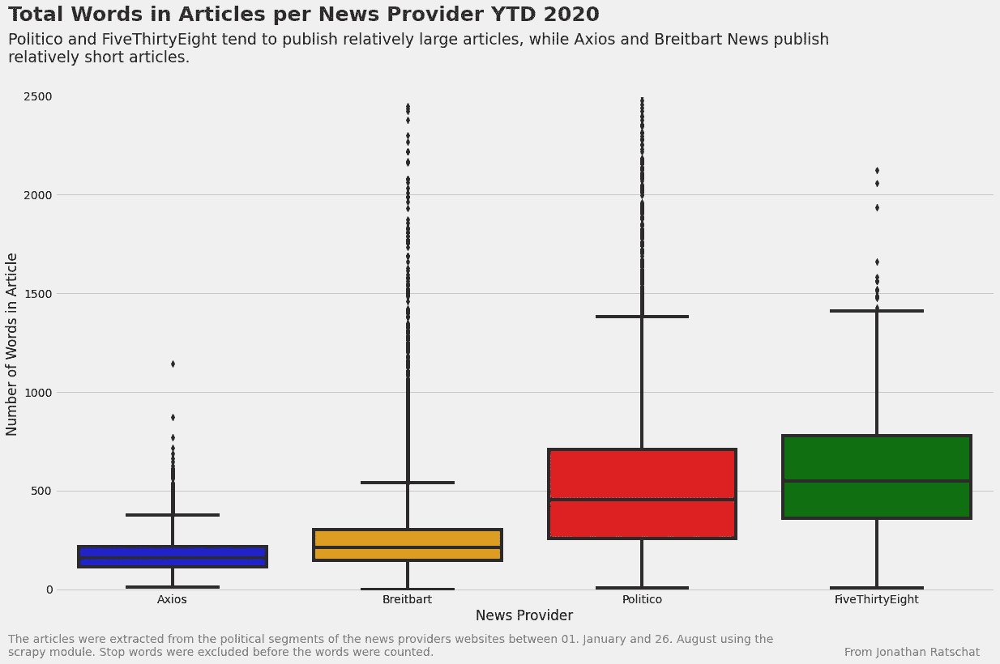
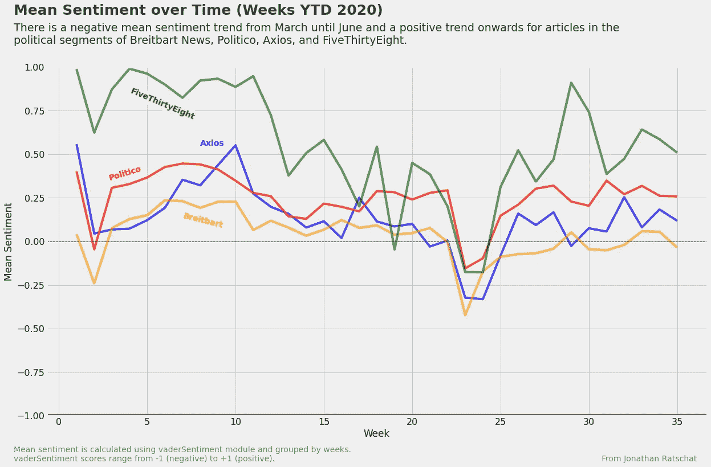
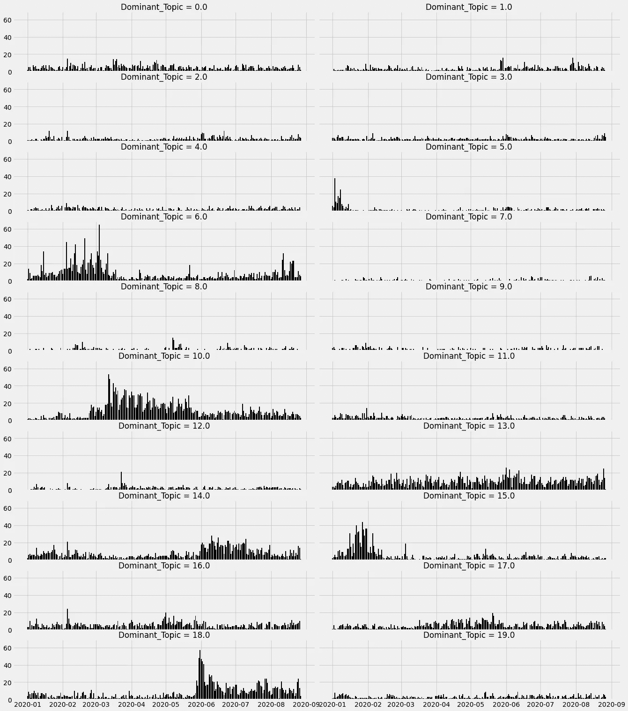
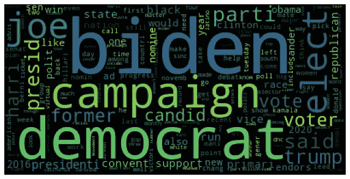
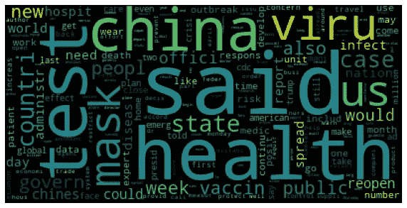
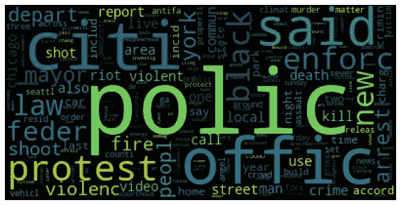
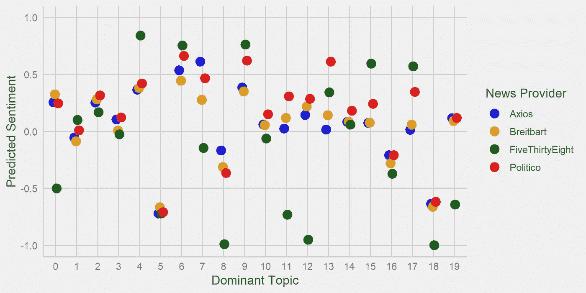

# 通过情感对美国新闻进行意识形态分类

> 原文：<https://pub.towardsai.net/ideology-classification-of-u-s-news-through-sentiment-37d911f31f8c?source=collection_archive---------2----------------------->

## [自然语言处理](https://towardsai.net/p/category/nlp)

## 揭露新闻提供者的党派偏见。


由 [Gabe Pierce](https://unsplash.com/@gaberce?utm_source=medium&utm_medium=referral) 在 [Unsplash](https://unsplash.com?utm_source=medium&utm_medium=referral) 上拍摄

我想通过对新闻文章执行一些常见的自然语言处理任务来确定新闻提供者的意识形态是否可以被客观地分类。

但是让我们从头开始…

政治分歧是当今美国的一个重要问题，甚至我们吃什么、开什么车、如何生活都与是民主党人还是共和党人有关。像戴不戴面具这样的决定成为政治身份的一部分。

20 世纪 70 年代，当拥有大学学位的人搬到城市，教育程度较低的人留在农村地区时，这种政治分裂的基础就奠定了。工作、技术和行业也随之而来，民主党人和共和党人之间的文化差异随着党派媒体和社交媒体网络的出现而被放大[1]。

如果你想一想:人们接触到不同种类的信息。人们读到的和听到的对他们如何看待世界起着至关重要的作用。

因此，如果人们接触到一家被认为“极右”和“受意识形态驱动”的新闻提供商，例如 Breitbart News [2]，这家新闻提供商的世界观可能会对读者的世界观产生显著影响。

仅仅通过阅读他们的一些文章，我能认出一个新闻提供者的政治意识形态吗？其他人呢？想象一下，阅读“极右”的文章，并认为这被认为是“正常的”…

> 这就是为什么我开始思考如何客观地对新闻提供者的意识形态进行分类。

最终，我认为 Breitbart News 在报道乔·拜登(Joe Biden)时会使用更多负面词汇，而对特朗普的评论会比其他新闻媒体更多。

因此，就某个主题写的文章，如果同意某个特定的意识形态，会有积极的情绪，而不同意的问题会对情绪产生负面影响。

使用来自四家新闻提供商的数据，并应用情感和话题模型，我将测试我的假设是否成立。如果你有兴趣知道我是如何使用 Python 和 R 进行分析的，请查看我的 [GitHub 库](https://github.com/JRatschat/US_News)。在那里你可以找到你需要的一切。

# 数据

我重点分析了来自 Breitbart News、政治、Axios 和 FiveThirtyEight 的文章。让我们先了解一下这些新闻提供者是谁，他们代表什么。

我已经介绍了 Breitbart 新闻，但这次我将使用他们的措辞。他们主张“真实的报道和自由开放的思想交流”,因为这是“维持一个强大的民主所必不可少的”此外，他们相信“美国的伟大”

Axios 是一家新闻提供商，应该“为观众和广告商提供最清晰、最智能、最高效和最值得信赖的体验。”他们声称不遵循任何意识形态。此外，他们的写作风格被描述为 Twitter 和《经济学人》的混合。

政治的主要话题是政治和政策，他们的目标是成为这些话题的主要新闻来源。代表“获取可靠信息、无党派新闻和实时工具”，以“创造、通知和参与全球公民。”

最后，FiveThirtyEight 跟踪数据驱动的政治和体育报道，并使用常见的数据可视化和统计分析来提供独特的新闻体验。

不得不承认:这是一个狂野的组合。不是你在研究论文中能找到的典型新闻提供者。那么，我为什么选择这些新闻提供商呢？

*   首先，我需要一些不同于布赖特巴特新闻的新闻来源。Axios 明确表示，它不遵循任何意识形态。所以在意识形态上应该是中立的。代表无党派新闻报道的政治也是如此。对于 FiveThirtyEight，就不那么清楚了。由于他们在 2016 年大选中的报道，我采取了更左倾的立场，他们认为“[唐纳德·川普不是真正的候选人](https://fivethirtyeight.com/features/why-donald-trump-isnt-a-real-candidate-in-one-chart/)”，并给他赢得选举的机会微乎其微。
*   第二，我喜欢收集更多知名左倾新闻提供商的文章，比如《纽约时报》或《华盛顿邮报》。可悲的是，我看到的提供商的网站通常基于 Javascript(而不是 HTML)，这使得我使用的方法更难提取信息。此外，许多新闻提供商有一个付费墙，不付费就不可能提取文章。

在我决定了要分析哪些新闻提供商之后，我收集了这些新闻提供商的政治文章。此外，我只从 2020 年的作品中提取了有限的主题。

这些决定产生了一个由大约 32.5k 篇文章组成的数据集。Breitbart News 向数据集贡献了大约 2 万篇文章，而我只从 FiveThirtyEight 中提取了大约 500 条。此外，大约有 7.8k 的文章来自政治，3.7k 来自 Axios。因此，Axios、Breitbart News 和政治的调查结果应该比 FiveThirtyEight 的结果更可靠。

我发现探究新闻提供商之间的一些差异很有趣。你可以在下面的图中看到，Axios 发布的文章最短*(和 Twitter 相比并不奇怪)*紧随其后的是 Breitbart News。政治和五三八倾向于有较长的文章。



# 感情

现在我已经提取了我需要的数据，是时候计算每篇文章的情感了。我决定使用成熟的 VADER 模型[3]，它主要用于社交媒体发布。然而，它也用《纽约时报》社论进行了测试，与其他情感分析词典相比，取得了最好的 F1 分数。因此，它也可以应用于其他领域。

该模型使用可概括的情感词典。该列表的灵感来自于著名的单词库 LIWC、ANEW 和 G.I .，但研究人员也将表情符号和俚语纳入了词典。有趣的是，它不仅依赖于每个单词的固定情感分数，还结合了语法和句法线索。举一些他们论文中的例子:

*   宣传词:“这里的服务*非常好*”比“服务*很好*”有更强的正面情绪
*   对比连接词:“这里的食物很棒，*但是服务很糟糕。”VADER 会感觉到一种复杂的情绪，这句话的后半部分占主导地位。*
*   极性的转变:“这里的食物真的没有那么好。”虽然这句话包含了积极的词语*伟大的*，但是 VADER 可以将消极的情绪归类。

尽管 VADER 不是用报纸上的文章建立起来的，但我最终决定，它的理论基础对我的分析来说是“足够好”的。

此外，当处理更大规模的数据集时，VADER 变得很方便，因为它的计算成本很低，并且不需要训练数据。虽然像谷歌的 BERT 这样的其他算法可以得到更准确的结果，但我仍然记得我在另一个项目中无尽的计算时间，我不愿意再经历一次。

当绘制每周文章的平均情绪时，两个惊人的见解对我来说变得很明显:

*   新闻提供者之间的情感分数存在差异。与其他新闻提供商相比，FiveThirtyEight 的平均正面文章最多，而 Breitbart News 的平均负面文章最多。
*   随着时间的推移，新闻提供者的情绪会有相似的发展。例如，所有新闻提供商都看到情绪得分在第 23 周和第 24 周大幅下降，随后几周有所回升。这一发现表明，一些话题或事件被 VADER 归类为比其他问题更积极或消极。例如，一个重大的不利事件可能发生在第 23 周，因为情绪得分如此之低。



# 主题

由于不同的事件很可能会影响新闻文章的情感，因此将新闻分类成不同的主题就变得至关重要。否则，情感分数将受到主题的影响，并且意识形态分类将是不可行的。

潜在狄利克雷分配(LDA)是一种无监督的机器学习模型，它提取给定单词集的主要主题。它假设每个文档都包含不同主题的组合。通过浏览文档，LDA 推断出哪些主题可能生成了它们。

我使用 LDA 生成主题，并计算每篇文章的主题概率。为了分析，我只存储了主题概率最高的主题。最终，我得出了 2020 年 1 月至 8 月的 20 个总体主题。不要详细地看每一个主题(这对你来说会很无聊)，让我们看看最突出的问题。

你可以在下面的图中看到每天的文章数量，取决于主题。有些问题似乎相对不太重要，而其他主题却非常重要。



乍一看，第 6、10 和 18 题确实最有趣。我创建了词云，并查看了主题概率最高的文章，以更好地理解这些主题。

通过查看主题 6 的词云以及主题贡献最高的文章，可以相对确定这些文章是关于民主党总统候选人的。



话题 6

```
Topic Contribution: 100%
"Why Bernie Sanders Lost" (FiveThirtyEight)Topic Contribution: 99%
"Electile Dysfunction: Joe Biden Pulls Out Early from New Hampshire" (Breitbart News)Topic Contribution: 99%
"Joe Biden says Iowa caucus results were a "gut punch"" (Axios)
```

当查看一段时间内的文章数量时，这个首要主题也是有意义的。直到三月份，新闻提供者和公众都对这个话题很感兴趣。后来，在布蒂吉格、彭博和沃伦退出民主党竞选后，人们的兴趣降低了。当桑德斯于 4 月 8 日暂停竞选活动并保持低水平直到拜登于 8 月 18 日正式赢得提名时，人们的兴趣迅速增加。

那么话题 10 怎么样？



话题 10

你猜对了:话题 10 大多由冠状病毒相关的文章组成。云这个词和每天的文章数是有意义的。我还查看了话题贡献最高的文章:

```
Topic Contribution: 99%
"China Has Not Accepted U.S. Offers to Send CDC Experts to Aid in Coronavirus Fight" (Breitbart News)Topic Contribution: 99%
"How many Americans have been tested for coronavirus?" (Politico)Topic Contribution: 99%
"Azar: Coronavirus 'a fast-moving, constantly changing situation" (Politico)
```

当只看单词 cloud 和时间趋势时，主题 18 似乎相对容易发现。对我来说，这是尖叫“黑人的命也是命”！



话题 18

但是我在评定话题贡献最高的文章的时候，首先就很迷茫。一般来说，LDA 给与警方行动的新闻文章的主题贡献最高。

```
Topic Contribution: 99%
"Armed Homeowner Kills One Alleged Intruder, Wounds Second" (Breitbart News)Topic Contribution: 97%
"Pennsylvania Homeowner Shoots Alleged Intruder Dead" (Breitbart News)Topic Contribution: 96%
"Watch: Daytona Beach Police Shoot Alleged Armed Carjacker" (Breitbart News)
```

但这并不能解释为什么在骚乱期间文章会出现这种剧变。看话题贡献分较低的文章时，出现了我原本期待的文章。

```
Topic Contribution: 90%
"Philadelphia Cops Injured with Chemical Burns During Violent Protests" (Breitbart News)Topic Contribution: 90%
Title: "Protesters Set NYPD Cars Ablaze in Union Square" (Breitbart News)Topic Contribution: 88%
Title: "Police Cars in LA, Chicago Damaged and Destroyed by Protesters" (Breitbart News)
```

这个话题引起了我的兴趣。布莱巴特关于这个话题的大多数文章都支持警方。当我在看 Axios 的报道时，这种观点完全变成了更集中的关于抗议者发生了什么的报道。这是意识形态上的重大差异，但这种差异能否被新闻情绪所追踪值得怀疑，因为两种观点都应该是相当有害的。

# 多元线性回归

在我为情感和主题分析生成变量之后，我终于能够进行回归估计了。首先，我运行了一个多元线性回归，以查看主题和新闻提供者(自变量)与新闻文章的情绪(因变量)之间的关系。我使用稳健的标准误差，因为误差是异方差的。

sentimentᵢ=β₀+β₁⨯dominant_topicᵢ+β₂⨯newsproviderᵢ+𝜀ᵢ

Axios 和 Topic 0 是基本情况，隐藏在截距系数中。

主题 5 *(例如，袭击、恐怖分子、香港、伊朗)*和 18(例如，警察、暴乱、黑人)与更多负面情绪相关联，而主题 6(例如，拜登、民主党、竞选)与对情绪的更积极影响相关联。此外，政治和 FiveThirtyEight 的报道倾向于比 Axios(如截稿所示)和 Breitbart News 更积极。

但我们在这里必须小心，因为 Breitbart 新闻的 p 值远未接近常用的显著性水平。因此，我们不能拒绝 Breitbart 新闻和它的文章的情绪之间没有条件手段差异的零假设。

尽管这种回归带来了一些初步的见解，但还不足以理解新闻提供商的潜在意识形态。记住:我假设新闻提供者对不同的话题会有不同的看法。

# 具有交互效应的多元线性回归

因此，我决定用交互效应进行多元线性回归。通过使用互动效应，现在可以分析主导话题和新闻提供者的综合效应。此外，我仍然在估计中使用稳健的标准误差。

sentimentᵢ=β₀+β₁⨯dominant_topicᵢ+β₂⨯newsproviderᵢ+β₃⨯(dominant_topicᵢ⨯newsproviderᵢ)+𝜀ᵢ[(想看输出就点这里)](https://gist.github.com/JRatschat/7c3548b8d130e3d399d7fa51edcc479c)

一些主题的 p 值以及 Breitbart News 和政治没有接近常用的显著性水平。

尽管如此，在下图中，你可以看到每个话题和新闻提供商的预测情绪。当在[回归表](https://gist.github.com/JRatschat/7c3548b8d130e3d399d7fa51edcc479c)中搜索情绪差异并检查每个交互效应的 p 值时，似乎只有主题 6 令人感兴趣。记住:这个话题主要是关于民主党总统候选人的。



```
**Predicted Sentiment per News Provider for Topic 6**
Axios: 0.54
Breitbart News: 0.44
FiveThirtyEight:0.75
Politico: 0.66
```

布莱巴特确实有情绪最低的文章。当仔细观察主题 6 的交互项时，很明显 Breitbart 新闻的系数是唯一一个负关联的系数。

尽管如此，我不得不承认我有点失望。20 个主题中只有一个显示出了某种程度上符合我的假设的结果。此外，预测的情绪得分之间的差异似乎没有我预期的那么高。

# 评价

那我做了什么？怎么样了？我学到了什么？

首先，我从四个不同的新闻提供商那里收集数据。一个人用 scrapy 这样的网络爬虫能做的事情真是太神奇了。我非常高兴能够从新闻提供商的网站上收集文章。然而，令人沮丧的是，我无法从《纽约时报》或《华盛顿邮报》上抓取文章。这些新闻提供者会更好地反映我的分析中的民主因素。

第二，用 VADER 模块计算情绪，并随着时间的推移观察它，会得出有趣的见解。我能够发现新闻提供者的情绪随着时间的推移而发展。这个发现让我想到了一个假设，即主题或事件本质上要么是积极的，要么是消极的。当重大事件发生时，可能会出现大起大落。

第三，使用 LDA 对新闻文章进行主题分类非常顺利。我对“民主党总统候选人提名”或“冠状病毒”等主题的准确分类以及文章随着时间推移的重要性印象深刻。

探索这些话题让我意识到 Breitbart News 与其他新闻提供商之间的第一个显著区别:人们可以影响事件的视角。Breitbart 新闻主要关注在抗议和骚乱中警察发生了什么，而其他新闻则更多地关注抗议者。这种差异本身就是新闻提供者意识形态的一个强有力的指标。

第三，进行回归估计给出了我所做的一些假设的答案。是的，根据题目的不同，情绪得分差别很大。此外，这一估计确实揭示了新闻提供者情绪的总体趋势。但是仅仅这一点对于给新闻提供者的意识形态分类毫无帮助。只有题目 6 的交互作用是有希望的，但可悲的是这个题目是我的假设唯一有意义的。

# 结论

最终，我认为我通过比较情感分数来对意识形态进行分类的方法失败了。我仍然喜欢这个想法，但似乎根据政治观点被认为是积极或消极的话题相对较少。

但我在主题分析中发现了一个非常有趣的见解:新闻提供者对黑人生命攸关抗议的报道截然不同。可悲的是(就我的分析而言)，这种情绪并没有受到这种差异的影响。

尽管如此，我还是为进一步的调查做了一些基础工作。如果我有更多的时间，并且你对此感兴趣，我可以想象自己回到黑人的命也是命的话题。找到一些方法，可以客观地显示我指出的差异，这将是可怕的。

如果您有任何问题或意见，请在下面留下您的反馈。另外，如果你想和我联系，你可以通过 [*LinkedIn*](http://www.linkedin.com/in/jonathan-ratschat) *联系我。*

*敬请期待，下期见！*

[1][https://edition . CNN . com/interactive/2019/11/opinions/fracted-States-of-America/part-one-fredrick/](https://edition.cnn.com/interactive/2019/11/opinions/fractured-states-of-america/part-one-fredrick/)

[2][https://en.wikipedia.org/wiki/Breitbart_News](https://en.wikipedia.org/wiki/Breitbart_News)

[3]休顿和吉伯特(2014 年)。VADER:基于规则的社交媒体文本情感分析的简约模型。第八届网络日志和社交媒体国际会议。密歇根州安阿伯，2014 年 6 月。