# 图像分类器— Zalando 服装店使用 Monk 库

> 原文：<https://pub.towardsai.net/image-classifier-zalando-clothing-store-using-monk-library-18ce2d8a6418?source=collection_archive---------2----------------------->

## [计算机视觉](https://towardsai.net/p/category/computer-vision)

本教程是关于使用 Monk 库对 Zalando 服装店数据集进行图像分类的。在这个数据集中，有服装和模特的高分辨率、彩色和多样的图像。

[**GitHub**](https://github.com/Tessellate-Imaging/monk_v1/blob/master/study_roadmaps/4_image_classification_zoo/Classifier%20-%20Zalando%20Clothing%20Store.ipynb) 上有教程。

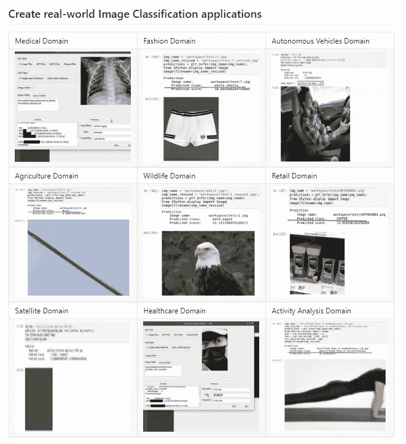

## 关于蒙克

*   使用 Monk，您可以编写更少的代码并创建端到端的应用程序。
*   只学习一种语法，使用任何深度学习库——py torch、Mxnet、Keras、TensorFlow 等，创建应用。
*   通过多个实验轻松管理您的整个项目。

这是在 Kaggle、Codalab、HackerEarth、AiCrowd 等平台举行的比赛中使用的最佳工具。

# 目录

1.  安装 Monk
2.  Zalando 服装店分类器演示
3.  下载数据集
4.  背景工作
5.  从零开始训练:vgg16
6.  超参数调谐实验综述
7.  专家模式
8.  确认
9.  推理
10.  从头开始培训:mobilenet_v2
11.  比较 vgg16 和 mobilenet_v2
12.  结论

# 安装 Monk

## 第一步:

```
*# Use this command if you're working on colab.*
!pip install -U monk-colab
```

其他安装方式，访问[僧库](https://github.com/Tessellate-Imaging/monk_v1)。

## 步骤 2:添加到系统路径(每个终端或内核运行都需要)

```
**import** **sys**
sys.path.append("monk_v1/")
```

# Zalando 服装店分类器演示

本节将在深入讨论细节之前向您演示这个分类器。

让我们先下载重量。

```
! wget --load-cookies /tmp/cookies.txt "https://docs.google.com/uc?export=download&confirm=$(wget --save-cookies /tmp/cookies.txt --keep-session-cookies --no-check-certificate 'https://docs.google.com/uc?export=download&id=1SO7GUcZlo8jRtLnGa6cBn2MGESyb1mUm' -O- | sed -rn 's/.*confirm=([0-9A-Za-z_]+).*/**\1\n**/p')&id=1SO7GUcZlo8jRtLnGa6cBn2MGESyb1mUm" -O cls_zalando_trained.zip && rm -rf /tmp/cookies.txt
```

解压文件夹。

```
! unzip -qq cls_zalando_trained.zip
ls workspace/
```

输出:`comparison/ Project-Zalando/ test/`

有三个文件夹供您探索:

1.  比较-检查不同模型和超参数之间的所有比较。

2.项目-Zalando-最终重量和日志。

3.测试—测试模型的图像。

```
ls workspace/Project-Zalando/
```

输出:`expert_mode_vgg16/`

`expert_mode_vgg16`是我们最后的模型。

```
*#Using keras backend* 
**from** **monk.keras_prototype** **import** prototype
```

## 暗示

```
ktf = prototype(verbose=1)
ktf.Prototype("Project-Zalando", "expert_mode_vgg16", eval_infer=**True**)
```

给出图像的位置。

```
img_name = "/content/workspace/test/0DB22O007-A11@8.jpg"
predictions = ktf.Infer(img_name=img_name)*#Display* 
**from** **IPython.display** **import** Image
Image(filename=img_name)
```

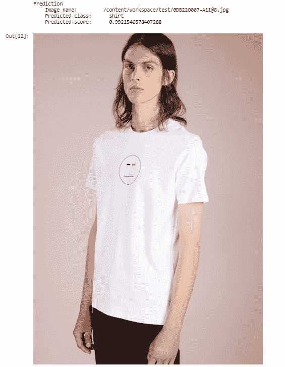

```
img_name = "/content/workspace/test/1FI21J00A-A11@10.jpg"
predictions = ktf.Infer(img_name=img_name)*#Display* 
**from** **IPython.display** **import** Image
Image(filename=img_name)
```

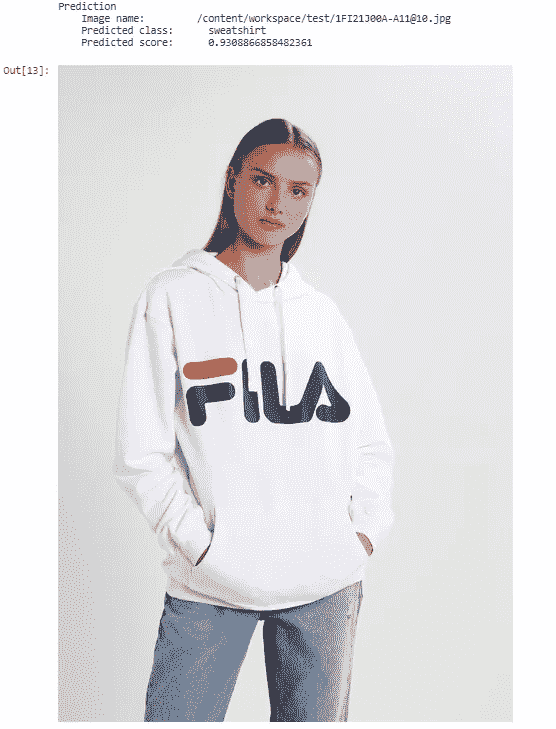

# 下载数据集

让我们使用 Kaggle 的 API 命令安装一个数据集。在此之前，请遵循以下步骤:

转到您的 Kaggle 个人资料>我的帐户>向下滚动找到 *API* 部分>现在点击过期 API 令牌>，点击*创建新的 API 令牌* >在您的本地系统上保存 *kaggle.json* 。

```
! pip install -q kaggle**from** **google.colab** **import** files# Upload your *kaggle.json* file here.
files.upload()! mkdir ~/.kaggle! cp kaggle.json ~/.kaggle/! chmod 600 ~/.kaggle/kaggle.json
```

该下载数据集了。在 Kaggle 上转到想要下载的数据集，复制 Kaggle 提供的 API 命令。应该如下图所示:

```
! kaggle datasets download -d dqmonn/zalando-store-crawl! unzip -qq zalando-store-crawl.zip -d zalando
```

解压文件后，将您的数据集/文件存储在您自己的 *Google Drive* 中，以备将来实验之用。

```
%cd /content/drive/My Drive/Data%cp -av /content/zalando/zalando zalando
```

# 背景工作

**1。问题**:我应该选择哪个后端来训练我的分类器？

**回答**:跟随[本教程](https://github.com/Tessellate-Imaging/monk_v1/blob/master/study_roadmaps/1_getting_started_roadmap/2_elemental_features_of_monk/4)%20Feature%20-%20Compare%20experiments%20-%20compare%20experiments%20across%20backends.ipynb)跨后端对比实验。

**2。问题**:选择后端后，我应该选择哪个模型来训练我的分类器？

**回答**:在当前的实验中，我选择了 **Keras** backend 来训练我的分类器。因此，使用下面的代码列出 Keras 下所有可用的模型。

```
# Using keras backend 
from keras_prototype import prototype

ktf = prototype(verbose=1)
ktf.List_Models()

Models List: 
    1\. mobilenet
    2\. densenet121
    3\. densenet169
    4\. densenet201
    5\. inception_v3
    6\. inception_resnet_v3
    7\. mobilenet_v2
    8\. nasnet_mobile
    9\. nasnet_large
    10\. resnet50
    11\. resnet101
    12\. resnet152
    13\. resnet50_v2
    14\. resnet101_v2
    15\. resnet152_v2
    16\. vgg16
    17\. vgg19
    18\. xception
```

现在，你可以选择任何 3-5 个模型开始做你的实验。按照本教程[来比较相同后端的实验。](https://github.com/Tessellate-Imaging/monk_v1/blob/master/study_roadmaps/1_getting_started_roadmap/2_elemental_features_of_monk/3)%20Feature%20-%20Compare%20experiments%20-%20compare%20experiments%20within%20same%20backend.ipynb)

# 进口和尚

```
#Using keras backendfrom monk.keras_prototype import prototype
```

您可以在一个项目下创建多个实验。这里，我的项目命名为 **Project-Zalando，**，我的第一个实验命名为 **vgg16_exp1** 。

```
ktf = prototype(verbose=1)ktf.Prototype("Project-Zalando", "vgg16_exp1")
```

输出:

```
Keras Version: 2.3.1 Tensorflow Version: 2.2.0  
Experiment Details     
Project: Project-Zalando     
Experiment: vgg16_exp1     
Dir: /content/drive/My Drive/Monk_v1/workspace/Project-Zalando/vgg16_exp1/
```

您可以使用下面的代码用默认参数来训练您的模型。然而，我们的目标是提高准确性。因此，我们将跳到*调整我们的超参数*。使用[这个链接](https://github.com/Tessellate-Imaging/monk_v1/tree/master/study_roadmaps/1_getting_started_roadmap/6_hyperparameter_tuning)来学习如何为你的分类器做**超参数调整**。

```
ktf.Default(dataset_path="/content/drive/My Drive/Data/zalando", model_name="vgg16", freeze_base_network=False, num_epochs=5)#Read the summary generated once you run this cell.
```

输出:

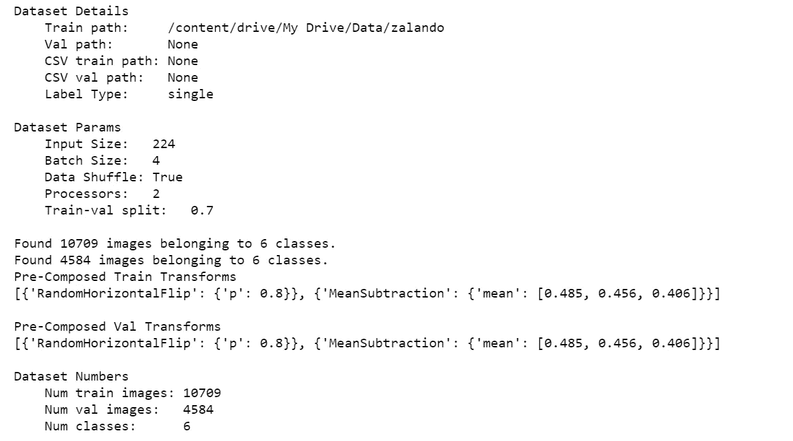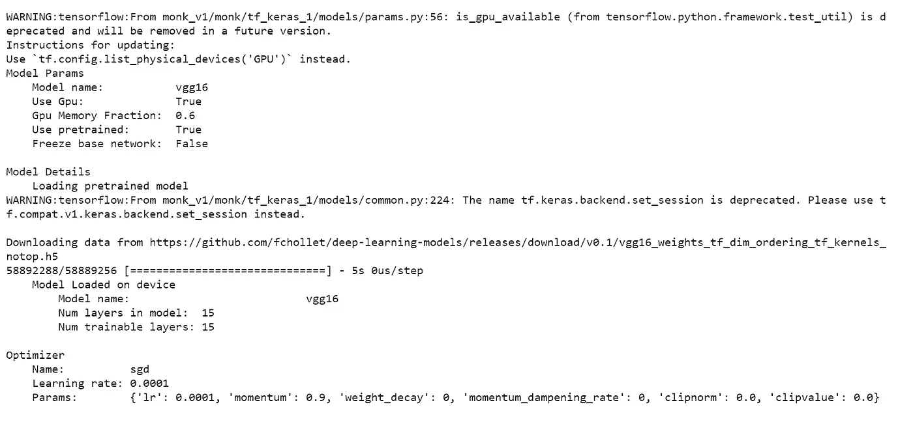

```
ktf.Train()
```

## a.分析学习率

```
# Analysis Project Name
analysis_name = "analyse_learning_rates_vgg16"# Learning rates to explore
lrs = [0.1, 0.05, 0.01, 0.005, 0.0001]# Number of epochs for each sub-experiment to run
epochs=5# Percentage of original dataset to take in for experimentation
# We're taking 5% of our original dataset.
percent_data=5# I made sure that all the GPU processors are running
ktf.update_num_processors(2)# Very important to reload post updating
ktf.Reload()
```

输出:

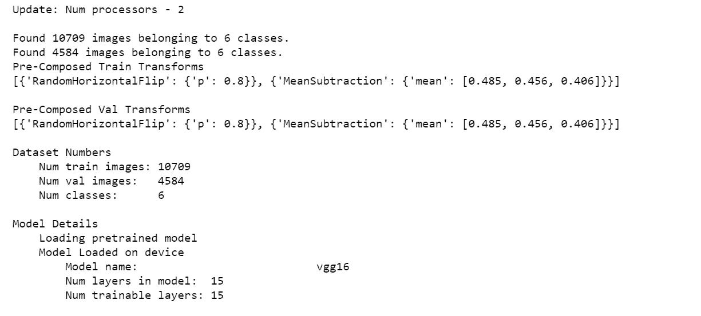

```
# "keep_all" - Keep all the sub experiments created
# "keep_none" - Delete all sub experiments createdanalysis = ktf.Analyse_Learning_Rates(analysis_name, lrs, percent_data, num_epochs=epochs, state="keep_none")
```

输出:

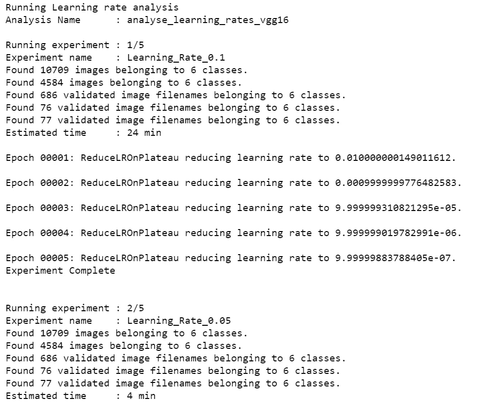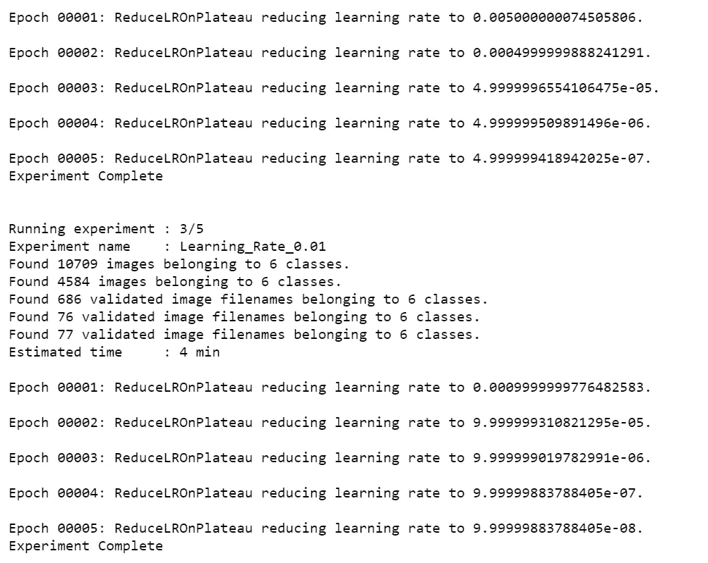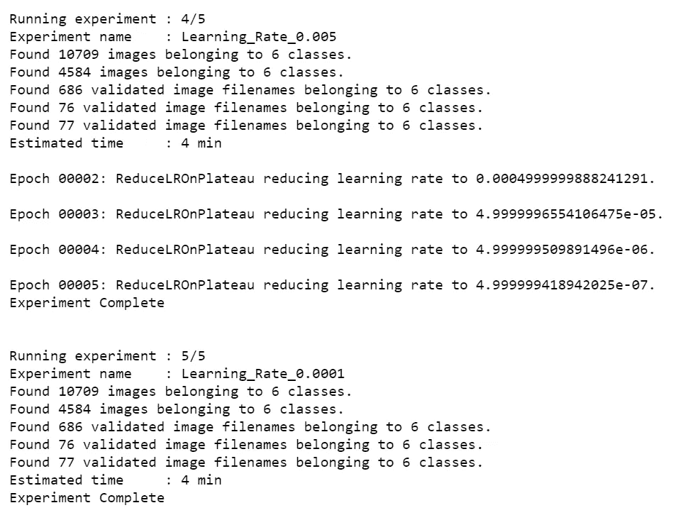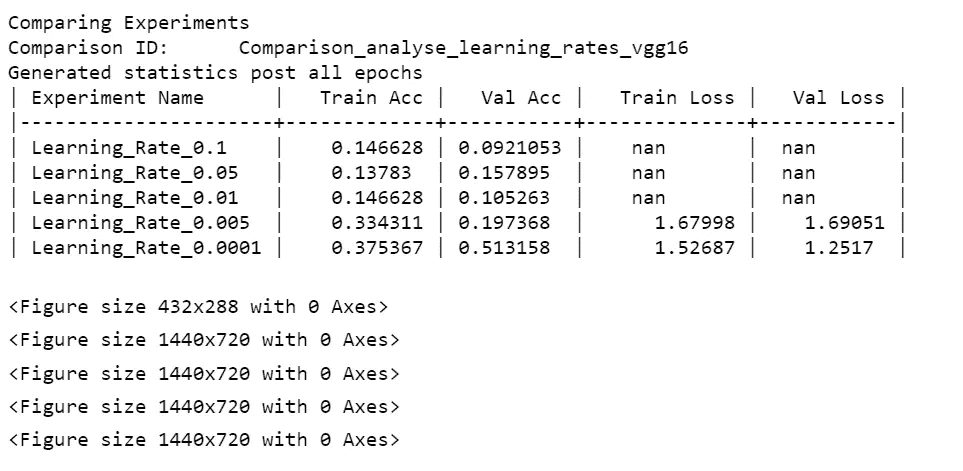

## 结果

从上表可以明显看出`Learning_Rate_0.0001`的**验证损失最小**。我们将用这个来更新我们的学习率。

```
ktf.update_learning_rate(0.0001)
*# Very important to reload post updates* ktf.Reload()
```

## b.分析批量大小

```
# Analysis Project Name
analysis_name = "analyse_batch_sizes_vgg16"# Batch sizes to explore
batch_sizes = [2, 4, 8, 12]# **Note:** We're using the same percent_data and num_epochs.
# "keep_all" - Keep all the sub experiments created
# "keep_none" - Delete all sub experiments createdanalysis_batches = ktf.Analyse_Batch_Sizes(analysis_name, batch_sizes, percent_data, num_epochs=epochs, state="keep_none")
```

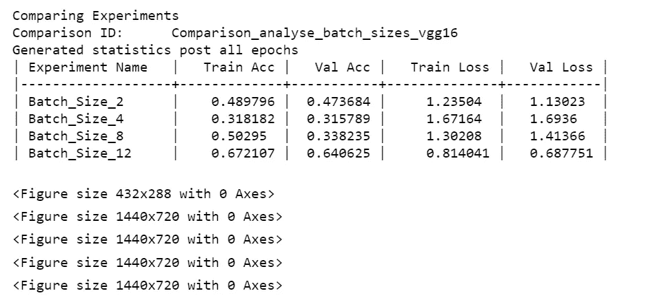

## 结果

从上表可以明显看出`Batch_Size_12`的**验证损失最小**。我们将用它来更新模型。

```
ktf.update_batch_size(12)# Very important to reload post updates
ktf.Reload()
```

## c.分析优化器

```
# Analysis Project Name
analysis_name = "analyse_optimizers_vgg16"# Optimizers to explore
optimizers = ["sgd", "adam", "adagrad"]# "keep_all" - Keep all the sub experiments created
# "keep_non" - Delete all sub experiments createdanalysis_optimizers = ktf.Analyse_Optimizers(analysis_name, optimizers, percent_data, num_epochs=epochs, state="keep_none")
```

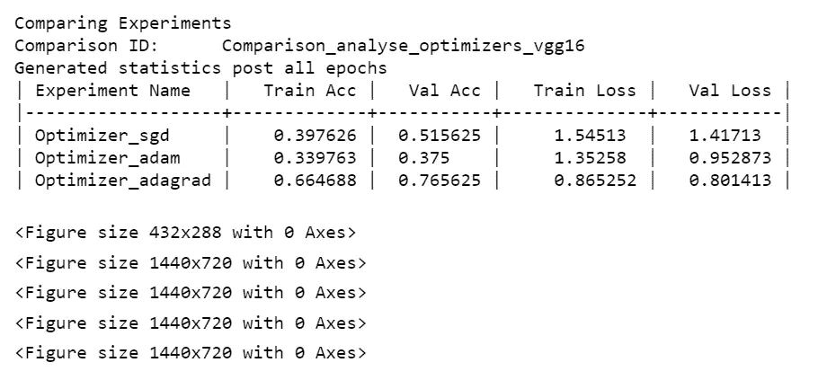

## 结果

从上表可以清楚地看出，我们应该选择`Optimizer_adagrad`，因为它的验证损失最小。

## 超参数调谐实验综述

我们的实验到此结束，现在是时候打开**专家模式**，使用上述**超参数**训练我们的分类器。

总结:

*   学习率— 0.0001
*   批量大小— 12
*   优化器— adagrad

# 1.从零开始训练:vgg16

## 专家模式

让我们创建另一个名为 **expert_mode_vgg16** 的*实验*，从头开始训练我们的分类器。

```
ktf = prototype(verbose=1)ktf.Prototype("Project-Zalando", "expert_mode_vgg16")ktf.Dataset_Params(dataset_path="/content/drive/My Drive/Data/zalando", split=0.8, input_size=224, batch_size=12, shuffle_data=True, num_processors=2)# Load the dataset
ktf.Dataset()ktf.Model_Params(model_name="vgg16", freeze_base_network=True, use_gpu=True, use_pretrained=True)ktf.Model()ktf.Training_Params(num_epochs=5, display_progress=True, display_progress_realtime=True, save_intermediate_models=True, intermediate_model_prefix="intermediate_model_", save_training_logs=True)# Update optimizer and learning rate
ktf.optimizer_adagrad(0.0001)ktf.loss_crossentropy()# Training
ktf.Train()
```

输出:

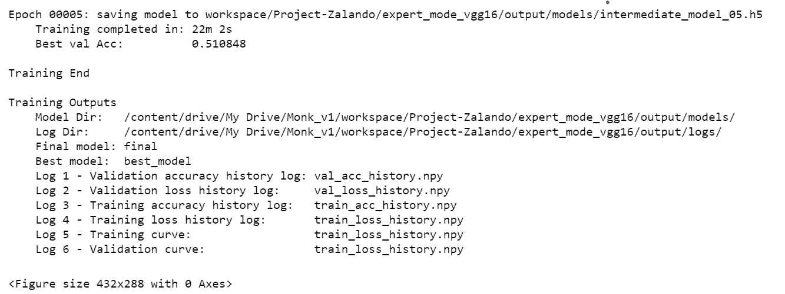

## 确认

```
ktf = prototype(verbose=1);ktf.Prototype("Project-Zalando", "expert_mode_vgg16", eval_infer=True)# Just for example purposes, validating on the training set itself
ktf.Dataset_Params(dataset_path="/content/drive/My Drive/Data/zalando")ktf.Dataset()accuracy, class_based_accuracy = ktf.Evaluate()
```

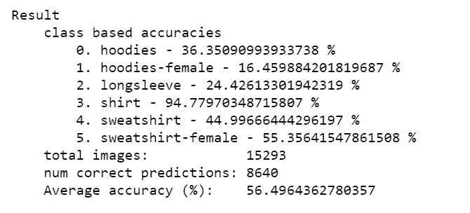

## 推理

让我们看看样本图像上的预测。

```
ktf = prototype(verbose=1)ktf.Prototype("Project-Zalando", "expert_mode_vgg16", eval_infer=True)
```

模型现在已加载。

```
img_name = "/content/1FI21J00A-A11@10.jpg"
predictions = ktf.Infer(img_name=img_name)*#Display* 
**from** **IPython.display** **import** Image
Image(filename=img_name)
```

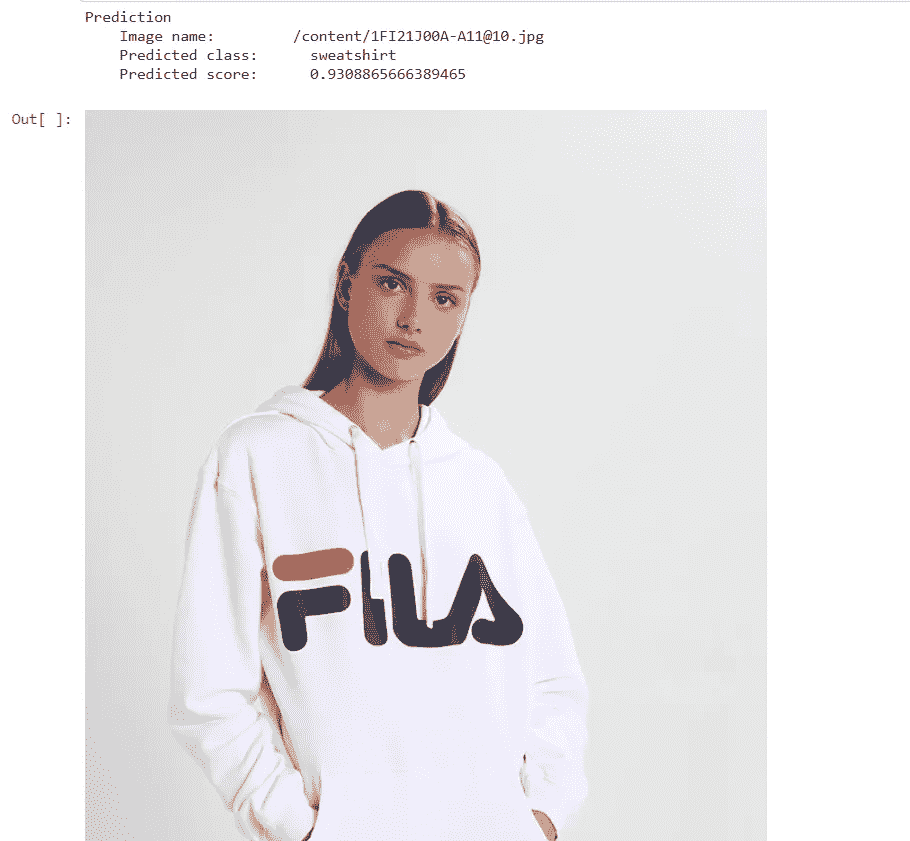

我们已经成功完成了分类器的训练。查看本实验下*日志*、*模型*文件夹，查看模型权重等洞见。

# 2.从头开始培训:mobilenet_v2

我以同样的方式从头开始训练`mobilenet_v2`来比较`vgg16`和`mobilenet_v2`。

实验结束后`mobilenet_v2`的最佳超参数为:

*   学习率-0.0001
*   批量-8
*   优化程序 adam

## 专家模式

```
ktf = prototype(verbose=1)
ktf.Prototype("Project-Zalando", "expert_mode_mobilenet_v2")ktf.Dataset_Params(dataset_path="/content/drive/My Drive/Data/zalando", split=0.8, input_size=224, batch_size=8, shuffle_data=True, num_processors=2)ktf.Dataset()ktf.Model_Params(model_name="mobilenet_v2", freeze_base_network=True, use_gpu=True, use_pretrained=True)ktf.Model()ktf.Training_Params(num_epochs=5, display_progress=True, display_progress_realtime=True, save_intermediate_models=True, intermediate_model_prefix="intermediate_model_", save_training_logs=True)ktf.optimizer_adam(0.0001)ktf.loss_crossentropy()ktf.Train()
```

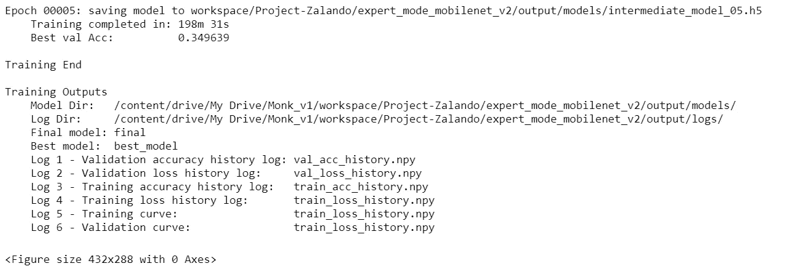

## 确认

```
ktf = prototype(verbose=1)
ktf.Prototype("Project-Zalando", "expert_mode_mobilenet_v2", eval_infer=True)# Just for example purposes, validating on the training set itself
ktf.Dataset_Params(dataset_path="/content/drive/My Drive/Data/zalando")ktf.Dataset()accuracy, class_based_accuracy = ktf.Evaluate()
```

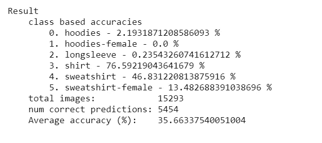

## 推理

```
ktf = prototype(verbose=1)ktf.Prototype("Project-Zalando", "expert_mode_mobilenet_v2", eval_infer=True)
```

模型现在已加载。

```
img_name = "/content/0DB22O007-A11@8.jpg"
predictions = ktf.Infer(img_name=img_name)#Display
from IPython.display import Image
Image(filename=img_name)
```

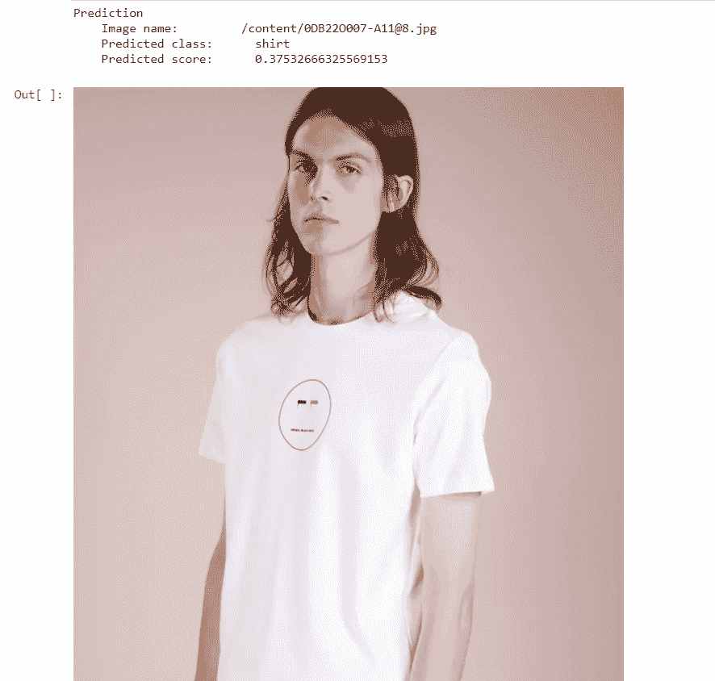

```
img_name = "/content/TOB22O01W-A11@8.jpg"
predictions = ktf.Infer(img_name=img_name)#Display
from IPython.display import Image
Image(filename=img_name)
```

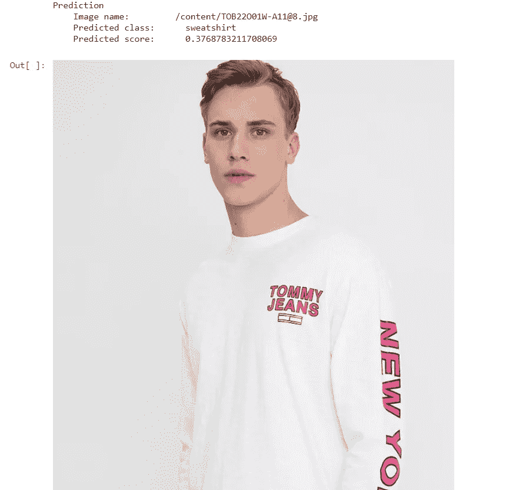

# 比较 vgg16 和 mobilenet_v2

我用了前面提到的同样的教程来比较这两个实验。

```
# Invoke the comparison class
# import monk_v1
from compare_prototype import compare# Create a project
ctf = compare(verbose=1)
ctf.Comparison("vgg-mobilenet-Comparison")ctf.Add_Experiment("Project-Zalando", "expert_mode_vgg16")
ctf.Add_Experiment("Project-Zalando", "expert_mode_mobilenet_v2")ctf.Generate_Statistics()
```

生成统计数据后，

```
from IPython.display import ImageImage(filename="/content/drive/My Drive/Monk_v1/workspace/comparison/vgg-mobilenet-Comparison/train_accuracy.png")
```

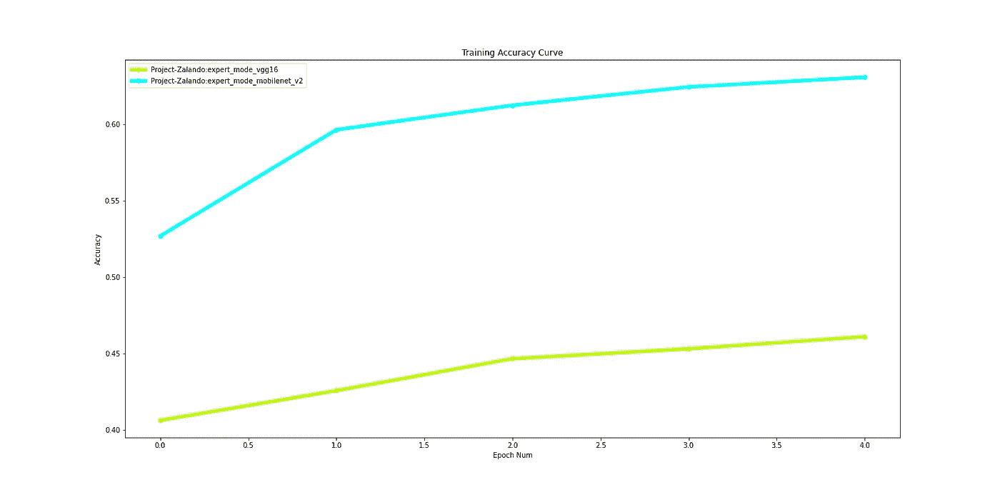

```
from IPython.display import ImageImage(filename="/content/drive/My Drive/Monk_v1/workspace/comparison/vgg-mobilenet-Comparison/train_loss.png")
```

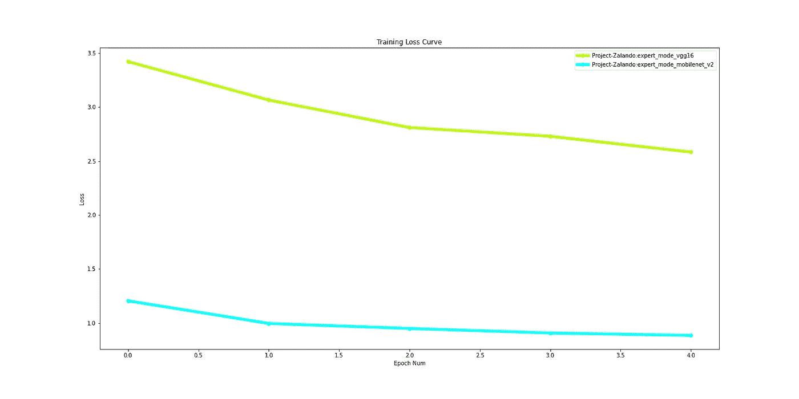

```
from IPython.display import ImageImage(filename="/content/drive/My Drive/Monk_v1/workspace/comparison/vgg-mobilenet-Comparison/val_accuracy.png")
```

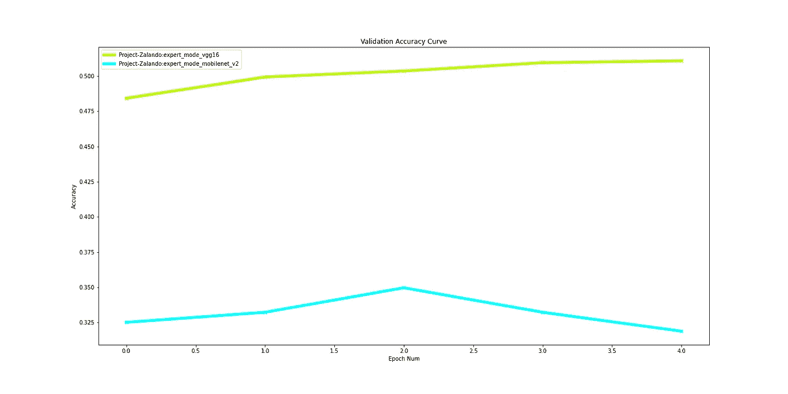

```
from IPython.display import ImageImage(filename="/content/drive/My Drive/Monk_v1/workspace/comparison/vgg-mobilenet-Comparison/val_loss.png")
```

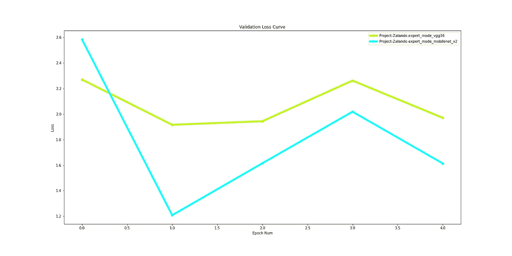

```
from IPython.display import ImageImage(filename="/content/drive/My Drive/Monk_v1/workspace/comparison/vgg-mobilenet-Comparison/stats_training_time.png")
```

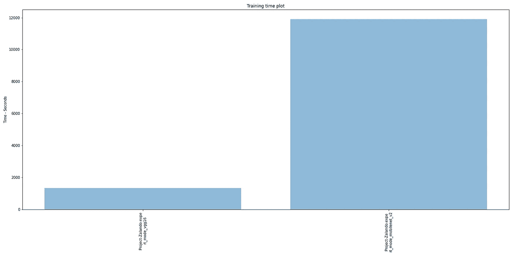

```
from IPython.display import ImageImage(filename="/content/drive/My Drive/Monk_v1/workspace/comparison/vgg-mobilenet-Comparison/stats_best_val_acc.png")
```

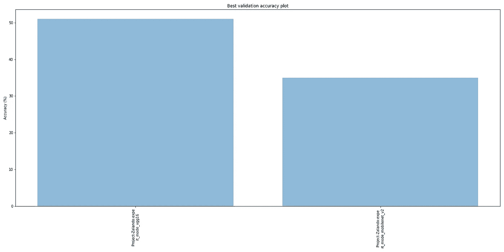

# 结论

从以上的比较中，可以明显看出`vgg16`模型在各个方面都表现得更好。

通过进一步调整超参数，提高模型精度的空间很大。更多教程请参见[图像分类动物园](https://github.com/Tessellate-Imaging/monk_v1/tree/master/study_roadmaps/4_image_classification_zoo)。

教程可在 [GitHub](https://github.com/Tessellate-Imaging/monk_v1/blob/master/study_roadmaps/4_image_classification_zoo/Classifier%20-%20Zalando%20Clothing%20Store.ipynb) 上获得。如果这篇文章对你有帮助，请鼓掌或分享！