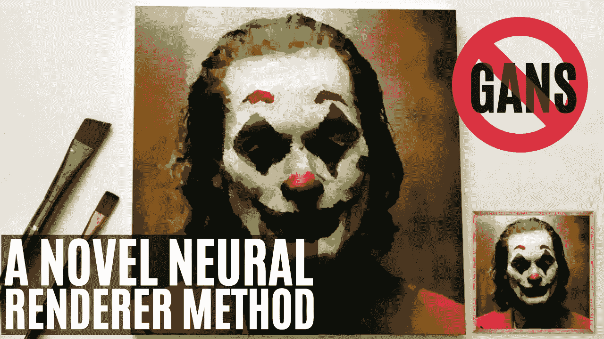
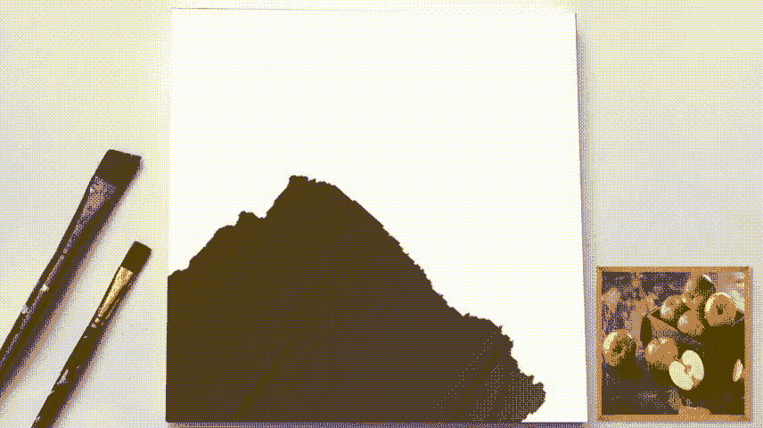
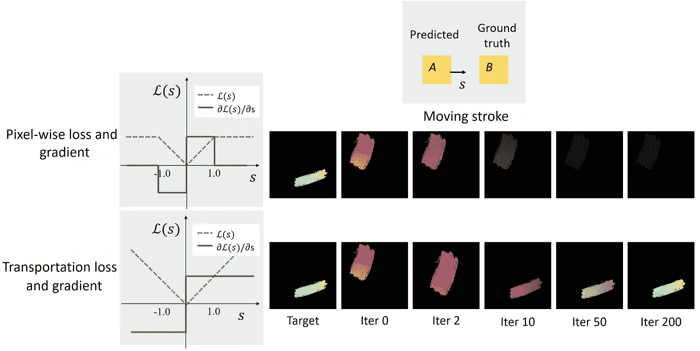
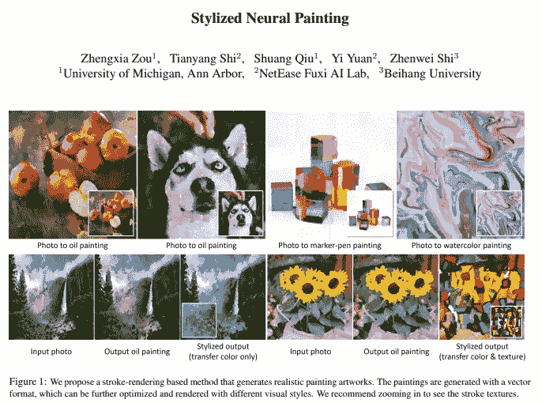

# 风格转换下的图像转绘画翻译

> 原文：<https://pub.towardsai.net/image-to-painting-translation-with-style-transfer-508618596409?source=collection_archive---------0----------------------->

## [机器学习和艺术](https://towardsai.net/p/category/machine-learning/ml-and-art)

## 这种图像到绘画的翻译方法使用新颖的方法模拟多种风格的真实画家，不涉及任何 GAN 架构，不同于所有当前最先进的方法！

关于这篇论文最好的事情之一是他们的代码在 GitHub 上完全可用，他们甚至创建了两个 google colab 笔记本供你在自己的图片上尝试！但首先，让我们快速看看他们是如何实现的，以及更惊人的结果！

## 图像到图像的翻译

图像到图像的翻译是最近一个非常有趣的任务，主要涉及 GANs 和频繁的风格转换。当前最先进的方法，如 pix2pix 网络或 CycleGANs，都使用 GANs。它们在这样的应用中非常强大，因为这里的目标是将一张图片转换成另一张图片，同时保留其属性，并且只改变图像的整体“风格”。比如把自己变成一种动物，或者在这种情况下，变成一幅现实主义的绘画作品。

图片来自[风格化神经绘画的项目页面](https://jiupinjia.github.io/neuralpainter/?fbclid=IwAR0H28RFPN8hGbhiCcfyGFQsTcL1y5sGh2iWvfnAj4NdOVaE_MD3KYeknPw)

与风格转移相结合的 GAN 架构的作用是通过同时训练两个网络来学习基于原始图像正确生成新图像的方法。一个试图生成转换后的图像，这将是一幅画，另一个试图判断图像是生成的(假的)还是一幅真正的画。在这里，他们尝试了一种不同的方法。使用 g an 架构创建图像到绘画算法的问题是 GAN 以逐个像素的方式生成绘画，这不是人类在绘画时会做的。他会用刷子。相反，他们通过使用基于矢量化笔画的方法来模拟人类绘画行为，而不是使用 GANs 图像到图像转换方法中使用的传统的逐像素预测方法。这种逐像素的预测基本上是根据生成图像与参考图像的每个像素之间的差异来确定结果是否很好，但我们稍后将回到这一点。

## 他们代替甘斯做了什么？

a)模型概述，b)双渲染器架构。图片来自[风格化神经绘画的项目页面](https://jiupinjia.github.io/neuralpainter/?fbclid=IwAR0H28RFPN8hGbhiCcfyGFQsTcL1y5sGh2iWvfnAj4NdOVaE_MD3KYeknPw)

他们在一张空白的画布上开始这个过程(a)。然后，他们基本上使用两个生成器网络绘制一个逼真的笔画向量，他们称之为“双通道神经渲染器”。这个过程一直重复，直到我们有一个最终的结果。现在，让我们看看这些笔画是如何生成的，以及网络如何知道它们是否逼真(b)。

第一个 Gs 是一个阴影卷积网络。在第一次迭代中，它接受颜色和形状参数来生成遵循图像前景色的笔画。然后，将该结果与另一个网络合并，该网络被设计成确定笔画的精确轮廓。第二个网络完全忽略了颜色，只关注笔画的形状，使其尽可能像人类。它基本上试图将笔画移动的努力最小化，就像一个真正的画家用快速的手移动来完成一笔。这两个网络可以联合训练，并产生具有更好的形状和颜色保真度的渲染。这大概是这种方法产生如此惊人效果的主要原因。

这些迭代生成的笔画向量是我们可以轻松应用各种风格的地方，如油画笔、水彩墨水、记号笔或胶带艺术。

它们也被保存为矢量格式，这使得像这样模拟绘画过程变得非常容易。

## 它怎么知道好不好？

将笔划从其初始状态“推”到其目标时像素损失(第一行)和传输损失(第二行)之间的比较。使用建议的运输损失，笔划很好地收敛到目标。作为比较，像素损失由于其位置和尺度的零梯度问题而未能收敛。图片来自[风格化神经绘画的项目页面](https://jiupinjia.github.io/neuralpainter/?fbclid=IwAR0H28RFPN8hGbhiCcfyGFQsTcL1y5sGh2iWvfnAj4NdOVaE_MD3KYeknPw)

现在，让我们回到我们之前谈到的像素损失。使用这种方法的问题是，如果你取一个笔画 A，你想让它收敛到一个目标位置 B。对于这种像素方式的损失，笔画不穿过 B 点的所有可能性都是相同的。因为不是所有的像素都适合，并且如果没有到达期望的位置，像素的总和在任何地方都是相同的。导致没有关于如何改进以达到这个 B 点的信息增益。这是一个被称为“零梯度问题”的问题，并且该算法不能指导笔画更新。他们发现这个问题可以通过使用不同的损失来有效地解决。他们没有采用这种像素方式，而是将这种损失重新定义为花费在移动上的运输努力量，也称为 Wasserstein 距离，这是画布和参考图像之间相似性的有效度量。换句话说，这意味着它测量“笔画 A 离目标点 B 有多远？”。基于该距离惩罚网络。您可以在这里看到两种方法之间的比较，其中顶部的像素损失不收敛，因为没有梯度来告诉它如何改进，而底部的传输损失使笔划收敛到目标位置，没有任何问题。

## 观看更多精彩结果:

## 结论

图片来自[风格化神经绘画的项目页面](https://jiupinjia.github.io/neuralpainter/?fbclid=IwAR0H28RFPN8hGbhiCcfyGFQsTcL1y5sGh2iWvfnAj4NdOVaE_MD3KYeknPw)

当然，这只是密歇根大学研究人员的论文“风格化神经绘画”的概述。如果你想有更深的理解，我强烈建议你亲自阅读这篇论文。他们的代码在 GitHub 上也完全可用。他们还为你创建了两个 Google Colab 笔记本，让你现在就用自己的图片进行尝试。所有的链接都在下面的参考中。

如果你喜欢我的工作并想支持我，我会非常感谢你在我的社交媒体频道上关注我:

*   支持我的最好方式就是跟随我上**。**
*   **订阅我 [**YouTube 频道**](https://www.youtube.com/channel/UCUzGQrN-lyyc0BWTYoJM_Sg) 。**
*   **在 [**LinkedIn**](https://www.linkedin.com/company/what-is-artificial-intelligence) 上关注我的项目**
*   **一起学 AI，加入我们的 [**Discord 社区**](https://discord.gg/SVse4Sr) ，*分享你的项目、论文、最佳课程，寻找 Kaggle 队友，等等！***

## **参考**

> ****项目用纸页&代码:**https://jiupinjia.github.io/neuralpainter/?[FB clid = iwar 0h 28 rfpn 8 hgbhiccfyfqstcl 1y 5 sgh 2 iwvfnaj 4 ndo vae _ MD 3 kyeknpw](https://jiupinjia.github.io/neuralpainter/?fbclid=IwAR0H28RFPN8hGbhiCcfyGFQsTcL1y5sGh2iWvfnAj4NdOVaE_MD3KYeknPw)
> ***可用 Google Colabs:*
> 图像转绘画翻译(渐进式渲染):**[https://colab . research . Google . com/drive/1 xwz 4v 12 CX 2v 9561-wd 5 ejwostjpfbbr？usp=sharing/](https://colab.research.google.com/drive/1XwZ4VI12CX2v9561-WD5EJwoSTJPFBbr?usp=sharing/)
> **图像转绘画翻译带图像风格转移:**[https://colab . research . Google . com/drive/1ch _ 41 gtcqnqt 1 nloa 21 vqj _ rqojjv 9d 8？usp=sharing/](https://colab.research.google.com/drive/1ch_41GtcQNQT1NLOA21vQJ_rQOjjv9D8?usp=sharing/)**