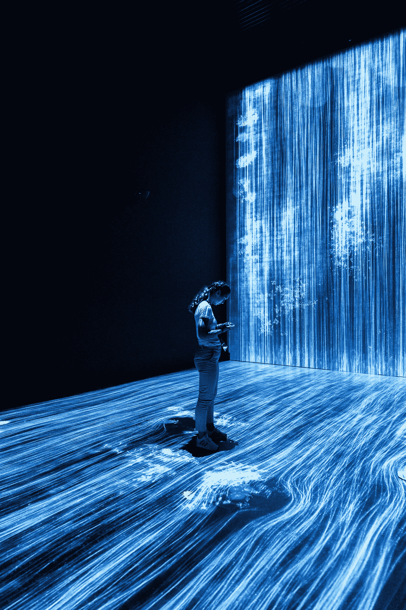

# 推理与预测

> 原文：<https://pub.towardsai.net/inference-vs-prediction-6ce093214d8e?source=collection_archive---------2----------------------->

## [数据科学](https://towardsai.net/p/category/data-science)，[机器学习](https://towardsai.net/p/category/machine-learning)

很多人似乎在机器学习的背景下混淆了这两个术语。这篇文章将试图阐明这两者的含义，它们在哪里有用，以及它们是如何应用的。几年前，当我在伦敦帝国理工学院攻读硕士学位时，上了一堂名为《智能数据和概率推理》(作者邓肯·吉利斯)的课时，我个人就明白了这一点。在这里，我将给出几个例子，以便直观地理解其中的区别。

## **推论:**

你观察你后院的草。它是潮湿的。你观察天空。天气多云。你推断已经下雨了。然后你打开电视，看天气频道。天气多云，但连续几天没有下雨。你记得几小时前你给洒水器装了定时器。你*推断*这是草湿的原因。

(令人毛骨悚然的例子)想象你在晚上盯着一个在角落里有点远的物体。越来越近…你注意到这个物体正盯着你。你*推断*那是一种动物。你足够勇敢，你越来越接近了。你现在可以看到动物的眼睛、皮毛、腿和其他特征。你*推断*这是一只猫*。对你的大脑来说是一个简单的过程，对吗？对你来说这是微不足道的，甚至讨论它都可能是愚蠢的。当然，你可以认出一只猫，但事实上，这是一种推理。*

比如说猫有一些特征，比如眼睛，皮毛，形状等等。当你越接近它，你就给这些变量赋予不同的值。例如，最初，眼睛变量被设置为 0，因为你看不到它们。随着你越走越近，你对你所观察到的就越有把握。你的大脑接受这些观察，并把它们转换成物体是猫的概率。假设我们有一个猫性变量，代表物体是猫的可能性。最初，这个变量可能接近零。随着越靠近对象，猫度越大。*推理*发生并更新你对物体类别的信念。类似的例子可以在这里找到:[http://www . doc . IC . AC . uk/~ dfg/probabilistic conference/idapislides 01 . pdf](http://www.doc.ic.ac.uk/~dfg/ProbabilisticInference/IDAPISlides01.pdf)

## **预测:**

现在我们来谈谈预测。你观察天空。天气多云。你预测会下雨。你在新闻中听到，尽管有云，下雨的可能性很低。你修改了你的*预测*，认为很可能不会下雨。

鉴于你有一只猫，你*预测*当你回家时，你会发现它到处乱跑。

## **要解决这个问题:**

理解人类在日常生活或日常活动模式方面的行为需要对控制其行为动态的潜在变量进行*推断*。关于人们未来在哪里的知识是*预测*。然而，如果我们没有*推断出*关系和动态，比如说，人类的流动性，就无法做出预测。

本质上，*推断*和*预测*回答的是不同的问题。预测可以是简单的猜测，或者是基于一些证据、数据或特征的有根据的猜测。推论是关于理解你能得到的事实。它是关于利用你可以得到的信息来理解世界上正在发生的事情。

预测是关于解释将要发生的事情，而推理是关于已经发生的事情。

在《统计学习导论》一书中，你可以找到更详细的解释。

**简而言之，**然而，重点是给定一些随机变量(X1，X2…Xn)或特征，如果你有兴趣估计某事(Y)，那么这就是预测。如果你想了解(Y)随着随机变量的变化是如何变化的，那么就是推断。