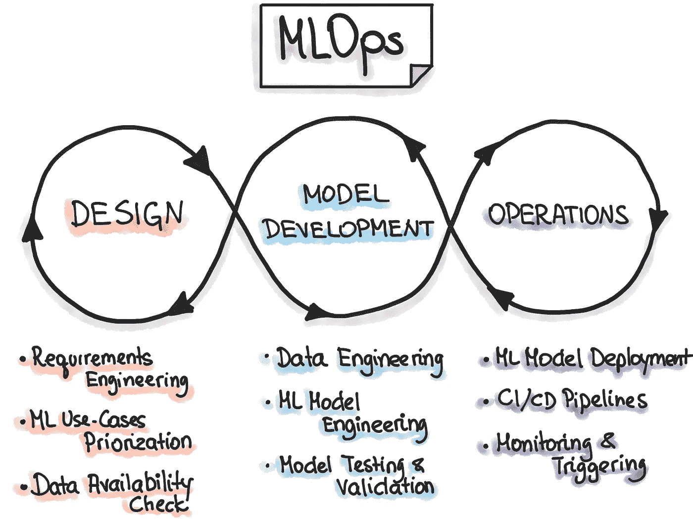

# 面向数据科学的 MLOps 简介

> 原文：<https://pub.towardsai.net/introduction-to-mlops-for-data-science-e2ca5a759f68?source=collection_archive---------0----------------------->

## [机器学习](https://towardsai.net/p/category/machine-learning)

## 持续集成、持续开发和持续测试的一部分

图片[来源](https://ml-ops.org/content/mlops-principles)

> ***什么是 MLOps？***

如果我们分解这个词本身，它是两个词的组合，机器学习和运营。其中机器学习代表模型开发或任何类型的代码开发，而操作意味着代码的生产和部署。

MLOps 的一个更具技术性的定义是一套标准化和简化机器学习生命周期管理的原则和实践。

这不是一项新技术或工具，而是一种文化，它有一套在机器学习世界中定义的原则和指南，可以无缝集成/自动化开发阶段和运营开发阶段。

这是一个迭代的增量过程，其中数据科学家、数据工程师和运营界合作构建、自动化、测试和监控机器学习管道，就像开发-运营项目一样。

我们可以说，MLops 受开发运营的启发，并基于持续集成、持续交付和应用于机器学习流程的附加持续培训的开发运营原则，以加快模型的开发和部署，最终提高 ML 工作流的效率。

> ***机器学习生命周期***

为了理解和开发机器学习模型，我们需要经历如下所示的以下阶段:

**第一阶段:业务问题理解**

*   业务理解/需求收集和规划阶段。我们知道没有坚实的计划，任何项目都不可能成功，人工智能也不例外。在我们开始项目的下一步之前，了解业务问题是很重要的。
*   例如:客户是否希望我们生成推荐系统，欺诈检测，聊天机器人，或任何个性化的需求。在现实世界中，首先部署主题专家和数据科学家来获得业务理解，分析现有数据，并找到可用于解决底层业务问题的模式。

**第二阶段:数据采集**

*   正如我们所知，在机器学习领域，当有大量训练数据集可用时，算法将产生最佳结果。
*   数据获取:数据可能来自多个活动，这些活动可能存在于许多数据源中，如文件、数据库、web 应用程序或移动设备。
*   我们需要识别不同的数据源，如果数据很大，我们可能还需要创建一个数据湖。
*   在这一步收集的数据的数量和质量将决定产出的效率。

**第三阶段:数据准备和数据争论**

*   在前一阶段，收集的数据可以或不可以直接用于训练我们的模型，因为它是原始形式，您知道数据可能包含缺失值，可能存在重复数据，可能存在无效数据或不需要的噪声数据，需要一个步骤将原始数据转换为可用格式，这一过程称为数据争论。
*   对于数据争论，我们需要其他过程来清理数据，如数据转换、探索性数据分析和数据预处理。

 [## Python 中的数据预处理概念

### 一种为机器学习估值器准备数据的稳健方法

pub.towardsai.net](/data-preprocessing-concepts-with-python-b93c63f14bb6) 

**第四阶段:建模**

*   在这个阶段，我们从一个模型选择开始，这个模型选择决定了用例上的模型或者算法的类型。我们有各种各样的机器学习模型可用，如监督模型、非监督模型等。
*   例如:对于数值预测，我们可以使用线性回归、随机森林、决策树等。对于分类问题，我们可以使用逻辑回归、KNN、朴素贝叶斯等。对于聚类问题，我们可以使用 k-means、DBScan 等。

**第五阶段:模型部署**

*   部署意味着将模型集成到现有的生产应用程序中，或者构建一个新的应用程序，并开始对真实数据进行预测，以提高业务价值。
*   我们以 web 服务或 API 的形式在某种生产服务器环境中部署我们的模型，在那里我们点击 API，模型做出预测，然后可能一些其他应用程序可能会使用这些模型，这反过来可以帮助企业做出明智的决策。

 [## 忘记 HTML 和 Flask，开始使用 Streamlit

### 数据科学和机器学习的 WebApp 框架

medium.com](https://medium.com/pythoneers/forget-html-and-flask-start-using-streamlit-1b394cfe4595) 

**第六阶段:监控**

*   仅仅部署模型是不够的，我们需要监控模型的性能，以确保它随着时间的推移继续良好地运行。
*   机器学习模型的一个特性是，随着新数据的到来或数据模式的改变，模型的准确性开始逐渐下降。
*   这种监控必须定期进行，方法是将模型预测的结果与实际值进行比较。

**第七阶段:模特再培训**

*   在模型调整中，我们会根据新的生产数据定期重新训练我们的模型，以确保模型保持快速和准确。

这都是一个连续的过程，直到新的应用程序是生命。

> ***结论:***

这篇文章详细解释了机器学习的生命周期。我相信这个机器学习生命周期的解释会为新的学习者打下基础。

我希望你喜欢这篇文章。通过我的 [LinkedIn](https://www.linkedin.com/in/data-scientist-95040a1ab/) 和 [twitter](https://twitter.com/amitprius) 联系我。

# 推荐文章

1. [8 主动学习 Python 见解收集模块](/8-active-learning-insights-of-python-collection-module-6c9e0cc16f6b?source=friends_link&sk=4a5c9f9ad552005636ae720a658281b1)
2。 [NumPy:图像上的线性代数](/numpy-linear-algebra-on-images-ed3180978cdb?source=friends_link&sk=d9afa4a1206971f9b1f64862f6291ac0)
3。[Python 中的异常处理概念](/exception-handling-concepts-in-python-4d5116decac3?source=friends_link&sk=a0ed49d9fdeaa67925eac34ecb55ea30)
4。[熊猫:处理分类数据](/pandas-dealing-with-categorical-data-7547305582ff?source=friends_link&sk=11c6809f6623dd4f6dd74d43727297cf)
5。[超参数:机器学习中的 RandomSeachCV 和 GridSearchCV](/hyper-parameters-randomseachcv-and-gridsearchcv-in-machine-learning-b7d091cf56f4?source=friends_link&sk=cab337083fb09601114a6e466ec59689)
6。[用 Python 充分解释了线性回归](https://medium.com/towards-artificial-intelligence/fully-explained-linear-regression-with-python-fe2b313f32f3?source=friends_link&sk=53c91a2a51347ec2d93f8222c0e06402)
7。[用 Python](https://medium.com/towards-artificial-intelligence/fully-explained-logistic-regression-with-python-f4a16413ddcd?source=friends_link&sk=528181f15a44e48ea38fdd9579241a78)
充分解释了 Logistic 回归 8。[使用 Numpy 与 Python](/data-distribution-using-numpy-with-python-3b64aae6f9d6?source=friends_link&sk=809e75802cbd25ddceb5f0f6496c9803)
9 进行数据分发。[机器学习中的决策树 vs 随机森林](/decision-trees-vs-random-forests-in-machine-learning-be56c093b0f?source=friends_link&sk=91377248a43b62fe7aeb89a69e590860)
10。[用 Python 实现数据预处理的标准化](/standardization-in-data-preprocessing-with-python-96ae89d2f658?source=friends_link&sk=f348435582e8fbb47407e9b359787e41)