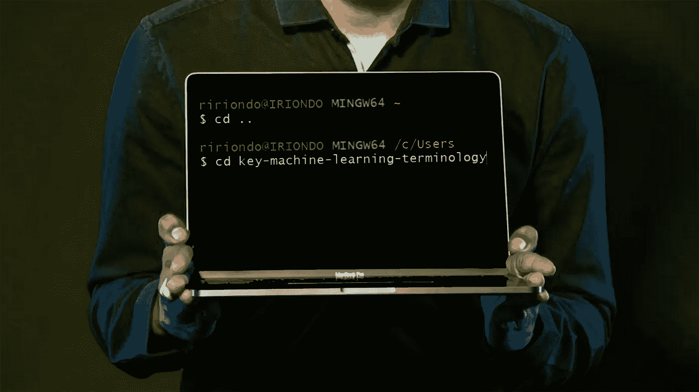

# 关键机器学习定义

> 原文：<https://pub.towardsai.net/key-machine-learning-ml-definitions-43e837ec6add?source=collection_archive---------0----------------------->

## 机器学习

## [机器学习](https://mld.ai/mldcmu)中最常用术语的词汇表

来源: [Pexels](https://pexels.com/)

下面请找到一个与机器学习科学领域相关的可搜索术语表——关于持续增长。

这个词汇表一点也不完整。如果缺少某个术语，请在评论中告诉我，我会把它的定义添加到这个不断增长的词汇表中。此外，如果您对任何术语的定义有任何反馈，也请告诉我。

# 术语表|已排序(A-Z)

## 人工智能代理:

人工智能代理或智能代理是用于人工智能相关任务的机器人。

## 算法:

算法是遵循一套规则的过程，是一个问题解决器——主要由计算机使用。

## AlphaGo:

AlphaGo 是一个玩围棋的计算机程序。它是公认的第一个击败职业人类围棋手[ [5](https://ai.googleblog.com/2016/01/alphago-mastering-ancient-game-of-go.html) ]的电脑围棋程序。

## 人工智能(AI):

根据安德鲁·摩尔教授的定义，人工智能(AI)是一门科学和工程，它让计算机以我们认为需要人类智能的方式运行，直到最近。

## 自主:

自主是指设备或工具能够在没有人类直接控制的情况下运行。

## 反向传播:

反向传播是梯度下降的主要算法，其输出计算前向传递神经网络中每个节点的值。然后，通过该图在反向传递神经网络中计算误差相对于每个参数的偏导数。

## 黑匣子:

黑盒是一个复杂的神经网络，其中的算法、内容和决策过程对最终用户来说是未知的。

## 机器人:

机器人是一种自主程序，可以与计算机系统、程序或用户进行交互。大部分情况下，直接或间接由人监督。

## 聚类:

聚类直接指的是无监督的机器学习。

## 计算学习理论:

计算学习理论是 AI 的子领域，致力于研究机器学习算法的设计和分析[ [4](https://en.wikipedia.org/wiki/Computational_learning_theory) ]。

## 计算机程序:

计算机程序是由计算机启动时执行特定任务的指令集合。

## 计算机科学(CS):

计算机科学是研究计算机原理和使用的科学。

## 计算机视觉:

计算机视觉是人工智能和计算机科学的交叉科学子领域，旨在让计算机对其输入进行视觉理解。

## 卷积神经网络(CNN):

卷积神经网络(CNN)是一种深度神经网络(DNN ),用于图像识别、处理和分析，专门用于处理像素数据。

## 数据:

数据是信息的数字化集合。

## 数据清理:

数据清洗或数据清理是指数据集的质量保证过程。仔细检查数据集以发现并纠正数据库中的错误数据记录。

## 数据挖掘:

数据挖掘是检查和发现数据模式以产生新信息的过程。

## 数据集:

数据集是相关数据集的集合，由单独的元素组成，但可以由计算机作为一个单元来操作。

## 数据科学:

数据科学是一个跨学科的科学领域，它专注于从各种形式的数据中提取知识或见解的过程和系统。

## 深度学习:

深度学习是机器学习的一个子集，其中分层的神经网络结合高计算能力和大数据集，可以创建强大的机器学习模型。

## 深度神经网络(DNN):

深度神经网络(DNN)是一个模仿人脑的大型计算机系统。

## 尺寸缩减:

降维是指通过特征选择和/或特征提取获得一组主变量来减少随机变量数量的过程。

## 可解释人工智能:

可解释的人工智能是能够解释其决策过程的人工智能系统。

## 生成性对抗网络(GANs):

生成对抗网络是两个神经网络在零和博弈框架下相互竞争。

## 启发式:

启发式是指从经验中提取规则，用来比人工智能中其他传统的解决问题的方法更快地解决问题。虽然速度更快，但启发式方法通常不如它所取代的经典方法理想。

## 输入:

输入是通过过程或计算机系统输入、接受或操作的东西。

## 智力:

智力是实现世界目标能力的计算部分。人、许多动物和一些机器都有不同种类和程度的智力。

## 线性代数:

线性代数是数学的一个分支，涉及向量空间和这些空间之间的线性映射。它包括对直线、平面和子空间的研究，但也涉及所有向量空间共有的性质。

## 长短期记忆网络:

长短期记忆网络(LSTMs)是一种独特的循环神经网络，能够学习长期依赖关系[ [2](https://colah.github.io/posts/2015-08-Understanding-LSTMs/) ]。

## 机器学习(ML):

根据 Tom Mitchell 教授的定义，机器学习是指人工智能的一个科学分支，主要研究计算机算法，让计算机程序通过经验自动改进[ [3](http://www.cs.cmu.edu/afs/cs.cmu.edu/user/mitchell/ftp/mlbook.html) ]。

## 机器学习模型:

机器学习建模指的是一个问题/回答系统，它通过净化的数据来处理与 ML 相关的任务。机器学习模型可以被称为过程的复杂表示。

## 机器感知:

机器感知是计算机系统解释数据的能力，就像人类使用感官与周围世界互动和联系的方式一样。

## 自然语言处理(NLP):

自然语言处理(NLP)是人工智能的一个科学分支，专注于帮助计算机理解、解释和操纵人类语言。

## 神经网络:

神经网络是模仿人脑的计算机系统。

## 递归神经网络(RNN):

递归神经网络(RNN)是一种强大而稳健的神经网络，能够在内存中进行复杂的循环。

## 图灵测试:

著名的图灵测试指的是只有当人类无法区分机器和人类时才通过的测试[ [6](https://en.wikipedia.org/wiki/Turing_test) ]。

**免责声明:**本文所表达的观点仅代表作者个人，不代表卡耐基梅隆大学或其他(直接或间接)与作者相关的公司的观点。这些文章并不打算成为最终产品，而是当前思想的反映，同时也是讨论和改进的催化剂。

你可以在 [Medium](https://medium.com/@robiriondo) 、 [Instagram](https://www.instagram.com/robiriondo) 、 [Twitter](https://twitter.com/robiriondo) 、[脸书](https://www.facebook.com/robiriondo)、 [LinkedIn](https://www.linkedin.com/in/robiriondo) 上找到我，或者通过我的 [SEO 公司](https://www.daibuilds.com/seo-company/)。

## 推荐文章

一、[机器学习和数据科学最佳数据集](https://towardsai.net/p/machine-learning/best-datasets-for-machine-learning-and-data-science-d80e9f030279)
二。[艾薪资冲天](http://towardsai.net/ai-salaries)三世
。[什么是机器学习？](https://towardsai.net/p/machine-learning/what-is-machine-learning-ml-b58162f97ec7)
四世。[2020 年最佳机器学习硕士项目](https://towardsai.net/ml-masters)
五、[2020 年最佳机器学习博士项目](https://towardsai.net/ml-phd)
六、[最佳机器学习博客](https://towardsai.net/p/machine-learning/best-machine-learning-blogs-6730ea2df3bd)
七。[关键机器学习定义](https://towardsai.net/p/machine-learning/key-machine-learning-ml-definitions-43e837ec6add)
八。[用机器学习在 0.05 秒内破解验证码](https://towardsai.net/ml-captcha)
九。[机器学习 vs. AI 及其重要区别](https://towardsai.net/p/machine-learning/machine-learning-vs-ai-important-differences-between-them/robiriondo/3432/)
十.[确保成功开创机器学习事业(ML)](https://towardsai.net/p/machine-learning/moocs-vs-academia-ensuring-success-starting-in-a-machine-learning-ml-career-304b2e42315e)
XI。[机器学习算法初学者](https://towardsai.net/p/machine-learning/machine-learning-algorithms-for-beginners-with-python-code-examples-ml-19c6afd60daa)
十二。[神经网络从零开始详细用 Python 代码和数学](https://towardsai.net/neural-networks-with-python)
XIII。[用 Python 构建神经网络](https://towardsai.net/p/machine-learning/building-neural-networks-with-python-code-and-math-in-detail-ii-bbe8accbf3d1)
XIV。[神经网络的主要类型](https://towardsai.net/p/machine-learning/main-types-of-neural-networks-and-its-applications-tutorial-734480d7ec8e)
十五。[用 Python 编写的蒙特卡洛模拟教程](https://towardsai.net/p/machine-learning/monte-carlo-simulation-an-in-depth-tutorial-with-python-bcf6eb7856c8)
XVI。[Python 自然语言处理教程](https://towardsai.net/p/nlp/natural-language-processing-nlp-with-python-tutorial-for-beginners-1f54e610a1a0)

## 参考

[1]卡耐基梅隆大学计算机科学学院院长谈人工智能的未来|福布斯|[https://www . Forbes . com/sites/Peter high/2017/10/30/卡内基-梅隆大学计算机科学学院院长谈人工智能的未来/#164487aa2197](https://www.forbes.com/sites/peterhigh/2017/10/30/carnegie-mellon-dean-of-computer-science-on-the-future-of-ai/#164487aa2197)

[2]了解 LSTM 网络|克里斯多佛·奥拉| https://colah.github.io/posts/2015-08-Understanding-LSTMs/

[3]机器学习定义|汤姆·m·米切尔|麦格劳-希尔科学/工程/数学；(1997 年 3 月 1 日)第 1 页| h[TTP://www . cs . CMU . edu/AFS/cs . CMU . edu/user/Mitchell/FTP/ml book . html](http://www.cs.cmu.edu/afs/cs.cmu.edu/user/mitchell/ftp/mlbook.html)

[4]计算学习理论|维基百科|[https://en.wikipedia.org/wiki/Computational_learning_theory](https://en.wikipedia.org/wiki/Computational_learning_theory)

[5] AlphaGo:用机器学习掌握围棋古棋|谷歌 AI 博客|[https://AI . Google Blog . com/2016/01/alpha Go-Mastering-ancient-game-of-Go . html](https://ai.googleblog.com/2016/01/alphago-mastering-ancient-game-of-go.html)

[6]什么是图灵测试|维基百科|[https://en.wikipedia.org/wiki/Turing_test](https://en.wikipedia.org/wiki/Turing_test)

通过[向 AI](https://towardsai.net/) 发布