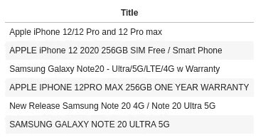
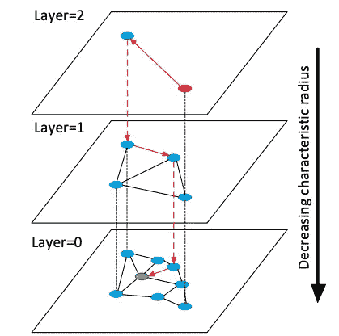
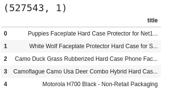
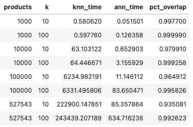
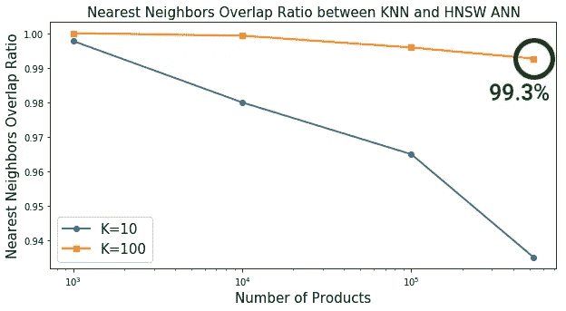

# KNN(K-最近邻)死了！

> 原文：<https://pub.towardsai.net/knn-k-nearest-neighbors-is-dead-fc16507eb3e?source=collection_archive---------1----------------------->

## [机器学习](https://towardsai.net/p/category/machine-learning)，[观点](https://towardsai.net/p/category/opinion)

## 人工神经网络万岁，他们在 sklearn 的 KNN 上实现了 380 倍的惊人加速，同时提供了 99.3%的相似结果。

KNN 就像死了一样！[来源](https://github.com/stephenleo/adventures-with-ann/blob/main/knn_is_dead.ipynb)

我们正在经历灭绝级别的事件。不，不是 COVID19。我说的是几乎每个数据科学课程中都教授的流行的 KNN 算法的消亡！请继续阅读，了解在每一位数据科学家的工具包中，是什么取代了这一主食。

# KNN 背景

在机器学习社区中，找到“K”个与任何给定项目相似的项目被广泛称为“相似性”搜索或“最近邻”(NN)搜索。最广为人知的神经网络搜索算法是 K-最近邻(KNN)算法。在 KNN，给定一组对象，如手机的电子商务目录，我们可以从整个目录中为任何新的搜索查询找到少量(K 个)最近邻。例如，在下面的示例中，如果您设置 K = 3，那么每个“iPhone”的 3 个最近邻居就是另一个“iPhone”同样，每个“Samsung”最近的 3 个邻居都是 Samsung。

6 款手机目录

## 与 KNN 的问题

虽然 KNN 很擅长寻找相似的物品，但它使用详尽的成对距离计算来寻找邻居。如果您的数据包含 1000 个商品，那么为了找到一个新产品的 K=3 个最近邻，该算法需要执行该新产品到数据库中所有其他产品的 1000 次距离计算。嗯，还不算太糟。但是想象一下现实世界中的客户对客户(C2C)市场，数据库中有数百万件产品，每天可能有数千件新产品上传。将每一款新产品与数百万款产品进行比较是浪费时间的，也就是根本不可扩展的*。*

## *解决方案*

*将最近邻扩展到大数据量的解决方案是完全避开强力距离计算，而是使用一种更复杂的算法，称为近似最近邻(ANN)。*

# *近似最近邻(ANN)*

*严格地说，人工神经网络是一类算法，其中在人工神经网络搜索过程中允许出现少量错误。但在现实世界的 C2C 市场中,“真实”邻居的数量高于被搜索的“K”个最近邻居，人工神经网络可以在很短的时间内达到与强力 KNN 相当的显著准确性。有几种人工神经网络算法，例如*

1.  *Spotify 的[ [惹恼了](https://github.com/spotify/annoy)*
2.  *谷歌的[ [ScaNN](https://github.com/google-research/google-research/tree/master/scann)*
3.  *脸书的[[失败](https://github.com/facebookresearch/faiss)*
4.  *我个人最喜欢的是:层次导航小世界图[ [HNSW](https://github.com/nmslib/hnswlib)*

*这篇文章的其余部分将 Python 的`sklearn`中实现的 KNN 算法与 Python 的`hnswlib`包中实现的称为分层可导航小世界(HNSW)图的优秀人工神经网络算法进行基准测试。我将使用一个包含 527000 件“手机&配件”产品的大型[ [亚马逊产品数据集](http://deepyeti.ucsd.edu/jianmo/amazon/) ]来证明 HNSW 在速度上要优越得多(精确地说快 380 倍)，同时提供 99.3%类似于 sklearn 的 KNN 的结果。*

## *分层可导航小世界*

*在 HNSW[【paper @ arxiv】](https://arxiv.org/abs/1603.09320)中，作者描述了一种使用多层图的 ANN 算法。在元素插入期间，通过随机选择具有指数衰减概率分布的每个元素的最大层，逐步构建 HNSW 图。这确保了层=0 具有许多元素来实现精细搜索，而层=2 具有 e^-2 较低数量的元素来促进粗略搜索。最近邻搜索从最顶层开始进行粗略搜索，并向下进行，直到最底层，使用贪婪图路由遍历图并找到所需数量的邻居。*

**

*HNSW 图形结构。最近邻搜索从最顶层(粗略搜索)开始，到最底层(精细搜索)结束。[来源](https://arxiv.org/abs/1603.09320)*

## *HNSW Python 包*

*整个 HNSW 算法都是用 C++写的，带有 Python 绑定，可以通过输入`pip install hnswlib`安装在你的机器上。一旦你安装了这个包并导入了它，创建 HNSW 图需要几个步骤，我已经把它们打包成了下面的一个方便函数。*

*一旦创建了 HNSW 索引，查询“K”最近邻就像调用下面的一行代码一样简单。*

# *KNN 与安基准测试实验*

## *计划*

*我们将首先下载一个包含 500K+行的大型数据集。然后，我们将通过使用预先训练的`fasttext`句子向量，将文本列转换为`300d` 嵌入向量。然后，我将在不同长度的输入数据`[1000, 10000, 100000, len(data)]`上训练 KNN 和 HNSW ANN 模型，以测量数据大小对速度的影响。最后，我将从两个模型中查询 K = 10 和 100 个最近邻，以测量 K 对速度的影响。首先，让我们导入必要的包和模型。这将需要一些时间，因为`fasttext` 模型需要从互联网上下载。*

## *数据*

*我们将使用[ [亚马逊产品数据集](http://deepyeti.ucsd.edu/jianmo/amazon/) ]，其中包含“手机&配件”类别中的 527000 件产品。从链接下载数据集，并运行以下代码将其转换为数据框。我们只需要产品`title`列，因为我们将使用它来搜索类似的产品。*

*如果一切运行正常，您应该会看到如下输出*

**

*亚马逊产品数据集*

## *把...嵌入*

*要在文本数据上运行任何相似性搜索，我们必须首先将它转换成一个数字向量。一种快速便捷的方法是使用预先训练好的网络嵌入层，比如脸书的[ [FastText](https://github.com/facebookresearch/fastText) ]提供的嵌入层。因为我们希望所有的行都有相同的长度向量，不管`title`中的字数是多少，我们将对 df 中的`title`列应用`get_sentence_vector`方法。一旦嵌入完成，我们提取`emb`列作为输入到我们的神经网络算法的列表列表。理想情况下，您应该在此步骤之前运行一些文本清理预处理。此外，使用微调嵌入模型通常是一个好主意。*

## *标杆管理*

*现在我们有了算法的输入，让我们运行基准测试。我们将在搜索空间中的产品数量和正在搜索的`K`最近邻居的循环中运行测试。*

*在每次迭代中，除了记录每个算法花费的时间之外，我们还检查`pct_overlap`作为也被人工神经网络选为最近邻的 KNN 最近邻的数量的比率。*

*小心！整个测试在一台 24x7 运行的 8 核 30 GB RAM 机器上运行了大约 6 天，因此这可能需要一些时间。理想情况下，您可以通过多重处理来加快速度，因为每次运行都是相互独立的。*

*运行结束时的输出如下所示。正如你已经从表中看到的，西南大学完全击败了 KNN！*

**

*表格形式的结果*

## *结果*

*让我们以图表的形式来看一下基准测试结果，以便真正了解差异的大小。我将使用标准的`matplotlib`代码来绘制这些图表。两个轴都在`log`刻度内。差别是惊人的！HNSW ANN 在查询 K=10 和 100 个最近邻居所需的时间方面胜过 KNN。当搜索空间包含约 500K 个产品时，在 ANN 上搜索 100 个最近邻要快 380 倍。同时，KNN 和安都找到 99.3%相同的最近邻。*

**

*当搜索空间包含约 500K 个元素时，HNSW ANN 比 Sklearn 的 KNN 快 380 倍，并且为搜索空间中的每个元素找到 K=100 个最近邻。[来源](https://github.com/stephenleo/adventures-with-ann/blob/main/knn_is_dead.ipynb)*

**

*当搜索空间包含约 500K 个元素时，HNSW ANN 产生 99.3%的与 Sklearn 的 KNN 相同的最近邻，并且在搜索空间中为每个元素找到 K=100 个最近邻。[信号源](https://github.com/stephenleo/adventures-with-ann/blob/main/knn_is_dead.ipynb)*

*有了这些结果，我想可以有把握地说，“KNN 死了！”再也没有合理的理由使用`sklearn's` KNN 了。我希望这篇文章对你有用。这篇文章的所有代码都可以在我的 [GitHub 库](https://github.com/stephenleo/adventures-with-ann/blob/main/knn_is_dead.ipynb)中找到。感谢您的阅读！*

*下一步是什么？如果你想知道哪种人工神经网络算法在你自己的数据集上是最好的，请查看我在这个系列中的下一篇文章:*

* [## 如何选择最佳最近邻算法

### 一种数据驱动的方法，用于在您的自定义数据集上选择最快、最准确的人工神经网络算法

medium.com](https://medium.com/towards-artificial-intelligence/how-to-choose-the-best-nearest-neighbors-algorithm-8d75d42b16ab) 

如果你想在大数据上部署人工神经网络，你可以在 Docker 容器中使用 Elasticsearch

 [## 基于 Docker 弹性搜索的近似最近邻

### 将人工神经网络扩展到上亿

medium.com](https://medium.com/towards-artificial-intelligence/approximate-nearest-neighbors-on-elastic-search-with-docker-15342153f22a) 

编辑 1:一个代码错误已被修复，结果有相应的变化，但结论没有任何变化。图已更新到更高的质量和 log-Y 轴。
编辑 2:更新了 github gists 的代码片段*