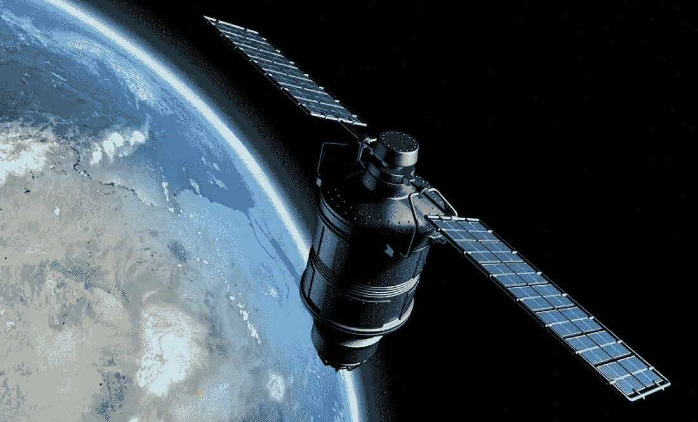
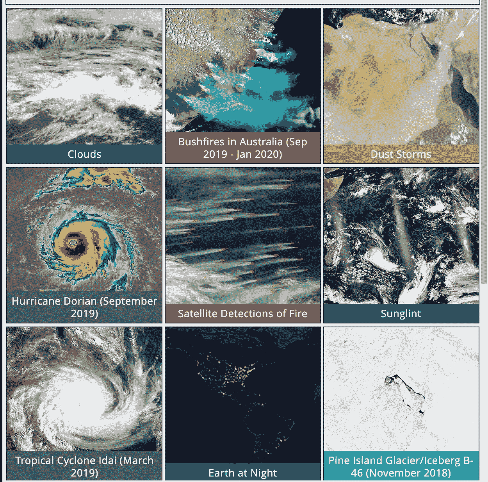
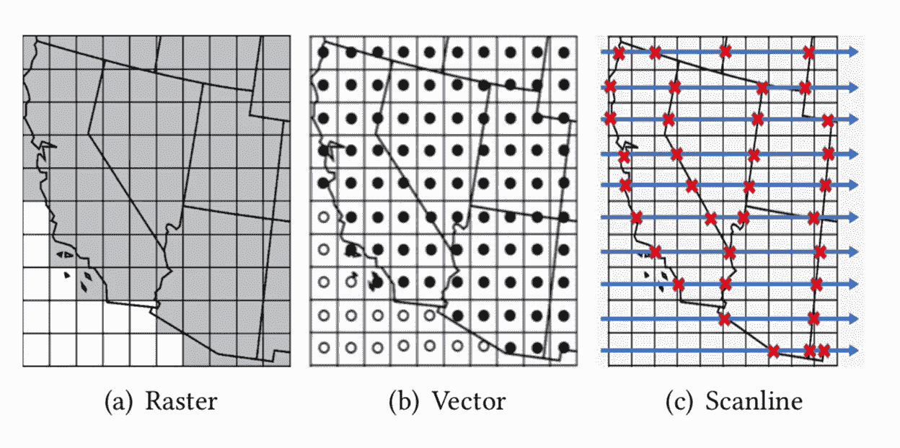
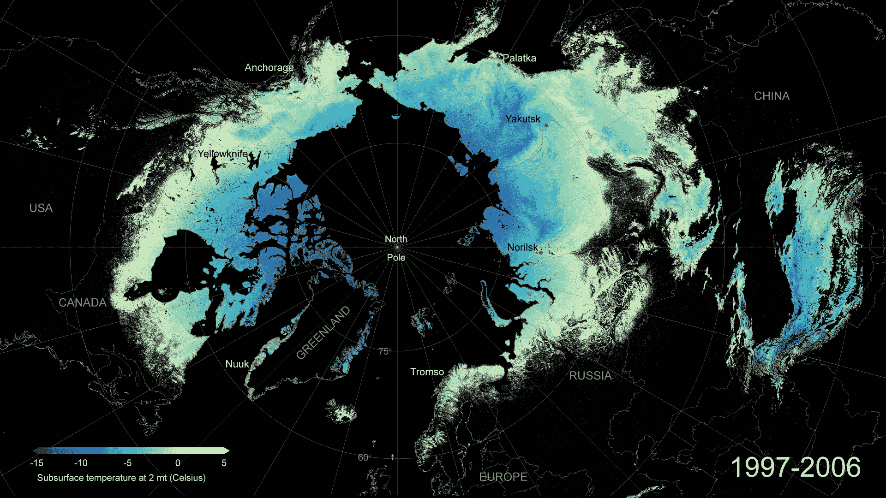

# 大规模卫星数据处理

> 原文：<https://pub.towardsai.net/large-scale-satellite-data-processing-e963692380b8?source=collection_archive---------3----------------------->

## [技术](https://towardsai.net/p/category/technology)

## 随着越来越多的空间数据涌入，我们希望提高卫星数据处理方法和效率。

[来源](https://www.techspot.com/news/57122-higher-resolution-satellite-imagery-approved-by-department-of-commerce.html) : Techspot

# 空间数据-它是什么？

空间数据或地理空间数据可以被认为是包含地球表面位置信息的任何数据。空间数据存在于任何领域或行业，尤其是在当今“实时”数据驱动的世界。有一些常用术语可以更好地解释空间数据的语言。

**矢量数据**是任何包含点、线和/或多边形的数据点。它可以被认为是我们对世界的“人造”地图视图，由道路网络、行政边界等组成。**光栅数据**，被称为图像，是任何像素化的数据，例如卫星图像。通常，栅格数据是从任何区域设备(如卫星或无人机)拍摄的照片。分辨率可能会因设备精度和其他技术及地域因素而有很大差异。**地理坐标系(GCS)** 是地球 3D 表面的投影，用于定义地球上的位置。它使用纬度、经度、角度(角度)和轴。

# 高分辨率地球图像现已公开

[来源](https://worldview.earthdata.nasa.gov/?v=-355.64996960982273,-181.14238495515653,280.70391705645204,157.08613744653766) : EOSDIS 图像

仅在过去十年里，遥感技术就取得了巨大进步。这为公开提供数十亿字节的高分辨率卫星图像铺平了道路。该数据的用例适用于任何行业，尤其是大气科学、农业、生态学、土壤科学等领域。[美国宇航局 EOSDIS](https://worldview.earthdata.nasa.gov/) 向公众提供超过 17pb 且不断增长的卫星图像数据。欧洲航天局(ESA)发射了[1A 哨兵](https://sentinel.esa.int/web/sentinel/missions/sentinel-1/data-distribution-schedule)卫星，仅在发射的头两年内就收集了超过 5pb 的数据。

然而，这些进步暴露了处理大量数据的漏洞，从而为我们建立新的空间数据处理系统铺平了道路，包括 SpatialHadoop、Simba、GeoSpark、RasDaMan 等。然而，这些系统只专注于处理光栅或图像数据。它们在同时处理矢量和栅格数据的查询上表现不佳。此外，这些方法需要进行栅格转矢量或矢量转栅格的转换，这在处理大量数据时效率极低。

那么，有什么解决方案可以同时处理矢量数据和栅格数据呢？一个答案是分区统计。

# 区域统计

*区域统计*是处理矢量和栅格数据组合的操作。它为矢量图层中的每个面计算栅格图层的统计数据。所有值都是从栅格图层聚合而来，栅格图层与矢量图层中的一组面重叠。

例如，假设我们对寻找美国各州的平均温度感兴趣。我们有来自矢量图层矢量的美国各州的面和来自栅格图层的温度数据。分区统计可计算美国各州的平均温度(或其他统计数据)。这种同时处理矢量和栅格图层的计算称为*扫描线方法。*

# 扫描线方法

图 1

*扫描线方法*通过寻找水平扫描线和各自多边形边界之间的交叉点，直接解决区域统计问题，如图 2(c)中的*所示。*在最新版本中，扫描线方法现在可以一次处理多个相邻多边形，进一步降低了处理的复杂性。这意味着，例如，如果我们想要找到西部所有州的平均温度，我们现在可以在一次计算中计算这个查询，而不是单独计算每个州的平均温度。

## 该算法

图 2

*   **输入**:一组多边形(矢量图层)，栅格图层
*   **输出**:期望的聚集(例如多边形内像素的总和、最小值、最大值、计数、平均值)

**第一步:**如图*图 2(b)* 所示，首先计算输入多边形的最小外接矩形(MBR)并将其两个角映射到光栅层，以定位光栅层中要处理的行/扫描线的范围。为了包含多个多边形，我们将此步骤扩展到所有查询的多边形。

**第二步:**如图*图 2(c)* 所示，计算每条扫描线与其多边形边界的交点。每条扫描线都被转换到向量空间，并将其 y 坐标存储在一个排序列表中。然后，扫描每个多边形的相应扫描线范围，这些扫描线用于计算多边形的交点。

**第三步:**如图*图 2(d)* 所示，位于多边形内部的像素被处理。这一步不是一次处理一个多边形，而是一次处理一条扫描线，大大加快了计算速度。

## 扫描线方法的优点

该算法克服了基于光栅和矢量方法的局限性。首先，它只需要最小的交叉点中间存储。其次，它会访问多边形内部的像素，从而提高大型栅格图层的磁盘 IO。第三，它不需要任何复杂的多边形内点测试，这使得它比矢量化方法更快。最后，扫描线方法是 IO 受限的，这使得它从处理的角度来看是最佳的，因为它需要对光栅数据进行一次扫描来处理所有的多边形。

# 使用案例

[资料来源](https://www.esa.int/Applications/Observing_the_Earth/Space_for_our_climate/Long-term_permafrost_record_details_Arctic_thaw):欧洲航天局——北极 1997 年至 2008 年的平均温度

正如我上面提到的，处理空间数据的用例是无穷无尽的。随着我们缓慢而坚定地迈向更加“绿色”和环境友好的全球社会，能够处理和提取地球图像的洞察力是非常重要的。同时处理矢量数据和卫星数据不仅使我们能够将空间数据洞察力应用于我们的社会，还使我们能够预见地球表面的趋势。我们可以更好地监测植被、温度、海平面变化等。

访问我的 [GitHub](https://github.com/hsayedi/Satellite-Data-Server) 库，查看在后端使用扫描线方法通过用户界面处理多个多边形的全栈应用程序。