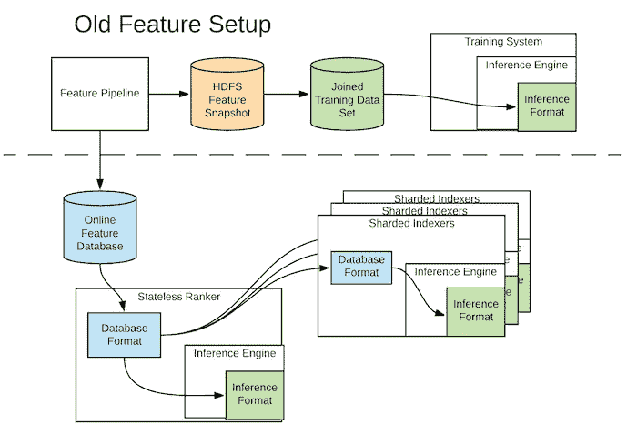
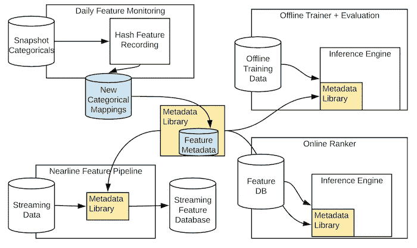

# LinkedIn 的类型化特征架构包括机器学习管道的有趣想法

> 原文：<https://pub.towardsai.net/linkedins-typed-feature-architecture-includes-interesting-ideas-for-machine-learning-pipelines-7487e42d2f47?source=collection_archive---------4----------------------->

## 新类型的特征模式简化了跨越数千个机器学习模型的特征的可重用性。


图片来源:[https://solutions review . com/business-intelligence/machine-learning-LinkedIn-groups/](https://solutionsreview.com/business-intelligence/machine-learning-linkedin-groups/)

> 我最近创办了一份专注于人工智能的教育时事通讯，已经有超过 15 万名订户。《序列》是一份无废话(意思是没有炒作，没有新闻等)的 ML 导向时事通讯，需要 5 分钟阅读。目标是让你与机器学习项目、研究论文和概念保持同步。请通过订阅以下内容来尝试一下:

[](https://thesequence.substack.com/) [## 序列

### 与机器学习、人工智能和数据发展保持同步的最佳资源…

thesequence.substack.com](https://thesequence.substack.com/) 

LinkedIn 是处于机器学习创新前沿的公司之一。LinkedIn 工程团队经常面临在大规模可扩展性水平上应用机器学习的问题，他们已经成为开源机器学习堆栈以及详细介绍他们在机器学习之旅中学习到的一些最佳实践的内容的定期贡献者。在 LinkedIn 体验的核心，我们有推荐新关系、工作或职位候选人的内容提要。这些内容由许多基于机器学习模型的推荐系统提供支持，这些系统需要不断的实验、版本控制和评估。这些目标依赖于一个非常健壮的特征工程过程。最近，LinkedIn 公布了一些关于他们的特征工程方法的细节，以实现快速实验，其中包含一些非常独特的创新。

像 LinkedIn 这样的组织处理的机器学习问题的规模对数据科学家来说是难以理解的。建立和维护一个单一的、有效的机器学习模型已经够难的了，所以想象一下协调成千上万个机器学习程序的执行来实现一个有凝聚力的体验。特征工程是允许机器学习程序快速实验的关键要素之一。例如，让我们假设使用 100 个特征来描述 LinkedIn 会员，并且会员主页中呈现的内容提要由 50 多个机器学习模型支持。假设每秒钟有数万人加载他们的 LinkedIn 页面，所需的特征计算量如下所示:

*(特征数量)LinkedIn 并发成员数量)X(机器学习模型数量)> 100 X 10000 X 50 >每秒 5000 万*

对于大多数开始机器学习之旅的组织来说，这个数字是难以理解的。这种规模要求以灵活且易于解释的方式表示功能，可以在不同的基础架构(如 Spark、Hadoop、数据库系统等)之间重用。LinkedIn 的特性架构的最新版本引入了类型化特性的概念，以一种可表达和可重用的格式来表示特性。这个想法源于对 LinkedIn 的机器学习推理和训练架构的早期版本的挑战。

# 第一个版本

像任何大型、敏捷的组织一样，LinkedIn 的机器学习架构在不同的基础设施上发展。例如，下图展示了 LinkedIn 分别基于 Spark 和 Hadoop 的在线和离线推理基础设施的特性架构。

在线要素架构针对表示字符串的通用性进行了优化，以存储类别和单个浮点值类型。这种设计在表示整数计数、具有已知域的类别和交互特征时产生了效率成本。另一方面，HDFS 要素快照针对简单的离线连接进行了优化，针对每个要素而不是统一的，并且没有考虑在线系统。不同类型的要素表示之间的不断转换会在跨不同系统复制更新的要素和挑战的可能实验中引入常规摩擦。



图片来源:LinkedIn

# 典型特征

为了解决最初的特征架构的一些限制，LinkedIn 引入了一种新的方法，在我们的系统中以张量的单一格式存储特征，并带有特定于特征的元数据。张量是大多数流行的深度学习框架中使用的标准计算单元，如 TensorFlow 或 PyTorch。从这个角度来看，张量的使用有助于实现复杂的线性代数运算，而不会牺牲底层格式。大多数数据科学家都熟悉张量结构，因此新的表示结果相对容易纳入机器学习程序。

值得注意的一点是，新的 LinkedIn 结构是专门为特性设计的，不依赖于 Avro 这样的通用数据类型格式。通过在张量的基础上构建，特征总是在相同的通用模式中序列化。这允许在不改变任何 API 的情况下灵活地向系统快速添加新特性。这是可以实现的，这要归功于元数据，它将以前空间效率低下的字符串或自定义模式映射为整数。

下面的代码使用 LinkedIn 的新类型化特性模式说明了特性的定义。具体定义了一个特性“historicalActionsInFeed ”,它将列出一个成员在提要上采取的历史操作。特性元数据信息是在旗舰名称空间中定义的，带有名称和版本。这允许任何系统使用 urn *urn:li:(旗舰，历史输入，1，0)在元数据系统中查找该特征。*根据该特征定义，有两个重要的维度，包括*“feed actions”*中不同动作类型的分类列表，以及代表成员历史中不同时间窗口的离散计数。

```
// Feature definition:
historicalActionsInFeed: {
  doc: "Historical interactions on feed for members. go/linkToDocumentation"
  version: "1.0"
  dims: [
    feedActions-1-0,
    numberOfDays-1-0
  ]
  valType: INT
  availability: ONLINE
}
//////////
// Dimension definitions:
feedActions: {
  doc: "The actions a user can take on main feed"
  version: "1.0"
  type: categorical : {
    idMappingFile: "feedActions.csv"
  }
}
numberOfDays: {
  doc: "Count of days for historical windowing"
  type: discrete
}
//////////
// Categorical definition (feedActions.csv):
0, OUT_OF_VOCAB
1, Comment
2, Click
3, Share
```

# 第二个版本

有了新的特性和元数据表示模型，分发就成了新的挑战。如何在数千个机器学习模型和数十个基础设施组件之间有效地分发新功能。答案比预期的简单。LinkedIn 为每种元数据类型创建了一个单一的文本数据源，存储在源代码控制之下，并作为工件库发布。多聪明啊！任何机器学习系统都可以通过简单地声明一个依赖关系来获取所需的元数据结构。此外，LinkedIn 类型的功能解决方案包括一个元数据解析库，它针对不同的功能存储进行操作。



图片来源:LinkedIn

LinkedIn 的新型特征架构包括一些有趣的想法，可以简化大规模机器学习系统的特征工程。通过使用张量作为底层计算单元，Linked 创建了一个可以轻松插入任何机器学习框架的特征表示。此外，元数据的使用可以丰富特征的表示。早期报告表明，新类型的功能架构将 LinkedIn 推理系统的性能提高了 20%以上，这在当时是一个了不起的数字。在不久的将来，看到一些这样的想法被开源会很有趣。