# 6 步使用 BigQuery ML 进行逻辑回归

> 原文：<https://pub.towardsai.net/logistic-regression-with-bigquery-ml-in-6-steps-7a8ce7700ee8?source=collection_archive---------2----------------------->

## 使用 BigQuery ML 通过 SQL 构建逻辑回归模型的分步指南。

[图片由 Freepik 拍摄](https://www.freepik.com/free-photo/nexus-bring-communicate-cloud-your-google_1235355.htm#query=google%20cloud&position=11&from_view=search&track=sph)

# 介绍

逻辑回归模型是一种用于预测结果概率的统计模型。逻辑回归，尽管它的名字，是一个分类模型，而不是回归模型。结果通常是二进制的，这意味着它只能是两个可能值中的一个，如是或否。但是逻辑回归也可以很容易地扩展到两个以上的类(多项式回归)。

以下是逻辑回归模型的一些优点:

*   逻辑回归很容易解释
*   它可以被正则化以避免过度拟合
*   模型系数可以被解释为特征重要性的指标。

在本教程中，您将学习 BigQuery ML 中的二元逻辑回归模型，以预测从[芝加哥出租车出行数据集](https://data.cityofchicago.org/Transportation/Taxi-Trips/wrvz-psew)中的客户处获得小费。该数据集包括从 2013 年到现在的出租车出行，报告给作为监管机构的芝加哥市。

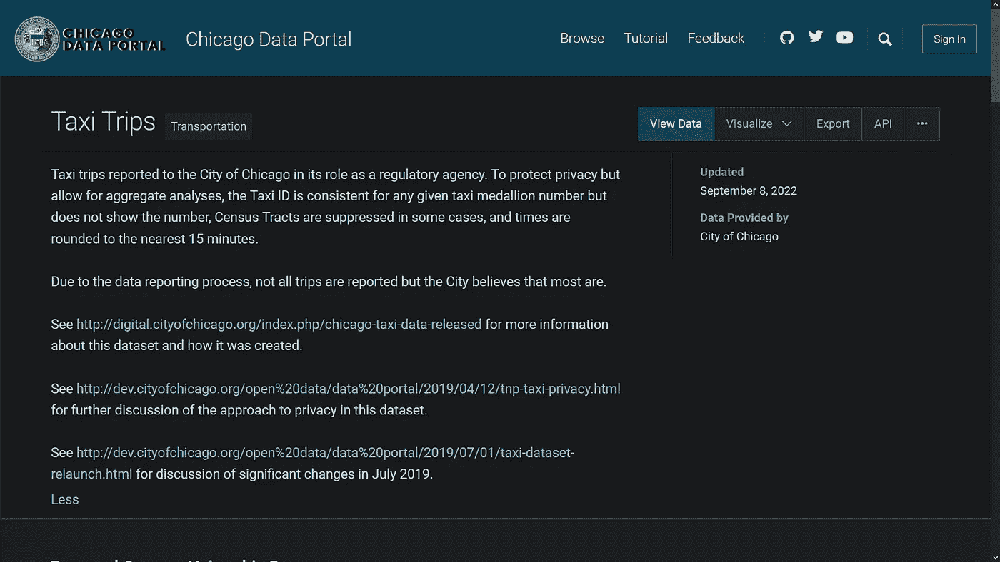

[芝加哥出租车旅行](https://data.cityofchicago.org/Transportation/Taxi-Trips/wrvz-psew)

以下是我们将在本帖中介绍的内容:

*   什么是 BigQuery？
*   什么是 BigQuery ML？
*   创建数据集
*   了解数据集
*   建立逻辑回归模型
*   评估逻辑回归模型
*   使用逻辑回归模型进行预测

让我们开始吧！

# 什么是 BigQuery？

[**BigQuery**](https://cloud.google.com/bigquery/docs/introduction) 是一个完全托管的无服务器数据仓库，允许您使用内置功能(如机器学习、地理空间分析和商业智能)来管理和分析您的数据。使用 BigQuery 可以在几秒钟内查询 TB，在几分钟内查询 Pb。

您可以在 Google 云控制台界面和 BigQuery 命令行工具中访问 BigQuery。您还可以使用 [Python](https://github.com/googleapis/python-bigquery) 、Java、JavaScript 和 Go 中的客户端库以及 BigQuery 的 REST API 和 RPC API 来处理 BigQuery，以转换和管理数据。

大查询页面

# 什么是 BigQuery ML？

您可以使用 BigQuery 来查询大数据，也可以使用标准 SQL 查询来构建机器学习模型。BigQuery ML 允许您发现、实现和管理数据工具，以做出关键的业务决策。

[BigQuery Cheatsheet](https://cloud.google.com/static/bigquery-ml/images/ml-model-cheatsheet.pdf)

如你所知，在大数据集上建立机器学习模型需要大量的编程和 ML 框架知识，如 TensorFlow 和 PyTorch。BigQuery ML 帮助 SQL 从业者使用现有的 SQL 工具和技能建立和评估机器学习模型。

以下是 BigQuery ML 的一些优点:

*   BigQuery ML 民主化了机器学习的使用，你只需要懂 SQL。
*   它提供了各种可以开箱即用的预构建模型。
*   不用从数据仓库导出数据，就可以快速建立机器学习模型。
*   它易于使用，可以集成到现有的工作流程中。
*   它具有成本效益，可用于在现收现付的基础上训练模型。

[数据处理管道](https://medium.com/google-cloud/how-to-integrate-external-data-sources-with-bigquery-9e126d5751ea)

# BigQuery 定价

Bigquery 不是免费的，它向你收取数据存储和运行查询的费用。但是作为[谷歌云免费层](https://cloud.google.com/free)的一部分，BigQuery 免费提供一些特定限制的资源。这些免费使用限制在免费试用期期间和之后可用。有关免费使用层的更多信息，您可以查看[这里](https://cloud.google.com/bigquery/pricing#free-tier)。

# 用 6 步 BigQuery 进行逻辑回归分析

在开始之前，您需要创建一个 Google Cloud 项目，或者在 Google Cloud 控制台中选择一个项目。*请记住，完成项目后，您可以删除该项目，删除与该项目相关的所有资源。*

## 第一步。创建数据集

在建立机器学习模型之前，您需要创建一个数据集。为此，我们先转到 bigquery 页面。之后，点击项目名称旁边的三个点，然后按*创建数据集*。

创建数据集

在**创建数据集**页面上，输入一个名称，比如说 *chicago_taxi，*保留所有其他选项的默认值，然后单击创建数据集。

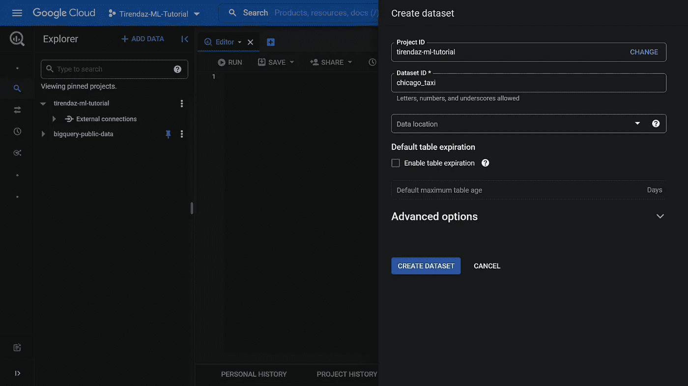

创建名为 chicago_taxi 的数据集

## 第二步。探索数据集

我要用的数据集是**芝加哥 _ 出租车 _ 行程**数据集**。**该数据集存在于托管所有 bigquery 公共数据集的**big query-public-data**GCP 项目中。让我们来看看这个数据集。打开**big query-public-data**GCP 项目，找到 **chicago_taxi_trips** 数据集。之后，单击 taxi_trips 表。

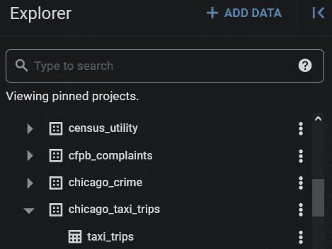

芝加哥出租车旅行

将打开一个新窗口，显示关于数据集的信息。

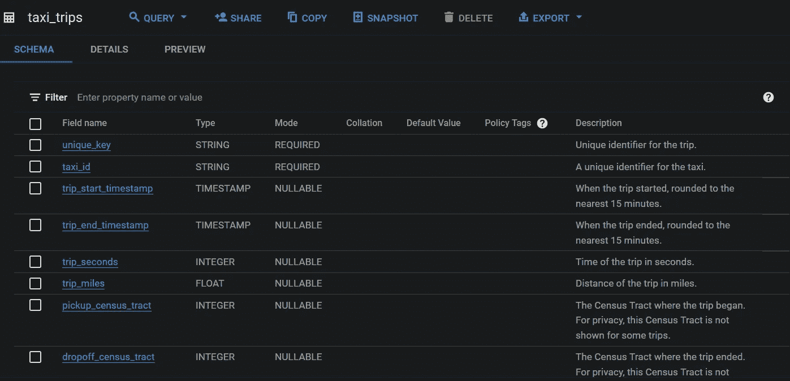

taxi_trips 表模式

在方案选项卡中，citibike_trips 表的结构显示了可用作标注和要素的所有字段。

您还可以通过按 PREVIEW 选项卡来查看数据集的行。

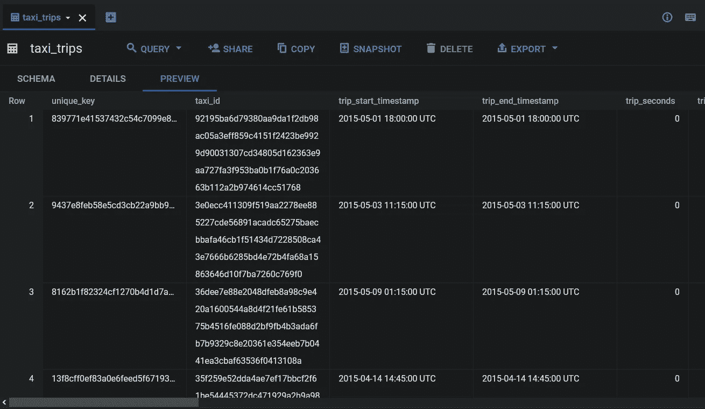

数据集的预览

现在，为了理解数据集，让我们看一下 taxi_trips 表中的前十行:

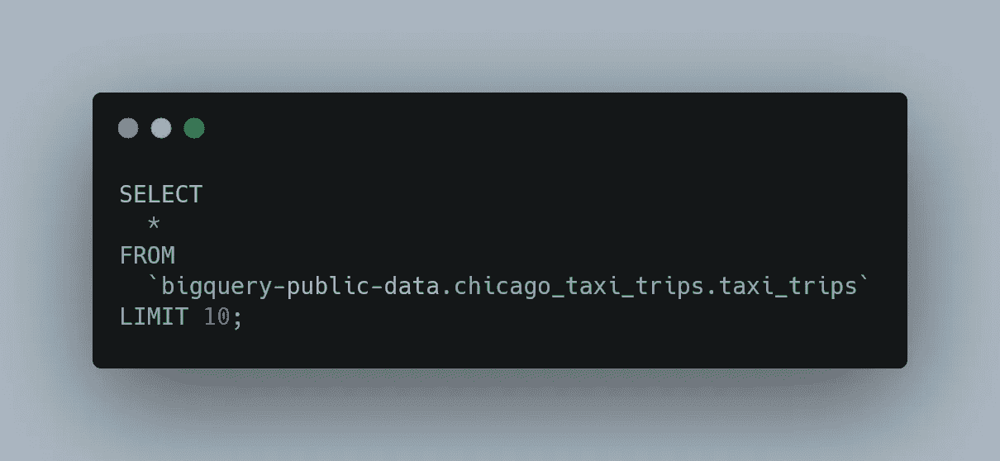

显示数据集前十行的查询

注意，我使用了`LIMIT 10`子句来限制结果集中的记录数量。运行该查询后，您将看到如下屏幕截图:

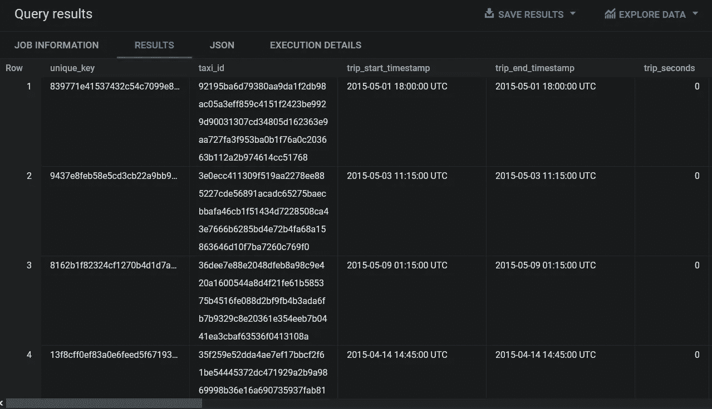

数据集的前几行

现在让我们来看看 **trip_start_timestamp** 字段的最小值和最大值:

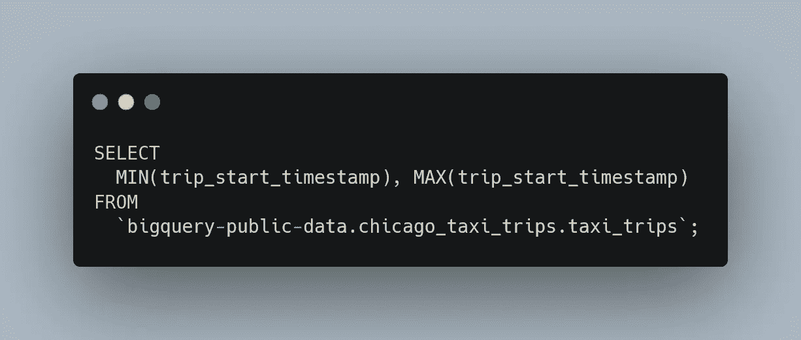

显示 **trip_start_timestamp** 字段的最小值和最大值的查询

运行该查询后，您将看到如下屏幕截图:

如你所见，这个数据集包括了从 2013 年到现在的出租车出行。现在，让我们来看看提示栏中缺少的数据:

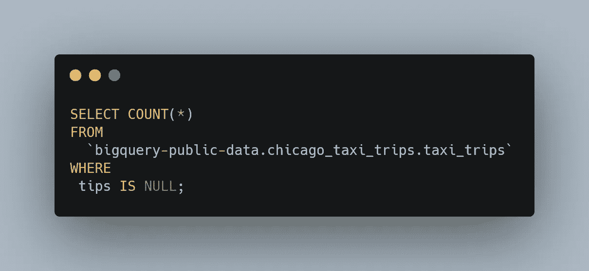

在提示列中显示缺失数据的查询

运行该查询后，您将看到如下屏幕截图:

如您所见，tips 列有 7，378 个缺失数据。在建立机器学习模型之前，我们将处理这些值。

现在，让我们将数据集分成三个不同的集合:训练、评估和分类。

## 第三步。创建表

在训练模型之前，数据集在机器学习项目中被分成三组。这些是训练集、验证集和测试集。模型是用定型集构建的，模型是用验证集评估的，测试集中的值是用模型预测的。

让我们首先创建培训表。

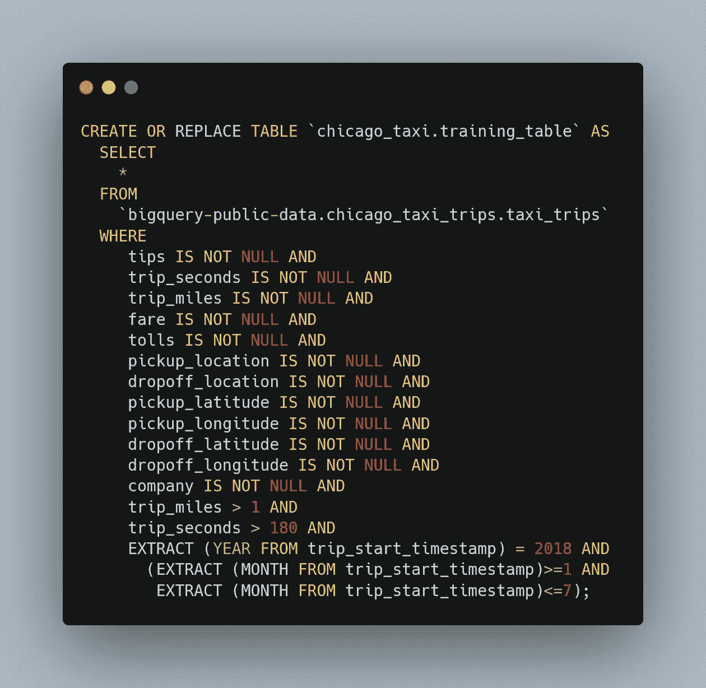

创建培训表

我关注的是 2018 年的前 7 个月。我将分别用第八个月和第九个月做评估和测试表。运行此查询时，将创建培训表。

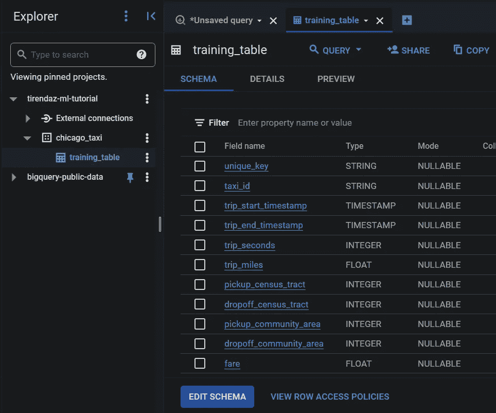

训练台

接下来，让我们用下面的查询创建评估表。请注意，我将只更改表的名称和日期。

创建评估表

现在让我们创建测试表。这次我要定第九个月。

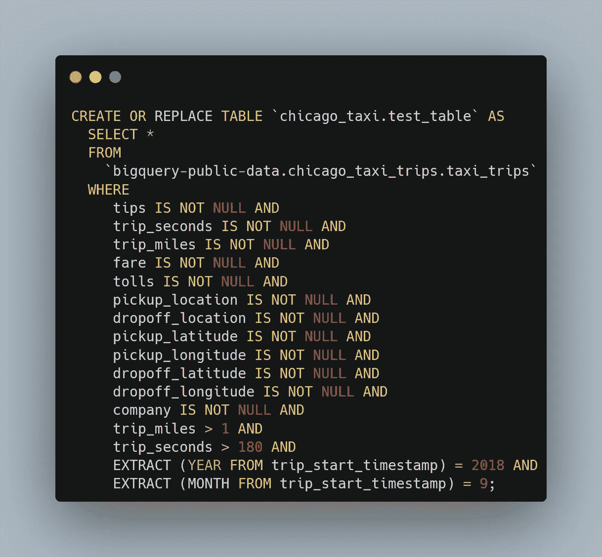

创建测试表

厉害！我们创造了桌子。现在，我们可以使用训练表建立逻辑回归模型。

## 第四步。构建模型

您可以使用带有选项`'LOGISTIC_REG'`的`CREATE MODEL`语句来创建和训练逻辑回归模型。让我们使用下面的查询建立一个逻辑回归模型。

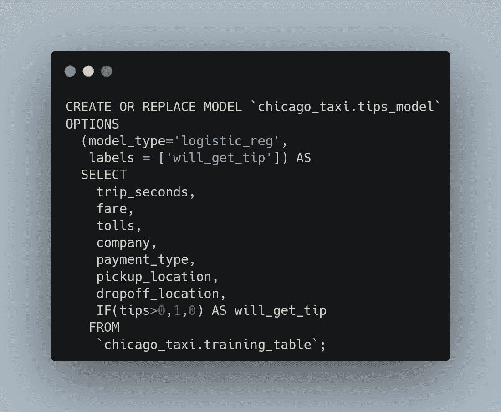

构建模型

在这里，我创建了 *will_get_tip* 数据。此数据指的是小费是否收到。如果小费大于零，它将被编码为 1，否则为零。我将这个数据设置为 label。运行此查询时，您可以在导航面板中看到您的模型。如果您点击 *tips_model* ，您可以看到如下模型指标:

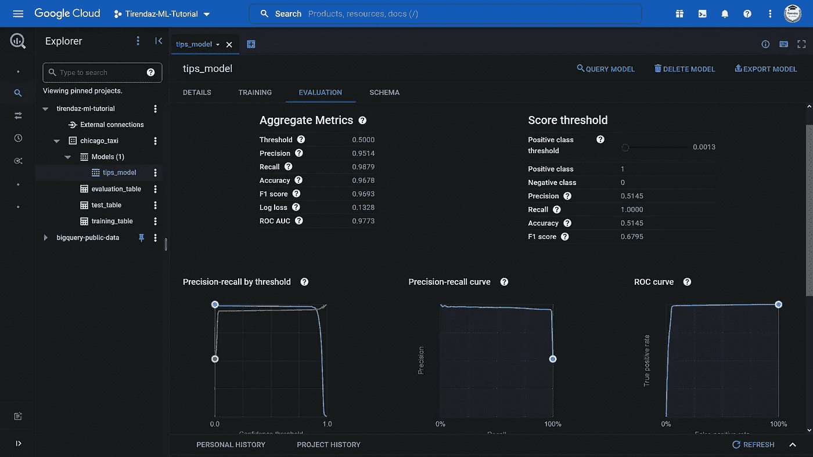

模型度量

很好。模型指标，如精确度、召回率和准确度，非常高，接近最大值 1。模型的性能看起来不错。现在，让我们使用评估表来评估模型。

## 第五步。评估模型

构建模型后，您可以使用`ML.EVALUATE`函数评估模型的性能。`ML.EVALUATE`函数根据实际数据评估预测值。

评估模型的查询如下:

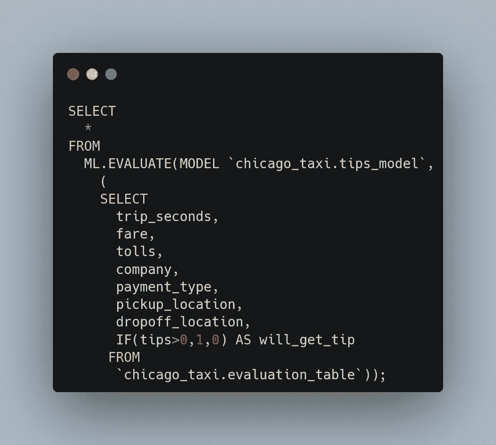

模型评估

运行此查询时，您会看到以下结果:

评估集上的模型度量

如您所见，模型指标非常高，接近最大值 1。现在，让我们看看如何预测测试集。

## 第六步。使用模型预测测试集

评估模型后，下一步是用它来预测结果。让我们使用测试表中的数据来预测标签:

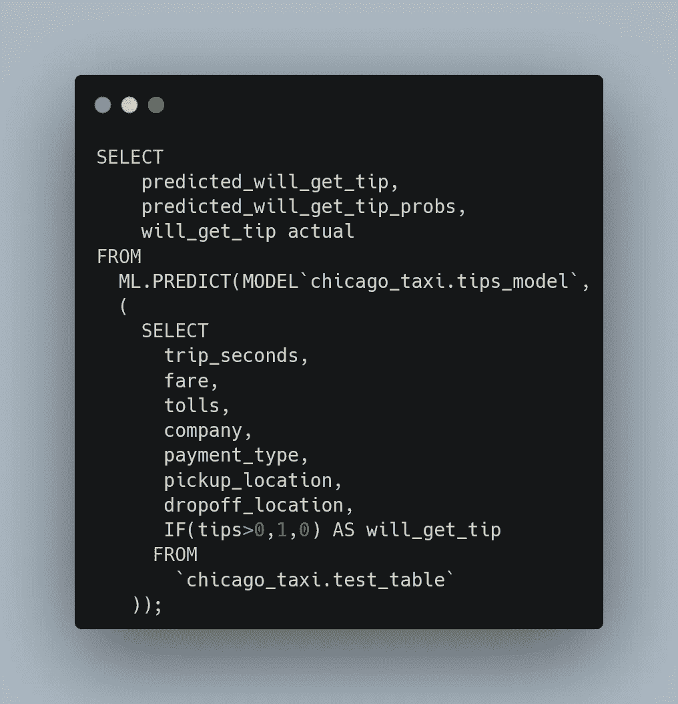

预测测试集。

这里，我在提取 **will_get_tip** 字段的实际值和预测值的`SELECT`语句中设置了三列，*predicted _ will _ get _ tip _ tip*、*predicted _ will _ get _ tip _ probs*和 *will_get_trip* 。当您运行此查询时，您将获得以下结果。

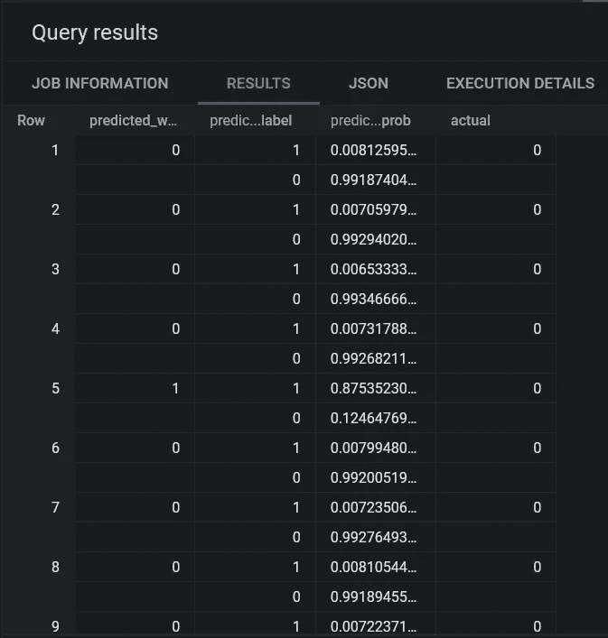

模型预测

在该表中，第一列包含预测标签，第二和第三列分别包含预测标签和这些标签的概率，最后一列包含实际标签。请注意，我们的模型预测几乎完美。

# 打扫

为了避免您的 Google Cloud 帐户因本教程中使用的资源而产生费用，您可以删除您创建的项目，或者保存项目并删除数据集。

# 结论

逻辑回归根据一组给定的独立变量预测一个事件发生的概率，如一个女人或一个男人。对于二元和线性分类任务，逻辑回归是一种简单且更有效的方法。在这篇文章中，我一步一步地展示了如何使用 BigQuery ML 执行逻辑回归分析。我们首先创建了一个逻辑回归模型，然后使用该模型来预测我们在构建模型时没有使用的数据。结果是，我们创建的模型的指标非常高，接近最大值 1。

就是这样。感谢阅读。我希望你喜欢它。别忘了关注我们的[YouTube](https://jovian.ai/outlink?url=http%3A%2F%2Fyoutube.com%2Ftirendazacademy)|[insta gram](https://instagram.com/tirendazacademy)|[Twitter](https://jovian.ai/outlink?url=http%3A%2F%2Ftwitter.com%2Ftirendazacademy)|[Linkedin](https://jovian.ai/outlink?url=https%3A%2F%2Fwww.linkedin.com%2Fin%2Ftirendaz-academy)|[ka ggle](https://jovian.ai/outlink?url=https%3A%2F%2Fwww.kaggle.com%2Ftirendazacademy)了解更多关于数据科学和云计算的内容。

 [## 使用 BigQuery 进行回归分析

### 如何使用 BiqQuery 执行线性回归分析的分步指南

medium.com](https://medium.com/geekculture/hands-on-regression-analysis-with-bigquery-7925dca179ff)  [## 使用 Pyspark 在 10 个步骤中进行数据操作

### 我将逐步指导您如何使用 PySpark 对真实世界的数据进行数据操作。

levelup.gitconnected.com](https://levelup.gitconnected.com/data-manipulation-with-pyspark-in-10-steps-ac9d4a0f96f9) 

如果这篇文章有帮助，请点击拍手👏按钮几下，以示支持👇