# Python 中时间序列数据的机器学习[回归]

> 原文：<https://pub.towardsai.net/machine-learning-for-time-series-data-in-python-regression-5e19fa2e7471?source=collection_archive---------0----------------------->

## 使用 Python 中的机器学习模型进行时间序列预测的实用指南

ime 系列数据是行业中最常见的数据类型之一，在您的职业生涯中可能会用到它。因此，了解如何使用它以及如何应用分析和预测技术对于每个有抱负的数据科学家来说至关重要。在这一系列文章中，我将介绍处理时间序列数据的基本技术，从数据操作、分析和可视化开始，以了解您的数据并为其做准备，然后使用统计、机器和深度学习技术进行预测和分类。这更像是一个实践指南，我将把每个讨论和解释的概念应用到真实数据中。

这个系列将由 10 篇文章组成:

1.  [在 Python Pandas 中操作时间序列数据【实用指南】](/manipulating-time-series-data-in-python-49aed42685a0)
2.  [Python Pandas 中的时间序列分析【实用指南】](/time-series-data-analysis-in-python-1492ee4ca974)
3.  [用 Python 可视化时间序列数据【实用指南】](https://medium.com/towards-artificial-intelligence/time-series-data-visualization-in-python-2b1959726312)
4.  [利用 Python 中的 ARIMA 模型进行时间序列预测【第一部分】](/time-series-forecasting-with-arima-models-in-python-part-1-c2940a7dbc48)
5.  [利用 Python 中的 ARIMA 模型进行时间序列预测【第二部分】](/time-series-forecasting-with-arima-models-in-python-part-2-91a30d10efb0)
6.  时间序列数据的机器学习【回归】(你来了！)
7.  时间序列数据的机器学习[分类](即将推出)
8.  时间序列数据的深度学习[实用指南](即将推出)
9.  使用统计分析、机器学习和深度学习的时间序列预测项目(即将推出)
10.  使用统计分析、机器学习和深度学习进行时间序列分类(即将推出)

# 目录:

1.  时间序列和机器学习简介
    1.1。时间序列的种类和应用
    1.2。机器学习和时间序列数据
2.  预测时间序列数据
    2.1。预测数据超时
    2.2。高级时间序列预测
    2.3。随着时间的推移创建要素
3.  验证和检查时间序列模型
    3.1。从过去创造特征
    3.2。交叉验证时序数据
    3.3。平稳性和稳定性

4.参考

时间序列的机器学习/图片由[安德里亚·德·森蒂斯峰](https://unsplash.com/@santesson89?utm_source=medium&utm_medium=referral)在 [Unsplash](https://unsplash.com?utm_source=medium&utm_medium=referral) 上拍摄

**本文使用的数据和代码可以在这个** [**资源库**](https://github.com/youssefHosni/Time-Series-With-Python/tree/main/Machine%20Learning%20For%20Time%20Series) **中找到。本文是 datacamp** **提供的时间序列数据课程** [**机器学习的总结。**](https://app.datacamp.com/learn/courses/machine-learning-for-time-series-data-in-python)

**如果你想免费学习数据科学和机器学习，看看这些资源:**

*   免费互动路线图，自学数据科学和机器学习。从这里开始:[https://aigents.co/learn/roadmaps/intro](https://aigents.co/learn/roadmaps/intro)
*   数据科学学习资源搜索引擎(免费)。将你最喜欢的资源加入书签，将文章标记为完整，并添加学习笔记。[https://aigents.co/learn](https://aigents.co/learn)
*   想要在导师和学习社区的支持下从头开始学习数据科学吗？免费加入这个学习圈:[https://community.aigents.co/spaces/9010170/](https://community.aigents.co/spaces/9010170/)

如果你想在数据科学& AI 领域开始职业生涯，但你不知道如何开始。我提供数据科学指导课程和长期职业指导:

*   长期指导:[https://lnkd.in/dtdUYBrM](https://lnkd.in/dtdUYBrM)
*   辅导课程:[https://lnkd.in/dXeg3KPW](https://lnkd.in/dXeg3KPW)

***加入*** [***中等会员***](https://youssefraafat57.medium.com/membership) ***计划，只需 5 美元，继续无限制学习。如果你使用下面的链接，我会收到一小部分会员费，不需要你额外付费。***

# 1.时间序列和机器学习简介

时间序列数据无处不在。无论是股市波动、记录气候变化的传感器数据，还是大脑活动，任何随时间变化的信号都可以被描述为时间序列。机器学习已经成为一种强大的方法，可以利用数据的复杂性来预测和洞察人们试图解决的问题。本文是机器学习和时间序列数据这两个世界的交集，涵盖了特征工程和其他先进技术，以便有效地预测股票价格。第一部分将介绍机器学习的基础知识、时间序列数据以及它们之间的交集。

## 1.1.时间序列的种类和应用

**时序数据**是随时间变化的数据。这可以采取多种不同的形式，例如一段时间内的大气二氧化碳、你的声音波形、一只股票一年内的价值波动，或者一个城市的人口统计信息。Timeseries 数据至少由两部分组成:一部分是代表数据本身的数字数组。第二，另一个数组包含每个数据点的时间戳。时间戳可以包括大范围的时间数据，从一年中的几个月到几纳秒。

**机器学习**席卷了数据科学领域。在过去的几十年里，计算能力、算法和社区实践的进步使得使用计算机来提出以前认为不可能的问题成为可能。机器学习是关于在数据中寻找模式——通常是人眼无法立即发现的模式。这通常是因为数据太大或太复杂，人类无法处理。机器学习的另一个关键部分是，我们可以建立一个世界模型，将我们手头问题的知识形式化。我们可以用这个模型来做预测。与自动化相结合，这可能是组织决策的关键组成部分。

由于机器学习就是在数据中寻找模式，并且时间序列数据总是随着时间而变化，这被证明是一种有用的模式。在本文中，我们将重点关注时序数据环境中的一个简单的机器学习管道。这可以归结为以下主要步骤。**特征提取:**什么样的特殊特征利用了随时间变化的信号？**模型拟合:**什么样的模型适合用时序数据提问？**验证:**我们如何验证一个使用时序数据的模型？因为它随时间变化，所以我们必须做哪些考虑？

## 1.2.机器学习和时间序列数据

在这一小节中，我们将讨论机器学习和时间序列数据之间的交互，并介绍为什么它们值得一起考虑。首先，让我们快速概述一下我们将使用的数据。它们都可以在网上免费获得，并且来自优秀的网站**。**

**我们将研究来自纽约证券交易所 [**的数据，纽约证券交易所**](https://github.com/youssefHosni/Time-Series-With-Python/blob/main/Machine%20Learning%20For%20Time%20Series/prices.csv) 的采样频率大约为每天一个样本。我们的目标是利用市场的历史数据预测一家公司的股票价值。由于我们预测的是一个连续的产值，这是一个回归问题。让我们加载数据，看看原始数据。每一行都是给定日期和公司的样本。似乎日期可以追溯到 2010 年。**

**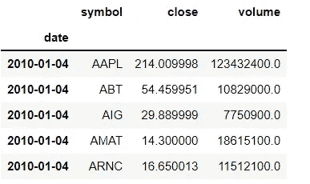**

**纽约股票价格时间序列的前五行。**

**让我们使用 **matplotlib** 以 FiveThirtyEight 风格绘制股票价格的变化。**

**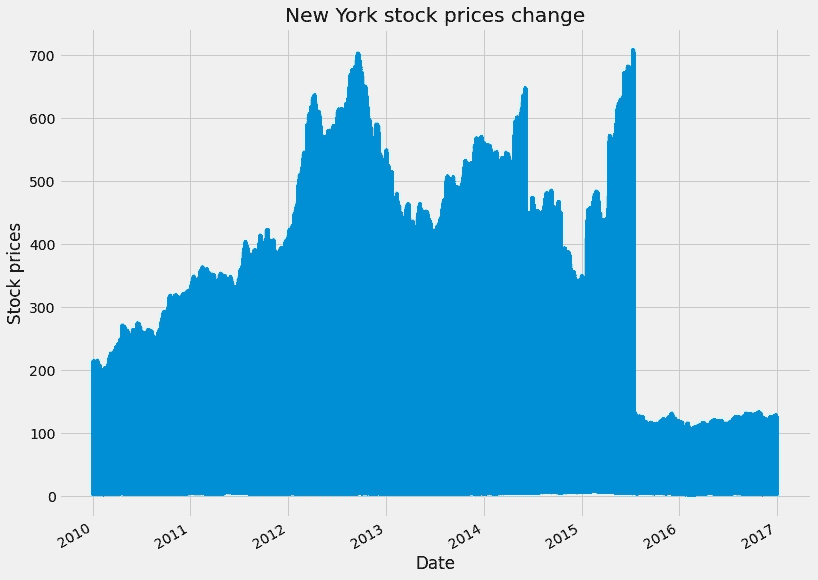**

**纽约股票价格随时间变化。**

**调查每一列中数据的“类型”也很有用。Numpy 或 Pandas 可能根据数据的类型以特殊的方式处理一组数据。我们可以通过查看**来打印每一列的类型。dtypes** 属性。这里我们看到符号列的类型是“object ”,收盘和成交量列是 **float 64** ,这是一种通用数据类型。此外，我们将使用**将索引格式转换为日期时间，以便更好地索引。截止日期时间****

# **2.基于机器学习的时间序列预测**

**如果您希望根据一段时间内的数据预测模式，那么在选择和构建模型时需要考虑一些特殊因素。本节介绍如何在拟合模型之前深入了解数据，以及对时间序列数据使用预测建模的最佳实践。**

## **2.1.预测一段时间内的数据**

**在这一节中，我们将讨论回归，在本系列的下一篇文章中，我们将把重点从回归转移到分类。**回归**有几个时序数据特有的特性和注意事项。**回归**和**分类**的最大区别在于回归模型预测连续输出，而分类模型预测分类输出。在时间序列的上下文中，这意味着我们可以随着时间的推移进行更精细的预测。**

**我们将从可视化和预测时序数据开始。然后，我们将介绍清理数据的基础知识，最后，我们将开始提取可以在模型中使用的特征。我们将使用 prices 数据集，它是各大公司的市场股票价格。总数据集可以在这里找到*，但是，为了简单和更好的可视化，我们将使用股票价格数据集的这个 [***预处理子集***](https://github.com/youssefHosni/Time-Series-With-Python/blob/main/Machine%20Learning%20For%20Time%20Series/preprocessed_prices.csv) 。***

***让我们首先上传数据并打印它的前五行***

***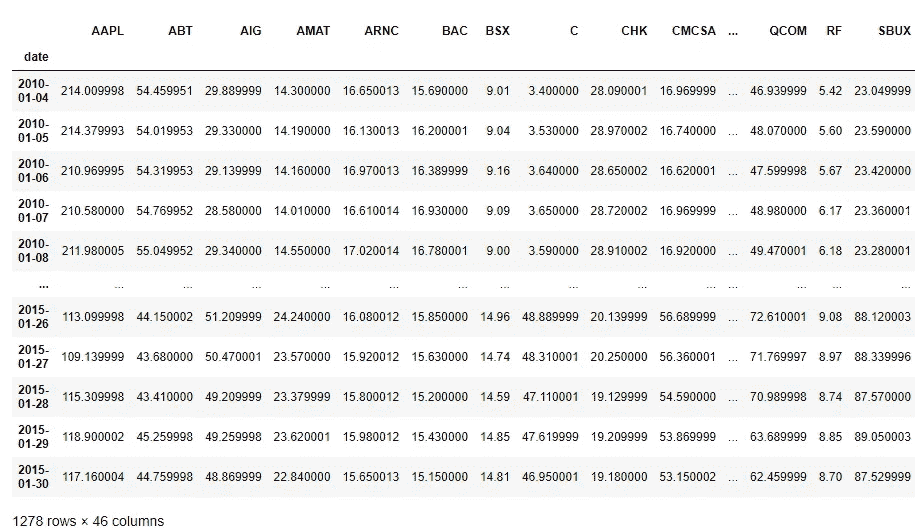***

***从 2010 年 1 月 4 日到 2015 年 1 月 30 日，我们有 42 家**公司**的股票价格随时间变化，时间戳为一天。为了更好地了解数据如何随时间变化，我们将使用以下代码绘制雅虎和易贝的股价随时间的变化:***

***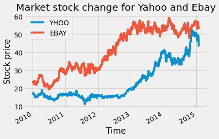***

***雅虎和易贝的市场股票价格变化。***

***要了解两家公司股价变化之间的关系，我们可以使用下面的代码绘制两家公司的散点图:***

***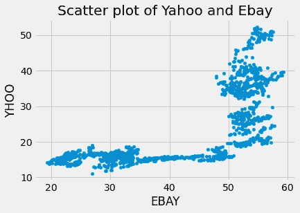***

***我们还可以将时间编码为每个数据点的颜色，以便直观地显示这两个变量之间的关系如何变化。***

***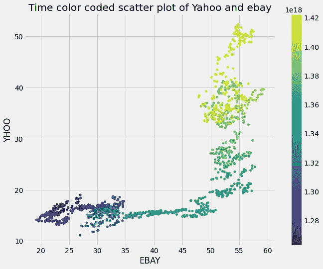***

***用 **scikit-learn** 拟合回归模型很简单，因为 **scikit-learn** 的 API 具有一致性，这是它最大的优势之一。然而，有一个完全不同的模型子集来完成回归。我们将从关注线性回归开始，这是回归的最简单形式。在这里，我们可以看到如何实例化模型，拟合和预测训练数据。我们将使用易贝，英伟达和雅虎股票价格作为特征，目标值将是苹果股票价格。我们将使用线性回归模型从 **scikit_learn 进行预测。*****

***评估回归模型有几个选项。最简单的是相关系数，而最常见的是决定系数，或 R 的平方，我们将在这里使用。决定系数可总结为模型中的总误差量(预测值和实际值之间的差异)除以总误差量(如果您构建了一个“虚拟”模型，该模型仅预测每个时间点的输出数据平均值)。你用“1”减去这个比值，结果就是决定系数。它以“1”为上界，可以无限低。我们还将使用来自 **scikit_learn** 的 r2_score 函数来评估模型，该函数首先获取预测输出值，然后获取“真实”输出值。***

***为了更好地理解模型输出，我们可以将预测的苹果股票价格和真实值绘制在同一个图上:***

***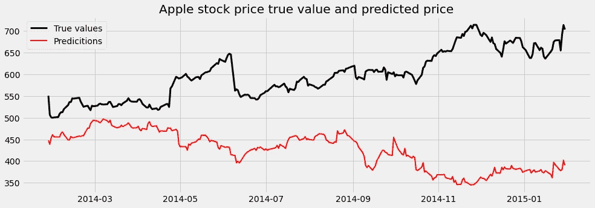***

***预测的苹果股票价格(红色)和真实的苹果价值(黑色)。***

***在这里，我们将几个不同模型对相同数据的预测可视化。我们将使用岭回归，它有一个名为“alpha”的参数，可以使系数变得更平滑、更小，如果有噪声或相关变量，这将非常有用。我们遍历 alpha 的几个值，用每个值初始化一个模型，并使它适合训练数据。然后，我们在测试数据上绘制模型的预测，这让我们看到每个模型的正确和错误。***

***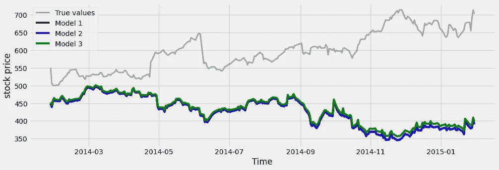***

***真实的苹果股票价格(灰色)和用不同 alpha 预测的苹果股票价格(红色、蓝色、绿色)。***

## ***2.2.高级时间序列预测***

***现在，我们已经介绍了一些简单的可视化和连续时间序列的模型拟合，让我们看看当我们查看更多真实世界的数据时会发生什么。真实世界的数据总是杂乱的，需要在拟合模型之前准备和清理数据。在时间序列中，由于传感器故障或记录数据时的人为错误，经常会出现混乱的数据。让我们介绍一些具体的方法来发现和修复时间序列中的杂乱数据。时序数据最常见的两个数据问题是**缺失数据和离群值**。***

***首先，让我们创建一些看起来杂乱的数据。由于股票价格的原始数据没有缺失数据，我们将随机删除部分数据。将使用的数据是美国国际集团(AIG)过去几年的股票市值。将使用以下函数删除连续百分比的数据:***

***该函数将数据帧和连续行数视为等于 **Nan** 和要删除的数据百分比。在我们的例子中，数据帧是 AIG 数据，要删除的连续行数是 100 行，数据的百分比是 20%。由于数据有 1278 行，因此删除其中的 20%意味着删除 255 行，因此两个连续的 100 行将被设置为 Nan。***

***让我们画出没有任何缺失值的 AIG 数据，然后画出有缺失值的 AIG 数据。***

***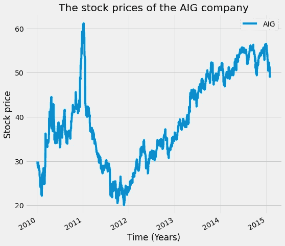***

***美国国际集团的股票价格没有缺失数据***

***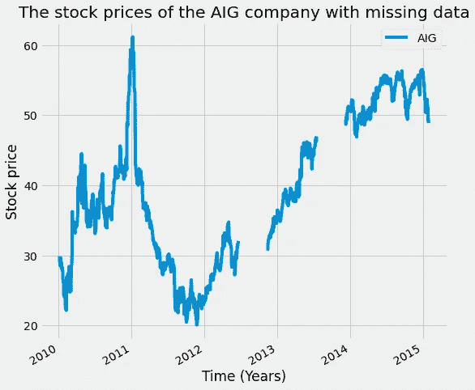***

***数据随机缺失下的 AIG 股票价格。***

***现在让我们看看如何解决时间序列中缺失数据的问题。我们可以首先使用一种叫做**插值**的技术，它使用丢失时间窗口两端的值来推断中间的值。我们将首先创建一个布尔掩码，用于标记丢失值的位置。接下来，我们调用点插值方法来填充缺失的值。我们将使用第一个参数来表示我们想要线性插值。最后，我们将绘制插值。***

***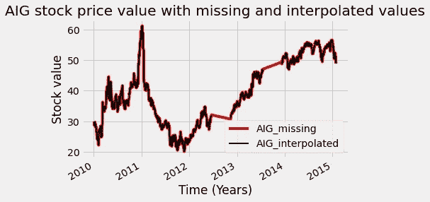***

***缺失数据(红色)和插值版本(黑色)的 AIG 时间序列。***

***你可以看到红色的插值结果。在这种情况下，我们使用“线性”参数，因此插值是丢失窗口的起点和终点之间的一条线。点插值方法的其他参数将导致不同的行为。***

***预处理时间序列数据的另一种常用技术是对其进行转换，使其成为性能更好的版本。为此，我们将使用滚动窗口技术。使用滚动窗口，我们将计算每个时间点相对于之前时间点窗口平均值的百分比变化。这使我们数据的方差标准化，并减少长期漂移。在下面的函数中，我们首先分离出输入数组的最终值。然后，我们计算除最后一个数据点以外的所有数据点的平均值。最后，我们从最终数据点中减去平均值，然后除以平均值。结果是最终值的百分比变化。***

***之后，我们可以使用点聚合方法将它应用于我们的数据，将我们的函数作为输入传递。我们绘制了数据，正如你在右边看到的，数据现在大致以零为中心，高低变化的时期更容易发现。***

***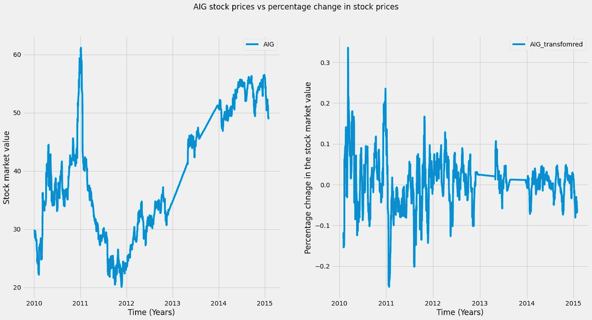***

***插值后的 AIG 股价(左)和 AIG 股价的百分比变化(右)。***

***此转换将用于检测异常值。离群值**是与整个数据集在统计上不同的数据点**。一个常见的定义是任何偏离数据集均值三个标准偏差以上的数据点。在接下来的图中，我们将可视化这个异常值的定义。我们将计算每个数据集的平均值和标准差，然后在原始和转换的 AIG 时间序列上绘制异常值“阈值”(平均值的三倍标准差)。***

***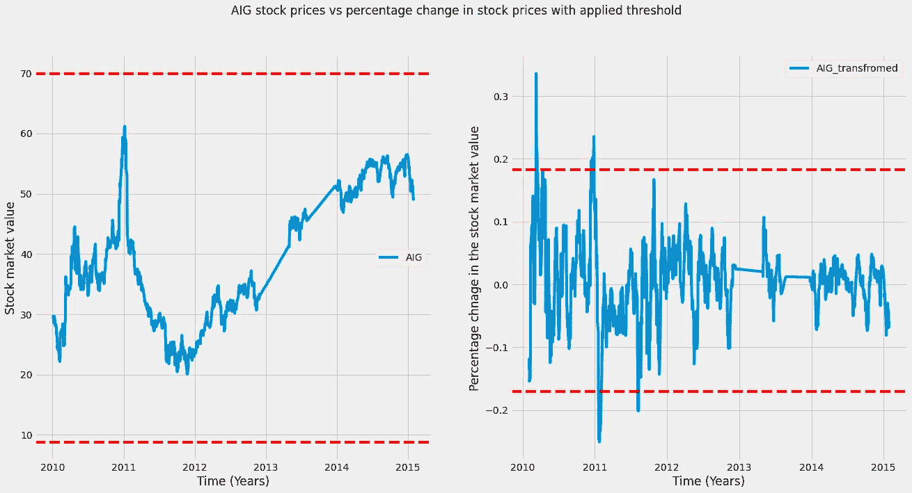***

***正如我们在左图中看到的，没有异常值，而在右图(转换后的数据)中有异常值(这些界限之外的任何数据点都可能是异常值)。请注意，被视为异常值的数据点取决于数据的转换。***

***我们将用剩余值的中值替换异常值。我们首先通过减去平均值并计算标准偏差来确定数据的中心。最后，我们计算每个数据点的绝对值，并标记位于平均值的三个标准偏差之外的任何数据点。然后，我们使用 **nanmedian** 函数替换这些值，该函数计算中值时不会受到缺失值的影响。***

***最后，我们将在移除异常值后绘制转换后的数据。正如你所看到的，一旦我们替换了异常值，似乎就没有那么多极端数据点了。这应该有助于我们的模型找到我们想要的模式。***

***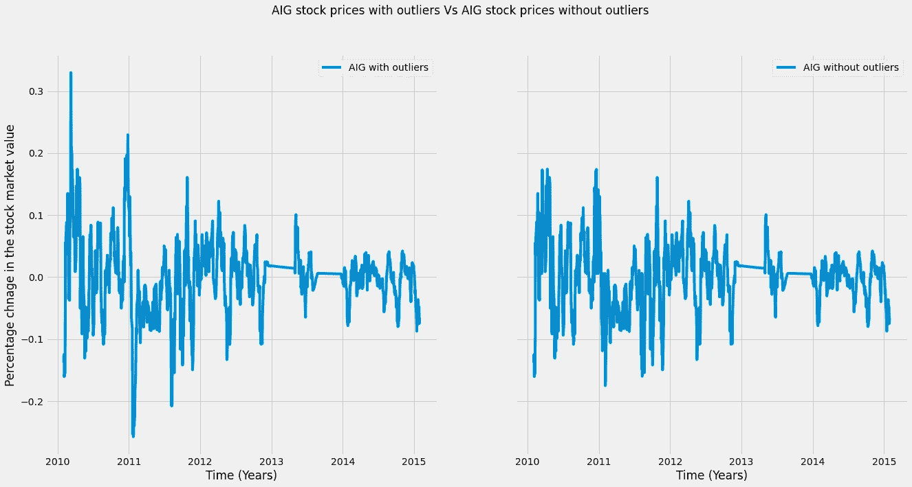***

***有异常值的 AIG(左)和移除异常值后的 AIG(右)。***

## ***2.3.随着时间的推移创建要素***

***在本文第二部分的最后一小节，我们将提取在时间序列分析中有用的特定特征。首先，我们可以为时间序列的每个窗口计算统计属性，如标准差(std)、平均值、最大值、最小值等，并将其用作时间序列的代表性特征。***

***我们可以定义每个窗口的多种功能，使用熊猫、**一次提取许多特征。aggregate** 方法可以通过向方法传递一个函数列表来一次性计算一个窗口的很多特性，每个函数都会在窗口上被调用，并收集在输出中。下面是这样的一个例子，我们首先使用**。rolling** 方法定义一个滚动窗口，然后传递两个函数列表(对于标准偏差和最大值)。随着时间的推移，这将为每列提取两个特征。***

******

***使用聚合函数计算每列的统计属性。***

***你可以用这种方法提取许多不同种类的特征。绘制一段时间内提取的要素总是好的，因为这可以为您提供关于它们如何表现的线索，并帮助您发现有噪声的数据和异常值。**这里我们可以看到，最大值比平均值跳跃得多。*****

***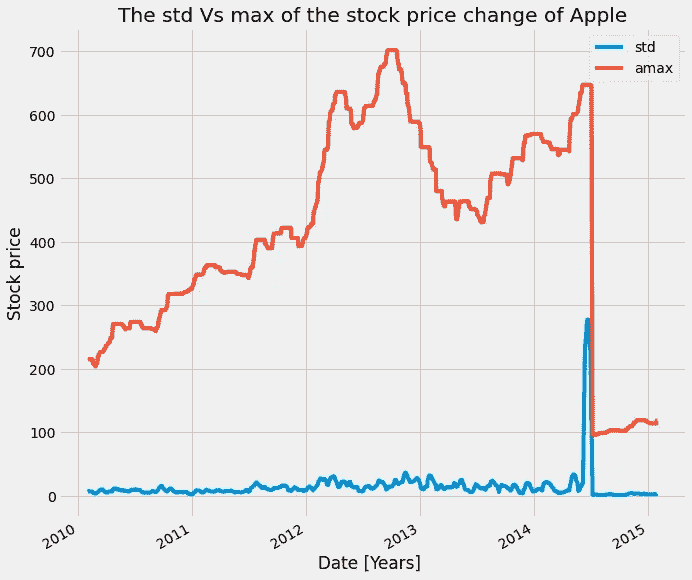***

***苹果股票价格的标准差与最大值。***

***使用点聚合方法时，一个有用的工具是分部函数。这是 Python 的内置功能，允许您从一个旧函数创建一个新的函数，并预先配置一些参数。***

***在这个例子中，我们首先从 **functools** 包中导入**部分**，然后用它创建一个总是在第一个轴上操作的均值函数。第一个参数是我们要修改的函数，后续的键值对将在输出函数中预先设置。此后，当我们调用新函数时，我们不再需要配置这些值。***

***输出为:[0。1.2.]，这是每列的平均值。***

***让我们回到时间序列数据的特征提取。用于特征提取的一个特别有用的工具是百分位数函数。这类似于计算数据的平均值或中值，但它让您可以更精细地控制提取的内容。对于给定的数据集，第 N 个百分位数是 N%的数据低于该数据点，而 100-N%的数据高于该数据点的值。在下面的例子中， **percentile** 函数将一个数组作为第一个输入，将一个 0 到 100 之间的整数作为第二个输入。它将返回输入数组中与您选择的百分比相匹配的值。这里它返回 40，这意味着值“40”大于输入数组的 20%。***

***产量:400***

***这里我们将把**百分位数**函数与**部分**函数结合起来，以便用**提取几个百分位数。聚合**方法。我们使用列表理解来创建函数列表(称为 percentile_funcs)。然后，我们遍历列表，对数据调用每个函数，返回不同百分比的数据。我们首先将它应用于测试数据，以了解它是如何工作的。使用 **np.linspace** 创建均匀间隔的数字序列来创建测试数据。我们将创造极限***

***输出:[20.0，40.000000000001，60.0]***

***然后我们可以将这个部分函数列表传递给我们的**。聚合**方法为我们的时间序列数据的每一列提取几个百分点。***

***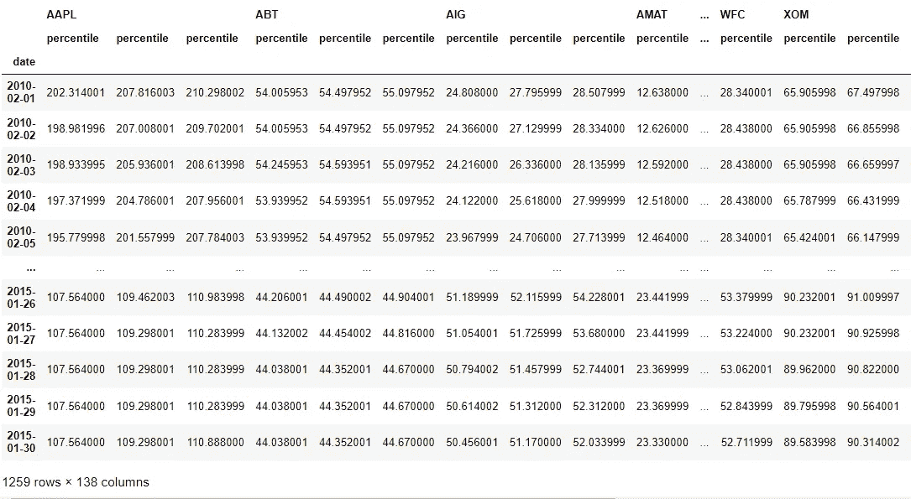***

***数据集中每列的 20、40 和 60 个百分点。***

***我们可以看到，对于每一列，三个百分位数函数应用于我们的数据，滚动窗口为 20。***

***另一个要考虑的常见特性是基于日期的特性。也就是说，这些特性考虑了诸如“现在是一年中的什么时候？”或者“今天放假吗？”。由于许多数据集涉及人类，这些信息通常很重要。例如，如果你想预测每天会有多少顾客光顾你的商店，知道今天是不是周末是很重要的！在熊猫身上，处理日期和时间很简单。日期时间功能最常通过数据帧的索引来访问。您可以使用 **to_datetime** 函数来确保日期被视为日期时间对象。您还可以提取许多特定日期的信息，如星期几或工作日名称，如下所示。然后，这些可以被视为模型中的特征。***

********* [## 加入我的介绍链接媒体-优素福胡斯尼

### 阅读 Youssef Hosni(以及媒体上成千上万的其他作家)的每一个故事。您的会员费直接支持…

youssefraafat57.medium.com](https://youssefraafat57.medium.com/membership)*** 

# ***3.时间序列模型的评估和检验***

***一旦你有了一个预测时间序列数据的模型，你需要决定它是好模型还是坏模型。本节介绍了使用模型生成预测的基础知识，以便根据“测试”数据对预测进行验证。***

## *****3.1。从过去创造特色*****

***时间序列数据和“非时间序列”数据最大的区别可能就是数据点之间的关系。因为数据具有线性流动(与时间的进展相匹配)，所以模式将在数据点的跨度上持续存在。因此，我们可以使用过去的信息来预测未来的值。***

***在用时间序列数据拟合模型时，考虑数据的**平滑度**非常重要。数据的平滑度反映了某个时间点与其前后时间点之间的相关程度。先前时间点对后续时间点的预测程度通常被描述为**自相关**，它会对模型的性能产生很大影响。***

***让我们通过创建一个模型来对此进行研究，在该模型中，以前的时间点用作模型的输入要素。请记住，回归模型将为每个输入特征分配一个**权重**，我们可以使用这些权重来确定时间序列的**平滑度**或**自相关度**。首先，我们将创建数据的时移版本。这需要将您的数据“滚动”到未来或过去，以便同一数据索引现在具有不同的时间点。我们可以通过使用数据帧的点移位法在熊猫身上做到这一点。正值向后滚动数据，负值向前滚动数据。***

***这里我们使用字典理解来创建数据的几个时滞版本。每一个都将数据转移到过去不同数量的索引中。由于我们的数据是每天记录的，这相当于移动数据，使每个索引对应于 N 天前的数据值。然后，我们可以将它转换成数据帧，其中字典键变成列名，并用零填充每个标签中缺少的值。***

***我们现在将拟合一个 scikit-learn 回归模型。注意，在这种情况下，“many _ shifts”只是包含在**数据**变量中的时间序列的时移版本。我们将使用岭回归来拟合模型，岭回归将权重分散到各个要素中。***

***一旦我们拟合了模型，我们就可以研究它找到的系数。**系数的绝对值越大，意味着给定特征对输出变量**的影响越大。我们可以使用 Matplotlib 中的条形图来显示模型拟合后创建的模型系数。***

***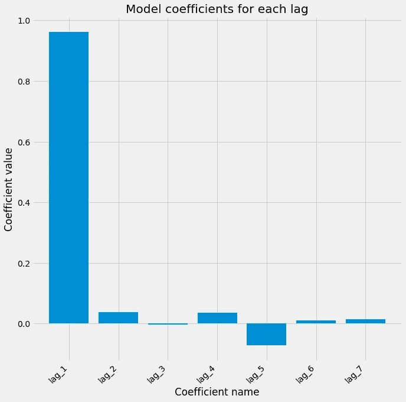***

## ***3.2.交叉验证时间序列数据***

***最常见的交叉验证形式是 k 重交叉验证。在这种情况下，数据被分成 K 个大小相等的子集。在每次迭代中，单个子集被遗漏作为验证集，并且使用剩余的 k-1 个折叠来训练模型。这里我们展示了如何用 scikit-learn 初始化 k 倍迭代器。***

***许多交叉验证迭代器允许您随机打乱数据。如果您的数据是独立且同分布的，这可能是合适的，但时间序列数据通常不是独立同分布的。这里我们使用“ShuffleSplit”交叉验证迭代器，它在每次迭代中随机排列数据标签。让我们看看使用混洗数据时我们的可视化是什么样子。使用的数据是 [**股票数据**](https://raw.githubusercontent.com/youssefHosni/Time-Series-With-Python/main/Machine%20Learning%20For%20Time%20Series/prices.csv) 的子集，其中训练数据是雅虎、Nvidea 和易贝股票数据，而目标值是苹果股票数据。***

***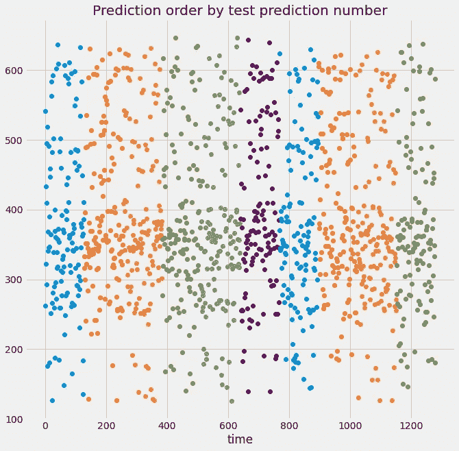***

***按测试预测号排序的预测***

***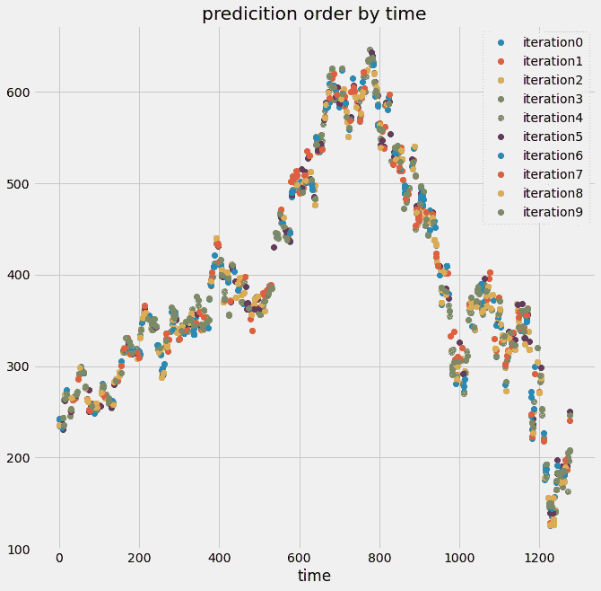***

***按时间排序的预测***

***在这里，我们可以从上面的图中看到，验证索引到处都是，而不是像以前那样成块出现。这是因为我们使用了一个交叉验证对象来打乱数据，所以预测不会遵循信号的时间顺序。下面我们看到输出数据不再“看起来”像时间序列，因为数据的时间结构被破坏了。如果数据被打乱了，这意味着现在关于训练集的一些信息存在于验证集中，你不能再信任和依赖你的模型的分数。***

***如果我们将 shuffle 参数设置为 false，我们可以看到，这两个按时间排序的预测和按预测编号排序的预测是相同的，因为发生了随机洗牌。***

***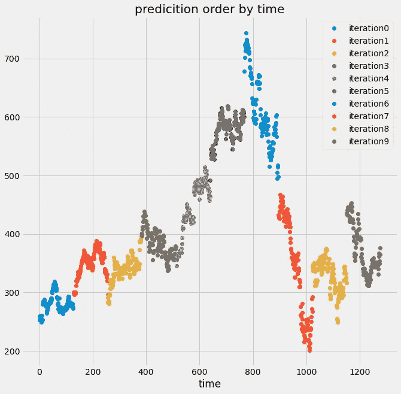***

***预测是按时间排序的。***

***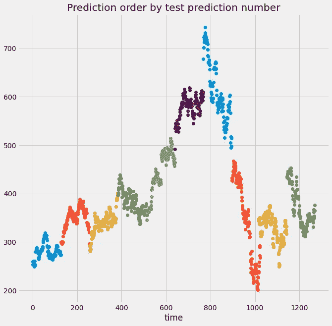***

***预测按测试预测号排序***

***最后，我们将介绍另一个交叉验证迭代器，它可以帮助处理时序数据。有一种交叉验证技术特别适用于时间序列数据。这种方法总是使用过去的数据来预测未来的时间点。通过 CV 迭代，大量的训练数据被用于预测下一个验证数据块，对应于已经过去了更多时间的事实。这更接近真实世界中的数据收集和预测过程。我们可以对 scikit-learn 中的 TimeSeriesSplit 对象使用这种交叉验证方法。我们还可以在交叉验证的每次迭代中可视化训练数据。从下图中我们可以看到，每次使用时序交叉验证对象时，训练集的大小都会增加。这样，你预测的时间点总是在我们训练的时间点之后*。****

***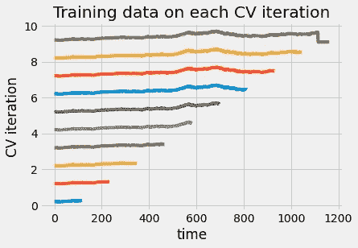***

## ***3.3.**平稳性和稳定性*****

***平稳信号是指其统计特性不随时间变化的信号。它有相同的均值、标准差和总体趋势。非平稳信号确实会随时间改变其属性。其中每一个对如何适应你的模型都有重要的影响。这是一个平稳和非平稳信号的例子。在顶部，我们看到一个非常不稳定的信号。它的方差和趋势随着时间而变化。在底部，我们可以看到信号一般不会改变其结构。它的可变性始终不变。几乎所有真实世界的数据都是非平稳的。***

******

***平稳与非平稳时间序列***

***大多数模型都有一个隐含的假设，即输入和输出之间的关系是静态的。如果这种关系发生变化(因为数据不是静态的)，那么模型将使用输入和输出之间的过时关系来生成预测。因此，知道如何量化和纠正这种情况是很重要的。***

***一种方法是使用**交叉验证**，如前一小节所述，每次迭代都会产生一组模型系数。我们可以量化这些系数在迭代中的可变性。如果模型的系数在交叉验证分割之间变化很大，那么数据很可能是非平稳的(或有噪声的)。***

***另一种方法是使用**引导**。 **Bootstrapping** 是一种对一组数字的均值进行置信估计的方法。要对平均值进行 bootstrap，从您收集的数字中随机抽取许多样本(替换)，并计算每个样本的平均值。现在，计算这个列表的下/上百分位数。下限和上限代表平均值的可变性。***

***这里有一个使用 scikit-learn 和 NumPy 的例子。学习随机抽取一个系数样本，然后使用 NumPy 计算样本中每个系数的平均值，并将它存储在一个数组中。然后，我们计算结果的 2.5 和 97.5 个百分点，以计算每个系数的下限和上限。这被称为 95%的置信区间。***

***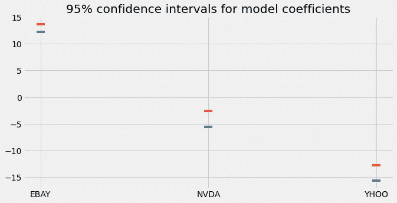***

***这里我们绘制了我们计算的 95%置信区间的下限和上限。这让我们了解了所有交叉验证迭代的平均值的可变性。***

***跨交叉验证层量化**模型预测能力**的稳定性也很常见。如果您使用前面提到的 TimeSeriesSplit 对象，那么您可以将它想象成一个时间序列。这有助于找到影响分数的特定时间区域。也有助于发现非平稳信号。在下面的示例中，我们将使用 cross_val_score 函数和 TimeSeriesSplit 迭代器来计算模型对交叉验证拆分的预测能力。我们首先创建一个小的评分函数，可以传递给 cross_val_score。接下来，我们使用列表理解来找到每个验证块的开始日期。最后，我们收集分数并将其转换成熊猫系列。因为交叉验证拆分随着时间线性发生，所以我们可以将结果可视化为一个时间序列。如果我们在某个时刻看到模型的预测能力发生了巨大的变化，这可能是因为数据的统计数据发生了变化。这里我们创建了交叉验证分数的滚动平均值，并用 matplotlib 绘制出来。***

***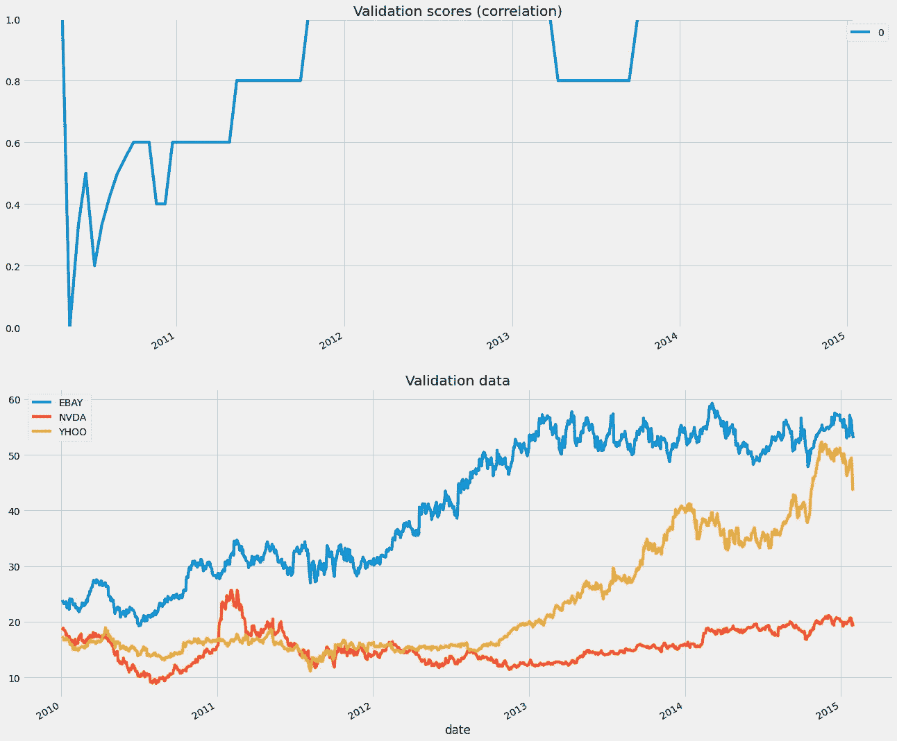***

***验证集得分与验证数据***

***我们可以看到我们的模型在验证集上的得分，这意味着随着时间的推移，我们会随着时间线性地分割它们。在数据的开始有一个明显的下降，可能是因为数据的统计发生了变化。一种选择是限制训练窗口的大小。这确保了在训练中只使用最新的数据点。我们可以使用 max_train_size 参数来控制这一点。***

***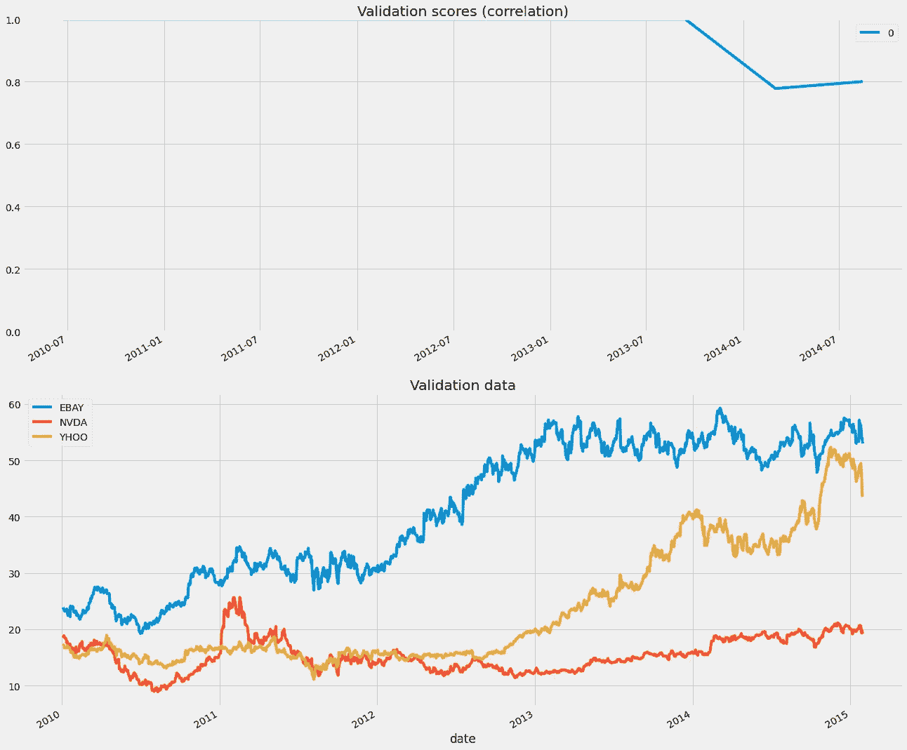***

****感谢阅读！如果你喜欢这篇文章，一定要鼓掌(高达 50！)并在* [*LinkedIn*](https://www.linkedin.com/in/youssef-hosni-b2960b135/) *上与我联系，并在*[*Medium*](https://youssefraafat57.medium.com/)*上关注我的新文章。****

*** [## 加入我的介绍链接媒体-优素福胡斯尼

### 阅读 Youssef Hosni(以及媒体上成千上万的其他作家)的每一个故事。您的会员费直接支持…

youssefraafat57.medium.com](https://youssefraafat57.medium.com/membership)***