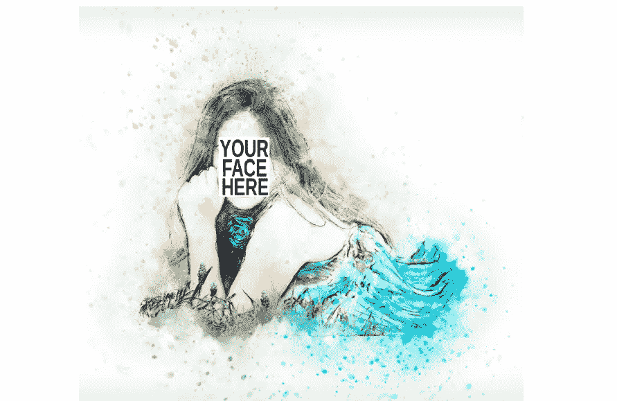
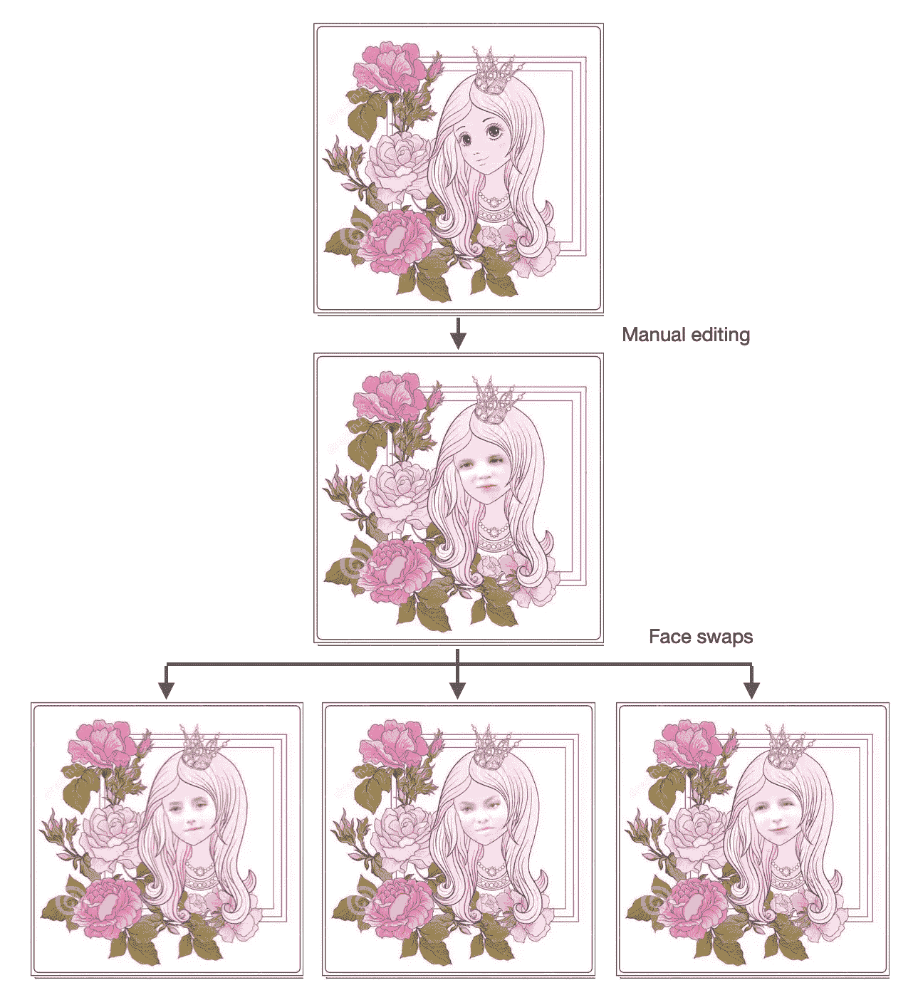
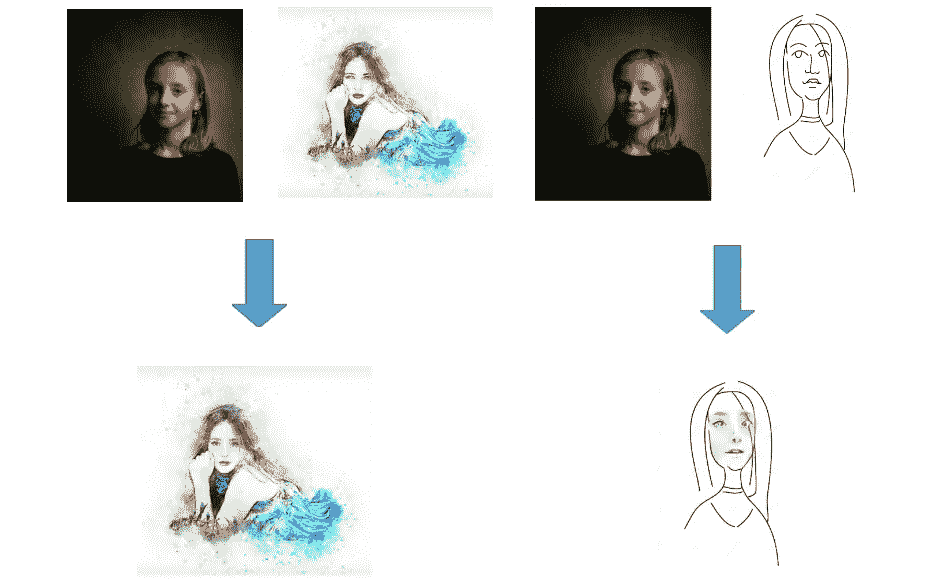
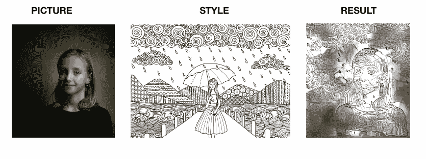
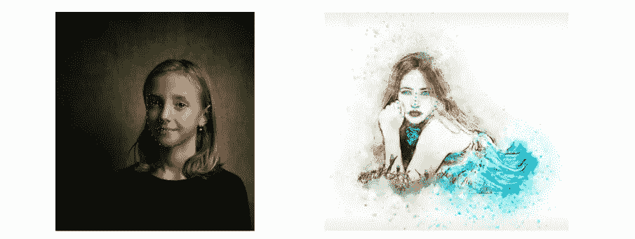
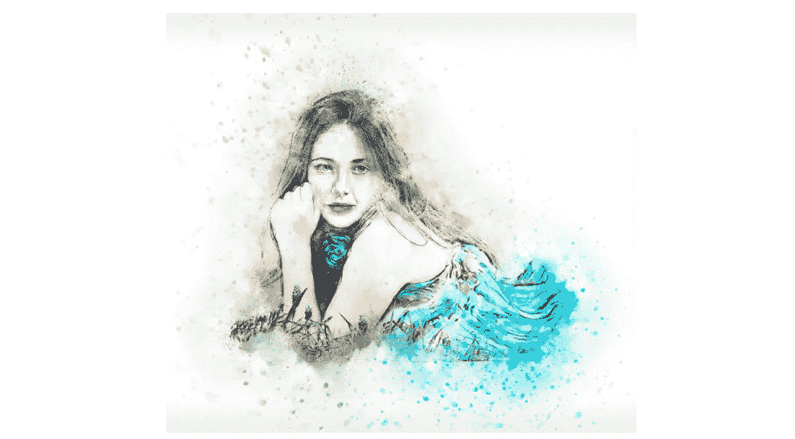

# 为儿童制作超个性化书籍:插图上的人脸交换

> 原文：<https://pub.towardsai.net/making-hyper-personalized-books-for-children-faceswap-on-illustrations-576ed5f7988b?source=collection_archive---------2----------------------->

## [计算机视觉](https://towardsai.net/p/category/computer-vision)

故事[一直是人类本性的一部分](https://www.bbc.com/culture/article/20180503-our-fiction-addiction-why-humans-need-stories):自从我们存在以来，我们就一直给孩子们讲故事，教导他们生活，警告他们危险，在不危及他们安全的情况下培养他们的性格。

故事极其重要，而书籍是讲述故事的主要手段之一。有了书，读者就能认同书中的人物，感受他们的情感。我们希望读者尽可能深入地与这本书联系在一起，我们希望故事和插图都能反映出你是谁，就个人而言:想象一下这本书的主要人物实际上看起来像你；想象一本书，书中的问题以你解决问题的方式得到解决；想象一本真正关于你的书，独一无二的你。这是我们的目标。

绘图示例(本文中使用的所有图像均来自图片库，仅用于演示目的)

# **个性化**书籍已经存在。**区别在哪里？**

如果你熟悉儿童文学世界，你会知道个性化书籍已经存在很长时间了，那么这个项目和那些可以在[wonderly](https://www.wonderbly.com/)或 [Dinkleboo](https://www.dinkleboo.com/) 上找到的东西有什么不同呢？

这些书允许你在众多可供选择的角色中选择一个角色的主要特征(金发还是棕发？绿眼睛还是蓝眼睛？)，而在我们的实现中，主角的脸实际上看起来像读者，这是通过面部交换实现的。

个性化文本也不同。不仅你选择的名字会印在书里，主角解决问题的方式也会印在书里:他会因为他压倒性的力量或狡猾的智力而成功吗？订购这本书时，一些关键的个性特征被插入，并影响故事的展开方式，使它真正独一无二。

本文的重点是插图问题:开发一个能够在绘制的身体上定位和调整用户面部的程序。客户应该能够在购买这本书之前看到插图的预览，所以我们的实现必须快速有效地提供结果。

# **什么是换脸？**

面部交换是在图像(通常是图片)或视频上交换两个人的面部的过程。

从计算机的角度来看，图像是像素的行和列，代表颜色和形状的数字矩阵。计算机视觉是人工智能和机器学习的一个子领域，致力于研究如何让机器以我们看到图像的方式看到图像:在我们的用例中，理解哪些像素值代表一张脸。

一旦面部检测的第一步完成，程序必须在两个目标之间交换面部区域的像素，调整颜色和形状以使最终结果更加平滑。

用于真实图像的 Deepfakes 和其他[人脸交换](https://filmora.wondershare.com/video-editor/best-face-swap-apps.html) [应用](https://petapixel.com/2020/07/20/disneys-high-res-face-swap-tech-is-both-impressive-and-creepy/)因其令人印象深刻的结果而占据了聚光灯，但很少有人关注不同的背景，例如与我们的任务有关的一个:为在图片上工作良好而开发的技术也会在绘画上有效吗？让我们找出答案。

# **D** 画中画 faceswap 的区别

我们做的第一件事是尝试各种现有的面部交换技术，看看当用图画而不是图片工作时会出现什么样的问题。

一种广泛采用的方法是 [dlib 的面部检测过程](http://dlib.net/imaging.html#get_frontal_face_detector):识别[面部关键点](https://www.pyimagesearch.com/2017/04/03/facial-landmarks-dlib-opencv-python/)，以便稍后在图片之间交换面部。它学习如何使用机器学习技术(Haar cascades 或 HOG +线性 SVM 检测器)来识别人脸，但我们注意到，在一些绘画中，机器更难识别人脸:如果人脸的细节太少，该软件可以使用一点帮助。

dlib 很难定位人脸的绘图示例

尽管闭着眼睛和极简风格，dlib 还是成功定位人脸的例子

为了解决这个问题，在面交换之前，可以在有问题的图形上手动编辑逼真的面。这有点耗时，但可以确保人脸检测过程的正确性能，如果处理得当，最终用户不会注意到它，因为它只发生在屏幕后面。

从 dlib 无法识别的绘制面开始，进行快速手动编辑，以添加一个可以在以后进行面交换的真实面。

我们试图获得结果质量基线的第一个面部交换应用是 [Reflect 的面部交换](https://reflect.tech/faceswap/hot)。在我们的实验中，它的效果因绘画风格的不同而有很大差异:细节太少的绘画往往会导致糟糕的表现。

Reflect 在细节绘图上的出色效果和在极简绘图上的糟糕表现。

为了获得另一个基线，我们尝试了 [DeepFaceLab](https://github.com/iperov/DeepFaceLab) : DeepFaceLab 在 DeepFake 行业是一个家喻户晓的名字；它的主要焦点是在视频中交换人脸，而不是我们的目标。该程序针对从许多帧中学习阴影和角度进行了优化，从我们通过反复试验收集的信息来看，它似乎在绘图上表现不太好(或者需要太多的超参数调整才能获得明显的结果)。这也花费了太多的时间来实现我们的目标:记住，我们的客户应该最多在几秒钟或几分钟内就能得到编辑过的图像的预览。

我们还尝试使用[深度梦境生成器](https://deepdreamgenerator.com/)将面部塑造成插图的手绘风格，以查看神经风格转移是否值得努力，但我们得到的结果并不令人鼓舞(也许图纸中没有足够的细节来正确地将它们作为一种风格来实现)。

DeepDream 生成器的结果

这些类型的结果，除了仍然必须正确地裁剪面部并在稍后执行面部交换，从而需要额外的时间和计算资源之外，使我们放弃了这种方法。

# **我们的解决方案**

对比上述结果，我们意识到，对于本项目:

*   照片真实感不是问题，我们不需要逼真的效果，但看起来像一幅画
*   交付时间是必不可少的:我们需要一些能快速产生结果的东西来呈现给潜在客户
*   我们只有一张图片和一些图画来输入我们的算法
*   我们需要一个可靠的程序。我们不能为每次迭代微调参数或丢弃不好的结果。用户应该能够自主使用它
*   dlib 的人脸检测效果很好(上面提到的偶尔调整)

因此，我们选择不使用神经网络，即每个先前显示的应用程序使用的技术，即使对于图片到图片的交换非常有效。

绿色:dlib 的面部探测器发现的面部标志

相反，一旦 dlib 应用面部标志检测器来获得面部区域的 *(x，y)*-坐标，我们的算法如下进行:

*   首先，它通过一个 [Delaunay 三角测量](https://en.wikipedia.org/wiki/Delaunay_triangulation)来绘制两个面，基本上最大化在标志点之间创建的三角形的最小角度，避免重叠和非常尖锐的角度；
*   它计算从“面具”(图中的脸)到图中的脸的每个三角形顶点的[仿射变换](https://en.wikipedia.org/wiki/Affine_transformation)矩阵，以使其呈现相同的形状；
*   最后，它使用[泊松混合](https://erkaman.github.io/posts/poisson_blending.html)在图上重叠这个遮罩，同时还应用[双线性插值](https://en.wikipedia.org/wiki/Bilinear_interpolation)平滑形状和[高斯模糊](https://en.wikipedia.org/wiki/Gaussian_blur)校正颜色(除了一些更多的检查和小的校正)以确保面部被正确编辑。

下面是最终结果:

使用解释的管道的 Faceswap 结果

这几乎与最先进的、神经网络驱动的最佳结果一样好，并且适用于更广泛的绘图，而成本只是其一小部分(程序运行只需几秒钟，并且只需要源图像和目标图像作为输入)，使其成为我们任务的理想解决方案。

*感谢您的阅读！*

## 关于 Digitiamo

Digitiamo 是一家来自意大利的初创公司，专注于使用人工智能来帮助公司管理和利用他们的知识。要了解更多信息，[请访问我们的](https://www.digitiamo.com/)。

## *关于作者*

[*法比奥·丘萨诺*](https://medium.com/u/56f43ec01c1e?source=post_page-----576ed5f7988b--------------------------------) *是*[*Digitiamo*](https://www.digitiamo.com/)*的数据科学负责人；* [*弗朗西斯科·福马加利*](https://medium.com/u/ec9f76d504e0?source=post_page-----576ed5f7988b--------------------------------) *是一名正在实习的有抱负的数据科学家。*