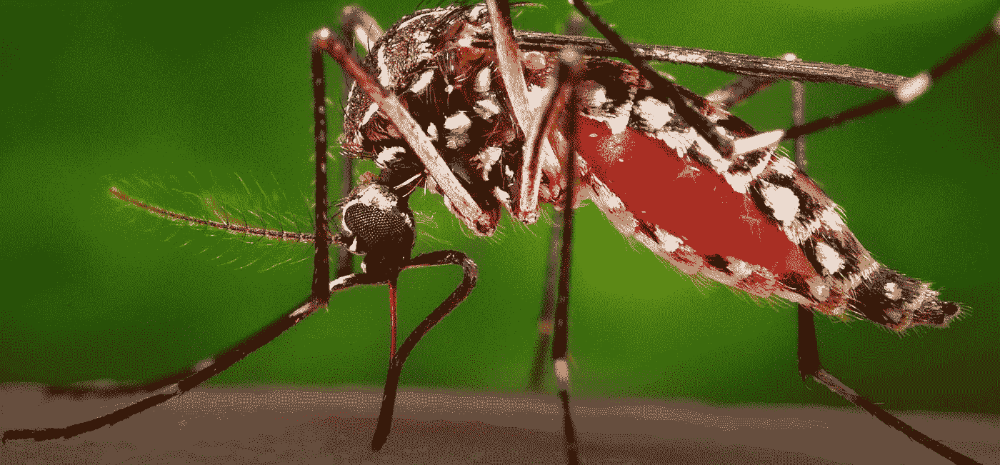

# 使用深度学习的疟疾检测

> 原文：<https://pub.towardsai.net/malaria-detection-using-deep-learning-8fa52839e801?source=collection_archive---------1----------------------->

## [深度学习](https://towardsai.net/p/category/machine-learning/deep-learning)

图片来源:[拜耳科学杂志](https://www.research.bayer.com/en/mosquitoes-zika-malaria-dengue.aspx)

它们可能看起来又小又脆弱，但蚊子可能极其危险。众所周知，疟疾是一种由蚊子传播的疾病，威胁着所有年龄段的人的生命。更重要的是，在最初阶段，这些症状很容易被误认为是*热*、*流感、*或*普通感冒*。但是，在晚期阶段，它可能会通过感染和破坏细胞结构造成严重破坏，这可能会威胁到生命。如果不及时治疗，甚至会导致死亡。

虽然大多数研究人员认为这种疾病起源于非洲大陆，但这种疾病的起源是有争议的。南美洲国家、非洲国家和印度次大陆因*疟疾*而处于高感染风险中，主要是因为它们的热带气候充当了受感染雌蚊的催化剂和繁殖地，这种受感染雌蚊携带*疟原虫*寄生虫，从而导致这种疾病。

我们这个项目的目标是开发一个可以检测这种致命疾病的系统，而不必完全依赖医学测试。

本文是由 [Jovian.ml](https://jovian.ml/) 和 [FreeCodeCamp](https://www.freecodecamp.org/) 撰写的[py torch Zero to GAN](http://zerotogans.com/)认证项目最终项目工作的一部分。

所以，在进入主要部分之前，让我们先完成后勤工作。

数据集最初取自美国国家卫生研究院网站，并上传至 Kaggle。数据集包含 **27558** 个细胞图像。其中，我们有被*疟疾感染的 **13779** 细胞图像和另一张 **13779** 未感染的图像。我们正试图解决一个分类问题。正在使用的框架是 Pytorch。*

*现在，让我们行动起来，创建一个检测疟疾的模型。*

# *导入库*

*现在让我们做一些数据探索:*

1.  *首先，我们将输入数据并对其应用各种转换。*

*a)数据集包含不规则形状的图像。这样会妨碍模特训练。因此，我们将图像调整为 128 x 128 的形状。*

*b)我们还将把我们的数据转换成张量，因为这是一种使用深度学习训练模型的有用格式。*

*PyTorch 的美妙之处在于，它允许我们使用很少几行代码来应用多种转换。*

*现在，我们将编写一个助手函数来可视化一些图像。*

*让我们看看这两个类的一组图像。*

*为了获得可重复的结果，我们需要设置种子。播种的原因可以在这里找到[。](https://medium.com/@ODSC/properly-setting-the-random-seed-in-ml-experiments-not-as-simple-as-you-might-imagine-219969c84752)*

*现在，让我们将整个图像集分为训练集、验证集和测试集。显然，训练集是用于训练模型的，而验证集是用于确保训练朝着正确的方向进行。测试集是为了在最后测试模型的性能。*

*我们将尝试通过使用批量图像来训练我们的模型。在这里，PyTorch 的[数据加载器](https://pytorch.org/docs/stable/data.html#torch.utils.data.DataLoader)实用程序就派上了用场。它在给定的数据集上提供了一个 iterable。*

*我们将使用数据加载器来创建用于训练和验证的批次。我们需要确保在训练的时候批次是内部洗牌的。这只是在模型中引入了一些随机性。我们没有在内部对验证集进行洗牌，因为我们只是使用来验证每个时期的模型性能。*

*现在让我们试着想象一组图像。我们将为此编写一个助手函数。*

*现在让我们设想一批图像。*

*由于我们的数据是图像，我们将训练一个卷积神经网络。如果你被这些吓到了，那么你并不孤单。我第一次听说 CNN 的时候也很害怕。但是，坦率地说，由于 Tensorflow 和 PyTorch 等深度学习框架，它们很容易理解，有些实现起来更简单。*

*阅读 [Irhum Shafkat](https://medium.com/u/cb2327c63f48?source=post_page-----8fa52839e801--------------------------------) 的这篇[文章](https://towardsdatascience.com/intuitively-understanding-convolutions-for-deep-learning-1f6f42faee1)可以对卷积运算有一个大概的了解。CNN 在初始层使用卷积运算来提取特征。最终图层是正常的线性图层。*

*我们将为包含各种助手方法的模型定义一个**基类**。如果我们将来试图解决类似的问题，这些方法可能会有所帮助。*

*现在让我们定义继承基类的主类。我们把它命名为`**Malaria2CnnModel**`*

*如果我们使用 CPU，训练深度学习模型是非常耗时和令人疲惫的。有许多平台，如 Kaggle 和谷歌的 Colab，提供免费的 GPU 计算来训练模型。下面的帮助函数帮助我们找到我们的系统上是否有可用的 GPU。如果是的话，我们可以将我们的数据和模型转移到 GPU 中进行更快的计算。*

*这个项目是在 Kaggle 上完成的，它每周提供 30 小时的 GPU 计算时间。*

*我们已经定义了一个`**DeviceDataLoader**`类来传输我们的模型、训练和验证数据。*

*现在，我们将定义我们的**拟合**和**评估**函数。 **fit()** 用于训练模型，而 **evaluate()** 用于查看每个历元结束时的模型表现。一个历元可以理解为整个训练过程中的一个步骤，是一系列的步骤。*

*让我们将我们的模型转移到 GPU 设备上。*

*在训练之前，我们将评估该模型，看看它在验证集上的表现如何。*

*在训练之前，我们大约有 50%的准确率。对于医疗保健领域的关键应用，这是非常低的。我们将设置要使用的时期和优化器(`torch.optim.Adam`)的数量。我们还将学习率设定为`0.001`*

*我们将定义几个函数来绘制每个时期结束时的损耗和精度。*

*现在，让我们通过使用**拟合**函数来训练我们的模型。*

*在训练结束时，我们的模型已经从早期的 50%准确率提高到大约 95.54%*

*让我们画出每个时期的精度和损耗，以便理解我们的模型。*

*我们现在将编写一个函数来预测单个图像的类别。然后，我们将对整个测试集进行预测，并检查整体准确性。*

*对单个图像进行预测:*

*现在让我们试着对整个测试集进行预测:*

*我们得到了一些很好的结果。96%是一个非常好的结果，但我认为这还可以通过改变超参数来改善。我们也可以使用更多的历元。*

*我们就此打住。我们将在一个独立的博客中从我们停止的地方继续。我们将使用不同的技术，如数据扩充、正则化、批量标准化等。谢谢你陪我到最后。过几天继续找下一个帖子。*

# *未来工作:*

1.  *我们将尝试应用迁移学习技术，看看它是否能进一步提高准确性。*
2.  *我们将尝试图像分割技术和图像定位技术来群集红色球状结构，并分析它们的证据。*
3.  *我们将尝试使用数据扩充技术来限制我们的模型过度拟合。*
4.  *我们将学习如何在生产中部署我们的模型，以便我们可以向不懂代码的人展示我们的工作。*

# ***参考文献**:*

1.  *[PyTorch 的文档](https://pytorch.org/docs/stable/index.html)*
2.  *尼提什·斯里瓦斯塔瓦和杰夫·辛顿的研究论文:[http://jmlr . org/papers/volume 15/Srivastava 14 a/Srivastava 14 a . pdf](http://jmlr.org/papers/volume15/srivastava14a/srivastava14a.pdf)*
3.  *Jovian.ml 的讲座系列。*