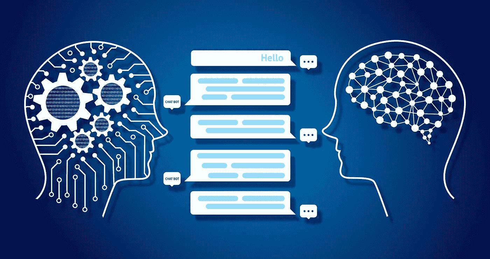
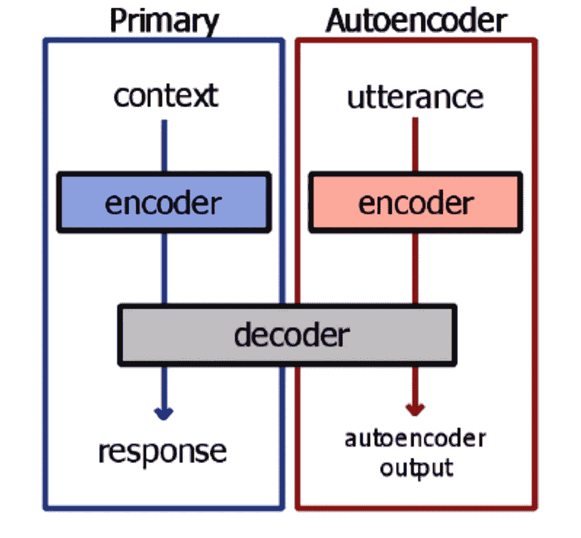
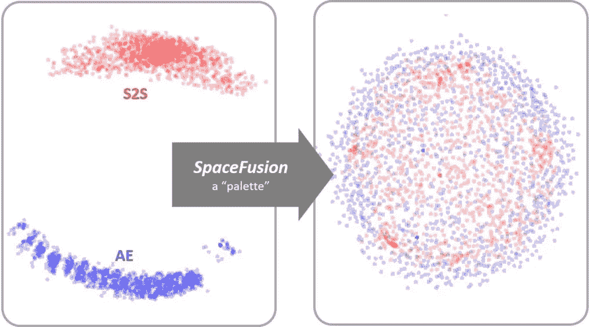
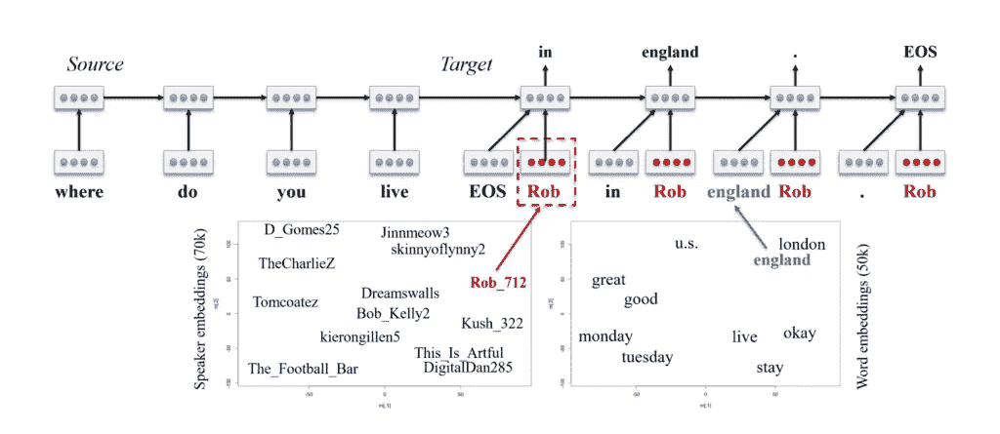
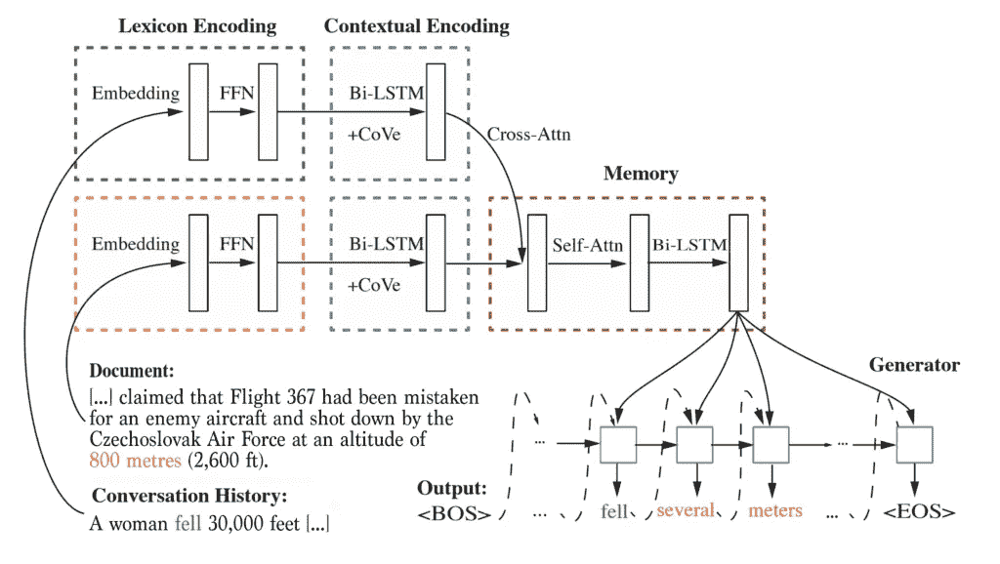

# Microsoft IceCAPS 是一个用于对话建模的开源框架

> 原文：<https://pub.towardsai.net/microsoft-icecaps-is-an-open-source-framework-for-conversational-modeling-4f78492ca685?source=collection_archive---------4----------------------->

## [人工智能](https://towardsai.net/p/category/artificial-intelligence)

## 新的开源框架为对话代理带来了多任务学习。

来源:[https://www . capgemini . com/de-de/2018/09/conversational-bots-use-case-driven/](https://www.capgemini.com/de-de/2018/09/conversational-bots-use-case-driven/)

> 我最近创办了一份专注于人工智能的教育时事通讯，已经有超过 80，000 名订户。《序列》是一份无废话(意思是没有炒作，没有新闻等)的 ML 导向时事通讯，需要 5 分钟阅读。目标是让你与机器学习项目、研究论文和概念保持同步。请通过订阅以下内容来尝试一下:

 [## 序列

### 订阅人工智能世界中最相关的项目和研究论文。受到 85，000 多人的信任…

thesequence.substack.com](https://thesequence.substack.com/) 

神经对话系统和自然语言处理(NLP)等学科在过去几年中取得了重大进展。然而，目前大多数 NLP 栈是为基于一两句话的简单对话而设计的。构建更复杂的对话，将个性或背景等因素考虑在内，仍然是一个公开的挑战。最近，微软研究院发布了 [IceCAPS](https://github.com/microsoft/icecaps) ，这是一个用于高级对话建模的开源框架。

对对话建模不同于有效地处理自然语言句子。我们通常根据谈话的上下文使用不同的语气和语言。同样，我们根据对话的环境表现出不同的个性和情绪。更重要的是，重要的是要认识到有效的对话不是基于一个单一的任务，如理解一个句子，而是基于多个连贯任务的组合。如果我们将这些动态与当前一代聊天机器人的行为进行比较，我们可以很快意识到在对话建模方面还需要做多少工作。

# 多任务学习

在人工智能(AI)的背景下，对对话进行建模不是掌握一项新任务而是多项任务的问题。当我们进行对话时，同样的问题可以用上下文、句法和语义结构的组合以无限的方式来回答。我们之所以能够做到这一点，是因为我们的大脑将语言的丰富性与给定的特定背景下可能的答案结合在一起。把它想象成画家的调色板。画家不会用一小群有结构的颜色去工作。相反，他们将不同颜色的颜料混合在一起，这样他们就可以创造出一个调色板，让人们一瞥他们面前的可能性。连续两次尝试使用调色板的同一个部分可能会产生略微不同的颜色，这些颜色的变化足以使绘画变得有趣。试图模仿这种朝向给定目标的多面方法的人工智能范式被称为多任务学习。

从概念上讲，多任务学习是机器学习的一个子领域，它专注于利用不同任务之间的共性来实现共同目标的模型。更具体地，多任务学习在多个任务之间共享参数子集，因此这些任务可以利用共享的特征表示。例如，这种技术已经被用于会话建模，以将一般的会话数据与不成对的话语相结合；通过将对话模型与共享其解码器的自动编码器配对，可以使用未配对的数据来个性化对话模型。

**图片来源:微软**

多任务学习是下一代对话模型的关键要素，也是微软 IceCAPS 工作的基础。

# 冰帽

智能对话引擎:编码和预训练系统，或微软 Icecaps 是一个开源工具包，允许研究人员模拟高级对话交互。通过更先进的，IceCAPs 专注于利用多任务学习来设计可以掌握多种语言能力的对话代理。[IceCAPs](https://github.com/microsoft/icecaps)目前的实现基于 TensorFlow，但其原理可以抽象到其他深度学习框架中。

IceCAPS 架构基于两个基本原则:组件链接和多任务学习。组件链接的思想是将序列到序列模型抽象为序列编码器和序列解码器的链。IceCAPs 实现了各种编码器和解码器，它们可以链接在一起形成一个单一的端到端功能模型。这种链接范例允许用户灵活地组合组件，并创建包括多个共享组件模型的拓扑结构。

多任务学习是 IceCAPS 架构的另一个基本组成部分。能够控制多项任务的对话代理的想法听起来很理想，但是它到底意味着什么呢？以 IceCAPS 为例，该框架允许用户通过任意共享组件来构建模型阵列，并将它们置于多任务学习环境中。用户可以构建任意的多任务训练计划，在每个训练步骤中分配不同的任务或任务之间的平衡。多任务学习一个特殊使用案例是将生成的数据与会话话语相结合。

**图片来源:微软**

IceCAPs 的多任务学习能力是通过 [SpaceFusion](https://towardsdatascience.com/teaching-neural-networks-to-talk-like-painters-paint-5a0954d90547) 实现的，这是一种专门的多任务学习范式，最初旨在联合优化所生成响应的多样性和相关性。根据我们画家的调色板类比，SpaceFusion 结合了人类对话的片段，以同样的自发方式建立对话，画家使用调色板中的颜色组合来实现特定的影响。为了看到 SpaceFusion 的实际应用，让我们考虑一个自然语言处理(NLP)场景，该场景使用了两种不同的方法:序列到序列(S2S)和变分自动编码器(AE)模型。每种类型的模型都产生了不同的完全脱节的潜在空间。像空间融合这样的技术为由 S2S 和声发射模型生成的特征生成非均匀分布。

**图片来源:微软**

IceCAPS 提供了许多内置模块，这些模块抽象了对话式应用程序最常见的架构。这些模块的一些例子包括包含变压器、基于 LSTM 的 seq2seq 模型和 attention、n-gram 卷积语言模型以及用于基线图像基础的深度卷积网络。IceCAPS 将这些内置模块组合成一系列创新的对话能力，如个性或知识基础。

## 个性基础

任何智能对话式人工智能代理必须能够适应不同的角色和风格，以便更好地适应给定的环境。Icecaps 允许研究人员和开发人员使用个性嵌入在多说话者数据上训练多角色对话系统。人格嵌入的工作方式类似于单词嵌入；正如我们学习每个单词的嵌入来描述单词在潜在单词空间中如何相互关联一样，我们可以从多说话者数据集学习每个说话者的嵌入来描述潜在的个性空间。通过将单词嵌入空间与人物嵌入空间相结合，个性化序列到序列模型实现了个性化响应生成。

**图片来源:微软**

## 知识基础

对话代理的最终目标之一是他们能够掌握百科全书中的知识，如维基百科。然而，这一目标往往变得具有挑战性，因为这些数据源不是以可用于训练 NLP 代理的对话格式构造的。IceCAPS 通过实施一种结合机器阅读理解和响应生成模块的基于知识的对话方法来解决这一问题。该模型使用注意力将内容从与上下文相关的知识源中分离出来，从而允许该模型产生更明智的响应。基于知识的方法可用于从外部知识库中提取相关信息，以形成生成的响应。

**图片来源:微软**

用 Microsoft IceCAPS 构建复杂的对话系统相对简单。该框架提供了一个直观的编程模型来组装复杂的组件链，以提供特定的语言功能。IceCAPS 建立在 TensorFlow 架构之上，用于抽象高级对话代理的关键功能。

Microsoft IceCAPS 是一种有趣的方法，它简化了可以同时控制多个任务的对话代理的实现。当前版本为开源社区贡献了关键的对话建模功能，包括个性化、知识基础、多样化的响应建模和生成，以及更普遍的用于在对话代理中引发偏见的多任务架构。通过利用多任务学习，IceCAPS 为构建更好地模拟人类对话的 NLP 代理提供了坚实的基础。