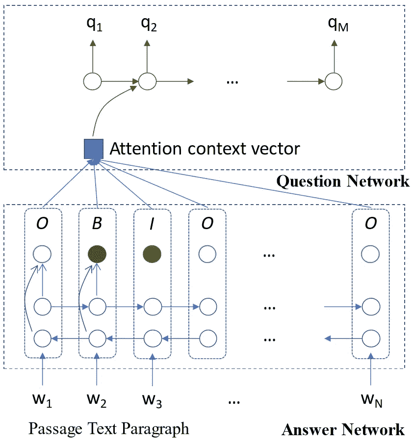

# 微软研究院训练神经网络理解它们所阅读的内容

> 原文：<https://pub.towardsai.net/microsoft-research-trains-neural-networks-to-understand-what-they-read-7dc40a0ae0f4?source=collection_archive---------1----------------------->

## [深度学习](https://towardsai.net/p/category/machine-learning/deep-learning)

## 新模型在被称为机器阅读理解的深度学习新领域取得了进展。

来源:[https://www . quanta magazine . org/machines-beat-humans-on-a-reading-test-but-do-they-understand-2019 10 17/](https://www.quantamagazine.org/machines-beat-humans-on-a-reading-test-but-do-they-understand-20191017/)

> 我最近创办了一份专注于人工智能的教育时事通讯，已经有超过 80，000 名订户。《序列》是一份无废话(意思是没有炒作，没有新闻等)的 ML 导向时事通讯，需要 5 分钟阅读。目标是让你与机器学习项目、研究论文和概念保持同步。请通过订阅以下内容来尝试一下:

 [## 序列

### 该序列解释了主要的机器学习概念，让你与最相关的项目和最新的…

thesequence.substack.com](https://thesequence.substack.com/) 

机器阅读理解是深度学习领域的一门新兴学科。从概念的角度来看，MRC 专注于深度学习模型，这些模型可以回答关于特定文本文档的智能问题。对人类来说，阅读理解是一种天生的认知技能，从上学早期甚至更早就开始发展了。当我们阅读一篇文章时，我们会本能地提取关键思想，这将使我们能够回答未来关于该主题的问题。就人工智能(AI)模型而言，这种技能在很大程度上仍未开发。

第一代广泛采用的自然语言理解(NLU)技术主要集中在检测与特定句子相关联的意图和概念。我们可以把这些模型看作是帮助阅读理解的第一层知识。然而，全机器阅读理解需要额外的构建模块，这些模块可以将问题与文本的特定部分进行推断和关联，并从文档的特定部分构建知识。

MRC 领域的最大挑战之一是，大多数模型都是基于监督训练的数据集，这些数据集不仅包含文档，还包含潜在的问题和答案。可以想象，这种方法不仅很难扩展，而且在一些没有数据的领域几乎不可能实现。最近，来自微软的研究人员提出了一种有趣的方法来应对 MRC 算法中的这一挑战。

在一篇题为[“机器理解中迁移学习的两阶段合成网络”](https://www.microsoft.com/en-us/research/wp-content/uploads/2017/07/emnlp17_SynNet.pdf)的论文中，微软的研究引入了一种称为两阶段合成网络或 [SynNet](https://www.microsoft.com/en-us/research/wp-content/uploads/2017/07/emnlp17_SynNet.pdf) 的技术，该技术应用迁移学习来减少训练 MRC 模型的努力。 [SynNet](https://www.microsoft.com/en-us/research/wp-content/uploads/2017/07/emnlp17_SynNet.pdf) 可以被看作是一种两阶段的方法来建立与特定文本相关的知识。在第一阶段， [SynNet](https://www.microsoft.com/en-us/research/wp-content/uploads/2017/07/emnlp17_SynNet.pdf) 学习在文本文档中识别潜在“兴趣”的一般模式。这些是关键知识点、命名实体或语义概念，通常是人们可能会问的答案。然后，在第二阶段，模型学习在文章的上下文中围绕这些潜在的答案形成自然语言问题。

SynNet 的迷人之处在于，一旦经过训练，一个模型可以应用到一个新的领域，读取新领域中的文档，然后根据这些文档生成伪问题和答案。然后，它形成必要的训练数据来训练该新领域的 MRC 系统，该新领域可以是新疾病、新公司的员工手册或新产品手册。

许多人错误地将 MRC 技术与更发达的机器翻译领域联系在一起。对于像 [SynNet](https://www.microsoft.com/en-us/research/wp-content/uploads/2017/07/emnlp17_SynNet.pdf) 这样的 MRC 模型，挑战在于它们需要为一个文档综合问题*和答案*。虽然问题是一个句法流畅的自然语言句子，但答案通常是段落中突出的语义概念，如命名实体、动作或数字。由于答案与问题具有不同的语言结构，因此将答案和问题视为两种不同类型的数据可能更合适。 [SynNet](https://www.microsoft.com/en-us/research/wp-content/uploads/2017/07/emnlp17_SynNet.pdf) 通过将生成问答对的过程分解为两个基本步骤来实现该理论:基于段落的答案生成和基于段落和答案的问题生成。

**图片来源:微软研究院**

你可以把 SynNet 看作是一个非常擅长根据经验从文档中生成问题的老师。当它了解一个领域中的相关问题时，它可以将相同的模式应用于新领域中的文档。微软研究人员已经将 [SynNet](https://www.microsoft.com/en-us/research/wp-content/uploads/2017/07/emnlp17_SynNet.pdf) 的原理应用于不同的 MRC 模型，包括最近发布的 [ReasoNet](https://arxiv.org/abs/1609.05284) ，该模型显示了在不久的将来使机器阅读理解成为现实的许多前景。